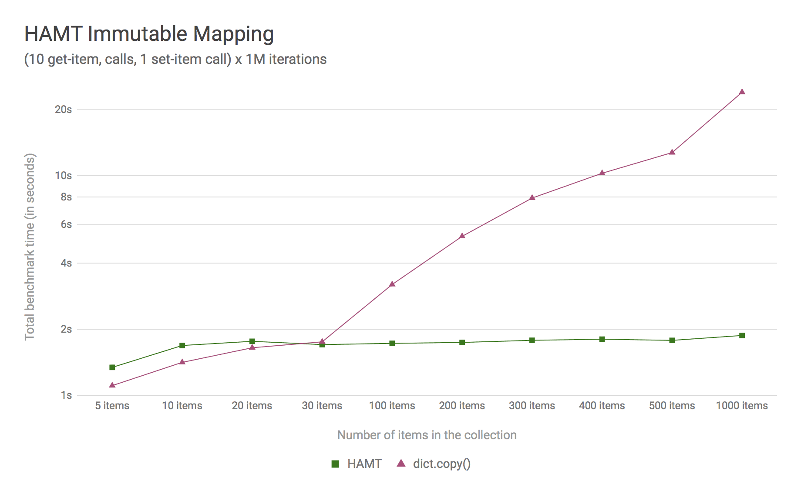

PEP: 550
Title: Execution Context
Version: $Revision$
Last-Modified: $Date$
Author: Yury Selivanov <yury@edgedb.com>,
        Elvis Pranskevichus <elvis@edgedb.com>
Status: Withdrawn
Type: Standards Track
Content-Type: text/x-rst
Created: 11-Aug-2017
Python-Version: 3.7
Post-History: 11-Aug-2017, 15-Aug-2017, 18-Aug-2017, 25-Aug-2017,
              01-Sep-2017

Abstract
========

This PEP adds a new generic mechanism of ensuring consistent access
to non-local state in the context of out-of-order execution, such
as in Python generators and coroutines.

Thread-local storage, such as ``threading.local()``, is inadequate for
programs that execute concurrently in the same OS thread.  This PEP
proposes a solution to this problem.

PEP Status
==========

Due to its breadth and the lack of general consensus on some aspects, this
PEP has been withdrawn and superceded by a simpler :pep:`567`, which has
been accepted and included in Python 3.7.

:pep:`567` implements the same core idea, but limits the ContextVar support
to asynchronous tasks while leaving the generator behavior untouched.
The latter may be revisited in a future PEP.

Rationale
=========

Prior to the advent of asynchronous programming in Python, programs
used OS threads to achieve concurrency.  The need for thread-specific
state was solved by ``threading.local()`` and its C-API equivalent,
``PyThreadState_GetDict()``.

A few examples of where Thread-local storage (TLS) is commonly
relied upon:

* Context managers like decimal contexts, ``numpy.errstate``,
  and ``warnings.catch_warnings``.

* Request-related data, such as security tokens and request
  data in web applications, language context for ``gettext`` etc.

* Profiling, tracing, and logging in large code bases.

Unfortunately, TLS does not work well for programs which execute
concurrently in a single thread.  A Python generator is the simplest
example of a concurrent program.  Consider the following::

    def fractions(precision, x, y):
        with decimal.localcontext() as ctx:
            ctx.prec = precision
            yield Decimal(x) / Decimal(y)
            yield Decimal(x) / Decimal(y ** 2)

    g1 = fractions(precision=2, x=1, y=3)
    g2 = fractions(precision=6, x=2, y=3)

    items = list(zip(g1, g2))

The intuitively expected value of ``items`` is::

    [(Decimal('0.33'), Decimal('0.666667')),
     (Decimal('0.11'), Decimal('0.222222'))]

Rather surprisingly, the actual result is::

    [(Decimal('0.33'), Decimal('0.666667')),
     (Decimal('0.111111'), Decimal('0.222222'))]

This is because implicit Decimal context is stored as a thread-local,
so concurrent iteration of the ``fractions()`` generator would
corrupt the state.  For Decimal, specifically, the only current
workaround is to use explicit context method calls for all arithmetic
operations [28]_.  Arguably, this defeats the usefulness of overloaded
operators and makes even simple formulas hard to read and write.

Coroutines are another class of Python code where TLS unreliability
is a significant issue.

The inadequacy of TLS in asynchronous code has lead to the
proliferation of ad-hoc solutions, which are limited in scope and
do not support all required use cases.

The current status quo is that any library (including the standard
library), which relies on TLS, is likely to be broken when used in
asynchronous code or with generators (see [3]_ as an example issue.)

Some languages, that support coroutines or generators, recommend
passing the context manually as an argument to every function, see
[1]_ for an example.  This approach, however, has limited use for
Python, where there is a large ecosystem that was built to work with
a TLS-like context.  Furthermore, libraries like ``decimal`` or
``numpy`` rely on context implicitly in overloaded operator
implementations.

The .NET runtime, which has support for async/await, has a generic
solution for this problem, called ``ExecutionContext`` (see [2]_).

Goals
=====

The goal of this PEP is to provide a more reliable
``threading.local()`` alternative, which:

* provides the mechanism and the API to fix non-local state issues
  with coroutines and generators;

* implements TLS-like semantics for synchronous code, so that
  users like ``decimal`` and ``numpy`` can switch to the new
  mechanism with minimal risk of breaking backwards compatibility;

* has no or negligible performance impact on the existing code or
  the code that will be using the new mechanism, including
  C extensions.

High-Level Specification
========================

The full specification of this PEP is broken down into three parts:

* High-Level Specification (this section): the description of the
  overall solution.  We show how it applies to generators and
  coroutines in user code, without delving into implementation
  details.

* Detailed Specification: the complete description of new concepts,
  APIs, and related changes to the standard library.

* Implementation Details: the description and analysis of data
  structures and algorithms used to implement this PEP, as well as
  the necessary changes to CPython.

For the purpose of this section, we define *execution context* as an
opaque container of non-local state that allows consistent access to
its contents in the concurrent execution environment.

A *context variable* is an object representing a value in the
execution context.  A call to ``contextvars.ContextVar(name)``
creates a new context variable object.  A context variable object has
three methods:

* ``get()``: returns the value of the variable in the current
  execution context;

* ``set(value)``: sets the value of the variable in the current
  execution context;

* ``delete()``: can be used for restoring variable state, it's
  purpose and semantics are explained in
  `Setting and restoring context variables`_.

Regular Single-threaded Code
----------------------------

In regular, single-threaded code that doesn't involve generators or
coroutines, context variables behave like globals::

    var = contextvars.ContextVar('var')

    def sub():
        assert var.get() == 'main'
        var.set('sub')

    def main():
        var.set('main')
        sub()
        assert var.get() == 'sub'

Multithreaded Code
------------------

In multithreaded code, context variables behave like thread locals::

    var = contextvars.ContextVar('var')

    def sub():
        assert var.get() is None  # The execution context is empty
                                  # for each new thread.
        var.set('sub')

    def main():
        var.set('main')

        thread = threading.Thread(target=sub)
        thread.start()
        thread.join()

        assert var.get() == 'main'

Generators
----------

Unlike regular function calls, generators can cooperatively yield
their control of execution to the caller.  Furthermore, a generator
does not control *where* the execution would continue after it yields.
It may be resumed from an arbitrary code location.

For these reasons, the least surprising behaviour of generators is
as follows:

* changes to context variables are always local and are not visible
  in the outer context, but are visible to the code called by the
  generator;

* once set in the generator, the context variable is guaranteed not
  to change between iterations;

* changes to context variables in outer context (where the generator
  is being iterated) are visible to the generator, unless these
  variables were also modified inside the generator.

Let's review::

    var1 = contextvars.ContextVar('var1')
    var2 = contextvars.ContextVar('var2')

    def gen():
        var1.set('gen')
        assert var1.get() == 'gen'
        assert var2.get() == 'main'
        yield 1

        # Modification to var1 in main() is shielded by
        # gen()'s local modification.
        assert var1.get() == 'gen'

        # But modifications to var2 are visible
        assert var2.get() == 'main modified'
        yield 2

    def main():
        g = gen()

        var1.set('main')
        var2.set('main')
        next(g)

        # Modification of var1 in gen() is not visible.
        assert var1.get() == 'main'

        var1.set('main modified')
        var2.set('main modified')
        next(g)

Now, let's revisit the decimal precision example from the `Rationale`_
section, and see how the execution context can improve the situation::

    import decimal

    # create a new context var
    decimal_ctx = contextvars.ContextVar('decimal context')

    # Pre-PEP 550 Decimal relies on TLS for its context.
    # For illustration purposes, we monkey-patch the decimal
    # context functions to use the execution context.
    # A real working fix would need to properly update the
    # C implementation as well.
    def patched_setcontext(context):
        decimal_ctx.set(context)

    def patched_getcontext():
        ctx = decimal_ctx.get()
        if ctx is None:
            ctx = decimal.Context()
            decimal_ctx.set(ctx)
        return ctx

    decimal.setcontext = patched_setcontext
    decimal.getcontext = patched_getcontext

    def fractions(precision, x, y):
        with decimal.localcontext() as ctx:
            ctx.prec = precision
            yield MyDecimal(x) / MyDecimal(y)
            yield MyDecimal(x) / MyDecimal(y ** 2)

    g1 = fractions(precision=2, x=1, y=3)
    g2 = fractions(precision=6, x=2, y=3)

    items = list(zip(g1, g2))

The value of ``items`` is::

    [(Decimal('0.33'), Decimal('0.666667')),
     (Decimal('0.11'), Decimal('0.222222'))]

which matches the expected result.

Coroutines and Asynchronous Tasks
---------------------------------

Like generators, coroutines can yield and regain control.  The major
difference from generators is that coroutines do not yield to the
immediate caller.  Instead, the entire coroutine call stack
(coroutines chained by ``await``) switches to another coroutine call
stack.  In this regard, ``await``-ing on a coroutine is conceptually
similar to a regular function call, and a coroutine chain
(or a "task", e.g. an ``asyncio.Task``) is conceptually similar to a
thread.

From this similarity we conclude that context variables in coroutines
should behave like "task locals":

* changes to context variables in a coroutine are visible to the
  coroutine that awaits on it;

* changes to context variables made in the caller prior to awaiting
  are visible to the awaited coroutine;

* changes to context variables made in one task are not visible in
  other tasks;

* tasks spawned by other tasks inherit the execution context from the
  parent task, but any changes to context variables made in the
  parent task *after* the child task was spawned are *not* visible.

The last point shows behaviour that is different from OS threads.
OS threads do not inherit the execution context by default.
There are two reasons for this: *common usage intent* and backwards
compatibility.

The main reason for why tasks inherit the context, and threads do
not, is the common usage intent.  Tasks are often used for relatively
short-running operations which are logically tied to the code that
spawned the task (like running a coroutine with a timeout in
asyncio).  OS threads, on the other hand, are normally used for
long-running, logically separate code.

With respect to backwards compatibility, we want the execution context
to behave like ``threading.local()``.  This is so that libraries can
start using the execution context in place of TLS with a lesser risk
of breaking compatibility with existing code.

Let's review a few examples to illustrate the semantics we have just
defined.

Context variable propagation in a single task::

    import asyncio

    var = contextvars.ContextVar('var')

    async def main():
        var.set('main')
        await sub()
        # The effect of sub() is visible.
        assert var.get() == 'sub'

    async def sub():
        assert var.get() == 'main'
        var.set('sub')
        assert var.get() == 'sub'

    loop = asyncio.get_event_loop()
    loop.run_until_complete(main())

Context variable propagation between tasks::

    import asyncio

    var = contextvars.ContextVar('var')

    async def main():
        var.set('main')
        loop.create_task(sub())  # schedules asynchronous execution
                                 # of sub().
        assert var.get() == 'main'
        var.set('main changed')

    async def sub():
        # Sleeping will make sub() run after
        # "var" is modified in main().
        await asyncio.sleep(1)

        # The value of "var" is inherited from main(), but any
        # changes to "var" made in main() after the task
        # was created are *not* visible.
        assert var.get() == 'main'

        # This change is local to sub() and will not be visible
        # to other tasks, including main().
        var.set('sub')

    loop = asyncio.get_event_loop()
    loop.run_until_complete(main())

As shown above, changes to the execution context are local to the
task, and tasks get a snapshot of the execution context at the point
of creation.

There is one narrow edge case when this can lead to surprising
behaviour.  Consider the following example where we modify the
context variable in a nested coroutine::

    async def sub(var_value):
        await asyncio.sleep(1)
        var.set(var_value)

    async def main():
        var.set('main')

        # waiting for sub() directly
        await sub('sub-1')

        # var change is visible
        assert var.get() == 'sub-1'

        # waiting for sub() with a timeout;
        await asyncio.wait_for(sub('sub-2'), timeout=2)

        # wait_for() creates an implicit task, which isolates
        # context changes, which means that the below assertion
        # will fail.
        assert var.get() == 'sub-2'  #  AssertionError!

However, relying on context changes leaking to the caller is
ultimately a bad pattern.  For this reason, the behaviour shown in
the above example is not considered a major issue and can be
addressed with proper documentation.

Detailed Specification
======================

Conceptually, an *execution context* (EC) is a stack of logical
contexts.  There is always exactly one active EC per Python thread.

A *logical context* (LC) is a mapping of context variables to their
values in that particular LC.

A *context variable* is an object representing a value in the
execution context.  A new context variable object is created by
calling ``contextvars.ContextVar(name: str)``.  The value of the
required ``name`` argument is not used by the EC machinery, but may
be used for debugging and introspection.

The context variable object has the following methods and attributes:

* ``name``: the value passed to ``ContextVar()``.

* ``get(*, topmost=False, default=None)``, if *topmost* is ``False``
  (the default), traverses the execution context top-to-bottom, until
  the variable value is found.  If *topmost* is ``True``, returns
  the value of the variable in the topmost logical context.
  If the variable value was not found, returns the value of *default*.

* ``set(value)``: sets the value of the variable in the topmost
  logical context.

* ``delete()``: removes the variable from the topmost logical context.
  Useful when restoring the logical context to the state prior to the
  ``set()`` call, for example, in a context manager, see
  `Setting and restoring context variables`_ for more information.

Generators
----------

When created, each generator object has an empty logical context
object stored in its ``__logical_context__`` attribute.  This logical
context is pushed onto the execution context at the beginning of each
generator iteration and popped at the end::

    var1 = contextvars.ContextVar('var1')
    var2 = contextvars.ContextVar('var2')

    def gen():
        var1.set('var1-gen')
        var2.set('var2-gen')

        # EC = [
        #     outer_LC(),
        #     gen_LC({var1: 'var1-gen', var2: 'var2-gen'})
        # ]
        n = nested_gen()  # nested_gen_LC is created
        next(n)
        # EC = [
        #     outer_LC(),
        #     gen_LC({var1: 'var1-gen', var2: 'var2-gen'})
        # ]

        var1.set('var1-gen-mod')
        var2.set('var2-gen-mod')
        # EC = [
        #     outer_LC(),
        #     gen_LC({var1: 'var1-gen-mod', var2: 'var2-gen-mod'})
        # ]
        next(n)

    def nested_gen():
        # EC = [
        #     outer_LC(),
        #     gen_LC({var1: 'var1-gen', var2: 'var2-gen'}),
        #     nested_gen_LC()
        # ]
        assert var1.get() == 'var1-gen'
        assert var2.get() == 'var2-gen'

        var1.set('var1-nested-gen')
        # EC = [
        #     outer_LC(),
        #     gen_LC({var1: 'var1-gen', var2: 'var2-gen'}),
        #     nested_gen_LC({var1: 'var1-nested-gen'})
        # ]
        yield

        # EC = [
        #     outer_LC(),
        #     gen_LC({var1: 'var1-gen-mod', var2: 'var2-gen-mod'}),
        #     nested_gen_LC({var1: 'var1-nested-gen'})
        # ]
        assert var1.get() == 'var1-nested-gen'
        assert var2.get() == 'var2-gen-mod'

        yield

    # EC = [outer_LC()]

    g = gen()  # gen_LC is created for the generator object `g`
    list(g)

    # EC = [outer_LC()]

The snippet above shows the state of the execution context stack
throughout the generator lifespan.

contextlib.contextmanager
-------------------------

The ``contextlib.contextmanager()`` decorator can be used to turn
a generator into a context manager.  A context manager that
temporarily modifies the value of a context variable could be defined
like this::

    var = contextvars.ContextVar('var')

    @contextlib.contextmanager
    def var_context(value):
        original_value = var.get()

        try:
            var.set(value)
            yield
        finally:
            var.set(original_value)

Unfortunately, this would not work straight away, as the modification
to the ``var`` variable is contained to the ``var_context()``
generator, and therefore will not be visible inside the ``with``
block::

    def func():
        # EC = [{}, {}]

        with var_context(10):
            # EC becomes [{}, {}, {var: 10}] in the
            # *precision_context()* generator,
            # but here the EC is still [{}, {}]

            assert var.get() == 10  # AssertionError!

The way to fix this is to set the generator's ``__logical_context__``
attribute to ``None``.  This will cause the generator to avoid
modifying the execution context stack.

We modify the ``contextlib.contextmanager()`` decorator to
set ``genobj.__logical_context__`` to ``None`` to produce
well-behaved context managers::

    def func():
        # EC = [{}, {}]

        with var_context(10):
            # EC = [{}, {var: 10}]
            assert var.get() == 10

        # EC becomes [{}, {var: None}]

Enumerating context vars
------------------------

The ``ExecutionContext.vars()`` method returns a list of
``ContextVar`` objects, that have values in the execution context.
This method is mostly useful for introspection and logging.

coroutines
----------

In CPython, coroutines share the implementation with generators.
The difference is that in coroutines ``__logical_context__`` defaults
to ``None``.  This affects both the ``async def`` coroutines and the
old-style generator-based coroutines (generators decorated with
``@types.coroutine``).

Asynchronous Generators
-----------------------

The execution context semantics in asynchronous generators does not
differ from that of regular generators.

asyncio
-------

``asyncio`` uses ``Loop.call_soon``, ``Loop.call_later``,
and ``Loop.call_at`` to schedule the asynchronous execution of a
function.  ``asyncio.Task`` uses ``call_soon()`` to run the
wrapped coroutine.

We modify ``Loop.call_{at,later,soon}`` to accept the new
optional *execution_context* keyword argument, which defaults to
the copy of the current execution context::

    def call_soon(self, callback, *args, execution_context=None):
        if execution_context is None:
            execution_context = contextvars.get_execution_context()

        # ... some time later

        contextvars.run_with_execution_context(
            execution_context, callback, args)

The ``contextvars.get_execution_context()`` function returns a
shallow copy of the current execution context.  By shallow copy here
we mean such a new execution context that:

* lookups in the copy provide the same results as in the original
  execution context, and
* any changes in the original execution context do not affect the
  copy, and
* any changes to the copy do not affect the original execution
  context.

Either of the following satisfy the copy requirements:

* a new stack with shallow copies of logical contexts;
* a new stack with one squashed logical context.

The ``contextvars.run_with_execution_context(ec, func, *args,
**kwargs)`` function runs ``func(*args, **kwargs)`` with *ec* as the
execution context.  The function performs the following steps:

1. Set *ec* as the current execution context stack in the current
   thread.
2. Push an empty logical context onto the stack.
3. Run ``func(*args, **kwargs)``.
4. Pop the logical context from the stack.
5. Restore the original execution context stack.
6. Return or raise the ``func()`` result.

These steps ensure that *ec* cannot be modified by *func*,
which makes ``run_with_execution_context()`` idempotent.

``asyncio.Task`` is modified as follows::

    class Task:
        def __init__(self, coro):
            ...
            # Get the current execution context snapshot.
            self._exec_context = contextvars.get_execution_context()

            # Create an empty Logical Context that will be
            # used by coroutines run in the task.
            coro.__logical_context__ = contextvars.LogicalContext()

            self._loop.call_soon(
                self._step,
                execution_context=self._exec_context)

        def _step(self, exc=None):
            ...
            self._loop.call_soon(
                self._step,
                execution_context=self._exec_context)
            ...

Generators Transformed into Iterators
-------------------------------------

Any Python generator can be represented as an equivalent iterator.
Compilers like Cython rely on this axiom.  With respect to the
execution context, such iterator should behave the same way as the
generator it represents.

This means that there needs to be a Python API to create new logical
contexts and run code with a given logical context.

The ``contextvars.LogicalContext()`` function creates a new empty
logical context.

The ``contextvars.run_with_logical_context(lc, func, *args,
**kwargs)`` function can be used to run functions in the specified
logical context.  The *lc* can be modified as a result of the call.

The ``contextvars.run_with_logical_context()`` function performs the
following steps:

1. Push *lc* onto the current execution context stack.
2. Run ``func(*args, **kwargs)``.
3. Pop *lc* from the execution context stack.
4. Return or raise the ``func()`` result.

By using ``LogicalContext()`` and ``run_with_logical_context()``,
we can replicate the generator behaviour like this::

    class Generator:

        def __init__(self):
            self.logical_context = contextvars.LogicalContext()

        def __iter__(self):
            return self

        def __next__(self):
            return contextvars.run_with_logical_context(
                self.logical_context, self._next_impl)

        def _next_impl(self):
            # Actual __next__ implementation.
            ...

Let's see how this pattern can be applied to an example generator::

    # create a new context variable
    var = contextvars.ContextVar('var')

    def gen_series(n):
        var.set(10)

        for i in range(1, n):
            yield var.get() * i

    # gen_series is equivalent to the following iterator:

    class CompiledGenSeries:

        # This class is what the `gen_series()` generator can
        # be transformed to by a compiler like Cython.

        def __init__(self, n):
            # Create a new empty logical context,
            # like the generators do.
            self.logical_context = contextvars.LogicalContext()

            # Initialize the generator in its LC.
            # Otherwise `var.set(10)` in the `_init` method
            # would leak.
            contextvars.run_with_logical_context(
                self.logical_context, self._init, n)

        def _init(self, n):
            self.i = 1
            self.n = n
            var.set(10)

        def __iter__(self):
            return self

        def __next__(self):
            # Run the actual implementation of __next__ in our LC.
            return contextvars.run_with_logical_context(
                self.logical_context, self._next_impl)

        def _next_impl(self):
            if self.i == self.n:
                raise StopIteration

            result = var.get() * self.i
            self.i += 1
            return result

For hand-written iterators such approach to context management is
normally not necessary, and it is easier to set and restore
context variables directly in ``__next__``::

    class MyIterator:

        # ...

        def __next__(self):
            old_val = var.get()
            try:
                var.set(new_val)
                # ...
            finally:
                var.set(old_val)

Implementation
==============

Execution context is implemented as an immutable linked list of
logical contexts, where each logical context is an immutable weak key
mapping.  A pointer to the currently active execution context is
stored in the OS thread state::

                      +-----------------+
                      |                 |     ec
                      |  PyThreadState  +-------------+
                      |                 |             |
                      +-----------------+             |
                                                      |
    ec_node             ec_node             ec_node   v
    +------+------+     +------+------+     +------+------+
    | NULL |  lc  |<----| prev |  lc  |<----| prev |  lc  |
    +------+--+---+     +------+--+---+     +------+--+---+
              |                   |                   |
    LC        v         LC        v         LC        v
    +-------------+     +-------------+     +-------------+
    | var1: obj1  |     |    EMPTY    |     | var1: obj4  |
    | var2: obj2  |     +-------------+     +-------------+
    | var3: obj3  |
    +-------------+

The choice of the immutable list of immutable mappings as a
fundamental data structure is motivated by the need to efficiently
implement ``contextvars.get_execution_context()``, which is to be
frequently used by asynchronous tasks and callbacks.  When the EC is
immutable, ``get_execution_context()`` can simply copy the current
execution context *by reference*::

    def get_execution_context(self):
        return PyThreadState_Get().ec

Let's review all possible context modification scenarios:

* The ``ContextVariable.set()`` method is called::

    def ContextVar_set(self, val):
        # See a more complete set() definition
        # in the `Context Variables` section.

        tstate = PyThreadState_Get()
        top_ec_node = tstate.ec
        top_lc = top_ec_node.lc
        new_top_lc = top_lc.set(self, val)
        tstate.ec = ec_node(
            prev=top_ec_node.prev,
            lc=new_top_lc)

* The ``contextvars.run_with_logical_context()`` is called, in which
  case the passed logical context object is appended to the execution
  context::

    def run_with_logical_context(lc, func, *args, **kwargs):
        tstate = PyThreadState_Get()

        old_top_ec_node = tstate.ec
        new_top_ec_node = ec_node(prev=old_top_ec_node, lc=lc)

        try:
            tstate.ec = new_top_ec_node
            return func(*args, **kwargs)
        finally:
            tstate.ec = old_top_ec_node

* The ``contextvars.run_with_execution_context()`` is called, in which
  case the current execution context is set to the passed execution
  context with a new empty logical context appended to it::

    def run_with_execution_context(ec, func, *args, **kwargs):
        tstate = PyThreadState_Get()

        old_top_ec_node = tstate.ec
        new_lc = contextvars.LogicalContext()
        new_top_ec_node = ec_node(prev=ec, lc=new_lc)

        try:
            tstate.ec = new_top_ec_node
            return func(*args, **kwargs)
        finally:
            tstate.ec = old_top_ec_node

* Either ``genobj.send()``, ``genobj.throw()``, ``genobj.close()``
  are called on a ``genobj`` generator, in which case the logical
  context recorded in ``genobj`` is pushed onto the stack::

    PyGen_New(PyGenObject *gen):
        if (gen.gi_code.co_flags &
                (CO_COROUTINE | CO_ITERABLE_COROUTINE)):
            # gen is an 'async def' coroutine, or a generator
            # decorated with @types.coroutine.
            gen.__logical_context__ = None
        else:
            # Non-coroutine generator
            gen.__logical_context__ = contextvars.LogicalContext()

    gen_send(PyGenObject *gen, ...):
        tstate = PyThreadState_Get()

        if gen.__logical_context__ is not None:
            old_top_ec_node = tstate.ec
            new_top_ec_node = ec_node(
                prev=old_top_ec_node,
                lc=gen.__logical_context__)

            try:
                tstate.ec = new_top_ec_node
                return _gen_send_impl(gen, ...)
            finally:
                gen.__logical_context__ = tstate.ec.lc
                tstate.ec = old_top_ec_node
        else:
            return _gen_send_impl(gen, ...)

* Coroutines and asynchronous generators share the implementation
  with generators, and the above changes apply to them as well.

In certain scenarios the EC may need to be squashed to limit the
size of the chain.  For example, consider the following corner case::

    async def repeat(coro, delay):
        await coro()
        await asyncio.sleep(delay)
        loop.create_task(repeat(coro, delay))

    async def ping():
        print('ping')

    loop = asyncio.get_event_loop()
    loop.create_task(repeat(ping, 1))
    loop.run_forever()

In the above code, the EC chain will grow as long as ``repeat()`` is
called. Each new task will call
``contextvars.run_with_execution_context()``, which will append a new
logical context to the chain.  To prevent unbounded growth,
``contextvars.get_execution_context()`` checks if the chain
is longer than a predetermined maximum, and if it is, squashes the
chain into a single LC::

    def get_execution_context():
        tstate = PyThreadState_Get()

        if tstate.ec_len > EC_LEN_MAX:
            squashed_lc = contextvars.LogicalContext()

            ec_node = tstate.ec
            while ec_node:
                # The LC.merge() method does not replace
                # existing keys.
                squashed_lc = squashed_lc.merge(ec_node.lc)
                ec_node = ec_node.prev

            return ec_node(prev=NULL, lc=squashed_lc)
        else:
            return tstate.ec

Logical Context
---------------

Logical context is an immutable weak key mapping which has the
following properties with respect to garbage collection:

* ``ContextVar`` objects are strongly-referenced only from the
  application code, not from any of the execution context machinery
  or values they point to.  This means that there are no reference
  cycles that could extend their lifespan longer than necessary, or
  prevent their collection by the GC.

* Values put in the execution context are guaranteed to be kept
  alive while there is a ``ContextVar`` key referencing them in
  the thread.

* If a ``ContextVar`` is garbage collected, all of its values will
  be removed from all contexts, allowing them to be GCed if needed.

* If an OS thread has ended its execution, its thread state will be
  cleaned up along with its execution context, cleaning
  up all values bound to all context variables in the thread.

As discussed earlier, we need ``contextvars.get_execution_context()``
to be consistently fast regardless of the size of the execution
context, so logical context is necessarily an immutable mapping.

Choosing ``dict`` for the underlying implementation is suboptimal,
because ``LC.set()`` will cause ``dict.copy()``, which is an O(N)
operation, where *N* is the number of items in the LC.

``get_execution_context()``, when squashing the EC, is an O(M)
operation, where *M* is the total number of context variable values
in the EC.

So, instead of ``dict``, we choose Hash Array Mapped Trie (HAMT)
as the underlying implementation of logical contexts.  (Scala and
Clojure use HAMT to implement high performance immutable collections
[5]_, [6]_.)

With HAMT ``.set()`` becomes an O(log N) operation, and
``get_execution_context()`` squashing is more efficient on average due
to structural sharing in HAMT.

See `Appendix: HAMT Performance Analysis`_ for a more elaborate
analysis of HAMT performance compared to ``dict``.

Context Variables
-----------------

The ``ContextVar.get()`` and ``ContextVar.set()`` methods are
implemented as follows (in pseudo-code)::

    class ContextVar:

        def get(self, *, default=None, topmost=False):
            tstate = PyThreadState_Get()

            ec_node = tstate.ec
            while ec_node:
                if self in ec_node.lc:
                    return ec_node.lc[self]
                if topmost:
                    break
                ec_node = ec_node.prev

            return default

        def set(self, value):
            tstate = PyThreadState_Get()
            top_ec_node = tstate.ec

            if top_ec_node is not None:
                top_lc = top_ec_node.lc
                new_top_lc = top_lc.set(self, value)
                tstate.ec = ec_node(
                    prev=top_ec_node.prev,
                    lc=new_top_lc)
            else:
                # First ContextVar.set() in this OS thread.
                top_lc = contextvars.LogicalContext()
                new_top_lc = top_lc.set(self, value)
                tstate.ec = ec_node(
                    prev=NULL,
                    lc=new_top_lc)

        def delete(self):
            tstate = PyThreadState_Get()
            top_ec_node = tstate.ec

            if top_ec_node is None:
                raise LookupError

            top_lc = top_ec_node.lc
            if self not in top_lc:
                raise LookupError

            new_top_lc = top_lc.delete(self)

            tstate.ec = ec_node(
                prev=top_ec_node.prev,
                lc=new_top_lc)

For efficient access in performance-sensitive code paths, such as in
``numpy`` and ``decimal``, we cache lookups in ``ContextVar.get()``,
making it an O(1) operation when the cache is hit.  The cache key is
composed from the following:

* The new ``uint64_t PyThreadState->unique_id``, which is a globally
  unique thread state identifier.  It is computed from the new
  ``uint64_t PyInterpreterState->ts_counter``, which is incremented
  whenever a new thread state is created.

* The new ``uint64_t PyThreadState->stack_version``, which is a
  thread-specific counter, which is incremented whenever a non-empty
  logical context is pushed onto the stack or popped from the stack.

* The ``uint64_t ContextVar->version`` counter, which is incremented
  whenever the context variable value is changed in any logical
  context in any OS thread.

The cache is then implemented as follows::

    class ContextVar:

        def set(self, value):
            ...  # implementation
            self.version += 1

        def get(self, *, default=None, topmost=False):
            if topmost:
                return self._get_uncached(
                    default=default, topmost=topmost)

            tstate = PyThreadState_Get()
            if (self.last_tstate_id == tstate.unique_id and
                    self.last_stack_ver == tstate.stack_version and
                    self.last_version == self.version):
                return self.last_value

            value = self._get_uncached(default=default)

            self.last_value = value  # borrowed ref
            self.last_tstate_id = tstate.unique_id
            self.last_stack_version = tstate.stack_version
            self.last_version = self.version

            return value

Note that ``last_value`` is a borrowed reference.  We assume that
if the version checks are fine, the value object will be alive.
This allows the values of context variables to be properly garbage
collected.

This generic caching approach is similar to what the current C
implementation of ``decimal`` does to cache the the current decimal
context, and has similar performance characteristics.

Performance Considerations
==========================

Tests of the reference implementation based on the prior
revisions of this PEP have shown 1-2% slowdown on generator
microbenchmarks and no noticeable difference in macrobenchmarks.

The performance of non-generator and non-async code is not
affected by this PEP.

Summary of the New APIs
=======================

Python
------

The following new Python APIs are introduced by this PEP:

1. The new ``contextvars.ContextVar(name: str='...')`` class,
   instances of which have the following:

   * the read-only ``.name`` attribute,
   * the ``.get()`` method, which returns the value of the variable
     in the current execution context;
   * the ``.set()`` method, which sets the value of the variable in
     the current logical context;
   * the ``.delete()`` method, which removes the value of the variable
     from the current logical context.

2. The new ``contextvars.ExecutionContext()`` class, which represents
   an execution context.

3. The new ``contextvars.LogicalContext()`` class, which represents
   a logical context.

4. The new ``contextvars.get_execution_context()`` function, which
   returns an ``ExecutionContext`` instance representing a copy of
   the current execution context.

5. The ``contextvars.run_with_execution_context(ec: ExecutionContext,
   func, *args, **kwargs)`` function, which runs *func* with the
   provided execution context.

6. The ``contextvars.run_with_logical_context(lc: LogicalContext,
   func, *args, **kwargs)`` function, which runs *func* with the
   provided logical context on top of the current execution context.

C API
-----

1. ``PyContextVar * PyContext_NewVar(char *desc)``: create a
   ``PyContextVar`` object.

2. ``PyObject * PyContext_GetValue(PyContextVar *, int topmost)``:
   return the value of the variable in the current execution context.

3. ``int PyContext_SetValue(PyContextVar *, PyObject *)``: set
   the value of the variable in the current logical context.

4. ``int PyContext_DelValue(PyContextVar *)``: delete the value of
   the variable from the current logical context.

5. ``PyLogicalContext * PyLogicalContext_New()``: create a new empty
   ``PyLogicalContext``.

6. ``PyExecutionContext * PyExecutionContext_New()``: create a new
   empty ``PyExecutionContext``.

7. ``PyExecutionContext * PyExecutionContext_Get()``: return the
   current execution context.

8. ``int PyContext_SetCurrent(
   PyExecutionContext *, PyLogicalContext *)``: set the
   passed EC object as the current execution context for the active
   thread state, and/or set the passed LC object as the current
   logical context.

Design Considerations
=====================

Should "yield from" leak context changes?
-----------------------------------------

No.  It may be argued that ``yield from`` is semantically
equivalent to calling a function, and should leak context changes.
However, it is not possible to satisfy the following at the same time:

* ``next(gen)`` *does not* leak context changes made in ``gen``, and
* ``yield from gen`` *leaks* context changes made in ``gen``.

The reason is that ``yield from`` can be used with a partially
iterated generator, which already has local context changes::

    var = contextvars.ContextVar('var')

    def gen():
        for i in range(10):
            var.set('gen')
            yield i

    def outer_gen():
        var.set('outer_gen')
        g = gen()

        yield next(g)
        # Changes not visible during partial iteration,
        # the goal of this PEP:
        assert var.get() == 'outer_gen'

        yield from g
        assert var.get() == 'outer_gen'  # or 'gen'?

Another example would be refactoring of an explicit ``for..in yield``
construct to a ``yield from`` expression.  Consider the following
code::

    def outer_gen():
        var.set('outer_gen')

        for i in gen():
            yield i
        assert var.get() == 'outer_gen'

which we want to refactor to use ``yield from``::

    def outer_gen():
        var.set('outer_gen')

        yield from gen()
        assert var.get() == 'outer_gen'  # or 'gen'?

The above examples illustrate that it is unsafe to refactor
generator code using ``yield from`` when it can leak context changes.

Thus, the only well-defined and consistent behaviour is to
**always** isolate context changes in generators, regardless of
how they are being iterated.

Should ``PyThreadState_GetDict()`` use the execution context?
-------------------------------------------------------------

No. ``PyThreadState_GetDict`` is based on TLS, and changing its
semantics will break backwards compatibility.

PEP 521
-------

:pep:`521` proposes an alternative solution to the problem, which
extends the context manager protocol with two new methods:
``__suspend__()`` and ``__resume__()``.  Similarly, the asynchronous
context manager protocol is also extended with ``__asuspend__()`` and
``__aresume__()``.

This allows implementing context managers that manage non-local state,
which behave correctly in generators and coroutines.

For example, consider the following context manager, which uses
execution state::

    class Context:

        def __init__(self):
            self.var = contextvars.ContextVar('var')

        def __enter__(self):
            self.old_x = self.var.get()
            self.var.set('something')

        def __exit__(self, *err):
            self.var.set(self.old_x)

An equivalent implementation with PEP 521::

    local = threading.local()

    class Context:

        def __enter__(self):
            self.old_x = getattr(local, 'x', None)
            local.x = 'something'

        def __suspend__(self):
            local.x = self.old_x

        def __resume__(self):
            local.x = 'something'

        def __exit__(self, *err):
            local.x = self.old_x

The downside of this approach is the addition of significant new
complexity to the context manager protocol and the interpreter
implementation.  This approach is also likely to negatively impact
the performance of generators and coroutines.

Additionally, the solution in :pep:`521` is limited to context
managers, and does not provide any mechanism to propagate state in
asynchronous tasks and callbacks.

Can Execution Context be implemented without modifying CPython?
---------------------------------------------------------------

No.

It is true that the concept of "task-locals" can be implemented
for coroutines in libraries (see, for example, [29]_ and [30]_).
On the other hand, generators are managed by the Python interpreter
directly, and so their context must also be managed by the
interpreter.

Furthermore, execution context cannot be implemented in a third-party
module at all, otherwise the standard library, including ``decimal``
would not be able to rely on it.

Should we update sys.displayhook and other APIs to use EC?
----------------------------------------------------------

APIs like redirecting stdout by overwriting ``sys.stdout``, or
specifying new exception display hooks by overwriting the
``sys.displayhook`` function are affecting the whole Python process
**by design**.  Their users assume that the effect of changing
them will be visible across OS threads.  Therefore we cannot
just make these APIs to use the new Execution Context.

That said we think it is possible to design new APIs that will
be context aware, but that is outside of the scope of this PEP.

Greenlets
---------

Greenlet is an alternative implementation of cooperative
scheduling for Python.  Although greenlet package is not part of
CPython, popular frameworks like gevent rely on it, and it is
important that greenlet can be modified to support execution
contexts.

Conceptually, the behaviour of greenlets is very similar to that of
generators, which means that similar changes around greenlet entry
and exit can be done to add support for execution context.  This
PEP provides the necessary C APIs to do that.

Context manager as the interface for modifications
--------------------------------------------------

This PEP concentrates on the low-level mechanics and the minimal
API that enables fundamental operations with execution context.

For developer convenience, a high-level context manager interface
may be added to the ``contextvars`` module.  For example::

    with contextvars.set_var(var, 'foo'):
        # ...

Setting and restoring context variables
---------------------------------------

The ``ContextVar.delete()`` method removes the context variable from
the topmost logical context.

If the variable is not found in the topmost logical context, a
``LookupError`` is raised, similarly to ``del var`` raising
``NameError`` when ``var`` is not in scope.

This method is useful when there is a (rare) need to correctly restore
the state of a logical context, such as when a nested generator
wants to modify the logical context *temporarily*::

    var = contextvars.ContextVar('var')

    def gen():
        with some_var_context_manager('gen'):
            # EC = [{var: 'main'}, {var: 'gen'}]
            assert var.get() == 'gen'
            yield

        # EC = [{var: 'main modified'}, {}]
        assert var.get() == 'main modified'
        yield

    def main():
        var.set('main')
        g = gen()
        next(g)
        var.set('main modified')
        next(g)

The above example would work correctly only if there is a way to
delete ``var`` from the logical context in ``gen()``.  Setting it
to a "previous value" in ``__exit__()`` would mask changes made
in ``main()`` between the iterations.

Alternative Designs for ContextVar API
--------------------------------------

Logical Context with stacked values
^^^^^^^^^^^^^^^^^^^^^^^^^^^^^^^^^^^

By the design presented in this PEP, logical context is a simple
``LC({ContextVar: value, ...})`` mapping.  An alternative
representation is to store a stack of values for each context
variable: ``LC({ContextVar: [val1, val2, ...], ...})``.

The ``ContextVar`` methods would then be:

* ``get(*, default=None)`` -- traverses the stack
  of logical contexts, and returns the top value from the
  first non-empty logical context;

* ``push(val)`` -- pushes *val* onto the stack of values in the
  current logical context;

* ``pop()`` -- pops the top value from the stack of values in
  the current logical context.

Compared to the single-value design with the ``set()`` and
``delete()`` methods, the stack-based approach allows for a simpler
implementation of the set/restore pattern.  However, the mental
burden of this approach is considered to be higher, since there
would be *two* stacks to consider: a stack of LCs and a stack of
values in each LC.

(This idea was suggested by Nathaniel Smith.)

ContextVar "set/reset"
^^^^^^^^^^^^^^^^^^^^^^

Yet another approach is to return a special object from
``ContextVar.set()``, which would represent the modification of
the context variable in the current logical context::

    var = contextvars.ContextVar('var')

    def foo():
        mod = var.set('spam')

        # ... perform work

        mod.reset()  # Reset the value of var to the original value
                     # or remove it from the context.

The critical flaw in this approach is that it becomes possible to
pass context var "modification objects" into code running in a
different execution context, which leads to undefined side effects.

Backwards Compatibility
=======================

This proposal preserves 100% backwards compatibility.

Rejected Ideas
==============

Replication of threading.local() interface
------------------------------------------

Choosing the ``threading.local()``-like interface for context
variables was considered and rejected for the following reasons:

* A survery of the standard library and Django has shown that the
  vast majority of ``threading.local()`` uses involve a single
  attribute, which indicates that the namespace approach is not
  as helpful in the field.

* Using ``__getattr__()`` instead of ``.get()`` for value lookup
  does not provide any way to specify the depth of the lookup
  (i.e. search only the top logical context).

* Single-value ``ContextVar`` is easier to reason about in terms
  of visibility.  Suppose ``ContextVar()`` is a namespace,
  and the consider the following::

        ns = contextvars.ContextVar('ns')

        def gen():
            ns.a = 2
            yield
            assert ns.b == 'bar' # ??

        def main():
            ns.a = 1
            ns.b = 'foo'
            g = gen()
            next(g)
            # should not see the ns.a modification in gen()
            assert ns.a == 1
            # but should gen() see the ns.b modification made here?
            ns.b = 'bar'
            yield

  The above example demonstrates that reasoning about the visibility
  of different attributes of the same context var is not trivial.

* Single-value ``ContextVar`` allows straightforward implementation
  of the lookup cache;

* Single-value ``ContextVar`` interface allows the C-API to be
  simple and essentially the same as the Python API.

See also the mailing list discussion: [26]_, [27]_.

Coroutines not leaking context changes by default
-------------------------------------------------

In V4 (`Version History`_) of this PEP, coroutines were considered to
behave exactly like generators with respect to the execution context:
changes in awaited coroutines were not visible in the outer coroutine.

This idea was rejected on the grounds that is breaks the semantic
similarity of the task and thread models, and, more specifically,
makes it impossible to reliably implement asynchronous context
managers that modify context vars, since ``__aenter__`` is a
coroutine.

Appendix: HAMT Performance Analysis
===================================

   Figure 1.  Benchmark code can be found here: [9]_.

The above chart demonstrates that:

* HAMT displays near O(1) performance for all benchmarked
  dictionary sizes.

* ``dict.copy()`` becomes very slow around 100 items.

   Figure 2.  Benchmark code can be found here: [10]_.

Figure 2 compares the lookup costs of ``dict`` versus a HAMT-based
immutable mapping.  HAMT lookup time is 30-40% slower than Python dict
lookups on average, which is a very good result, considering that the
latter is very well optimized.

There is research [8]_ showing that there are further possible
improvements to the performance of HAMT.

The reference implementation of HAMT for CPython can be found here:
[7]_.

Acknowledgments
===============

Thanks to Victor Petrovykh for countless discussions around the topic
and PEP proofreading and edits.

Thanks to Nathaniel Smith for proposing the ``ContextVar`` design
[17]_ [18]_, for pushing the PEP towards a more complete design, and
coming up with the idea of having a stack of contexts in the thread
state.

Thanks to Nick Coghlan for numerous suggestions and ideas on the
mailing list, and for coming up with a case that cause the complete
rewrite of the initial PEP version [19]_.

Version History
===============

1. Initial revision, posted on 11-Aug-2017 [20]_.

2. V2 posted on 15-Aug-2017 [21]_.

   The fundamental limitation that caused a complete redesign of the
   first version was that it was not possible to implement an iterator
   that would interact with the EC in the same way as generators
   (see [19]_.)

   Version 2 was a complete rewrite, introducing new terminology
   (Local Context, Execution Context, Context Item) and new APIs.

3. V3 posted on 18-Aug-2017 [22]_.

   Updates:

   * Local Context was renamed to Logical Context.  The term "local"
     was ambiguous and conflicted with local name scopes.

   * Context Item was renamed to Context Key, see the thread with Nick
     Coghlan, Stefan Krah, and Yury Selivanov [23]_ for details.

   * Context Item get cache design was adjusted, per Nathaniel Smith's
     idea in [25]_.

   * Coroutines are created without a Logical Context; ceval loop
     no longer needs to special case the ``await`` expression
     (proposed by Nick Coghlan in [24]_.)

4. V4 posted on 25-Aug-2017 [31]_.

   * The specification section has been completely rewritten.

   * Coroutines now have their own Logical Context.  This means
     there is no difference between coroutines, generators, and
     asynchronous generators w.r.t. interaction with the Execution
     Context.

   * Context Key renamed to Context Var.

   * Removed the distinction between generators and coroutines with
     respect to logical context isolation.

5. V5 posted on 01-Sep-2017: the current version.

   * Coroutines have no logical context by default (a revert to the V3
     semantics).  Read about the motivation in the
     `Coroutines not leaking context changes by default`_ section.

     The `High-Level Specification`_ section was also updated
     (specifically Generators and Coroutines subsections).

   * All APIs have been placed to the ``contextvars`` module, and
     the factory functions were changed to class constructors
     (``ContextVar``, ``ExecutionContext``, and ``LogicalContext``).
     Thanks to Nick for the idea [33]_.

   * ``ContextVar.lookup()`` got renamed back to ``ContextVar.get()``
     and gained the ``topmost`` and ``default`` keyword arguments.
     Added ``ContextVar.delete()``.

     See Guido's comment in [32]_.

   * New ``ExecutionContext.vars()`` method.  Read about it in
     the `Enumerating context vars`_ section.

   * Fixed ``ContextVar.get()`` cache bug (thanks Nathaniel!).

   * New `Rejected Ideas`_,
     `Should "yield from" leak context changes?`_,
     `Alternative Designs for ContextVar API`_,
     `Setting and restoring context variables`_, and
     `Context manager as the interface for modifications`_ sections.

References
==========

.. [1] https://blog.golang.org/context

.. [2] https://msdn.microsoft.com/en-us/library/system.threading.executioncontext.aspx

.. [3] https://github.com/numpy/numpy/issues/9444

.. [4] http://bugs.python.org/issue31179

.. [5] https://en.wikipedia.org/wiki/Hash_array_mapped_trie

.. [6] http://blog.higher-order.net/2010/08/16/assoc-and-clojures-persistenthashmap-part-ii.html

.. [7] https://github.com/1st1/cpython/tree/hamt

.. [8] https://michael.steindorfer.name/publications/oopsla15.pdf

.. [9] https://gist.github.com/1st1/9004813d5576c96529527d44c5457dcd

.. [10] https://gist.github.com/1st1/dbe27f2e14c30cce6f0b5fddfc8c437e

.. [11] https://github.com/1st1/cpython/tree/pep550

.. [12] https://www.python.org/dev/peps/pep-0492/#async-await

.. [13] https://github.com/MagicStack/uvloop/blob/master/examples/bench/echoserver.py

.. [14] https://github.com/MagicStack/pgbench

.. [15] https://github.com/python/performance

.. [16] https://gist.github.com/1st1/6b7a614643f91ead3edf37c4451a6b4c

.. [17] https://mail.python.org/pipermail/python-ideas/2017-August/046752.html

.. [18] https://mail.python.org/pipermail/python-ideas/2017-August/046772.html

.. [19] https://mail.python.org/pipermail/python-ideas/2017-August/046775.html

.. [20] https://github.com/python/peps/blob/e8a06c9a790f39451d9e99e203b13b3ad73a1d01/pep-0550.rst

.. [21] https://github.com/python/peps/blob/e3aa3b2b4e4e9967d28a10827eed1e9e5960c175/pep-0550.rst

.. [22] https://github.com/python/peps/blob/287ed87bb475a7da657f950b353c71c1248f67e7/pep-0550.rst

.. [23] https://mail.python.org/pipermail/python-ideas/2017-August/046801.html

.. [24] https://mail.python.org/pipermail/python-ideas/2017-August/046790.html

.. [25] https://mail.python.org/pipermail/python-ideas/2017-August/046786.html

.. [26] https://mail.python.org/pipermail/python-ideas/2017-August/046888.html

.. [27] https://mail.python.org/pipermail/python-ideas/2017-August/046889.html

.. [28] https://docs.python.org/3/library/decimal.html#decimal.Context.abs

.. [29] https://curio.readthedocs.io/en/latest/reference.html#task-local-storage

.. [30] https://docs.atlassian.com/aiolocals/latest/usage.html

.. [31] https://github.com/python/peps/blob/1b8728ded7cde9df0f9a24268574907fafec6d5e/pep-0550.rst

.. [32] https://mail.python.org/pipermail/python-dev/2017-August/149020.html

.. [33] https://mail.python.org/pipermail/python-dev/2017-August/149043.html

Copyright
=========

This document has been placed in the public domain.

..
   Local Variables:
   mode: indented-text
   indent-tabs-mode: nil
   sentence-end-double-space: t
   fill-column: 70
   coding: utf-8
   End:
