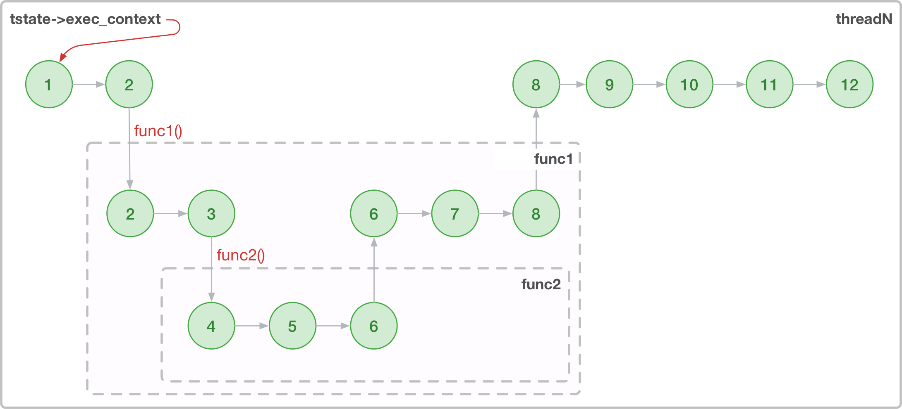
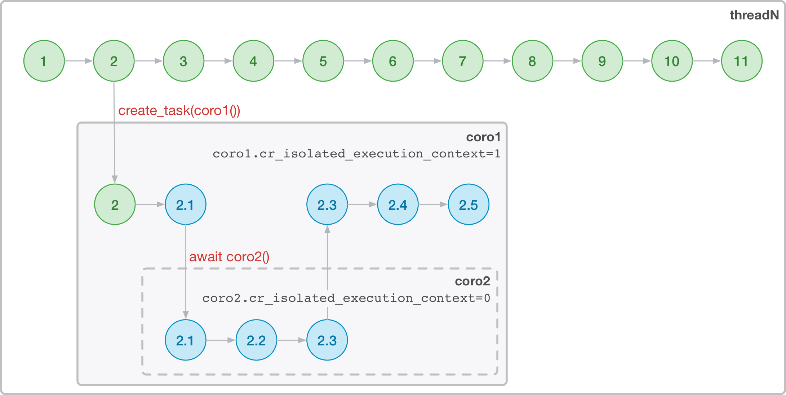
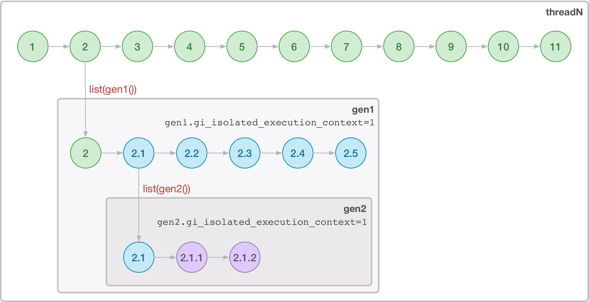
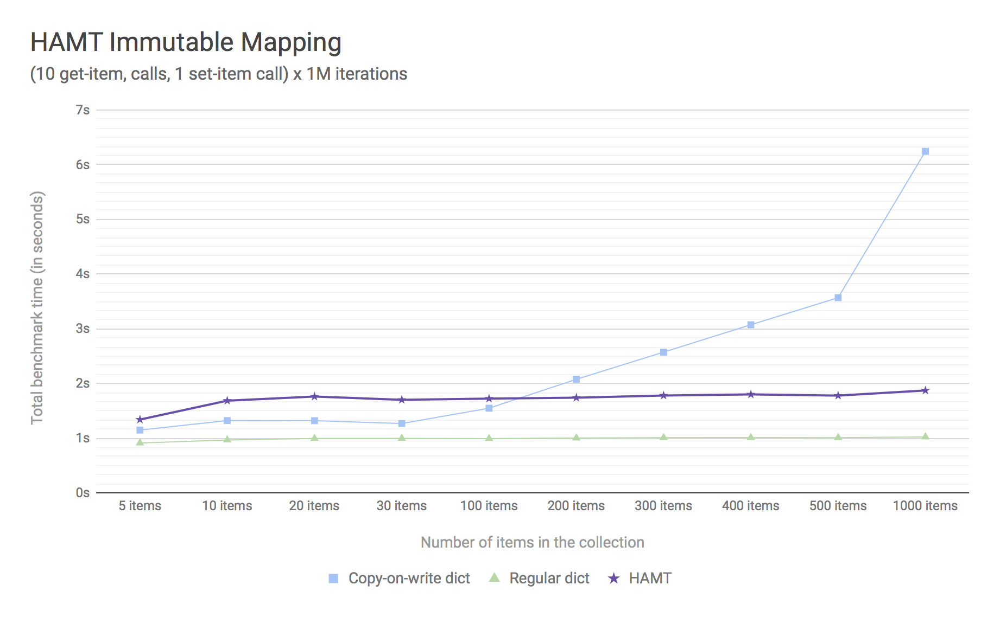
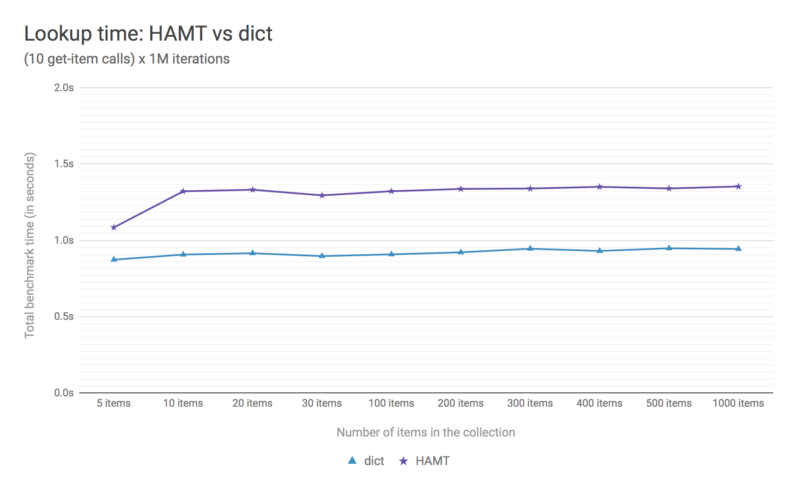

PEP: 550
Title: Execution Context
Version: $Revision$
Last-Modified: $Date$
Author: Yury Selivanov <yury@magic.io>
Status: Draft
Type: Standards Track
Content-Type: text/x-rst
Created: 11-Aug-2017
Python-Version: 3.7
Post-History: 11-Aug-2017

Abstract
========

This PEP proposes a new mechanism to manage execution state--the
logical environment in which a function, a thread, a generator,
or a coroutine executes in.

A few examples of where having a reliable state storage is required:

* Context managers like decimal contexts, ``numpy.errstate``,
  and ``warnings.catch_warnings``;

* Storing request-related data such as security tokens and request
  data in web applications;

* Profiling, tracing, and logging in complex and large code bases.

The usual solution for storing state is to use a Thread-local Storage
(TLS), implemented in the standard library as ``threading.local()``.
Unfortunately, TLS does not work for isolating state of generators or
asynchronous code because such code shares a single thread.

Rationale
=========

Traditionally a Thread-local Storage (TLS) is used for storing the
state.  However, the major flaw of using the TLS is that it works only
for multi-threaded code.  It is not possible to reliably contain the
state within a generator or a coroutine.  For example, consider
the following generator::

    def calculate(precision, ...):
        with decimal.localcontext() as ctx:
            # Set the precision for decimal calculations
            # inside this block
            ctx.prec = precision

            yield calculate_something()
            yield calculate_something_else()

Decimal context is using a TLS to store the state, and because TLS is
not aware of generators, the state can leak.  The above code will
not work correctly, if a user iterates over the ``calculate()``
generator with different precisions in parallel::

    g1 = calculate(100)
    g2 = calculate(50)

    items = list(zip(g1, g2))

    # items[0] will be a tuple of:
    #   first value from g1 calculated with 100 precision,
    #   first value from g2 calculated with 50 precision.
    #
    # items[1] will be a tuple of:
    #   second value from g1 calculated with 50 precision,
    #   second value from g2 calculated with 50 precision.

An even scarier example would be using decimals to represent money
in an async/await application: decimal calculations can suddenly
lose precision in the middle of processing a request.  Currently,
bugs like this are extremely hard to find and fix.

Another common need for web applications is to have access to the
current request object, or security context, or, simply, the request
URL for logging or submitting performance tracing data::

    async def handle_http_request(request):
        context.current_http_request = request

        await ...
        # Invoke your framework code, render templates,
        # make DB queries, etc, and use the global
        # 'current_http_request' in that code.

        # This isn't currently possible to do reliably
        # in asyncio out of the box.

These examples are just a few out of many, where a reliable way to
store context data is absolutely needed.

The inability to use TLS for asynchronous code has lead to
proliferation of ad-hoc solutions, limited to be supported only by
code that was explicitly enabled to work with them.

Current status quo is that any library, including the standard
library, that uses a TLS, will likely not work as expected in
asynchronous code or with generators (see [3]_ as an example issue.)

Some languages that have coroutines or generators recommend to
manually pass a ``context`` object to every function, see [1]_
describing the pattern for Go.  This approach, however, has limited
use for Python, where we have a huge ecosystem that was built to work
with a TLS-like context.  Moreover, passing the context explicitly
does not work at all for libraries like ``decimal`` or ``numpy``,
which use operator overloading.

.NET runtime, which has support for async/await, has a generic
solution of this problem, called ``ExecutionContext`` (see [2]_).
On the surface, working with it is very similar to working with a TLS,
but the former explicitly supports asynchronous code.

Goals
=====

The goal of this PEP is to provide a more reliable alternative to
``threading.local()``.  It should be explicitly designed to work with
Python execution model, equally supporting threads, generators, and
coroutines.

An acceptable solution for Python should meet the following
requirements:

* Transparent support for code executing in threads, coroutines,
  and generators with an easy to use API.

* Negligible impact on the performance of the existing code or the
  code that will be using the new mechanism.

* Fast C API for packages like ``decimal`` and ``numpy``.

Explicit is still better than implicit, hence the new APIs should only
be used when there is no option to pass the state explicitly.

With this PEP implemented, it should be possible to update a context
manager like the below::

    _local = threading.local()

    @contextmanager
    def context(x):
        old_x = getattr(_local, 'x', None)
        _local.x = x
        try:
            yield
        finally:
            _local.x = old_x

to a more robust version that can be reliably used in generators
and async/await code, with a simple transformation::

    @contextmanager
    def context(x):
        old_x = get_execution_context_item('x')
        set_execution_context_item('x', x)
        try:
            yield
        finally:
            set_execution_context_item('x', old_x)

Specification
=============

This proposal introduces a new concept called Execution Context (EC),
along with a set of Python APIs and C APIs to interact with it.

EC is implemented using an immutable mapping.  Every modification
of the mapping produces a new copy of it.  To illustrate what it
means let's compare it to how we work with tuples in Python::

    a0 = ()
    a1 = a0 + (1,)
    a2 = a1 + (2,)

    # a0 is an empty tuple
    # a1 is (1,)
    # a2 is (1, 2)

Manipulating an EC object would be similar::

    a0 = EC()
    a1 = a0.set('foo', 'bar')
    a2 = a1.set('spam', 'ham')

    # a0 is an empty mapping
    # a1 is {'foo': 'bar'}
    # a2 is {'foo': 'bar', 'spam': 'ham'}

In CPython, every thread that can execute Python code has a
corresponding ``PyThreadState`` object.  It encapsulates important
runtime information like a pointer to the current frame, and is
being used by the ceval loop extensively.  We add a new field to
``PyThreadState``, called ``exec_context``, which points to the
current EC object.

We also introduce a set of APIs to work with Execution Context.
In this section we will only cover two functions that are needed to
explain how Execution Context works.  See the full list of new APIs
in the `New APIs`_ section.

* ``sys.get_execution_context_item(key, default=None)``: lookup
  ``key`` in the EC of the executing thread.  If not found,
  return ``default``.

* ``sys.set_execution_context_item(key, value)``: get the
  current EC of the executing thread.  Add a ``key``/``value``
  item to it, which will produce a new EC object.  Set the
  new object as the current one for the executing thread.
  In pseudo-code::

      tstate = PyThreadState_GET()
      ec = tstate.exec_context
      ec2 = ec.set(key, value)
      tstate.exec_context = ec2

Note, that some important implementation details and optimizations
are omitted here, and will be covered in later sections of this PEP.

Now let's see how Execution Contexts work with regular multi-threaded
code, generators, and coroutines.

Regular & Multithreaded Code
----------------------------

For regular Python code, EC behaves just like a thread-local.  Any
modification of the EC object produces a new one, which is immediately
set as the current one for the thread state.

   Figure 1.  Execution Context flow in a thread.

As Figure 1 illustrates, if a function calls
``set_execution_context_item()``, the modification of the execution
context will be visible to all subsequent calls and to the caller::

    def set_foo():
        set_execution_context_item('foo', 'spam')

    set_execution_context_item('foo', 'bar')
    print(get_execution_context_item('foo'))

    set_foo()
    print(get_execution_context_item('foo'))

    # will print:
    #   bar
    #   spam

Coroutines
----------

Python :pep:`492` coroutines are used to implement cooperative
multitasking.  For a Python end-user they are similar to threads,
especially when it comes to sharing resources or modifying
the global state.

An event loop is needed to schedule coroutines.  Coroutines that
are explicitly scheduled by the user are usually called Tasks.
When a coroutine is scheduled, it can schedule other coroutines using
an ``await`` expression.  In async/await world, awaiting a coroutine
can be viewed as a different calling convention: Tasks are similar to
threads, and awaiting on coroutines within a Task is similar to
calling functions within a thread.

By drawing a parallel between regular multithreaded code and
async/await, it becomes apparent that any modification of the
execution context within one Task should be visible to all coroutines
scheduled within it.  Any execution context modifications, however,
must not be visible to other Tasks executing within the same thread.

To achieve this, a small set of modifications to the coroutine object
is needed:

* When a coroutine object is instantiated, it saves a reference to
  the current execution context object to its ``cr_execution_context``
  attribute.

* Coroutine's ``.send()`` and ``.throw()`` methods are modified as
  follows (in pseudo-C)::

    if coro->cr_isolated_execution_context:
        # Save a reference to the current execution context
        old_context = tstate->execution_context

        # Set our saved execution context as the current
        # for the current thread.
        tstate->execution_context = coro->cr_execution_context

        try:
            # Perform the actual `Coroutine.send()` or
            # `Coroutine.throw()` call.
            return coro->send(...)
        finally:
            # Save a reference to the updated execution_context.
            # We will need it later, when `.send()` or `.throw()`
            # are called again.
            coro->cr_execution_context = tstate->execution_context

            # Restore thread's execution context to what it was before
            # invoking this coroutine.
            tstate->execution_context = old_context
    else:
        # Perform the actual `Coroutine.send()` or
        # `Coroutine.throw()` call.
        return coro->send(...)

* ``cr_isolated_execution_context`` is a new attribute on coroutine
  objects.  Set to ``True`` by default, it makes any execution context
  modifications performed by coroutine to stay visible only to that
  coroutine.

  When Python interpreter sees an ``await`` instruction, it flips
  ``cr_isolated_execution_context`` to ``False`` for the coroutine
  that is about to be awaited.  This makes any changes to execution
  context made by nested coroutine calls within a Task to be visible
  throughout the Task.

  Because the top-level coroutine (Task) cannot be scheduled with
  ``await`` (in asyncio you need to call ``loop.create_task()`` or
  ``asyncio.ensure_future()`` to schedule a Task), all execution
  context modifications are guaranteed to stay within the Task.

* We always work with ``tstate->exec_context``.  We use
  ``coro->cr_execution_context`` only to store coroutine's execution
  context when it is not executing.

Figure 2 below illustrates how execution context mutations work with
coroutines.

   Figure 2.  Execution Context flow in coroutines.

In the above diagram:

* When "coro1" is created, it saves a reference to the current
  execution context "2".

* If it makes any change to the context, it will have its own
  execution context branch "2.1".

* When it awaits on "coro2", any subsequent changes it does to
  the execution context are visible to "coro1", but not outside
  of it.

In code::

    async def inner_foo():
        print('inner_foo:', get_execution_context_item('key'))
        set_execution_context_item('key', 2)

    async def foo():
        print('foo:', get_execution_context_item('key'))

        set_execution_context_item('key', 1)
        await inner_foo()

        print('foo:', get_execution_context_item('key'))

    set_execution_context_item('key', 'spam')
    print('main:', get_execution_context_item('key'))

    asyncio.get_event_loop().run_until_complete(foo())

    print('main:', get_execution_context_item('key'))

which will output::

    main: spam
    foo: spam
    inner_foo: 1
    foo: 2
    main: spam

Generator-based coroutines (generators decorated with
``types.coroutine`` or ``asyncio.coroutine``) behave exactly as
native coroutines with regards to execution context management:
their ``yield from`` expression is semantically equivalent to
``await``.

Generators
----------

Generators in Python, while similar to Coroutines, are used in a
fundamentally different way.  They are producers of data, and
they use ``yield`` expression to suspend/resume their execution.

A crucial difference between ``await coro`` and ``yield value`` is
that the former expression guarantees that the ``coro`` will be
executed to the end, while the latter is producing ``value`` and
suspending the generator until it gets iterated again.

Generators share 99% of their implementation with coroutines, and
thus have similar new attributes ``gi_execution_context`` and
``gi_isolated_execution_context``.  Similar to coroutines, generators
save a reference to the current execution context when they are
instantiated.  The have the same implementation of ``.send()`` and
``.throw()`` methods.

The only difference is that
``gi_isolated_execution_context`` is always set to ``True``, and
is never modified by the interpreter.  ``yield from o`` expression in
regular generators that are not decorated with ``types.coroutine``,
is semantically equivalent to ``for v in o: yield v``.

   Figure 3.  Execution Context flow in a generator.

In the above diagram:

* When "gen1" is created, it saves a reference to the current
  execution context "2".

* If it makes any change to the context, it will have its own
  execution context branch "2.1".

* When "gen2" is created, it saves a reference to the current
  execution context for it -- "2.1".

* Any subsequent execution context updated in "gen2" will only
  be visible to "gen2".

* Likewise, any context changes that "gen1" will do after it
  created "gen2" will not be visible to "gen2".

In code::

    def inner_foo():
        for i in range(3):
            print('inner_foo:', get_execution_context_item('key'))
            set_execution_context_item('key', i)
            yield i

    def foo():
        set_execution_context_item('key', 'spam')
        print('foo:', get_execution_context_item('key'))

        inner = inner_foo()

        while True:
            val = next(inner, None)
            if val is None:
                break
            yield val
            print('foo:', get_execution_context_item('key'))

    set_execution_context_item('key', 'spam')
    print('main:', get_execution_context_item('key'))

    list(foo())

    print('main:', get_execution_context_item('key'))

which will output::

    main: ham
    foo: spam
    inner_foo: spam
    foo: spam
    inner_foo: 0
    foo: spam
    inner_foo: 1
    foo: spam
    main: ham

As we see, any modification of the execution context in a generator
is visible only to the generator itself.

There is one use-case where it is desired for generators to affect
the surrounding execution context: ``contextlib.contextmanager``
decorator.  To make the following work::

    @contextmanager
    def context(x):
        old_x = get_execution_context_item('x')
        set_execution_context_item('x', x)
        try:
            yield
        finally:
            set_execution_context_item('x', old_x)

we modified ``contextmanager`` to flip
``gi_isolated_execution_context`` flag to ``False`` on its generator.

Greenlets
---------

Greenlet is an alternative implementation of cooperative
scheduling for Python.  Although greenlet package is not part of
CPython, popular frameworks like gevent rely on it, and it is
important that greenlet can be modified to support execution
contexts.

In a nutshell, greenlet design is very similar to design of
generators.  The main difference is that for generators, the stack
is managed by the Python interpreter.  Greenlet works outside of the
Python interpreter, and manually saves some ``PyThreadState``
fields and pushes/pops the C-stack.  Since Execution Context is
implemented on top of ``PyThreadState``, it's easy to add
transparent support of it to greenlet.

New APIs
========

Even though this PEP adds a number of new APIs, please keep in mind,
that most Python users will likely ever use only two of them:
``sys.get_execution_context_item()`` and
``sys.set_execution_context_item()``.

Python
------

1. ``sys.get_execution_context_item(key, default=None)``: lookup
   ``key`` for the current Execution Context.  If not found,
   return ``default``.

2. ``sys.set_execution_context_item(key, value)``: set
   ``key``/``value`` item for the current Execution Context.
   If ``value`` is ``None``, the item will be removed.

3. ``sys.get_execution_context()``: return the current Execution
   Context object: ``sys.ExecutionContext``.

4. ``sys.set_execution_context(ec)``: set the passed
   ``sys.ExecutionContext`` instance as a current one for the current
   thread.

5. ``sys.ExecutionContext`` object.

   Implementation detail: ``sys.ExecutionContext`` wraps a low-level
   ``PyExecContextData`` object.  ``sys.ExecutionContext`` has a
   mutable mapping API, abstracting away the real immutable
   ``PyExecContextData``.

   * ``ExecutionContext()``: construct a new, empty, execution
     context.

   * ``ec.run(func, *args)`` method: run ``func(*args)`` in the
     ``ec`` execution context.

   * ``ec[key]``: lookup ``key`` in ``ec`` context.

   * ``ec[key] = value``: assign ``key``/``value`` item to the ``ec``.

   * ``ec.get()``, ``ec.items()``, ``ec.values()``, ``ec.keys()``, and
     ``ec.copy()`` are similar to that of ``dict`` object.

C API
-----

C API is different from the Python one because it operates directly
on the low-level immutable ``PyExecContextData`` object.

1. New ``PyThreadState->exec_context`` field, pointing to a
   ``PyExecContextData`` object.

2. ``PyThreadState_SetExecContextItem`` and
   ``PyThreadState_GetExecContextItem`` similar to
   ``sys.set_execution_context_item()`` and
   ``sys.get_execution_context_item()``.

3. ``PyThreadState_GetExecContext``: similar to
   ``sys.get_execution_context()``.  Always returns an
   ``PyExecContextData`` object.  If ``PyThreadState->exec_context``
   is ``NULL`` an new and empty one will be created and assigned
   to ``PyThreadState->exec_context``.

4. ``PyThreadState_SetExecContext``: similar to
   ``sys.set_execution_context()``.

5. ``PyExecContext_New``: create a new empty ``PyExecContextData``
   object.

6. ``PyExecContext_SetItem`` and ``PyExecContext_GetItem``.

The exact layout ``PyExecContextData`` is private, which allows
to switch it to a different implementation later.  More on that
in the `Implementation Details`_ section.

Modifications in Standard Library
=================================

* ``contextlib.contextmanager`` was updated to flip the new
  ``gi_isolated_execution_context`` attribute on the generator.

* ``asyncio.events.Handle`` object now captures the current
  execution context when it is created, and uses the saved
  execution context to run the callback (with
  ``ExecutionContext.run()`` method.)  This makes
  ``loop.call_soon()`` to run callbacks in the execution context
  they were scheduled.

  No modifications in ``asyncio.Task`` or ``asyncio.Future`` were
  necessary.

Some standard library modules like ``warnings`` and ``decimal``
can be updated to use new execution contexts.  This will be considered
in separate issues if this PEP is accepted.

Backwards Compatibility
=======================

This proposal preserves 100% backwards compatibility.

Performance
===========

Implementation Details
----------------------

The new ``PyExecContextData`` object is wrapping a ``dict`` object.
Any modification requires creating a shallow copy of the dict.

While working on the reference implementation of this PEP, we were
able to optimize ``dict.copy()`` operation **5.5x**, see [4]_ for
details.

.. figure:: pep-0550/dict_copy.png
   :align: center
   :width: 100%

   Figure 4.

Figure 4 shows that the performance of immutable dict implemented
with shallow copying is expectedly O(n) for the ``set()`` operation.
However, this is tolerable until dict has more than 100 items
(1 ``set()`` takes about a microsecond.)

Judging by the number of modules that need EC in Standard Library
it is likely that real world Python applications will use
significantly less than 100 execution context variables.

The important point is that the cost of accessing a key in
Execution Context is always O(1).

If the ``set()`` operation performance is a major concern, we discuss
alternative approaches that have O(1) or close ``set()`` performance
in `Alternative Immutable Dict Implementation`_, `Faster C API`_, and
`Copy-on-write Execution Context`_ sections.

Generators and Coroutines
-------------------------

Using a microbenchmark for generators and coroutines from :pep:`492`
([12]_), it was possible to observe 0.5 to 1% performance degradation.

asyncio echoserver microbechmarks from the uvloop project [13]_
showed 1-1.5% performance degradation for asyncio code.

asyncpg benchmarks [14]_, that execute more code and are closer to a
real-world application did not exhibit any noticeable performance
change.

Overall Performance Impact
--------------------------

The total number of changed lines in the ceval loop is 2 -- in the
``YIELD_FROM`` opcode implementation.  Only performance of generators
and coroutines can be affected by the proposal.

This was confirmed by running Python Performance Benchmark Suite
[15]_, which demonstrated that there is no difference between
3.7 master branch and this PEP reference implementation branch
(full benchmark results can be found here [16]_.)

Design Considerations
=====================

Alternative Immutable Dict Implementation
-----------------------------------------

Languages like Clojure and Scala use Hash Array Mapped Tries (HAMT)
to implement high performance immutable collections [5]_, [6]_.

Immutable mappings implemented with HAMT have O(log\ :sub:`32`\ N)
performance for both ``set()`` and ``get()`` operations, which will
be essentially O(1) for relatively small mappings in EC.

To assess if HAMT can be used for Execution Context, we implemented
it in CPython [7]_.

   Figure 5.  Benchmark code can be found here: [9]_.

Figure 5 shows that HAMT indeed displays O(1) performance for all
benchmarked dictionary sizes.  For dictionaries with less than 100
items, HAMT is a bit slower than Python dict/shallow copy.

   Figure 6.  Benchmark code can be found here: [10]_.

Figure 6 below shows comparison of lookup costs between Python dict
and an HAMT immutable mapping.  HAMT lookup time is 30-40% worse
than Python dict lookups on average, which is a very good result,
considering how well Python dicts are optimized.

Note, that according to [8]_, HAMT design can be further improved.

The bottom line is that the current approach with implementing
an immutable mapping with shallow-copying dict will likely perform
adequately in real-life applications.  The HAMT solution is more
future proof, however.

The proposed API is designed in such a way that the underlying
implementation of the mapping can be changed completely without
affecting the Execution Context `Specification`_, which allows
us to switch to HAMT at some point if necessary.

Copy-on-write Execution Context
-------------------------------

The implementation of Execution Context in .NET is different from
this PEP. .NET uses copy-on-write mechanism and a regular mutable
mapping.

One way to implement this in CPython would be to have two new
fields in ``PyThreadState``:

* ``exec_context`` pointing to the current Execution Context mapping;
* ``exec_context_copy_on_write`` flag, set to ``0`` initially.

The idea is that whenever we are modifying the EC, the copy-on-write
flag is checked, and if it is set to ``1``, the EC is copied.

Modifications to Coroutine and Generator ``.send()`` and ``.throw()``
methods described in the `Coroutines`_ section will be almost the
same, except that in addition to the ``gi_execution_context`` they
will have a ``gi_exec_context_copy_on_write`` flag.  When a coroutine
or a generator starts, the flag will be set to ``1``.  This will
ensure that any modification of the EC performed within a coroutine
or a generator will be isolated.

This approach has one advantage:

* For Execution Context that contains a large number of items,
  copy-on-write is a more efficient solution than the shallow-copy
  dict approach.

However, we believe that copy-on-write disadvantages are more
important to consider:

* Copy-on-write behaviour for generators and coroutines makes
  EC semantics less predictable.

  With immutable EC approach, generators and coroutines always
  execute in the EC that was current at the moment of their
  creation.  Any modifications to the outer EC while a generator
  or a coroutine is executing are not visible to them::

    def generator():
        yield 1
        print(get_execution_context_item('key'))
        yield 2

    set_execution_context_item('key', 'spam')
    gen = iter(generator())
    next(gen)
    set_execution_context_item('key', 'ham')
    next(gen)

  The above script will always print 'spam' with immutable EC.

  With a copy-on-write approach, the above script will print 'ham'.
  Now, consider that ``generator()`` was refactored to call some
  library function, that uses Execution Context::

    def generator():
        yield 1
        some_function_that_uses_decimal_context()
        print(get_execution_context_item('key'))
        yield 2

  Now, the script will print 'spam', because
  ``some_function_that_uses_decimal_context`` forced the EC to copy,
  and ``set_execution_context_item('key', 'ham')`` line did not
  affect the ``generator()`` code after all.

* Similarly to the previous point, ``sys.ExecutionContext.run()``
  method will also become less predictable, as
  ``sys.get_execution_context()`` would still return a reference to
  the current mutable EC.

  We can't modify ``sys.get_execution_context()`` to return a shallow
  copy of the current EC, because this would seriously harm
  performance of ``asyncio.call_soon()`` and similar places, where
  it is important to propagate the Execution Context.

* Even though copy-on-write requires to shallow copy the execution
  context object less frequently, copying will still take place
  in coroutines and generators.  In which case, HAMT approach will
  perform better for medium to large sized execution contexts.

All in all, we believe that the copy-on-write approach introduces
very subtle corner cases that could lead to bugs that are
exceptionally hard to discover and fix.

The immutable EC solution in comparison is always predictable and
easy to reason about.  Therefore we believe that any slight
performance gain that the copy-on-write solution might offer is not
worth it.

Faster C API
------------

Packages like numpy and standard library modules like decimal need
to frequently query the global state for some local context
configuration.  It is important that the APIs that they use is as
fast as possible.

The proposed ``PyThreadState_SetExecContextItem`` and
``PyThreadState_GetExecContextItem`` functions need to get the
current thread state with ``PyThreadState_GET()`` (fast) and then
perform a hash lookup (relatively slow).  We can eliminate the hash
lookup by adding three additional C API functions:

* ``Py_ssize_t PyExecContext_RequestIndex(char *key_name)``:
  a function similar to the existing ``_PyEval_RequestCodeExtraIndex``
  introduced :pep:`523`.  The idea is to request a unique index
  that can later be used to lookup context items.

  The ``key_name`` can later be used by ``sys.ExecutionContext`` to
  introspect items added with this API.

* ``PyThreadState_SetExecContextIndexedItem(Py_ssize_t index, PyObject *val)``
  and ``PyThreadState_GetExecContextIndexedItem(Py_ssize_t index)``
  to request an item by its index, avoiding the cost of hash lookup.

Why setting a key to None removes the item?
-------------------------------------------

Consider a context manager::

    @contextmanager
    def context(x):
        old_x = get_execution_context_item('x')
        set_execution_context_item('x', x)
        try:
            yield
        finally:
            set_execution_context_item('x', old_x)

With ``set_execution_context_item(key, None)`` call removing the
``key``, the user doesn't need to write additional code to remove
the ``key`` if it wasn't in the execution context already.

An alternative design with ``del_execution_context_item()`` method
would look like the following::

    @contextmanager
    def context(x):
        not_there = object()
        old_x = get_execution_context_item('x', not_there)
        set_execution_context_item('x', x)
        try:
            yield
        finally:
            if old_x is not_there:
                del_execution_context_item('x')
            else:
                set_execution_context_item('x', old_x)

Can we fix ``PyThreadState_GetDict()``?
---------------------------------------

``PyThreadState_GetDict`` is a TLS, and some of its existing users
might depend on it being just a TLS.  Changing its behaviour to follow
the Execution Context semantics would break backwards compatibility.

PEP 521
-------

:pep:`521` proposes an alternative solution to the problem:
enhance Context Manager Protocol with two new methods: ``__suspend__``
and ``__resume__``.  To make it compatible with async/await,
the Asynchronous Context Manager Protocol will also need to be
extended with ``__asuspend__`` and ``__aresume__``.

This allows to implement context managers like decimal context and
``numpy.errstate`` for generators and coroutines.

The following code::

    class Context:

        def __enter__(self):
            self.old_x = get_execution_context_item('x')
            set_execution_context_item('x', 'something')

        def __exit__(self, *err):
            set_execution_context_item('x', self.old_x)

would become this::

    class Context:

        def __enter__(self):
            self.old_x = get_execution_context_item('x')
            set_execution_context_item('x', 'something')

        def __suspend__(self):
            set_execution_context_item('x', self.old_x)

        def __resume__(self):
            set_execution_context_item('x', 'something')

        def __exit__(self, *err):
            set_execution_context_item('x', self.old_x)

Besides complicating the protocol, the implementation will likely
negatively impact performance of coroutines, generators, and any code
that uses context managers, and will notably complicate the
interpreter implementation.  It also does not solve the leaking state
problem for greenlet/gevent.

:pep:`521` also does not provide any mechanism to propagate state
in a local context, like storing a request object in an HTTP request
handler to have better logging.

Can Execution Context be implemented outside of CPython?
--------------------------------------------------------

Because async/await code needs an event loop to run it, an EC-like
solution can be implemented in a limited way for coroutines.

Generators, on the other hand, do not have an event loop or
trampoline, making it impossible to intercept their ``yield`` points
outside of the Python interpreter.

Is it possible to write a context manager to isolate EC changes?
----------------------------------------------------------------

Yes!

::

    @contextlib.contextmanager
    def isolated_context():
        old_ctx = sys.get_execution_context()
        try:
            yield
        finally:
            sys.set_execution_context(old_ctx)

    with isolated_context():
        # Any Execution Context changes will not be visible
        # outside of this block.

Reference Implementation
========================

The reference implementation can be found here: [11]_.

References
==========

.. [1] https://blog.golang.org/context

.. [2] https://msdn.microsoft.com/en-us/library/system.threading.executioncontext.aspx

.. [3] https://github.com/numpy/numpy/issues/9444

.. [4] http://bugs.python.org/issue31179

.. [5] https://en.wikipedia.org/wiki/Hash_array_mapped_trie

.. [6] http://blog.higher-order.net/2010/08/16/assoc-and-clojures-persistenthashmap-part-ii.html

.. [7] https://github.com/1st1/cpython/tree/hamt

.. [8] https://michael.steindorfer.name/publications/oopsla15.pdf

.. [9] https://gist.github.com/1st1/9004813d5576c96529527d44c5457dcd

.. [10] https://gist.github.com/1st1/dbe27f2e14c30cce6f0b5fddfc8c437e

.. [11] https://github.com/1st1/cpython/tree/pep550

.. [12] https://www.python.org/dev/peps/pep-0492/#async-await

.. [13] https://github.com/MagicStack/uvloop/blob/master/examples/bench/echoserver.py

.. [14] https://github.com/MagicStack/pgbench

.. [15] https://github.com/python/performance

.. [16] https://gist.github.com/1st1/6b7a614643f91ead3edf37c4451a6b4c

Copyright
=========

This document has been placed in the public domain.

..
   Local Variables:
   mode: indented-text
   indent-tabs-mode: nil
   sentence-end-double-space: t
   fill-column: 70
   coding: utf-8
   End:
