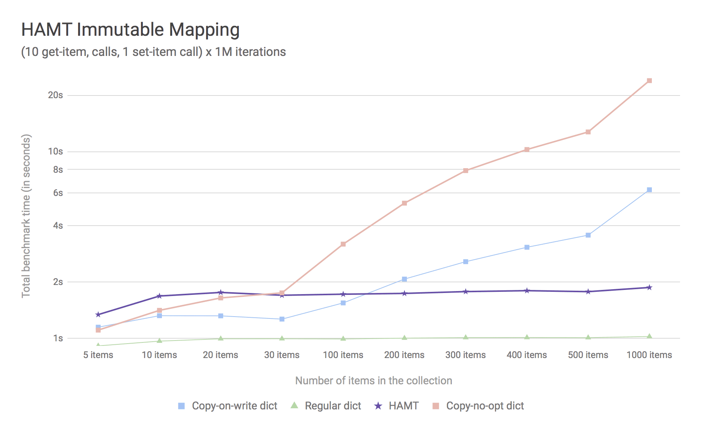

PEP: 550
Title: Implicit Execution Context
Version: $Revision$
Last-Modified: $Date$
Author: Yury Selivanov <yury@magic.io>, Nick Coghlan <ncoghlan@gmail.com>
Status: Draft
Type: Standards Track
Content-Type: text/x-rst
Created: 11-Aug-2017
Python-Version: 3.7
Post-History: 11-Aug-2017, 15-Aug-2017, 18-Aug-2017

Abstract
========

This PEP proposes a new mechanism to manage implicit execution state -- the
logical environment in which a function, a thread, a generator,
or a coroutine executes.

A few examples where having reliable implicit state storage is required:

* Context managers like decimal contexts, ``numpy.errstate``,
  and ``warnings.catch_warnings``;

* Storing request-related data such as security tokens and request
  data in web applications, implementing i18n;

* Profiling, tracing, and logging in complex and large code bases.

The proposed API is split into two main sections:

* an implicit context *access* API, which consists of the ``ContextKey`` type,
  its methods, and a helper function to create new ``ContextKey`` instances
* an implicit context *management* API, which consists of the opaque
  ``LogicalContext`` and ``ExecutionContext`` types, several helper functions
  to create and manipulate these objects, and new attributes on generators and
  coroutines to indicate whether or not they should be run in a private logical
  context

Note: the PEP is currently being redrafted to reflect the above separation into
clearly distinct access and management APIs. The Specification section does
*not* currently reflect that separation.

Rationale
=========

In a variety of situations, especially those relying on operator overloading,
it isn't always practical to pass all the required configuration state for an
operation as an explicit function parameter.

While module globals can sometimes be used for this purpose, they are often
insufficient when an application wants to be using different contexts for
different operations that may be executing concurrently (for example, the
current decimal context, or the request currently being handled in a web
framework).

Traditionally, thread local storage (TLS), also known as thread-specific
storage (TSS), has been used for storing this implicit state.  However, the
major flaw of relying on thread locals for this use case is that it works only
for thread-based concurrency: it fails to reliably contain state updates made
within a generator or a coroutine.

For example, consider the following generator::

    import decimal
    def precision_gen(value):
        yield +value
        yield +value
        with decimal.localcontext(decimal.Context(prec=2)):
            yield +value
            yield +value

And the following interactive session using that generator::

    >>> value = decimal.Decimal("1.2345")
    >>> print(value)
    1.2345
    >>> print(+value)
    1.2345
    >>> pg = precision_gen(value)
    >>> print(next(pg))
    1.2345

So far, so good - the unary ``+`` operator rounds to the local context, the
default decimal precision is 28, and so all three values are displayed the
same way. Things also behave as expected if we reconfigure the decimal context
outside the generator::

    >>> decimal.setcontext(decimal.Context(prec=3))
    >>> print(+value)
    1.23
    >>> print(next(pg))
    1.23

With the new more limited precision set, both the code inside the generator
and the code outside the generator round their results to only 3 significant
digits.

However, problems arise once we advance the generator again and it
*changes* the active decimal context in the current thread to round to only
two significant digits::

    >>> print(next(pg))
    1.2
    >>> print(+value) # Expecting 1.23
    1.2

Our state change, intended to be local to the generator, has *leaked*, and will
now affect all other code running in that thread until the decimal context is
updated again (whether by advancing the generator until it reverts its state
change, or through other means).

This isn't the only potentially perplexing consequence of combining thread
locals with generators though, as even though the generator has explicitly
configured a desired decimal precision, it remains possible for the code
advancing the generator to override that setting::

    >>> decimal.setcontext(decimal.Context(prec=28))
    >>> print(+value)
    1.2345
    >>> print(next(pg)) # Expecting 1.2
    1.2345

Neither of those last two behaviours is desirable:

* if a generator updates this kind of implicit context, we want that change to
  be visible to the generator itself, and to other functions that the generator
  calls, but we do *not* want it to be visible to the outer code advancing the
  generator (at least, not by default - we do want it to remain available as an
  explicitly opt-in behaviour)
* while we want generators to respect changes to their implicit context by
  default, we *also* want them to be able to reliably override that context,
  such that readers can correctly reason about an example like the ``with``
  statement in ``precision_gen()`` without relying on the assumption that the
  calling code won't update the decimal context unexpectedly

While the above example uses a generator for simplicity, a more realistic,
and more concerning, example would be using decimals to represent money
in an async/await application: if another coroutine running in the same thread
adjusts the shared decimal context and then yields control of the thread
without first reverting that change, decimal calculations may suddenly lose
precision in the middle of processing a request.  Currently, implicit state
management interaction bugs like this are extremely hard to find and fix.

While the decimal module does offer more explicit context management features to
avoid these kinds of unexpected side effects, actually adopting them means
giving up on the attractive operator overloading syntax and instead using
explicit method calls directly on Decimal context objects.

Another common need for web applications is to have access to the
current request object, or security context, or, simply, the request
URL for logging or submitting performance tracing data::

    async def handle_http_request(request):
        context.current_http_request = request

        await ...
        # Invoke your framework code, render templates,
        # make DB queries, etc, and use the global
        # 'current_http_request' in that code.

        # This isn't currently possible to do reliably
        # in asyncio out of the box.

These examples are just a few out of many, where a reliable way to
store implicit context data is absolutely needed.

The difficulty of reliably using thread locals in asynchronous code has lead to
a proliferation of ad-hoc solutions, which are limited in scope, do not support
all required use cases, and can make it difficult to effectively share code
that relies on implicit state management between different asynchronous
frameworks.

As a result, the current status quo is that any library, including the
standard library, that relies on thread local variables for implicit state
management, will likely not work as expected in asynchronous code or with
generators (see [3]_ as an example issue.)

Background
==========

Python is not the only language to face this implicit context management
problem, as it is inherent in the notion of supporting asynchronous operations
that can be suspended and resumed independently of the underlying operating
system thread executing them.

Some languages that have coroutines or generators recommend to
manually pass a ``context`` object to every function, see [1]_
describing the pattern for Go.  This approach, however, has limited
use for Python, where we have a huge ecosystem that was built to work
with a TLS-like implicit context.  Moreover, passing the context explicitly
does not work at all for libraries like ``decimal`` or ``numpy``,
which use operator overloading.

The .NET runtime, which has support for async/await, has a generic
solution of this problem, called ``ExecutionContext`` (see [2]_).
On the surface, working with it is very similar to working with a TLS,
but the ExecutionContext concept is explicitly designed to work correctly
for asynchronous code.

Goals
=====

The goal of this PEP is to provide an alternative to ``threading.local()``
for use by libraries (such as the standard library's ``decimal`` module)
that actually want to track logical threads of control within an application,
rather than specifically tracking operating system level threads.

The proposed API is explicitly designed to work with Python's execution model,
equally supporting threads, generators, and coroutines.

An acceptable solution for Python should meet the following
requirements:

* Transparent support for code executing in threads, coroutines,
  and generators with an easy to use API.

* Negligible impact on the performance of the existing code or the
  code that will be using the new mechanism.

* Fast C API for packages like ``decimal`` and ``numpy``.

Explicit is still better than implicit, hence the new APIs should only
be used when there is no acceptable way of passing the state
explicitly.

Specification
=============

Execution Context is a mechanism of storing and accessing data specific
to a logical thread of execution.  We consider OS threads,
generators, and chains of coroutines (such as ``asyncio.Task``)
to be variants of a logical thread.

In this specification, we will use the following terminology:

* **Logical Context**, or LC, is a key/value mapping that stores the
  context of a logical thread.

* **Execution Context**, or EC, is an OS-thread-specific dynamic
  stack of Logical Contexts.

* **Context Key**, or CK, is an object used to set and get values
  from the Execution Context.

Please note that throughout the specification we use simple
pseudo-code to illustrate how the EC machinery works.  The actual
algorithms and data structures that we will use to implement the PEP
are discussed in the `Implementation Strategy`_ section.

Context Key Object
------------------

The ``sys.new_context_key(name)`` function creates a new ``ContextKey``
object.  The ``name`` parameter is a ``str`` needed to render a
representation of ``ContextKey`` object for introspection and
debugging purposes.

``ContextKey`` objects have the following methods and attributes:

* ``.name``: read-only name;

* ``.set(o)`` method: set the value to ``o`` for the context key
  in the execution context.

* ``.get()`` method: return the current EC value for the context key.
  Context keys return ``None`` when the key is missing, so the method
  never fails.

The below is an example of how context keys can be used::

    my_context = sys.new_context_key('my_context')
    my_context.set('spam')

    # Later, to access the value of my_context:
    print(my_context.get())

Thread State and Multi-threaded code
------------------------------------

Execution Context is implemented on top of Thread-local Storage.
For every thread there is a separate stack of Logical Contexts --
mappings of ``ContextKey`` objects to their values in the LC.
New threads always start with an empty EC.

For CPython::

    PyThreadState:
        execution_context: ExecutionContext([
            LogicalContext({ci1: val1, ci2: val2, ...}),
            ...
        ])

The ``ContextKey.get()`` and ``.set()`` methods are defined as
follows (in pseudo-code)::

    class ContextKey:

        def get(self):
            tstate = PyThreadState_Get()

            for logical_context in reversed(tstate.execution_context):
                if self in logical_context:
                    return logical_context[self]

            return None

        def set(self, value):
            tstate = PyThreadState_Get()

            if not tstate.execution_context:
                tstate.execution_context = [LogicalContext()]

            tstate.execution_context[-1][self] = value

With the semantics defined so far, the Execution Context can already
be used as an alternative to ``threading.local()``::

    def print_foo():
        print(ci.get() or 'nothing')

    ci = sys.new_context_key('ci')
    ci.set('foo')

    # Will print "foo":
    print_foo()

    # Will print "nothing":
    threading.Thread(target=print_foo).start()

Manual Context Management
-------------------------

Execution Context is generally managed by the Python interpreter,
but sometimes it is desirable for the user to take the control
over it.  A few examples when this is needed:

* running a computation in ``concurrent.futures.ThreadPoolExecutor``
  with the current EC;

* reimplementing generators with iterators (more on that later);

* managing contexts in asynchronous frameworks (implement proper
  EC support in ``asyncio.Task`` and ``asyncio.loop.call_soon``.)

For these purposes we add a set of new APIs (they will be used in
later sections of this specification):

* ``sys.new_logical_context()``: create an empty ``LogicalContext``
  object.

* ``sys.new_execution_context()``: create an empty
  ``ExecutionContext`` object.

* Both ``LogicalContext`` and ``ExecutionContext`` objects are opaque
  to Python code, and there are no APIs to modify them.

* ``sys.get_execution_context()`` function.  The function returns a
  copy of the current EC: an ``ExecutionContext`` instance.

  The runtime complexity of the actual implementation of this function
  can be O(1), but for the purposes of this section it is equivalent
  to::

    def get_execution_context():
        tstate = PyThreadState_Get()
        return copy(tstate.execution_context)

* ``sys.run_with_execution_context(ec: ExecutionContext, func, *args,
  **kwargs)`` runs ``func(*args, **kwargs)`` in the provided execution
  context::

    def run_with_execution_context(ec, func, *args, **kwargs):
        tstate = PyThreadState_Get()

        old_ec = tstate.execution_context

        tstate.execution_context = ExecutionContext(
            ec.logical_contexts + [LogicalContext()]
        )

        try:
            return func(*args, **kwargs)
        finally:
            tstate.execution_context = old_ec

  Any changes to Logical Context by ``func`` will be ignored.
  This allows to reuse one ``ExecutionContext`` object for multiple
  invocations of different functions, without them being able to
  affect each other's environment::

      ci = sys.new_context_key('ci')
      ci.set('spam')

      def func():
          print(ci.get())
          ci.set('ham')

      ec = sys.get_execution_context()

      sys.run_with_execution_context(ec, func)
      sys.run_with_execution_context(ec, func)

      # Will print:
      #   spam
      #   spam

* ``sys.run_with_logical_context(lc: LogicalContext, func, *args,
  **kwargs)`` runs ``func(*args, **kwargs)`` in the current execution
  context using the specified logical context.

  Any changes that ``func`` does to the logical context will be
  persisted in ``lc``.  This behaviour is different from the
  ``run_with_execution_context()`` function, which always creates
  a new throw-away logical context.

  In pseudo-code::

    def run_with_logical_context(lc, func, *args, **kwargs):
        tstate = PyThreadState_Get()

        old_ec = tstate.execution_context

        tstate.execution_context = ExecutionContext(
            old_ec.logical_contexts + [lc]
        )

        try:
            return func(*args, **kwargs)
        finally:
            tstate.execution_context = old_ec

  Using the previous example::

      ci = sys.new_context_key('ci')
      ci.set('spam')

      def func():
          print(ci.get())
          ci.set('ham')

      ec = sys.get_execution_context()
      lc = sys.new_logical_context()

      sys.run_with_logical_context(lc, func)
      sys.run_with_logical_context(lc, func)

      # Will print:
      #   spam
      #   ham

As an example, let's make a subclass of
``concurrent.futures.ThreadPoolExecutor`` that preserves the execution
context for scheduled functions::

    class Executor(concurrent.futures.ThreadPoolExecutor):

        def submit(self, fn, *args, **kwargs):
            context = sys.get_execution_context()

            fn = functools.partial(
                sys.run_with_execution_context, context,
                fn, *args, **kwargs)

            return super().submit(fn)

Generators
----------

Generators in Python are producers of data, and ``yield`` expressions
are used to suspend/resume their execution.  When generators suspend
execution, their local state will "leak" to the outside code if they
store it in a TLS or in a global variable::

    local = threading.local()

    def gen():
        old_x = local.x
        local.x = 'spam'
        try:
            yield
            ...
            yield
        finally:
            local.x = old_x

The above code will not work as many Python users expect it to work.
A simple ``next(gen())`` will set ``local.x`` to "spam" and it will
never be reset back to its original value.

One of the goals of this proposal is to provide a mechanism to isolate
local state in generators.

Generator Object Modifications
^^^^^^^^^^^^^^^^^^^^^^^^^^^^^^

To achieve this, we make a small set of modifications to the
generator object:

* New ``__logical_context__`` attribute.  This attribute is readable
  and writable for Python code.

* When a generator object is instantiated its ``__logical_context__``
  is initialized with an empty ``LogicalContext``.

* Generator's ``.send()`` and ``.throw()`` methods are modified as
  follows (in pseudo-C)::

    if gen.__logical_context__ is not NULL:
        tstate = PyThreadState_Get()

        tstate.execution_context.push(gen.__logical_context__)

        try:
            # Perform the actual `Generator.send()` or
            # `Generator.throw()` call.
            return gen.send(...)
        finally:
            gen.__logical_context__ = tstate.execution_context.pop()
    else:
        # Perform the actual `Generator.send()` or
        # `Generator.throw()` call.
        return gen.send(...)

  If a generator has a non-NULL ``__logical_context__``, it will
  be pushed to the EC and, therefore, generators will use it
  to accumulate their local state.

  If a generator has no ``__logical_context__``, generators will
  will use whatever LC they are being run in.

EC Semantics for Generators
^^^^^^^^^^^^^^^^^^^^^^^^^^^

Every generator object has its own Logical Context that stores
only its own local modifications of the context.  When a generator
is being iterated, its logical context will be put in the EC stack
of the current thread.  This means that the generator will be able
to access keys from the surrounding context::

    local = sys.new_context_key("local")
    global = sys.new_context_key("global")

    def generator():
        local.set('inside gen:')
        while True:
            print(local.get(), global.get())
            yield

    g = gen()

    local.set('hello')
    global.set('spam')
    next(g)

    local.set('world')
    global.set('ham')
    next(g)

    # Will print:
    #   inside gen: spam
    #   inside gen: ham

Any changes to the EC in nested generators are invisible to the outer
generator::

    local = sys.new_context_key("local")

    def inner_gen():
        local.set('spam')
        yield

    def outer_gen():
        local.set('ham')
        yield from gen()
        print(local.get())

    list(outer_gen())

    # Will print:
    #   ham

Running generators without LC
^^^^^^^^^^^^^^^^^^^^^^^^^^^^^

If ``__logical_context__`` is set to ``None`` for a generator,
it will simply use the outer Logical Context.

The ``@contextlib.contextmanager`` decorator uses this mechanism to
allow its generator to affect the EC::

    item = sys.new_context_key('item')

    @contextmanager
    def context(x):
        old = item.get()
        item.set('x')
        try:
            yield
        finally:
            item.set(old)

    with context('spam'):

        with context('ham'):
            print(1, item.get())

        print(2, item.get())

    # Will print:
    #   1 ham
    #   2 spam

Implementing Generators with Iterators
^^^^^^^^^^^^^^^^^^^^^^^^^^^^^^^^^^^^^^

The Execution Context API allows to fully replicate EC behaviour
imposed on generators with a regular Python iterator class::

    class Gen:

        def __init__(self):
            self.logical_context = sys.new_logical_context()

        def __iter__(self):
            return self

        def __next__(self):
            return sys.run_with_logical_context(
                self.logical_context, self._next_impl)

        def _next_impl(self):
            # Actual __next__ implementation.
            ...

yield from in generator-based coroutines
^^^^^^^^^^^^^^^^^^^^^^^^^^^^^^^^^^^^^^^^

Prior to :pep:`492`, ``yield from`` was used as one of the mechanisms
to implement coroutines in Python.  :pep:`492` is built on top
of ``yield from`` machinery, and it is even possible to make a
generator compatible with async/await code by decorating it with
``@types.coroutine`` (or ``@asyncio.coroutine``).

Generators decorated with these decorators follow the Execution
Context semantics described below in the
`EC Semantics for Coroutines`_ section below.

yield from in generators
^^^^^^^^^^^^^^^^^^^^^^^^

Another ``yield from`` use is to compose generators.  Essentially,
``yield from gen()`` is a better version of
``for v in gen(): yield v`` (read more about many subtle details
in :pep:`380`.)

A crucial difference between ``await coro`` and ``yield value`` is
that the former expression guarantees that the ``coro`` will be
executed fully, while the latter is producing ``value`` and
suspending the generator until it gets iterated again.

Therefore, this proposal does not special case ``yield from``
expression for regular generators::

    item = sys.new_context_key('item')

    def nested():
        assert item.get() == 'outer'
        item.set('inner')
        yield

    def outer():
        item.set('outer')
        yield from nested()
        assert item.get() == 'outer'

EC Semantics for Coroutines
---------------------------

Python :pep:`492` coroutines are used to implement cooperative
multitasking.  For a Python end-user they are similar to threads,
especially when it comes to sharing resources or modifying
the global state.

An event loop is needed to schedule coroutines.  Coroutines that
are explicitly scheduled by the user are usually called Tasks.
When a coroutine is scheduled, it can schedule other coroutines using
an ``await`` expression.  In async/await world, awaiting a coroutine
is equivalent to a regular function call in synchronous code.  Thus,
Tasks are similar to threads.

By drawing a parallel between regular multithreaded code and
async/await, it becomes apparent that any modification of the
execution context within one Task should be visible to all coroutines
scheduled within it.  Any execution context modifications, however,
must not be visible to other Tasks executing within the same OS
thread.

Similar to generators, coroutines have the new ``__logical_context__``
attribute and same implementations of ``.send()`` and ``.throw()``
methods.  The key difference is that coroutines start with
``__logical_context__`` set to ``NULL`` (generators start with
an empty ``LogicalContext``.)

This means that it is expected that the asynchronous library and
its Task abstraction will control how exactly coroutines interact
with Execution Context.

Tasks
^^^^^

In asynchronous frameworks like asyncio, coroutines are run by
an event loop, and need to be explicitly scheduled (in asyncio
coroutines are run by ``asyncio.Task``.)

To enable correct Execution Context propagation into Tasks, the
asynchronous framework needs to assist the interpreter:

* When ``create_task`` is called, it should capture the current
  execution context with ``sys.get_execution_context()`` and save it
  on the Task object.

* The ``__logical_context__`` of the wrapped coroutine should be
  initialized to a new empty logical context.

* When the Task object runs its coroutine object, it should execute
  ``.send()`` and ``.throw()`` methods within the captured
  execution context, using the ``sys.run_with_execution_context()``
  function.

For ``asyncio.Task``::

    class Task:
        def __init__(self, coro):
            ...
            self.exec_context = sys.get_execution_context()
            coro.__logical_context__ = sys.new_logical_context()

        def _step(self, val):
            ...
            sys.run_with_execution_context(
                self.exec_context,
                self.coro.send, val)
            ...

This makes any changes to execution context made by nested coroutine
calls within a Task to be visible throughout the Task::

    ci = sys.new_context_key('ci')

    async def nested():
        ci.set('nested')

    async def main():
        ci.set('main')
        print('before:', ci.get())
        await nested()
        print('after:', ci.get())

    asyncio.get_event_loop().run_until_complete(main())

    # Will print:
    #   before: main
    #   after: nested

New Tasks, started within another Task, will run in the correct
execution context too::

    current_request = sys.new_context_key('current_request')

    async def child():
        print('current request:', repr(current_request.get()))

    async def handle_request(request):
        current_request.set(request)
        event_loop.create_task(child)

    run(top_coro())

    # Will print:
    #   current_request: None

The above snippet will run correctly, and the ``child()``
coroutine will be able to access the current request object
through the ``current_request`` Context Key.

Any of the above examples would work if one the coroutines
was a generator decorated with ``@asyncio.coroutine``.

Event Loop Callbacks
^^^^^^^^^^^^^^^^^^^^

Similarly to Tasks, functions like asyncio's ``loop.call_soon()``
should capture the current execution context with
``sys.get_execution_context()`` and execute callbacks
within it with ``sys.run_with_execution_context()``.

This way the following code will work::

    current_request = sys.new_context_key('current_request')

    def log():
        request = current_request.get()
        print(request)

    async def request_handler(request):
        current_request.set(request)
        get_event_loop.call_soon(log)

Asynchronous Generators
-----------------------

Asynchronous Generators (AG) interact with the Execution Context
similarly to regular generators.

They have an ``__logical_context__`` attribute, which, similarly to
regular generators, can be set to ``None`` to make them use the outer
Logical Context.  This is used by the new
``contextlib.asynccontextmanager`` decorator.

Greenlets
---------

Greenlet is an alternative implementation of cooperative
scheduling for Python.  Although greenlet package is not part of
CPython, popular frameworks like gevent rely on it, and it is
important that greenlet can be modified to support execution
contexts.

In a nutshell, greenlet design is very similar to design of
generators.  The main difference is that for generators, the stack
is managed by the Python interpreter.  Greenlet works outside of the
Python interpreter, and manually saves some ``PyThreadState``
fields and pushes/pops the C-stack.  Thus the ``greenlet`` package
can be easily updated to use the new low-level `C API`_ to enable
full support of EC.

New APIs
========

Python
------

Python APIs were designed to completely hide the internal
implementation details, but at the same time provide enough control
over EC and LC to re-implement all of Python built-in objects
in pure Python.

1. ``sys.new_context_key(name: str='...')``: create a
   ``ContextKey`` object used to access/set values in EC.

2. ``ContextKey``:

   * ``.name``: read-only attribute.
   * ``.get()``: return the current value for the key.
   * ``.set(o)``: set the current value in the EC for the key.

3. ``sys.get_execution_context()``: return the current
   ``ExecutionContext``.

4. ``sys.new_execution_context()``: create a new empty
   ``ExecutionContext``.

5. ``sys.new_logical_context()``: create a new empty
   ``LogicalContext``.

6. ``sys.run_with_execution_context(ec: ExecutionContext,
   func, *args, **kwargs)``.

7. ``sys.run_with_logical_context(lc:LogicalContext,
   func, *args, **kwargs)``.

C API
-----

1. ``PyContextKey * PyContext_NewKey(char *desc)``: create a
   ``PyContextKey`` object.

2. ``PyObject * PyContext_GetKey(PyContextKey *)``: get the
   current value for the context key.

3. ``int PyContext_SetKey(PyContextKey *, PyObject *)``: set
   the current value for the context key.

4. ``PyLogicalContext * PyLogicalContext_New()``: create a new empty
   ``PyLogicalContext``.

5. ``PyLogicalContext * PyExecutionContext_New()``: create a new empty
   ``PyExecutionContext``.

6. ``PyExecutionContext * PyExecutionContext_Get()``: get the
   EC for the active thread state.

7. ``int PyExecutionContext_Set(PyExecutionContext *)``: set the
   passed EC object as the current for the active thread state.

8. ``int PyExecutionContext_SetWithLogicalContext(PyExecutionContext *,
   PyLogicalContext *)``: allows to implement
   ``sys.run_with_logical_context`` Python API.

Implementation Strategy
=======================

LogicalContext is a Weak Key Mapping
------------------------------------

Using a weak key mapping for ``LogicalContext`` implementation
enables the following properties with regards to garbage
collection:

* ``ContextKey`` objects are strongly-referenced only from the
  application code, not from any of the Execution Context
  machinery or values they point to.  This means that there
  are no reference cycles that could extend their lifespan
  longer than necessary, or prevent their garbage collection.

* Values put in the Execution Context are guaranteed to be kept
  alive while there is a ``ContextKey`` key referencing them in
  the thread.

* If a ``ContextKey`` is garbage collected, all of its values will
  be removed from all contexts, allowing them to be GCed if needed.

* If a thread has ended its execution, its thread state will be
  cleaned up along with its ``ExecutionContext``, cleaning
  up all values bound to all Context Keys in the thread.

ContextKey.get() Cache
----------------------

We can add three new fields to ``PyThreadState`` and
``PyInterpreterState`` structs:

* ``uint64_t PyThreadState->unique_id``: a globally unique
  thread state identifier (we can add a counter to
  ``PyInterpreterState`` and increment it when a new thread state is
  created.)

* ``uint64_t ContextKey->version``: every time the key is updated
  in any logical context or thread, this key will be incremented.

The above two fields allow implementing a fast cache path in
``ContextKey.get()``, in pseudo-code::

    class ContextKey:

        def set(self, value):
            ...  # implementation
            self.version += 1

        def get(self):
            tstate = PyThreadState_Get()

            if (self.last_tstate_id == tstate.unique_id and
                    self.last_version == self.version):
                return self.last_value

            value = None
            for mapping in reversed(tstate.execution_context):
                if self in mapping:
                    value = mapping[self]
                    break

            self.last_value = value  # borrowed ref
            self.last_tstate_id = tstate.unique_id
            self.last_version = self.version

            return value

Note that ``last_value`` is a borrowed reference.  The assumption
is that if current thread and key version tests are OK, the object
will be alive.  This allows the CK values to be properly GCed.

This is similar to the trick that decimal C implementation uses
for caching the current decimal context, and will have the same
performance characteristics, but available to all
Execution Context users.

Approach #1: Use a dict for LogicalContext
------------------------------------------

The straightforward way of implementing the proposed EC
mechanisms is to create a ``WeakKeyDict`` on top of Python
``dict`` type.

To implement the ``ExecutionContext`` type we can use Python
``list`` (or a custom stack implementation with some
pre-allocation optimizations).

This approach will have the following runtime complexity:

* O(M) for ``ContextKey.get()``, where ``M`` is the number of
  Logical Contexts in the stack.

  It is important to note that ``ContextKey.get()`` will implement
  a cache making the operation O(1) for packages like ``decimal``
  and ``numpy``.

* O(1) for ``ContextKey.set()``.

* O(N) for ``sys.get_execution_context()``, where ``N`` is the
  total number of keys/values in the current **execution** context.

Approach #2: Use HAMT for LogicalContext
----------------------------------------

Languages like Clojure and Scala use Hash Array Mapped Tries (HAMT)
to implement high performance immutable collections [5]_, [6]_.

Immutable mappings implemented with HAMT have O(log\ :sub:`32`\ N)
performance for both ``set()``, ``get()``, and ``merge()`` operations,
which is essentially O(1) for relatively small mappings
(read about HAMT performance in CPython in the
`Appendix: HAMT Performance`_ section.)

In this approach we use the same design of the ``ExecutionContext``
as in Approach #1, but we will use HAMT backed weak key Logical Context
implementation.  With that we will have the following runtime
complexity:

* O(M * log\ :sub:`32`\ N) for ``ContextKey.get()``,
  where ``M`` is the number of Logical Contexts in the stack,
  and ``N`` is the number of keys/values in the EC.  The operation
  will essentially be O(M), because execution contexts are normally
  not expected to have more than a few dozen of keys/values.

  (``ContextKey.get()`` will have the same caching mechanism as in
  Approach #1.)

* O(log\ :sub:`32`\ N) for ``ContextKey.set()`` where ``N`` is the
  number of keys/values in the current **logical** context.  This will
  essentially be an O(1) operation most of the time.

* O(log\ :sub:`32`\ N) for ``sys.get_execution_context()``, where
  ``N`` is the total number of keys/values in the current
  **execution** context.

Essentially, using HAMT for Logical Contexts instead of Python dicts,
allows to bring down the complexity of ``sys.get_execution_context()``
from O(N) to O(log\ :sub:`32`\ N) because of the more efficient
merge algorithm.

Approach #3: Use HAMT and Immutable Linked List
-----------------------------------------------

We can make an alternative ``ExecutionContext`` design by using
a linked list.  Each ``LogicalContext`` in the ``ExecutionContext``
object will be wrapped in a linked-list node.

``LogicalContext`` objects will use an HAMT backed weak key
implementation described in the Approach #2.

Every modification to the current ``LogicalContext`` will produce a
new version of it, which will be wrapped in a **new linked list
node**.  Essentially this means, that ``ExecutionContext`` is an
immutable forest of ``LogicalContext`` objects, and can be safely
copied by reference in ``sys.get_execution_context()`` (eliminating
the expensive "merge" operation.)

With this approach, ``sys.get_execution_context()`` will be a
constant time **O(1) operation**.

In case we decide to apply additional optimizations such as
flattening ECs with too many Logical Contexts, HAMT-backed
immutable mapping will have a O(log\ :sub:`32`\ N) merge
complexity.

Summary
-------

We believe that approach #3 enables an efficient and complete
Execution Context implementation, with excellent runtime performance.

`ContextKey.get() Cache`_ enables fast retrieval of context keys
for performance critical libraries like decimal and numpy.

Fast ``sys.get_execution_context()`` enables efficient management
of execution contexts in asynchronous libraries like asyncio.

Design Considerations
=====================

Can we fix ``PyThreadState_GetDict()``?
---------------------------------------

``PyThreadState_GetDict`` is a TLS, and some of its existing users
might depend on it being just a TLS.  Changing its behaviour to follow
the Execution Context semantics would break backwards compatibility.

PEP 521
-------

:pep:`521` proposes an alternative solution to the problem:
enhance Context Manager Protocol with two new methods: ``__suspend__``
and ``__resume__``.  To make it compatible with async/await,
the Asynchronous Context Manager Protocol will also need to be
extended with ``__asuspend__`` and ``__aresume__``.

This allows to implement context managers like decimal context and
``numpy.errstate`` for generators and coroutines.

The following code::

    class Context:

        def __init__(self):
            self.key = new_context_key('key')

        def __enter__(self):
            self.old_x = self.key.get()
            self.key.set('something')

        def __exit__(self, *err):
            self.key.set(self.old_x)

would become this::

    local = threading.local()

    class Context:

        def __enter__(self):
            self.old_x = getattr(local, 'x', None)
            local.x = 'something'

        def __suspend__(self):
            local.x = self.old_x

        def __resume__(self):
            local.x = 'something'

        def __exit__(self, *err):
            local.x = self.old_x

Besides complicating the protocol, the implementation will likely
negatively impact performance of coroutines, generators, and any code
that uses context managers, and will notably complicate the
interpreter implementation.

:pep:`521` also does not provide any mechanism to propagate state
in a logical context, like storing a request object in an HTTP request
handler to have better logging.  Nor does it solve the leaking state
problem for greenlet/gevent.

Can Execution Context be implemented outside of CPython?
--------------------------------------------------------

Because async/await code needs an event loop to run it, an EC-like
solution can be implemented in a limited way for coroutines.

Generators, on the other hand, do not have an event loop or
trampoline, making it impossible to intercept their ``yield`` points
outside of the Python interpreter.

Should we update sys.displayhook and other APIs to use EC?
----------------------------------------------------------

APIs like redirecting stdout by overwriting ``sys.stdout``, or
specifying new exception display hooks by overwriting the
``sys.displayhook`` function are affecting the whole Python process
**by design**.  Their users assume that the effect of changing
them will be visible across OS threads.  Therefore we cannot
just make these APIs to use the new Execution Context.

That said we think it is possible to design new APIs that will
be context aware, but that is outside of the scope of this PEP.

Backwards Compatibility
=======================

This proposal preserves 100% backwards compatibility.

Appendix: HAMT Performance
==========================

While investigating possibilities of how to implement an immutable
mapping in CPython, we were able to improve the efficiency
of ``dict.copy()`` up to 5 times: [4]_.  One caveat is that the
improved ``dict.copy()`` does not resize the dict, which is a
necessary thing to do when items get deleted from the dict.
Which means that we can make ``dict.copy()`` faster for only dicts
that don't need to be resized, and the ones that do, will use
a slower version.

To assess if HAMT can be used for Execution Context, we implemented
it in CPython [7]_.

   Figure 1.  Benchmark code can be found here: [9]_.

The chart illustrates the following:

* HAMT displays near O(1) performance for all benchmarked
  dictionary sizes.

* If we can use the optimized ``dict.copy()`` implementation ([4]_),
  the performance of immutable mapping implemented with Python
  ``dict`` is good up until 100 items.

* A dict with an unoptimized ``dict.copy()`` becomes very slow
  around 100 items.

.. figure:: pep-0550-lookup_hamt.png
   :align: center
   :width: 100%

   Figure 2.  Benchmark code can be found here: [10]_.

Figure 2 shows comparison of lookup costs between Python dict
and an HAMT immutable mapping.  HAMT lookup time is 30-40% worse
than Python dict lookups on average, which is a very good result,
considering how well Python dicts are optimized.

Note, that according to [8]_, HAMT design can be further improved.

The bottom line is that it is possible to imagine a scenario when
an application has more than 100 items in the Execution Context, in
which case the dict-backed implementation of an immutable mapping
becomes a subpar choice.

HAMT on the other hand guarantees that its ``set()``, ``get()``,
and ``merge()`` operations will execute in O(log\ :sub:`32`\ ) time,
which means it is a more future proof solution.

Acknowledgments
===============

I thank Elvis Pranskevichus and Victor Petrovykh for countless
discussions around the topic and PEP proof reading and edits.

Thanks to Nathaniel Smith for proposing the ``ContextKey`` design
[17]_ [18]_, for pushing the PEP towards a more complete design, and
coming up with the idea of having a stack of contexts in the thread
state.

Thanks to Nick Coghlan for numerous suggestions and ideas on the
mailing list, and for coming up with a case that cause the complete
rewrite of the initial PEP version [19]_.

Version History
===============

1. Posted on 11-Aug-2017, view it here: [20]_.

2. Posted on 15-Aug-2017, view it here: [21]_.

   The fundamental limitation that caused a complete redesign of the
   first version was that it was not possible to implement an iterator
   that would interact with the EC in the same way as generators
   (see [19]_.)

   Version 2 was a complete rewrite, introducing new terminology
   (Local Context, Execution Context, Context Item) and new APIs.

3. Posted on 18-Aug-2017: the current version.

   Updates:

   * Local Context was renamed to Logical Context.  The term "local"
     was ambiguous and conflicted with local name scopes.

   * Context Item was renamed to Context Key, see the thread with Nick
     Coghlan, Stefan Krah, and Yury Selivanov [22]_ for details.

   * Context Item get cache design was adjusted, per Nathaniel Smith's
     idea in [24]_.

   * Coroutines are created without a Logical Context; ceval loop
     no longer needs to special case the ``await`` expression
     (proposed by Nick Coghlan in [23]_.)

   * `Appendix: HAMT Performance`_ section was updated with more
     details about the proposed ``dict.copy()`` optimization and
     its limitations.

References
==========

.. [1] https://blog.golang.org/context

.. [2] https://msdn.microsoft.com/en-us/library/system.threading.executioncontext.aspx

.. [3] https://github.com/numpy/numpy/issues/9444

.. [4] http://bugs.python.org/issue31179

.. [5] https://en.wikipedia.org/wiki/Hash_array_mapped_trie

.. [6] http://blog.higher-order.net/2010/08/16/assoc-and-clojures-persistenthashmap-part-ii.html

.. [7] https://github.com/1st1/cpython/tree/hamt

.. [8] https://michael.steindorfer.name/publications/oopsla15.pdf

.. [9] https://gist.github.com/1st1/9004813d5576c96529527d44c5457dcd

.. [10] https://gist.github.com/1st1/dbe27f2e14c30cce6f0b5fddfc8c437e

.. [11] https://github.com/1st1/cpython/tree/pep550

.. [12] https://www.python.org/dev/peps/pep-0492/#async-await

.. [13] https://github.com/MagicStack/uvloop/blob/master/examples/bench/echoserver.py

.. [14] https://github.com/MagicStack/pgbench

.. [15] https://github.com/python/performance

.. [16] https://gist.github.com/1st1/6b7a614643f91ead3edf37c4451a6b4c

.. [17] https://mail.python.org/pipermail/python-ideas/2017-August/046752.html

.. [18] https://mail.python.org/pipermail/python-ideas/2017-August/046772.html

.. [19] https://mail.python.org/pipermail/python-ideas/2017-August/046775.html

.. [20] https://github.com/python/peps/blob/e8a06c9a790f39451d9e99e203b13b3ad73a1d01/pep-0550.rst

.. [21] https://github.com/python/peps/blob/e3aa3b2b4e4e9967d28a10827eed1e9e5960c175/pep-0550.rst

.. [22] https://mail.python.org/pipermail/python-ideas/2017-August/046801.html

.. [23] https://mail.python.org/pipermail/python-ideas/2017-August/046790.html

.. [24] https://mail.python.org/pipermail/python-ideas/2017-August/046786.html

Copyright
=========

This document has been placed in the public domain.

..
   Local Variables:
   mode: indented-text
   indent-tabs-mode: nil
   sentence-end-double-space: t
   fill-column: 70
   coding: utf-8
   End:
