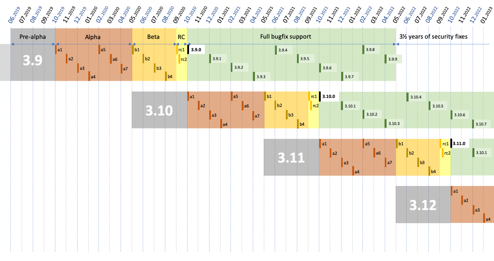

PEP: 602
Title: Annual Release Cycle for Python
Version: $Revision$
Last-Modified: $Date$
Author: Łukasz Langa <lukasz@python.org>
Discussions-To: https://discuss.python.org/t/pep-596-python-3-9-release-schedule-doubling-the-release-cadence/1828
Status: Draft
Type: Informational
Content-Type: text/x-rst
Created: 04-Jun-2019
Python-Version: 3.9

Abstract
========

This document describes a change in the release calendar for Python
starting with Python 3.9.  This change accelerates the release cadence
such that major versions are released every twelve months.

Implementation
==============

Seventeen months to develop a major version
-------------------------------------------

This PEP proposes that Python 3.X.0 will be developed for around
16 months:

- The first *five months* overlap with Python 3.(X-1).0's beta
  and release candidate stages and are thus unversioned.

- The next *seven months* are spent on versioned alpha releases where
  both new features are incrementally added and bug fixes are included.

- The following *four months* are spent on versioned beta releases where
  **no new features** can be added but bug fixes are still included.

- The *final month* is spent on a release candidate (or more, if
  necessary) and concludes with the release of the final release of
  Python 3.X.0.

One year of full support, four more years of security fixes
-----------------------------------------------------------

After the relase of Python 3.X.0, the 3.X series is maintained for
five years:

- During the *first year* it receives bugfix updates approximately
  every month.  After the release of 3.(X+1).0 final, a final 3.X.12 is
  released.

- For the next *four years* it receives security updates and
  source-only releases are made on an as-needed basis
  (no monthly cadence).

- The final source-only release is made *five years* after 3.X.0.

Annual release cadence
----------------------

Feature development of Python 3.(X+1).0 starts as soon as
Python 3.X.0 Beta 1 is released.  This creates a twelve month delta
between major Python versions.

Example
=======

- 3.9 development begins: Tuesday, 2019-06-04
- 3.9.0 alpha 1: Monday, 2019-10-14
- 3.9.0 alpha 2: Monday, 2019-11-18
- 3.9.0 alpha 3: Monday, 2019-12-16
- 3.9.0 alpha 4: Monday, 2020-01-13
- 3.9.0 alpha 5: Monday, 2020-02-17
- 3.9.0 alpha 6: Monday, 2020-03-16
- 3.9.0 alpha 7: Monday, 2020-04-13
- 3.9.0 beta 1: Monday, 2020-05-18
  (No new features beyond this point.)

- 3.9.0 beta 2: Monday, 2020-06-15
- 3.9.0 beta 3: Monday, 2020-07-13
- 3.9.0 beta 4: Monday, 2020-08-17
- 3.9.0 candidate 1: Monday, 2020-09-14
- 3.9.0 candidate 2: Monday, 2020-09-21 (if necessary)
- 3.9.0 final: Monday, 2020-10-05

   Figure 1. Consequences of the annual release cycle on the calendar.

Rationale and Goals
===================

This change provides the following advantages:

- makes releases smaller: since doubling the cadence doesn't double our
  available development resources, consecutive releases are going to be
  smaller in terms of features;

- puts features and bug fixes in hands of users sooner;

- creates a more gradual upgrade path for users, by decreasing the
  surface of change in any single release;

- creates a predictable calendar for releases where the final release is
  always in October, and the beta phase starts in late May (so after
  PyCon US sprints);

- decreases the urge to rush features shortly before "Beta 1" due to
  the risk of them "slipping for 18 months";

- increases the explicit alpha release phase, which provides meaningful
  snapshots of progress on new features;

- significantly cuts the implicit "alpha 0" release phase which provides
  limited use for new development anyway (it overlaps with the beta of
  the *currently developed*, still unreleased, version).

Non-risks
---------

This change does not shorten the security updates calendar for a Python
release.

This change does not accelerate the velocity of development.  Python is
not going to become incompatible faster or accrue new features faster.
It's just that features are going to be released more gradually as they
are developed.

Consequently, while this change introduces the ability for users to
upgrade much faster, it does not require them to do so.  Say, if they
upgrade every second release, their experience with Python is going to
be very similar to the current situation.

Risks
-----

This requires changes to how integrators, like Linux distributions,
release Python within their systems.

This eventually increases the testing matrix for library and application
maintainers that want to support all actively supported Python versions
by 33%.

The following policies depend on the release cadence and will have to
be updated:

- the deprecation policy
- the``__future__`` import becoming the default
- the term of the Steering Council
- the term of the Release Manager

Finally, this shortens the bugfix period to twelve months.  This allows
core developers to increase the cadence without increasing the biggest
maintenance cost, however provides an inconvenience to the user.  This
particular risk might be solved by making every n-th release a LTS, in
the vein of Python 2.7.  This is open for debate.

Rejected Ideas
--------------

Keep the current 18 month release cadence
~~~~~~~~~~~~~~~~~~~~~~~~~~~~~~~~~~~~~~~~~

This is undesirable both for core developers and end users. From the
perspective of the core developer:

- it creates a surge of rushed commits before (and even after!) Beta 1
  due to the stress involved with "missing a release";

- ironically, after Beta 1 it creates a false sense of having "plenty of
  time" before the next release, time that passes quickly regardless;

- it causes certain elements of the workflow to be executed so rarely
  that they are not explicitly documented, let alone automated.

More importantly, from the perspective of the user:

- it creates releases with many new features, some being explicitly
  incompatible and some being accidentally incompatible, which makes
  the upgrade cost relatively high every time;

- it sits on features and incompatible bug fixes for over a year before
  becoming available to the user; and more specifically

- it causes every "point zero" release to be extra risky for users.
  While we provide and recommend testing with alphas and betas,
  "point zero" is the first release of a given Python version for many
  users.  The bigger a release is feature-wise, the more potential
  problems are hiding in "point zero releases".

Double the release cadence to achieve 9 months between major versions
~~~~~~~~~~~~~~~~~~~~~~~~~~~~~~~~~~~~~~~~~~~~~~~~~~~~~~~~~~~~~~~~~~~~~

This was originally proposed in PEP 596 and rejected as both too
irregular and too short.  One consequence of a 9 month release cadence
was shortening of the beta phase and this was considered dangerous.

Slow down releases but don't freeze feature development with Beta 1
~~~~~~~~~~~~~~~~~~~~~~~~~~~~~~~~~~~~~~~~~~~~~~~~~~~~~~~~~~~~~~~~~~~

This is described in PEP 598.  This proposal includes non-standard
concepts like the "incremental feature release" which makes it hard
to understand.  The presented advantages are unclear while the
unfamiliarity of the scheme poses a real risk of user and integrator
confusion.

Copyright
=========

This document has been placed in the public domain.


..
  Local Variables:
  mode: indented-text
  indent-tabs-mode: nil
  sentence-end-double-space: t
  fill-column: 72
  coding: utf-8
  End:
