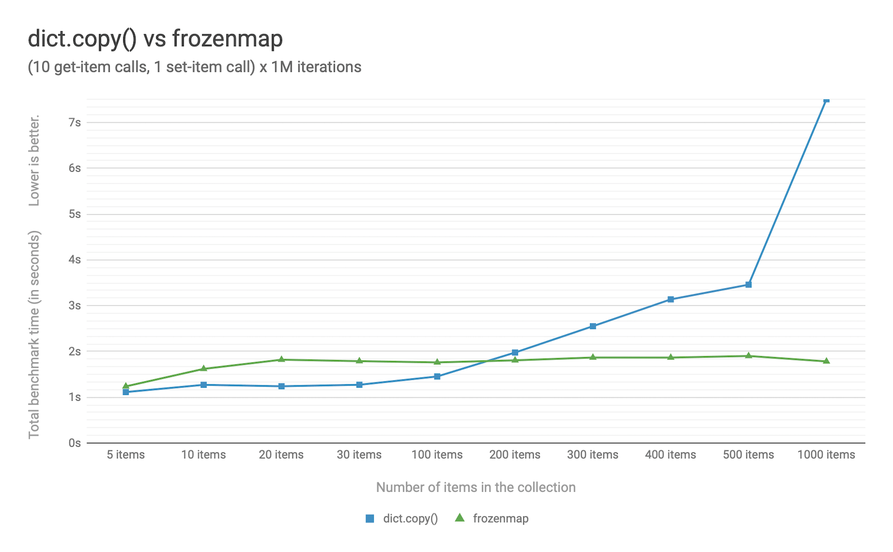

PEP: 603
Title: Adding a frozenmap type to collections
Version: $Revision$
Last-Modified: $Date$
Author: Yury Selivanov <yury@edgedb.com>
Status: Draft
Type: Standards Track
Content-Type: text/x-rst
Created: 12-Sep-2019
Python-Version: 3.9
Post-History: 12-Sep-2019

Abstract
========

A *persistent data structure* is defined as a data structure that
preserves the previous version of the data when the data is modified.
Such data structures are effectively *immutable*, as operations on
them do not update the structure in-place, but instead always yield
a new updated structure (see [0]_ for more details.)

This PEP proposes to add a new fully persistent and immutable mapping
type called ``frozenmap`` to the ``collections`` module.

The bulk of ``frozenmap``'s reference implementation is already
used in CPython to implement the ``contextvars`` module.

Rationale
=========

Python has two immutable collection types: ``tuple`` and
``frozenset``.  These types can be used to represent immutable lists
and sets. However, a way to represent immutable *mappings* does not yet
exist, and this PEP proposes a ``frozenmap`` to implement an
immutable *mapping*.

The proposed ``frozenmap`` type:

* implements the ``collections.abc.Mapping`` protocol,
* supports pickling, and
* provides an API for efficient creation of "modified" versions.

The following use cases illustrate why an immutable mapping is
desirable:

* Immutable mappings are hashable which allows their use
  as dictionary keys or set elements.

  This hashable property permits functions decorated with
  ``@functools.lru_cache()`` to accept immutable mappings as
  arguments. Unlike an immutable mapping, passing a plain ``dict``
  to such a function results in error.

* Immutable mappings can hold complex state. Since immutable mappings
  can be copied by reference, transactional mutation of state can be
  efficiently implemented.

* Immutable mappings can be used to safely share dictionaries across
  thread and asynchronous task boundaries. The immutability makes it
  easier to reason about threads and asynchronous tasks.

Lastly, CPython [1]_ already contains the main portion of the C code
required for the ``frozenmap`` implementation.  The C code already
exists to implement the ``contextvars`` module (see :pep:`567` for
more details.) Exposing this C code via a public collection type
drastically increases the number of users of the code.  This leads to
increased code quality by discovering bugs and improving performance
which without a ``frozenmap`` collection would be very challenging
because most programs use the ``contextvars`` module indirectly.

Specification
=============

A new public immutable type ``frozenmap`` is added to the
``collections`` module.

Construction
------------

``frozenmap`` implements a ``dict``-like construction API:

* ``frozenmap()`` creates a new empty immutable mapping;

* ``frozenmap(**kwargs)`` creates a mapping from ``**kwargs``, e.g.
  ``frozenmap(x=10, y=0, z=-1)``

* ``frozenmap(collection)`` creates a mapping from the passed
  ``collection`` object. The passed ``collection`` object can be:

  - a ``dict``,
  - another ``frozenmap``,
  - an object with an ``items()`` method that is expected to return
    a series of key/value tuples, or
  - an iterable of key/value tuples.

Data Access
-----------

``frozenmap`` implements the ``collection.abc.Mapping`` protocol.
Therefore, getters, membership checks, and iteration work the same
way that they would for a ``dict``::

  m = frozenmap(foo='bar')

  assert m['foo'] == 'bar'
  assert m.get('foo') == 'bar'
  assert 'foo' in m

  assert 'baz' not in m
  assert m.get('baz', 'missing') == 'missing'

  assert m == m
  assert m != frozenmap()  # m is not equal to an empty frozenmap

  assert len(m) == 1

  # etc.

Mutation
--------

``frozenmap`` instances are immutable. That said, it is possible
to efficiently produce mutated *copies* of the immutable instance.

The complexity of mutation operations is O(log N) and the resulting
``frozenmap`` copies often consume very little additional memory due
to the use of structural sharing (read [6]_ for more details.)

frozenmap.including(key, value)
^^^^^^^^^^^^^^^^^^^^^^^^^^^^^^^

The method creates a new ``frozenmap`` copy with a new *key* / *value*
pair::

  m = frozenmap(foo=1)
  m2 = m.including('bar', 100)

  print(m)   # will print frozenmap({'foo': 1})
  print(m2)  # will print frozenmap({'foo': 1, 'bar': 100})

frozenmap.excluding(key)
^^^^^^^^^^^^^^^^^^^^^^^^

The method produces a copy of the ``frozenmap`` which does not
include a deleted *key*::

  m = frozenmap(foo=1, bar=100)

  m2 = m.excluding('foo')

  print(m)   # will print frozenmap({'foo': 1, 'bar': 100})
  print(m2)  # will print frozenmap({'bar': 1})

  m3 = m.excluding('spam')  # will throw a KeyError('spam')

frozenmap.union(mapping=None, \*\*kw)
^^^^^^^^^^^^^^^^^^^^^^^^^^^^^^^^^^^^^

The method produces a copy of the ``frozenmap`` and adds or modifies
multiple key/values for the created copy.  The signature of
the method matches the signature of the ``frozenmap`` constructor::

  m = frozenmap(foo=1)

  m2 = m.union({'spam': 'ham'})
  print(m2)  # will print frozenmap({'foo': 1, 'spam': 'ham'})

  m3 = m.union(foo=100, y=2)
  print(m3)  # will print frozenmap({'foo': 100, 'y': 2})

  print(m)   # will print frozenmap({'foo': 1})

Calling the ``union()`` method to add/replace N keys is more efficient
than calling the ``including()`` method N times.

frozenmap.mutating()
^^^^^^^^^^^^^^^^^^^^

The method allows efficient copying of a ``frozenmap`` instance with
multiple modifications applied.  This method is especially useful
when the frozenmap in question contains thousands of key/value pairs
and there's a need to update many of them in a performance-critical
section of the code.

The ``frozenmap.mutating()`` method returns a mutable dict-like
copy of the ``frozenmap`` object: an instance of
``collections.FrozenMapCopy``.

The ``FrozenMapCopy`` objects:

* are copy-on-write views of the data of ``frozenmap`` instances
  they were created from;

* are mutable, although any mutations on them do not affect the
  ``frozenmap`` instances they were created from;

* can be passed to the ``frozenmap`` constructor; creating a
  frozenmap from a ``FrozenMapCopy`` object is an O(1)
  operation;

* have O(log N) complexity for get/set operations; creating
  them is an O(1) operation;

* have a ``FrozenMapCopy.close()`` method that prevents any
  further access/mutation of the data;

* can be used as a context manager.

The below example illustrates how ``mutating()`` can be used with
a context manager::

  numbers = frozenmap((i, i ** 2) for i in range(1_000_000))

  with numbers.mutating() as copy:
      for i in numbers:
          if not (numbers[i] % 997):
              del copy[i]

      numbers_without_997_multiples = frozenmap(copy)

      # at this point, *numbers* still has 1_000_000 key/values, and
      # *numbers_without_997_multiples* is a copy of *numbers* without
      # values that are multiples of 997.

      for i in numbers:
          if not (numbers[i] % 593):
              del copy[i]

      numbers_without_593_multiples = frozenmap(copy)

      print(copy[10])  # will print 100.

  print(copy[10])  # This will throw a ValueError as *copy*
                   # has been closed when the "with" block
                   # was executed.

Iteration
---------

As ``frozenmap`` implements the standard ``collections.abc.Mapping``
protocol, so all expected methods of iteration are supported::

  assert list(m) == ['foo']
  assert list(m.items()) == [('foo', 'bar')]
  assert list(m.keys()) == ['foo']
  assert list(m.values()) == ['bar']

Iteration in ``frozenmap``, unlike in ``dict``, does not preserve the
insertion order.

Hashing
-------

``frozenmap`` instances can be hashable just like ``tuple`` objects::

  hash(frozenmap(foo='bar'))  # works
  hash(frozenmap(foo=[]))     # will throw an error

Typing
------

It is possible to use the standard typing notation for frozenmaps::

  m: frozenmap[str, int] = frozenmap()

Implementation
==============

The proposed ``frozenmap`` immutable type uses a Hash Array Mapped
Trie (HAMT) data structure. Functional programming languages,
like Clojure, use HAMT to efficiently implement immutable hash tables,
vectors, and sets.

HAMT
----

The key design contract of HAMT is the guarantee of a predictable
*value* when given the hash of a *key*. For a pair of *key* and *value*,
the hash of the *key* can be used to determine the location of
*value* in the hash map tree.

Immutable mappings implemented with HAMT have O(log N) performance
for ``set()`` and ``get()`` operations.  This efficiency is possible
because mutation operations only affect one branch of the tree,
making it possible to reuse non-mutated branches, and, therefore,
avoiding copying of unmodified data.

Read more about HAMT in [5]_.  The CPython implementation [1]_ has a
fairly detailed description of the algorithm as well.

Performance
-----------

   Figure 1.  Benchmark code can be found here: [3]_.

The above chart demonstrates that:

* ``frozenmap`` implemented with HAMT displays near O(1) performance
  for all benchmarked dictionary sizes.

* ``dict.copy()`` becomes less efficient when using around
  100-200 items.

.. figure:: pep-0550-lookup_hamt.png
   :align: center
   :width: 100%

   Figure 2.  Benchmark code can be found here: [4]_.

Figure 2 compares the lookup costs of ``dict`` versus a HAMT-based
immutable mapping.  HAMT lookup time is ~30% slower than Python dict
lookups on average. This performance difference exists since traversing
a shallow tree is less efficient than lookup in a flat continuous array.

Further to that, quoting [6]_: "[using HAMT] means that in practice
while insertions, deletions, and lookups into a persistent hash array
mapped trie have a computational complexity of O(log n), for most
applications they are effectively constant time, as it would require
an extremely large number of entries to make any operation take more
than a dozen steps."

Design Considerations
=====================

Why "frozenmap" and not "FrozenMap"
-----------------------------------

The lower-case "frozenmap" resonates well with the ``frozenset``
built-in as well as with types like ``collections.defaultdict``.

Why "frozenmap" and not "frozendict"
------------------------------------

"Dict" has a very specific meaning in Python:

* a dict is a concrete implementation of ``abc.MutableMapping`` with
  O(1) get and set operations (``frozenmap`` has O(log N) complexity);

* Python dicts preserve insertion order.

The proposed ``frozenmap`` does not have these mentioned
properties. Instead, ``frozenmap`` has an O(log N) cost of set/get
operations, and it only implements the ``abc.Mapping`` protocol.

Implementation
==============

The full implementation of the proposed ``frozenmap`` type is
available at [2]_.  The package includes C and pure Python
implementations of the type.

See also the HAMT collection implementation as part of the
CPython project tree here: [1]_.

References
==========

.. [0] https://en.wikipedia.org/wiki/Persistent_data_structure

.. [1] https://github.com/python/cpython/blob/3.8/Python/hamt.c

.. [2] https://github.com/MagicStack/immutables

.. [3] https://gist.github.com/1st1/be5a1c10aceb0775d0406e879cf87344

.. [4] https://gist.github.com/1st1/dbe27f2e14c30cce6f0b5fddfc8c437e

.. [5] https://en.wikipedia.org/wiki/Hash_array_mapped_trie#cite_note-bagwell-1

.. [6] https://en.wikipedia.org/wiki/Persistent_data_structure#Trees

Acknowledgments
===============

I thank Carol Willing, Łukasz Langa, Larry Hastings, and
Guido van Rossum for their feedback, ideas, edits, and discussions
around this PEP.

Copyright
=========

This document is placed in the public domain or under the
CC0-1.0-Universal license, whichever is more permissive.

..
   Local Variables:
   mode: indented-text
   indent-tabs-mode: nil
   sentence-end-double-space: t
   fill-column: 70
   coding: utf-8
   End:
