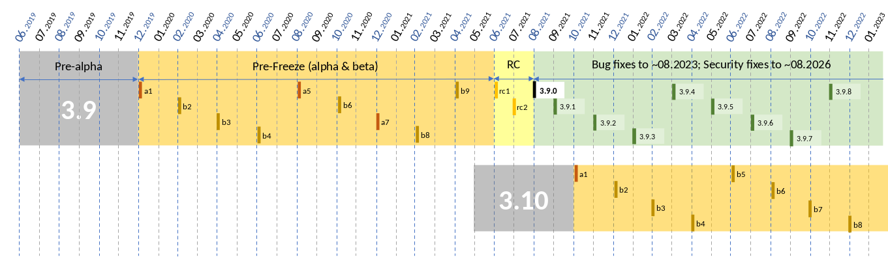
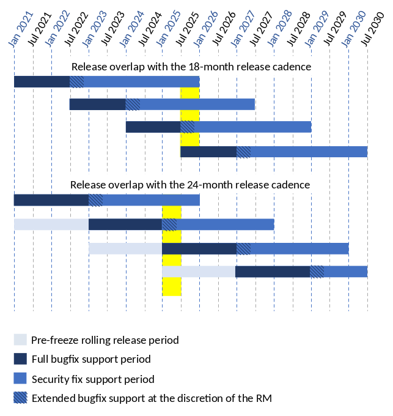

PEP: 605
Title: A rolling feature release stream for CPython
Version: $Revision$
Last-Modified: $Date$
Author: Steve Dower <steve.dower@python.org>, Nick Coghlan <ncoghlan@gmail.com>
Discussions-To: https://discuss.python.org/t/pep-605-a-rolling-feature-release-stream-for-cpython/2418
Status: Draft
Type: Informational
Content-Type: text/x-rst
Created: 20-Sep-2019
Python-Version: 3.9
Post-History: 1-Oct-2019, 6-Oct-2019

Abstract
========

Rather than proposing more frequent full CPython releases (as PEP 602 does),
or a policy change to allow backwards compatible feature additions later in a
release series (as PEP 598 does), this PEP instead proposes that we create a
rolling stream of production-ready beta releases, together with alpha releases
that are specifically designed to be suitable as platforms for building
extension modules and wheel archives that are compatible with the subsequent
beta releases.

The key desired outcome of this proposal is that the usage guidance given for
beta releases would become "suitable for production use only in environments
with sufficiently robust compatibility testing and operational monitoring
capabilities", rather than current unqualified "not for production use".

Similarly, the guidance given for alpha releases would be amended to state
"intended for library compatibility testing and the creation of ABI compatible
binary artifacts", rather than simply saying "not for production use".

The PEP authors believe these outcomes can be achieved by amending CPython's
pre-release management process as described in the Proposal section below.

This PEP also proposes that the frequency of X.Y.0 releases be adjusted to
begin each new release series in August every two years (starting in 2021,
around two years after the release of Python 3.8.0).

Example Future Release Schedules
================================

Under this proposal, Python 3.9.0a1 would be released in December 2019, two
months after the Python 3.8.0 baseline feature release in October 2019.

Assuming no further breaking changes were made to the full CPython ABI, the
3.9.0b2 release would then follow 2 months later in February 2020, continuing
through to 3.9.0b9 in April 2021.

Any time a breaking change to the full CPython ABI was introduced, the first
pre-release that included it would be marked as an alpha release.

3.9.0rc1 would be published in June 2021, 3.9.0rc2 in July 2021, and then
the full release published as 3.9.0 in August 2021.

The cycle would start over again in October 2021, with the publication
of 3.10.0a1 (4 months after the creation of the 3.9.x maintenance branch).

The exact schedule of maintenance releases would be up to the release team,
but assuming maintenance releases of 3.9.x were also to occur every other month
(offset from the 3.10.0 beta releases), the overall release timeline
would look like:

* 2019-12: 3.9.0a1
* 2020-02: 3.9.0b2
* ... beta (or alpha) releases every other month
* 2021-04: 3.9.0b9
* 2021-06: 3.9.0rc1 (feature freeze, ABI freeze, pyc format freeze)
* 2021-07: 3.9.0rc2
* 2021-08: 3.9.0
* 2021-09: 3.9.1, 3.8.x (final 3.8.x binary maintenance release)
* 2021-10: 3.10.0a1
* 2021-11: 3.9.2
* 2021-12: 3.10.0b2
* ... beta (or alpha) and maintenance releases continue in alternate months
* 2023-04: 3.10.0b10
* 2023-05: 3.9.11
* 2023-06: 3.10.0rc1 (feature freeze, ABI freeze, pyc format freeze)
* 2023-07: 3.10.0rc2, 3.9.12
* 2023-08: 3.10.0
* 2023-09: 3.10.1, 3.9.13 (final 3.9.x binary maintenance release)
* 2023-10: 3.11.0a1
* 2023-12: 3.11.0b2
* ... etc

If we assume two additional pre-releases were made that introduced breaking
changes to the full CPython ABI in the 3.9.0a5 and 3.9.0a7 releases, then the
overall calendar would look like:

   Figure 1. Impact of the pre-release process changes on the calendar.

There are always two or three active maintenance branches in this model,
which preserves the status quo in that respect. The major difference is that
we would start encouraging publishers to provide pre-built binaries for the
pre-freeze rolling releases in addition to providing them for the stable
maintenance branches.

   Figure 2. Testing matrix in the 18-month cadence vs. the 24-month

Package publishers targeting the full CPython ABI that choose to provide
pre-built binaries for the rolling pre-freeze releases would at least need
to build new wheel archives following the 3.9.0a1 release. Whether they needed
to publish updated binaries after subsequent alpha releases (e.g. 3.9.0a5 or
3.9.0a7 releases in the example timeline) would depend on whether or not they
were actually affected by the ABI breaks in those later releases.

As with the status quo, all package publishers wishing to provide pre-built
binaries for the final release will need to build new wheel archives following
the ABI freeze date. Unlike the status quo, this date will be clearly marked
by the publication of the first release candidate, and it will occur early
enough to give publishers a couple of months to get ready for the final release.

Example Future Release Announcements
====================================

If this PEP is accepted, the primary channels used to communicate the updated
pre-release management process to end users would be the Python 3.9 What's New
document, and the release announcements themselves.

This section provides initial drafts of text that could be used for those
purposes.

Suggested "What's New in Python 3.9" Entry
------------------------------------------

The following subsection would be added to the Python 3.9 What's New document,
and then linked from each of the Python 3.9 alpha and beta announcements.

PEP 605: Changes to the pre-release management process
^^^^^^^^^^^^^^^^^^^^^^^^^^^^^^^^^^^^^^^^^^^^^^^^^^^^^^

As detailed in PEP 605, the pre-release management process has been updated to
produce a rolling series of beta releases that are considered suitable for
production use in environments with sufficiently robust integration testing and
operational monitoring capabilities.

Under this new rolling model, the alpha and beta releases are intermingled as
part of a combined "pre-freeze" period, with alpha releases indicating breaks
in the full CPython ABI that may require recompilation of extension modules or
embedding applications, and beta releases indicating full binary compatibility
with the immediately preceding pre-release.

Unlike previous releases, publishing pre-built binaries for 3.9.0 alpha and beta
releases is actively encouraged, as a new pre-release ABI flag ("p") is now
set when building and loading extension modules prior to the full CPython ABI
freeze, ensuring that all such pre-freeze extension module builds will be
ignored by post-freeze interpreter builds.

The full CPython ABI will be frozen, and the pre-release flag dropped from the
ABI flags, in 3.9.0rc1, which is expected to occur 2 months prior to the final
3.9.0 release (refer to the release schedule in PEP 596 for exact target dates).

For application developers, migrating to the rolling release stream provides
the opportunity to be actively involved in the design and development of
enhancements to the standard library and reference interpreter prior to the
next stable release. It also provides the opportunity to benefit from
interpreter performance enhancements up to a year or more before they become
available in a stable release.

For library developers that publish pre-built wheel archives, opting in to
supporting the 3.9.x rolling release stream in addition to the 3.8 stable
release series requires no specific action if the project is already publishing
either pure Python wheels (tagged as ``py3-none-any``), or builds against the
stable C ABI (tagged as ``cp38-abi3-<platform>``, or the equivalent from an
earlier CPython 3.x release). These same wheel archives will also be usable on
the subsequent 3.9 stable release series.

For library developers that publish pre-built wheel archives that are built
against the full CPython ABI, the binaries for the 3.9 stable release series
will need to be built after the full CPython ABI freeze (i.e. using 3.9.0rc1 or
later).

Developers of these libraries may also opt in to supporting the rolling release
stream by building against the 3.9.0a1 release (or a subsequent beta release)
and publishing the result as normal.

In the ideal case, binaries built this way will continue working all the way
through to the last pre-freeze release. However, if the project is affected by
a change in the full CPython C ABI during the pre-freeze period, then it will
be necessary to publish a maintenance update that rebuilds the affected binaries
against the alpha release that changed the relevant interface. In these cases,
a corresponding ``Python-Requires`` entry should be added to the project
metadata. For example, if a project is affected by an ABI change introduced in
``3.9.0a5``, then the ``Python-Requires`` entry to add would be::

    Python-Requires: >= "3.9.0b6"; python_version == "3.9" and full_python_version != "3.9.0a5"

(This additional metadata ensures that the updated version won't be installed on
earlier pre-releases in the 3.9 series that offer an older variant of the ABI)

As for application developers, library developers that choose to support the
rolling release stream will have the opportunity to provide feedback on new and
updated API designs *before* they're locked down for multiple years in a stable
release (or before they're included as a provisional API in a stable release
series).

Example announcement text for the 3.9.0a1 release
-------------------------------------------------

This is the first preview release of Python 3.9. As an alpha release, it is
intended for library and application compatibility testing and the creation of
ABI compatible binary artifacts. It is not recommended for use in production
environments.

Changes to the pre-release management process
^^^^^^^^^^^^^^^^^^^^^^^^^^^^^^^^^^^^^^^^^^^^^

CPython has switched to a new pre-release management process that is designed
to produce a rolling series of beta releases that are considered suitable for
production use in environments with sufficiently robust integration testing and
operational monitoring capabilities. Refer to the Python 3.9 What's New
document (hyperlinked to relevant section) for details.

Major new features of the 3.9 series, compared to 3.8
^^^^^^^^^^^^^^^^^^^^^^^^^^^^^^^^^^^^^^^^^^^^^^^^^^^^^

Many new features for Python 3.9 are still being planned and written. Among the
major new features and changes already implemented:

* ...
* (Hey, fellow core developer or user of the rolling release stream, if a
  feature you find important is missing from this list, let <the release
  manager> know.)

The next pre-release of Python 3.9 is expected to be 3.8.0b2, currently scheduled for 2020-02-02.

Example announcement text for the 3.9.0b2 release
-------------------------------------------------

This is the second preview release of Python 3.9. As a beta release, it is
fully binary compatible with the preceding 3.9.0a1 release. It is recommended
for production use only in environments with sufficiently robust integration
testing and operational monitoring capabilities.

(Remainder as per 3.9.0a1 announcement, with updates for implemented changes
and the next expected release being 3.9.0b3)

Example announcement text for 3.9.0a5 (a mid-stream alpha release)
------------------------------------------------------------------

This is the fifth preview release of Python 3.9. As an alpha release, it is
NOT fully binary compatible with the preceding 3.9.0b4 release. This release is
intended for library and application compatibility testing and the creation of
ABI compatible binary artifacts. It is not recommended for use in production
environments.

Breaking changes in the full CPython ABI between 3.9.0b4 and 3.9.0a5
^^^^^^^^^^^^^^^^^^^^^^^^^^^^^^^^^^^^^^^^^^^^^^^^^^^^^^^^^^^^^^^^^^^^

* new field ``ob_example`` added to the ``PyObject`` struct
* provisional field ``tp_example`` removed from the ``PyTypeObject`` struct

Projects that are supporting the rolling release stream and require a rebuild
to restore binary compatibility should add the following metadata to their
updated release::

    Python-Requires: >= "3.9.0b6"; python_version == "3.9" and full_python_version != "3.9.0a5"

(Remainder as per 3.9.0a1 announcement, with updates for implemented changes
and the next expected release being 3.9.0b6)

Example announcement text for 3.9.0rc1
--------------------------------------

This is the first release candidate for Python 3.9. As a release candidate,
this release is now feature complete, the full CPython ABI is now frozen, and
the pre-release marker has been removed from the ABI compatibility flags. It is
recommended for production use only in environments with sufficiently robust
integration testing and operational monitoring capabilities.

Preparation for the final 3.9.0 release
^^^^^^^^^^^^^^^^^^^^^^^^^^^^^^^^^^^^^^^

With the full CPython ABI now frozen, library developers targeting that ABI are
encouraged to build and publish binaries for the stable 3.9.x series.

Application developers that have not been testing against the rolling release
stream are encouraged to test their applications against the release candidate
and report any compatibility regressions not already mentioned in the Porting
Guide (hyperlinked to relevant What's New section).

A second release candidate is planned for 2021-07-02, and then the final 3.9.0
release is planned for 2021-08-02.

Major new features of the 3.9 series, compared to 3.8
^^^^^^^^^^^^^^^^^^^^^^^^^^^^^^^^^^^^^^^^^^^^^^^^^^^^^

Some of the major new features and changes in this release:

* ...
* (Hey, fellow core developer or user of the rolling release stream, if a
  feature you find important is missing from this list, let <the release
  manager> know.)

Motivation
==========

The current CPython pre-release and release management processes were developed
in an era where automated continuous integration and operational monitoring
systems were still relatively immature. Since that time, many organisations
have adopted deployment models that allow them to incorporate new CPython
feature releases without adding substantially more risk than they incur for any
other code change. Newer deployment models, such as lightweight task specific
application containers, also make it easier to combine an application with a
language runtime in a CI pipeline, and then keep them together until the entire
container image is later replaced by an updated one.

In light of those changes in the wider environment, PEP 602 has proposed
reducing the feature delivery latency for the Python standard library and
CPython reference interpreter by increasing the frequency of CPython feature
releases from every 18-24 months to instead occur every 12 months.

Unfortunately, for many organisations, the cost of adopting a new Python release
doesn't automatically scale down with a reduced number of changes in the release,
as the primary costs aren't associated with resolving any discovered issues;
the primary costs are associated with the *search* for issues. This search may
involve manual testing of software systems, human review of written materials,
and other activities where the time required scales with the size of the
existing system, rather than with the number of changes between the versions of
Python.

For third party library developers, costs are primarily associated with the
*number* of distinct Python versions in widespread usage. This currently tends
to be influenced by a combination of which releases are still actively
maintained by python-dev, and which releases are the latest versions offered
by particular redistributors (with the Debian, Ubuntu LTS, and RHEL/CentOS
system Python versions being particularly popular development targets). In
addition to the basic CI cost of testing against more Python versions, having
more variants in widespread use can make it more difficult to determine when a
fault report is an actual error in the project, or an issue in the reporting
user's environment.

PEP 602 proposes that affected organisations and projects simply switch to
adopting every second or third CPython release, rather than attempting to adopt
every release, but that creates its own set of new problems to be resolved, both
practical (e.g. deprecations would need to cover more than one release if we're
expecting users to routinely skip releases) and cultural (e.g. with a larger
number of versions in active use, there is a much higher chance that open source
library maintainers will receive bug reports that only occur on Python versions
that they're not using themselves).

PEP 598 was an initial attempt by one of the authors of this PEP to propose
an alternative scheme to reduce feature delivery latency by adopting a
semantic versioning style policy that allowed for the incremental delivery of
backwards compatible features within a release series, until that series
reached feature complete status. That variant still had the undesirable
consequence of imposing visible changes on end users that are happy enough
with the current release management model.

This PEP takes the view that both PEP 598 and PEP 602 share a common flaw: they
are attempting to satisfy the needs of two quite distinct audiences within the
constraints of a single release model, which results in conflicting design
requirements, and the need for awkward trade-offs between those conflicting
requirements. The proposal in this PEP aims to avoid that flaw by proposing the
creation of two *distinct* production-ready release streams, with the existing
release stream being largely left alone, while the new release stream is
tailored towards the audience that would most benefit from a reduction in
feature delivery latency.

Aims of this Proposal
=====================

The core of the proposal in this PEP is changing the CPython pre-release process
to produce a rolling stream of incremental feature releases at a regular
cadence, and to ensure that most of those builds offer a sufficient level of
stability as to be suitable for use in appropriately managed production systems.

By adopting this approach, the proposal aims to provide an improved outcome
for almost all Python users and contributors:

* for users of the new incremental feature release stream, targeting the
  pre-release phase allows for even lower feature delivery latency than the
  annual cadence proposed in PEP 602;
* for core developers working on new features, increased frequency and adoption
  of pre-releases should improve pre-release feedback cycles;
* for users of the established release stream, the increased adoption and
  improved feedback cycles during the pre-release period should result in
  increased feature maturity at the time of its first X.Y.0 release, as well
  as higher levels of ecosystem readiness;
* for Python library maintainers, the rolling stream of pre-releases will
  hopefully provide more opportunities to identify and resolve design issues
  before they make it into a full stable release than is offered by the current
  pre-release management process; and
* for developers of alternative Python implementations, the rolling stream of
  pre-releases may provide an additional incentive for extension module authors
  to migrate from the full CPython ABI to the Python stable ABI, which would
  also serve to make more of the ecosystem compatible with implementations that
  don't emulate the full CPython C API.

That said, it is acknowledged that not all the outcomes of this proposal will be
beneficial for all members of the wider Python ecosystem:

* for Python library maintainers, both this PEP and PEP 602 would likely
  result in user pressure to support the faster release cadence. While this PEP
  attempts to mitigate that by clearly marking which pre-releases include
  potentially breaking changes to the full CPython C ABI, and PEP 602 attempts
  to mitigate it by keeping the minimum time between full releases at
  12 months, it isn't possible to eliminate this downside completely;
* for third party extension module maintainers, both this PEP and PEP 602 would
  likely result in user pressure to start supporting the stable ABI in order to
  provide wheel archives that work on the new version as soon as it is
  available. Whether that's a net negative or not will depend on how the request
  is presented to them (it could be a positive if the request comes in the form
  of a courteous contribution to their project from a developer interested in
  supporting the rolling pre-freeze releases);
* for some users of the established release stream that rely on the
  availability of pre-built wheel archives, switching to adopting a new release
  every 12 months may be an acceptable rate increase, while moving consistently
  to the 24 month end of the historical 18-24 month cadence would be an
  undesirable rate reduction relative to the 18 month cycle used for recent
  releases. Whether this proposal would be a net negative for these users will
  depend on whether or not we're able to persuade library maintainers that
  it's worth their while to support the upcoming stable release throughout its
  pre-freeze period, rather than waiting until its API and ABI have been
  frozen.

Proposal
========

The majority of the proposed changes in this PEP only affect the handling of
pre-release versions. The one change affecting full release versions is a
suggested change to their cadence.

Two year cadence for stable releases
------------------------------------

With the rolling pre-freeze releases available to users that are looking to
use leading edge versions of the reference interpreter and standard library,
this PEP proposes that the frequency of X.Y.0 releases be adjusted to publish
a new stable release in August every two years (starting in 2021,
around two years after the release of Python 3.8.0).

This change is arguably orthogonal to the proposed changes to the handling of
the pre-freeze release period, but the connection is that without those
pre-release management changes, the downsides of a two year full release cadence
would probably outweigh the upsides, whereas the opposite is true for a 12
month release cadence (i.e. with the pre-release management changes proposed
in this PEP in place, the downsides of a 12 month full release cadence would
outweigh the upsides).

Merging of the alpha and beta phases into a "pre-freeze" phase
--------------------------------------------------------------

Rather than continuing the status quo where the pre-release alpha and beta
phases are distinct and sequential, this PEP proposes that they instead be
combined into a single "pre-freeze" phase with a monotonically increasing serial
number on the releases.

Rather than denoting distinct phases, the "alpha" and "beta" names would
instead indicate whether or not the release contains breaking changes to the
full CPython C ABI:

* "alpha" releases would be "ABI breaking" releases where extension modules
  built against the full CPython ABI in the preceding pre-release are not
  necessarily going to load correctly
* "beta" releases would be "binary compatible" releases, where extension modules
  built against the full CPython ABI in the preceding pre-release are expected
  to load correctly, as long as those modules abide by the following additional
  criteria:
  
  * the module must not be using any provisional or private C APIs (either from
    the previous stable release series, or the in development pre-release series)
    that were removed in this beta release, or were changed in an ABI incompatible
    way
  * the module must not be using any C APIs that were deprecated in the previous
    stable release series, and removed in this beta release

Pre-freeze phase duration and cadence
^^^^^^^^^^^^^^^^^^^^^^^^^^^^^^^^^^^^^

Rather than being released monthly for a period of a few months while preparing
a new X.Y.0 release, pre-freeze releases would instead be consistently published
every two months.

The only time this would not be the case is during the two month release
candidate period for an upcoming X.Y.0 release (see the release candidate
section below for more details). This means two otherwise scheduled releases
would be skipped (one corresponding with the first release candidate date, one
with the final release date).

The pre-freeze phase would typically be expected to start 2 months after the
preceding stable X.Y.0 release.

The first pre-freeze release for any new release series will always be X.Y.0a1
(as there is no preceding release with the same ABI version markers to judge
binary compatibility against).

Pre-freeze releases would gain an additional flag in their C ABI compatibility
markers to avoid binary compatibility issues with the eventual stable release.

Release policy for beta releases
^^^^^^^^^^^^^^^^^^^^^^^^^^^^^^^^

This PEP proposes that the policy for beta releases be set as follows:

* as with current beta releases, the stable BuildBot fleet is expected to be
  green prior to preparation and publication of the beta release
* as with current beta releases, the release manager is expected to review
  open release blocker issues prior to preparation and publication of the beta
  release
* as with current beta releases, any additions to the `abi3` stable C ABI would
  be expected to become a permanent part of that ABI unless and until that
  stable ABI version is retired completely (Note: there are no current plans
  to increment the stable ABI version)
* unlike current beta releases, beta releases under this PEP would *not* be
  considered feature complete for the next X.Y.0 release
* unlike current beta releases, all APIs added since the last CPython feature
  release (other than additions to the stable C ABI) would be considered
  provisional
* unlike current beta releases, beta releases under this PEP would be prepared
  and published from the master development branch
* unlike current alpha or beta releases, beta releases under this PEP would be
  required to be fully ABI compatible with the immediately preceding pre-release
  in the series (excluding any changes to provisional APIs, or the removal of
  APIs that were deprecated in the previous release series)

Release policy for alpha releases
^^^^^^^^^^^^^^^^^^^^^^^^^^^^^^^^^

This PEP proposes that the policy for alpha releases be set as follows:

* as with current alpha releases, the stable BuildBot fleet is expected to be
  green prior to preparation and publication of the alpha release
* as with current alpha releases, the release manager is expected to review
  open release blocker issues prior to preparation and publication of the beta
  release
* unlike current alpha release, the release manager would be expected to
  target a similar level of stability to the current beta releases, even
  for the alpha releases

Under this PEP, an alpha release would be published whenever it isn't possible
to publish a release that satisfies the criteria for a beta release, and
allowing some additional time before making the release won't resolve the issue.

It is expected that the full CPython API changing in a way that breaks ABI
compatibility (for example, a field may have been added to or removed from a
public struct definition) will be the most likely reason for publishing
additional alpha releases beyond the initial compatibility tag defining
X.Y.0a1 release, but the decision for any particular release rests with the
release manager.

Release candidate policy, phase duration, and cadence
-----------------------------------------------------

Given the proposed changes to the alpha and beta release phases, the release
candidate phase would see the following related adjustments:

* Feature freeze, ABI freeze, pyc file format freeze, and maintenance branch
  creation would all correspond with the creation of X.Y.0rc1 (currently these
  occur across a mixture of X.Y.0b1, the last beta release, and X.Y.0rc1)
* The X.Y.0 release candidate period would be extended from 3 weeks to 2 months
* There would normally be two release candidates issued a month apart, but
  additional candidates may be published at the release manager's discretion
* The final X.Y.0 release would occur between 1 and 4 weeks after the final
  release candidate (depending if additional release candidates were needed
  after the second)
* If the final X.Y.0 release is delayed beyond the August target date, the
  subsequent release series is not affected, and will still be scheduled for
  August (now slightly less than two years later).

In addition to allowing more time for end user feedback on the release
candidate, this adjusted policy also provides additional time for maintainers
of Python projects to build and publish pre-built wheel archives for the new
stable release series, significantly improving the initial user experience of
the X.Y.0 release.

Changes to management of the CPython stable C ABI
-------------------------------------------------

The CPython stable ABI [5_] makes the commitment that binary extension modules
built against any particular CPython release will continue to work on future
CPython releases that support the same stable ABI version (this version is
currently ``abi3``).

Under the proposed rolling pre-freeze release model, this commitment would be
extended to also apply to the beta releases: once an intentional addition to the
``abi3`` stable ABI for the upcoming Python version has been shipped in a beta
release, then it will not be removed from future releases for as long as the
``abi3`` stable ABI remains supported.

Two main mechanisms will be available for obtaining community feedback on
additions to the stable ABI:

* the preferred mechanism will be to add new APIs to the full CPython API first,
  and only promote them to the stable ABI after they have been included in at
  least one published beta release and received relevant user feedback
* for APIs where that approach is unavailable for some reason (e.g. some API
  additions may serve no useful purpose when the full CPython API is available),
  then developers may request that the release manager mark the next release
  as an alpha release (even in the absence of an ABI break in the full CPython
  API), and attempt to obtain further feedback that way

As a slight readability and usability improvement, this PEP also proposes the
introduction of aliases for each major stable ABI version::

    #define Py_LIMITED_API_3_3 0x03030000
    #define Py_LIMITED_API_3_4 0x03040000
    #define Py_LIMITED_API_3_5 0x03050000
    #define Py_LIMITED_API_3_6 0x03060000
    #define Py_LIMITED_API_3_7 0x03070000
    #define Py_LIMITED_API_3_8 0x03080000
    #define Py_LIMITED_API_3_9 0x03090000
    // etc...

These would be used both in extension module code to set the target ABI
version::

    #define Py_LIMITED_API Py_LIMITED_API_3_8

And also in the CPython interpreter implementation to check which symbols should
be made available::

    #if !defined(Py_LIMITED_API) || Py_LIMITED_API+0 >= Py_LIMITED_API_3_9
    // A Python 3.9+ addition to the stable ABI would appear here
    #endif

The documentation for the rolling pre-freeze releases and the stable C ABI would
make it clear that extension modules built against the stable ABI in a later
pre-freeze release may not load correctly on an earlier pre-freeze release.

The documentation for alpha releases and the stable C ABI would make it clear
that even extension modules built against the stable ABI in an alpha release
release may not load correctly on the next release if two alpha releases are
published in a row (this situation would ideally be rare).

Changes to management of the full CPython ABI
---------------------------------------------

This PEP proposes two changes to the management of the full CPython ABI.

An explicit commit and NEWS file convention to mark ABI breaking changes
^^^^^^^^^^^^^^^^^^^^^^^^^^^^^^^^^^^^^^^^^^^^^^^^^^^^^^^^^^^^^^^^^^^^^^^^

The proposal in this PEP requires that release managers be able to appropriately
mark a pre-freeze release as either an alpha or a beta release based on whether
or not it includes an ABI breaking change.

To assist in that process, core developers would be requested to include a
"(CPython ABI break)" marker at the beginning of all NEWS file snippets for
changes that introduce a breaking change in the full CPython C ABI.

The "CPython" marker is included to make it clear that these annotations relate
to the full CPython ABI, not the stable ABI.

For commit messages, the shorter marker "(ABI break)" would be placed at the
start of the summary line for the commit.

The pre-merge bots will be updated to ensure that if the ABI break marker
appears in one of the two locations, it appears in both of them.

If the marker is inadvertently omitted from the initial commit message and NEWS
entry, then the commit message marker should be included in the subsequent
commit that adds the marker to the NEWS entry.

In addition to being useful for release managers, these markers should also be
useful for developers investigating unexpected segfaults when testing against
the affected release.

Explicitly marking builds against the pre-freeze ABI
^^^^^^^^^^^^^^^^^^^^^^^^^^^^^^^^^^^^^^^^^^^^^^^^^^^^

The full CPython ABI has long operated under a policy where binary
compatibility only applies within a release series after the ABI has been
declared frozen, and only source compatibility applies between different
release series.

This policy means that extension modules built against CPython pre-releases
prior to the ABI freeze for that release series may not actually load correctly
on the final release.

This is due to the fact that the extension module may be relying on provisional
or previously deprecated interfaces that were changed or removed in a later
alpha or beta release, or it may be due to public structures used by the
extension module changing size due to the addition of new fields.

Historically, adoption of alpha and beta releases has been low enough that this
hasn't really been a problem in practice. However, this PEP proposes to actively
encourage widespread operational use of beta releases, which makes it desirable
to ensure that users of those releases won't inadvertently publish binary
extension modules that cause segfaults for users running the release candidates
and final releases.

To that end, this PEP proposes amending the extension module ``SOABI`` marker
on non-Windows systems to include a new "p" flag for CPython pre-releases, and
only switch back to omitting that flag once the ABI for that particular X.Y.0
version has been frozen on entry to the release candidate stage.

With this change, alpha and beta releases of 3.9.0 would get an SOABI tag of
``cpython-39p``, while all release candidates and final builds (for both 3.9.0
and later 3.9.x releases) would get an unqualified SOABI tag of ``cpython-39``

Debug builds would still add the "d" to the end of the tag, giving
``cpython-39pd`` for debug builds of pre-releases.

On Windows systems, the suffix for tagged ``pyd`` files in pre-release builds
would include "p" as a pre-release marker immediately after the version number,
giving markers like "cp39p-win_amd64".

A proposed reference implementation for this change is available at [4_] (Note:
at time of writing, that implementation had not yet been tested on Windows).

Updating Python-Requires for projects affected by full C ABI changes
--------------------------------------------------------------------

When a project first opts in to providing pre-built binary wheels for the
rolling pre-freeze release series, they don't need to do anything special: they
would add the rolling release series to their build and test matrices and
publish binary archives that are flagged as being compatible with that release
series, just as they would if providing pre-built binary wheels after the
full CPython ABI freeze for that release series.

However, if the project is affected by a CPython ABI compatibility break in the
rolling release stream, then they will need to issue a version update that
includes both the new binary build, and a new environment constrained
``Python-Requires`` marker.

For example, if a project supporting the rolling release stream was affected by
a CPython ABI compatibility break in the 3.9.0a5 release, then they would add
the following metadata entry on the version that published the updated binary
build::

    Python-Requires: >= "3.9.0b6"; python_version == "3.9" and full_python_version != "3.9.0a5"

What this does is add an additional compatibility constraint as part of the
published packages, so Python 3.9.0 beta versions prior to 3.9.0b6 won't
consider the updated package as a candidate for installation, and the only
alpha release that will consider the package is 3.9.0a5 itself.

Caveats and Limitations
=======================

Actual release dates may be scheduled up to a month earlier or later at
the discretion of the release manager, based on release team availability, and
the timing of other events (e.g. PyCon US, or the annual core developer
sprints). However, as one goal of the proposal is to provide a consistent
release cadence, adjustments should ideally be rare.

Within a release series, the exact frequency of maintenance releases would
still be up to the release manager and the binary release team; this PEP
only proposes an expected cadence for pre-releases and X.Y.0 releases.

However, for the sake of the example timelines, the PEP assumes maintenance
releases every other month, allowing them to alternate months with the rolling
pre-freeze releases.

Design Discussion
=================

Why rolling pre-freeze releases over simply doing more frequent X.Y.0 releases?
-------------------------------------------------------------------------------

For large parts of Python's user base, *availability* of new CPython feature
releases isn't the limiting factor on their adoption of those new releases
(this effect is visible in such metrics as PyPI download metadata).

As such, any proposal based on speeding up full feature releases needs to strike
a balance between meeting the needs of users who would be adopting each release
as it became available, and those that would now be in a position of adopting
every 2nd, 3rd, or 4th release, rather than being able to migrate to almost
every release at some point within its lifecycle.

This proposal aims to approach the problem from a different angle by defining a
*new* production-ready release stream that is more specifically tailored to the
interests of operating environments that are able to consume new releases as
fast as the CPython core team is prepared to produce them.

Is it necessary to keep the "alpha" and "beta" naming scheme?
-------------------------------------------------------------

Using the "a" and "b" initials for the proposed rolling releases is a design
constraint imposed by some of the pragmatic aspects of the way CPython version
numbers are published.

Specifically, alpha releases, beta releases, and release candidates are reported
in some places using the strings "a", "b", and "c" respectively, while in others
they're reported using the hex digits ``0xA``, ``0xB``, and ``0xC``. We want to
preserve that, while also ensuring that any ``Python-Requires`` constraints
are expressed against the beta releases rather than the alpha releases (since
the latter may not enforce the ``abi3`` stability requirements if two alpha
releases occur in succession).

However, there isn't anything forcing us to say that the "a" stands for "alpha"
or the "b" stands for "beta".

That means that if we wanted to increase adoption amongst folks that were
only being put off by the "beta" label, then it may make sense to emphasise
the "\*A\*BI breaking" and "\*B\*inary compatible" names over the "alpha"
and "beta" names, giving:

* 3.9.0a1: ABI breaking pre-freeze release
* 3.9.0b2: binary compatible pre-freeze release
* 3.9.0rc1: release candidate
* 3.9.0: final release

This iteration of the PEP doesn't go that far, as limiting initial adoption
of the rolling pre-freeze releases to folks that are comfortable with the
"beta" label is likely to be a good thing, as it is the early adopters of these
releases that are going to encounter any unexpected consequences that occur
at the level of the wider Python ecosystem, and we're going to need them to
be willing to take an active part in getting those issues resolved.

Moving away from the "beta" naming would then become an option to keep in mind
for the future, assuming the resulting experience is sufficiently positive that
we decide the approach is worth continuing.

Why rolling pre-freeze releases rather than alternating between stable and unstable release series?
---------------------------------------------------------------------------------------------------

Rather than using the beta period for rolling releases, another option would be
to alternate between traditional stable releases (for 3.8.x, 3.10.x, etc), and
release series that used the new rolling release cadence (for 3.9.x, 3.11.x,
etc).

This idea suffers from the same core problem as PEP 598 and PEP 602: it imposes
changes on end users that are happy with the status quo without offering them
any clear compensating benefit.

It's also affected by one of the main concerns raised against PEP 598: at least
some core developers and end users strongly prefer that no particular semantics
be assigned to the *value* of any of the numbers in a release version. These
community members instead prefer that all the semantic significance be
associated with the *position* within the release number that is changing.

By contrast, the rolling pre-freeze release proposal aims to address that concern by
ensuring that the proposed changes in policy all revolve around whether a
particular release is an alpha release, beta release, release candidate, or
final release.

Why not use Calendar Versioning for the rolling release stream?
---------------------------------------------------------------

Steve Dower's initial write-up of this proposal [1_] suggested the use of
calendar versioning for the rolling release stream (so the first rolling
pre-release after Python 3.8.0 would have been Python 2019.12 rather than
3.9.0b1).

Paul Moore pointed out [2_] two major practical problems with that proposal:

* it isn't going to be clear to users of the calendar-based versions where they
  stand in relation to the traditionally numbered versions
* it breaks ``Python-Requires`` metadata processing in packaging tools with
  no clear way of fixing it reliably (since all calendar versions would appear
  as newer than any standard version)

This PEP aims to address both of those problems by using the established beta
version numbers for the rolling releases.

As an example, consider the following question: "Does Python 2021.12 include
all the new features released in Python 3.9.0?". With calendar versioning on
the rolling releases, that's impossible to answer without consulting a release
calendar to see when 3.9.0rc1 was branched off from the rolling release series.

By contrast, the equivalent question for rolling pre-freeze releases is
straightforward to answer: "Does Python 3.10.0b2 include all the new features
released in Python 3.9.0?". Just from formulating the question, the answer is
clearly "Yes, unless they were provisional features that got removed".

The beta numbering approach also avoids other questions raised by the calendar
versioning concept, such as how ``sys.version_info``, ``PY_VERSION_HEX``,
``site-packages`` directory naming, and installed Python binary and extension
module naming would work.

How would users of the rolling pre-freeze releases detect API changes?
----------------------------------------------------------------------

When adding new features, core developers would be strongly encouraged to
support feature detection and graceful fallback to alternative approaches via
mechanisms that don't rely on either ``sys.version_info`` or runtime code object
introspection.

In most cases, a simple ``hasattr`` check on the affected module will serve this
purpose, but when it doesn't, alternative approaches would be considered as part
of the feature addition. Prior art in this area includes the
``pickle.HIGHEST_PROTOCOL`` attribute, the ``hashlib.algorithms_available`` set,
and the various ``os.supports_*`` sets that the ``os`` module already offers for
platform dependent capability detection.

It would also be possible to add features that need to be explicitly enabled
via a ``__future__`` import when first included in the rolling pre-freeze releases,
even if that feature flag was subsequently enabled by default before its first
appearance in an X.Y.0 release candidate.

The rationale behind these approaches is that explicit detection/enabling like
this would make it straightforward for users of the rolling pre-freeze release
stream to notice when we remove or change provisional features
(e.g. ``from __future__`` imports break on compile if the feature flag no
longer exists), or to safely fall back on previous functionality.

The interpreter's rich attribute lookup machinery means we can also choose to
add warnings for provisional or deprecated imports and attributes that we don't
have any practical way to add for checks against the value of
``sys.version_info``.

Why add a new pre-freeze ABI flag to force rebuilds after X.Y.0rc1?
-------------------------------------------------------------------

The core development team currently actively *discourage* the creation of
public pre-built binaries for an X.Y series prior to the ABI freeze date.

The reason we do that is to avoid the risk of painful debugging sessions
on the stable X.Y.0 release that get traced back to "Oh, our dependency
'superfast-binary-operation' was affected by a CPython ABI break in
X.Y.0a3, but the project hasn't published a new build since then".

With the proposed pre-freeze ABI flag in place, this aspect of the
release adoption process continues on essentially unchanged from the
status quo: a new CPython X.Y release series hits ABI freeze -> package
maintainers publish new binary extension modules for that release
series -> end users only get segfaults due to actual bugs, not just
builds against an incompatible ABI.

The primary goal of the new pre-freeze ABI flag is then to improve
the user experience of the rolling pre-freeze releases themselves, by
allowing pre-built binary archives to be published for those releases
without risking the problems that currently cause us to actively
discourage the publication of binary artifacts prior to ABI freeze.

In the ideal case, package maintainers will only need to publish
one pre-freeze binary build at X.Y.0a1, and then a post-freeze
build after X.Y.0rc1. The only situations that should *require*
a rebuild in the meantime are those where the project was
actually affected by a CPython ABI break in an intervening alpha
release.

As a concrete example, consider the scenario where we end up having three
releases that include ABI breaks: X.Y.0a1, X.Y.0a5, X.Y.0a7. The X.Y.0a7 ABI is
then the ABI that carries through all the subsequent beta releases and into
X.Y.0rc1. (This is the scenario illustrated in figure 1)

Forcing everyone to rebuild the world every time there’s an alpha release in
the rolling release stream would almost certainly lead to publishers deciding
supporting the rolling releases was more trouble than it was worth, so we want
to allow modules built against X.Y.0a1 to be loaded against X.Y.0a7, as they’re
*probably* going to be compatible (there are very few projects that use every
C API that CPython publishes, and most ABI breaks affect a single specific API).

Once we publish X.Y.0rc1 though, we want to ensure that any binaries that were
built against X.Y.0a1 and X.Y.0a4 are completely removed from the end user
experience. It would be nice to be able to keep the builds against X.Y.0a7 and
any subsequent beta releases (since it turned out those actually were built
against the post-freeze ABI, even if we didn’t know that at the time), but
losing them isn’t any *worse* than the status quo.

This means that the pre-freeze flag is “the simplest thing that could possibly
work” to solve this problem - it’s just a new ABI flag, and we already have
the tools available to deal with ABI flags (both in the interpreter and in
package publication and installation tools).

Since the ABI flags have changed relative to the pre-releases, projects don't
even need to publish a new release: they can upload new wheel archives to their
existing releases, just as they can today.

A cleverer scheme that was able to retroactively accept everything built
against the last alpha or subsequent beta releases would likely be possible,
but it isn't considered *necessary* for adoption of this PEP, as even if we
initially start out with a simple pre-release ABI flag, it would still be
possible to devise a more sophisticated approach in the future.

Why allow additional alpha releases after X.Y.0a1?
--------------------------------------------------

In an ideal world, all breaking changes to the full CPython ABI would land in
X.Y.0a1 alongside the filesystem layout changes, and the ABI for the release
series would remain stable after that.

However, recent history doesn't suggest that we'd be able to actually make that
commitment and stick to it, so the PEP assumes that ABI changes will be made
progressively throughout the pre-freeze period, and the full lockdown will occur
only with the creation of the X.Y.z maintenance branch when preparing X.Y.0rc1.

Implications for CPython core development
-----------------------------------------

The major change for CPython core development is the need to keep the master
branch more consistently release ready.

While the main requirement for that would be to keep the stable BuildBot fleet
green, there would also be encouragement to keep the development version of
the documentation up to date for the benefit of users of the rolling pre-freeze
releases. This will include providing draft What's New entries for changes as
they are implemented, although the initial versions may be relatively sparse,
and then expanded based on feedback from beta release users.

For core developers working on the CPython C API, there would also be a new
requirement to consistently mark ABI breaking changes in their NEWS file
snippets.

On the specific topic of the stable ABI, most API designs will be able to go
through a process where they're first introduced as a provisional part of the
full CPython API (allowing changes between pre-freeze releases), and only
promoted to the stable ABI once developers are confident that the interface
is genuinely stable.

It's only in rare cases where an API serves no useful purpose outside the
stable ABI that it may make sense to publish an alpha release containing a
provisional stable ABI addition rather than iterating on the design in the
provisional CPython API instead.

Implications for Python library development
-------------------------------------------

If this PEP is successful in its aims, then supporting the rolling pre-freeze
release stream shouldn't be subtantially more painful for library authors than
supporting the stable releases.

For publishers of pure Python packages, this would be a matter of publishing
"py3" tagged wheel archives, and potentially adding the rolling pre-freeze
release stream to their test matrix if that option is available to them.

For publishers of binary extension modules, the preferred option would be to
target the stable C ABI (if feasible), and thus enjoy an experience similar to
that of pure Python packages, where a single pre-built wheel archive is able to
cover multiple versions of Python, including the rolling pre-freeze release
stream.

This option isn't going to be viable for all libraries, and the desired outcome
for those authors is that they be able to support the rolling releases by
building and publishing one additional wheel archive, built against the initial
X.Y.0a1 release. The subsequent build against X.Y.0rc1 or later is then the same
build that would have been needed if only supporting the final stable release.

Additional wheel builds beyond those two should then only be needed if that
particular library is directly affected by an ABI break in any other alpha
release that occurs between those two points.

Having a rolling pre-freeze release stream available may also make it more feasible
for more CI providers to offer a "CPython beta release" testing option. At the
moment, this feature is only available from CI providers that are willing and
able to put the necessary time and effort into creating, testing, and publishing
their own builds from the CPython master branch (e.g. [6_]).

Implications for the proposed Scientific Python ecosystem support period
------------------------------------------------------------------------

Based on discussions at SciPy 2019, NEP (NumPy Enhancement Proposal) 29 has
been drafted [3_] to propose a common convention across the Scientific Python
ecosystem for dropping support for older Python versions.

While the exact formulation of that policy is still being discussed, the initial
proposal is very simple: support any Python feature release published within
the last 42 months.

For an 18 month feature release cadence, that works out to always supporting at
least the two most recent feature releases, and then dropping support for all
X.Y.Z releases around 6 months after X.(Y+2).0 is released. This means there is
a 6 month period roughly every other year where the three most recent feature
releases are supported.

For a 12 month release cadence, it would work out to always supporting at
least the three most recent feature releases, and then dropping support for all
X.Y.Z releases around 6 months after X.(Y+3).0 is released. This means that
for half of each year, the four most recent feature releases would be supported.

For a 24 month release cadence, a 42 month support cycle works out to always
supporting at least the most recent feature release, and then dropping support
for all X.Y.Z releases around 18 months after X.(Y+1).0 is released.
This means there is a 6 month period every other year where only one feature
release is supported. Under the proposal in this PEP, that period would
correspond to the final few rolling pre-freeze releases and the release candidate
phase for the upcoming stable feature release.

Release cycle alignment for core development sprints
----------------------------------------------------

With the proposal in this PEP, it is expected that the focus of core
development sprints would shift slightly based on the current location
in the two year cycle.

In release years, the timing of PyCon US is suitable for new contributors to
work on bug fixes and smaller features before the first release candidate goes
out, while the Language Summit and core developer discussions can focus on
plans for the next release series.

The pre-alpha core development sprint in release years will provide an
opportunity to incorporate feedback received on the previous release, either
as part of the next maintenance release (for bug fixes and feedback on
provisional APIs), or as part of the first alpha release of the next release
series (for feedback received on stable APIs).

Those initial alpha releases would also be the preferred target for ABI breaking
changes to the full CPython ABI (while changes later in the release cycle
would still be permitted as described in this PEP, landing them in the X.Y.0a1
release means that they won't trigger any additional work for publishers of
pre-built binary packages).

The Steering Council elections for the next release cycle are also likely to
occur around the same time as the pre-alpha development sprints.

In non-release years, the focus for both events would just be on the upcoming
maintenance and pre-freeze releases. These less intense years would hopefully
provide an opportunity to tackle various process changes and infrastructure
upgrades without impacting the release candidate preparation process.

Release cycle alignment for prominent Linux distributions
---------------------------------------------------------

Some rolling release Linux distributions (e.g. Arch, Gentoo) may be in a
position to consume the new rolling pre-freeze releases proposed in this PEP,
but it is expected that most distributions would continue to use the established
releases.

The specific dates for final releases proposed in this PEP are chosen to align
with the feature freeze schedules for the annual October releases of the Ubuntu
and Fedora Linux distributions.

For both Fedora and Ubuntu, it means that the release candidate phase aligns
with the development period for a distro release, which is the ideal time for
them to test a new version and provide feedback on potential regressions and
compatibility concerns.

For Ubuntu, this also means that their April LTS releases will have benefited
from a full short-term release cycle using the new system Python version, while
still having that CPython release be open to upstream bug fixes for most of the
time until the next Ubuntu LTS release.

The one Linux release cycle alignment that is likely to be consistently poor
with the specific proposal in this PEP is with Debian, as that has been released
in the first half of odd-numbered years since 2005 (roughly 12 months offset
from Ubuntu LTS releases).

With the annual release proposal in PEP 602, both Debian and Ubuntu LTS would
consistently get a system Python version that is around 6 months old, but
would also consistently select different Python versions from each other.

With a two year cadence, and CPython releases in the latter half of the year,
they're likely to select the same version as each other, but one of them will
be choosing a CPython release that is more than 18 months behind the latest beta
releases by the time the Linux distribution ships.

If that situation does occur, and is deemed undesirable (but not sufficiently
undesirable for *Debian* to choose to adjust their release timing), then that's
where the additional complexity of the "incremental feature release" proposal
in PEP 598 may prove worthwhile.

(Moving CPython releases to the same half of the year as the Debian and Ubuntu
LTS releases would potentially help mitigate the problem, but also creates
new problems where a slip in the CPython release schedule could directly affect
the release schedule for a Linux distribution, or else result in a distribution
shipping a Python version that is *more* than 18 months old)

Implications for simple deployment environments
-----------------------------------------------

For the purposes of this PEP, a "simple" deployment environment is any use case
where it is straightforward to ensure that all target environments are updated
to a new Python release at the same time (or at least in advance of the rollout
of new higher level application versions), and any pre-release testing that
occurs need only target a single Python micro version.

The simplest such case would be scripting for personal use, where the testing
and target environments are the exact same environment.

Similarly simple environments would be containerised web services, where the
same Python container is used in the CI pipeline as is used on deployment, and
any application that bundles its own Python runtime, rather than relying on a
pre-existing Python deployment on the target system.

For these use cases, there is a straightforward mechanism to minimise the
impact of this PEP: continue using the stable releases, and ignore the rolling
pre-freeze releases.

To actually adopt the rolling pre-freeze releases in these environments, the
main challenge will be handling the potential for extension module segfaults
when the next pre-freeze release is an alpha release rather than a beta
release, indicating that the CPython ABI may have changed in an incompatible
way.

If all extension modules in use target the stable ABI, then there's no problem,
and everything will work just as smoothly as it does on the stable releases.

Alternatively, "rebuild and recache all extension modules" could become a
standard activity undertaken as part of updating to an alpha release.

Finally, it would also be reasonable to just not worry about it until something
actually breaks, and then handle it like any other library compatibility issue
found in a new alpha or beta release.

Aside from extension module ABI compatibilty, the other main point of additional
complexity when using the rolling pre-freeze releases would be "roll-back"
compatibility for independently versioned features, such as pickle and SQLite,
where use of new or provisional features in the beta stream may create files
that are not readable by the stable release. Applications that use these
kinds of features and also require the ability to reliably roll-back to a
previous stable CPython release would, as today, be advised to avoid adopting
pre-release versions.

Implications for complex deployment environments
------------------------------------------------

For the purposes of this PEP, "complex" deployment environments are use cases
which don't meet the "simple deployment" criteria above. They may involve
multiple distinct versions of Python, use of a personalised build of Python,
or "gatekeepers" who are required to approve use of a new version prior to
deployment.

For example, organisations that install Python on their users' machines as part
of a standard operating environment fall into this category, as do those that
provide a standard build environment. Distributions such as conda-forge or
WinPython that provide collections of consistently built and verified packages
are impacted in similar ways.

These organisations tend to either prefer high stability (for example, all of
those who are happily using the system Python in a stable Linux distribution
like Debian, RHEL/CentOS, or Ubuntu LTS as their preferred Python environment)
or fast turnaround (for example, those who regularly contribute toward the
latest CPython pre-releases).

In some cases, both usage models may exist within the same organisation for
different purposes, such as:

* using a stable Python environment for mission critical systems, but allowing
  data scientists to use the latest available version for ad hoc data anaylsis
* a hardware manufacturer deploying a stable Python version as part of their
  production firmware, but using the latest available version in the development
  and execution of their automated integration tests

Under any release model, each new release of Python generates work for these
organisations. This work may involve legal, security or technical reviews of
Python itself, assessment and verification of impactful changes, reapplication
of patches, recompilation and testing of third-party dependencies, and
only then deployment.

Organisations that can take updates quickly should be able to make use of the
more frequent beta releases. While each update will still require similar
investigative work to what they require today, the volume of work required per
release should be reduced as each release will be more similar to the previous
than it is under the present model. One advantage of the proposed
release-every-2-months model is that organisations can choose their own adoption
cadence from adopting every beta release, to adopting one per quarter, or one
every 6 months, or one every year. Beyond that, it would likely make more sense
to continue using the stable releases instead.

For organisations with stricter evaluations or a preference for stability, the
longer release cycle for stable releases will reduce the annual effort required
to update, the longer release candidate period will allow more time to do
internal testing before the X.Y.0 release, and the greater use by others
during the beta period will provide more confidence in the initial releases.
Meanwhile, the organisation can confidently upgrade through maintenance
releases for a longer time without fear of breaking changes.

Acknowledgements
================

Thanks to Łukasz Langa for creating PEP 602 and prompting this discussion of
possible improvements to the CPython release cadence, and to Kyle Stanley
and h-vetinari for constructive feedback on the initial draft of this PEP.

References
==========

.. [1] Steve Dower's initial "Fast and Stable releases" proposal
       (https://discuss.python.org/t/pep-602-annual-release-cycle-for-python/2296/20)

.. [2] Paul Moore's initial comments on Steve's proposal
       (https://discuss.python.org/t/pep-602-annual-release-cycle-for-python/2296/37)

.. [3] NEP 29 proposes a common policy for dropping support of old Python versions
       (https://numpy.org/neps/nep-0029-deprecation_policy.html)

.. [4] Example implementation for a pre-release SOABI flag
       (https://github.com/ncoghlan/cpython/pull/3)

.. [5] CPython stable ABI documentation
       (https://docs.python.org/3/c-api/stable.html)

.. [6] Travis CI nightly CPython builds
       (https://docs.travis-ci.com/user/languages/python/#nightly-build-support)

Copyright
=========

This document is placed in the public domain or under the CC0-1.0-Universal
license, whichever is more permissive.

..
  Local Variables:
  mode: indented-text
  indent-tabs-mode: nil
  sentence-end-double-space: t
  fill-column: 80
  coding: utf-8
  End:
