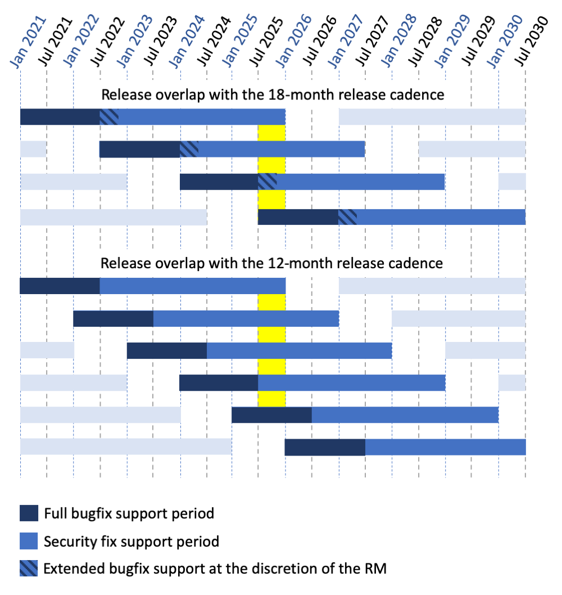

PEP: 602
Title: Annual Release Cycle for Python
Author: Łukasz Langa <lukasz@python.org>
PEP-Delegate: Brett Cannon <brett@python.org>
Discussions-To: https://discuss.python.org/t/pep-602-annual-release-cycle-for-python/2296/
Status: Active
Type: Process
Created: 04-Jun-2019
Python-Version: 3.9
Post-History: `09-Oct-2023 <https://discuss.python.org/t/27002>`__

Abstract
========

This document describes a change in the release calendar for Python
starting with Python 3.9.  This change accelerates the release cadence
such that feature versions are released predictably every twelve months,
in October every year.

Implementation
==============

Seventeen months to develop a feature version
---------------------------------------------

This PEP proposes that Python 3.X.0 will be developed for around
17 months:

- The first *five months* overlap with Python 3.(X-1).0's beta
  and release candidate stages and are thus unversioned.

- The next *seven months* are spent on versioned alpha releases where
  both new features are incrementally added and bug fixes are included.

- The following *three months* are spent on four versioned beta releases
  where **no new features** can be added but bug fixes are still
  included.

- The final *two months* are spent on two release candidates (or more,
  if necessary) and conclude with the release of the final release of
  Python 3.X.0.

2 years of full support, 3 more years of security fixes
-------------------------------------------------------

After the release of Python 3.X.0, the 3.X series is maintained for
five years:

- During the *first twenty four months* (2 years) it receives bugfix
  updates and full releases (sources and installers for Windows and
  macOS) are made approximately every other month.

- For the next *thirty six months* (3 years) it receives security
  updates and source-only releases are made on an as-needed basis
  (no fixed cadence).

- The final source-only release is made *five years* after 3.X.0.

Note: 2 years of full support start with
:pep:`Python 3.13 <719>`.  Python versions
3.9 - 3.12 operate on a calendar with 1½ year of full support, followed
by 3½ more years of security fixes.

Annual release cadence
----------------------

Feature development of Python 3.(X+1).0 starts as soon as
Python 3.X.0 Beta 1 is released.  This creates a twelve-month delta
between Python feature versions.

Example
=======

- 3.9 development begins: Tuesday, 2019-06-04
- 3.9.0 alpha 1: Monday, 2019-10-14
- 3.9.0 alpha 2: Monday, 2019-11-18
- 3.9.0 alpha 3: Monday, 2019-12-16
- 3.9.0 alpha 4: Monday, 2020-01-13
- 3.9.0 alpha 5: Monday, 2020-02-17
- 3.9.0 alpha 6: Monday, 2020-03-16
- 3.9.0 alpha 7: Monday, 2020-04-13
- 3.9.0 beta 1: Monday, 2020-05-18
  (No new features beyond this point.)

- 3.9.0 beta 2: Monday, 2020-06-08
- 3.9.0 beta 3: Monday, 2020-06-29
- 3.9.0 beta 4: Monday, 2020-07-20
- 3.9.0 candidate 1: Monday, 2020-08-10
- 3.9.0 candidate 2: Monday, 2020-09-14
- 3.9.0 final: Monday, 2020-10-05

.. figure:: pep-0602-example-release-calendar.png
   :align: center
   :width: 100%

   Figure 1. Consequences of the annual release cycle on the calendar.

In comparison, if this PEP is rejected and Python keeps the current
release schedule:

- 3.9 development begins: Tuesday, 2019-06-04
- 3.9.0 alpha 1: Monday, 2020-08-03  (10 months later)
- 3.9.0 alpha 2: Monday, 2020-09-07
- 3.9.0 alpha 3: Monday, 2020-10-05
- 3.9.0 alpha 4: Monday, 2020-11-02
- 3.9.0 beta 1: Monday, 2020-11-30  (6 months later)
- 3.9.0 beta 2: Monday, 2021-01-04
- 3.9.0 beta 3: Monday, 2021-02-01
- 3.9.0 beta 4: Monday, 2021-03-01
- 3.9.0 candidate 1: Monday, 2021-03-29
- 3.9.0 candidate 2: Monday, 2021-04-05 (if necessary)
- 3.9.0 final: Monday, 2021-04-19  (6 months later)

Dependent Policies
==================

Deprecations
------------

The current policy around breaking changes assumes at least two releases
before a deprecated feature is removed from Python or a ``__future__``
behavior is enabled by default.  This is documented in :pep:`387`.

This PEP proposes to keep this policy of **at least** two releases
before making a breaking change.

The term of the Steering Council
--------------------------------

The current wording of :pep:`13` states that "a new council is elected
after each feature release".  This PEP proposes to keep this policy
as it will lead to a consistent election schedule.

The term of the Release Manager
-------------------------------

The current undocumented convention is for a single Release Manager to
handle two feature releases of Python.  This PEP proposes to keep this
policy, allowing for the term to be extended to more releases with
approval from the Steering Council and the Cabal of Release Managers.

In particular, since this PEP is authored by the active Release Manager
and its effect would shorten the term of the Release Manager, the author
is open to managing the release of a third feature release to compensate
for the disruption.

Rationale and Goals
===================

This change provides the following advantages:

- makes releases smaller: since doubling the cadence doesn't double our
  available development resources, consecutive releases are going to be
  smaller in terms of features;

- puts features and bug fixes in hands of users sooner;

- creates a more gradual upgrade path for users, by decreasing the
  surface of change in any single release;

- creates a predictable calendar for releases where the final release is
  always in October (so after the annual core sprint), and the beta
  phase starts in late May (so after PyCon US sprints), which is
  especially important for core developers who need to plan to include
  Python involvement in their calendar;

- decreases the urge to rush features shortly before "Beta 1" due to
  the risk of them "slipping for 18 months";

- allows for synchronizing the schedule of Python release management
  with external distributors like Fedora who've been historically very
  helpful in finding regressions early not only in core Python but also
  in third-party libraries, helping moving the community forward to
  support the latest version of Python from Day 1;

- increases the explicit alpha release phase, which provides meaningful
  snapshots of progress on new features;

- significantly cuts the implicit "alpha 0" release phase which provides
  limited use for new development anyway (it overlaps with the beta of
  the *currently developed*, still unreleased, version).

Non-goals
---------

Adopting an annual release calendar allows for natural switching to
calendar versioning, for example by calling Python 3.9 "Python 3.20"
since it's released in October '20 and so on ("Python 3.23" would be the
one released in October '23).

While the ease of switching to calendar versioning can be treated as
an advantage of an annual release cycle, this PEP does not advocate for
or against a change in how Python is versioned.  Should the annual
release cycle be adopted, the versioning question will be dealt with in
a separate PEP.

Non-risks
---------

This change does not shorten the currently documented support calendar
for a Python release, both in terms of bugfix releases and security
fixes.

This change does not accelerate the velocity of development.  Python is
not going to become incompatible faster or accrue new features faster.
It's just that features are going to be released more gradually as they
are developed.

Consequently, while this change introduces the ability for users to
upgrade much faster, it does not require them to do so.  Say, if they
upgrade every second release, their experience with Python is going to
be similar to the current situation.

Risks
-----

Python redistribution
~~~~~~~~~~~~~~~~~~~~~

This requires changes to how integrators, like Linux distributions,
release Python within their systems.

The testing matrix
~~~~~~~~~~~~~~~~~~

This eventually increases the testing matrix for library and application
maintainers that want to support all actively supported Python versions
by one or two:

   Figure 2. Testing matrix in the 18-month cadence vs. the 12-month

The "extended bugfix support at the discretion of the Release Manager"
stage of the current release cycle is not codified.  If fact, :pep:`101`
currently states that after the release of Python 3.(X+1).0 only one
last bugfix release is made for Python 3.X.0.  However, in practice at
least the last four versions of Python 3 overlapped with stable releases
of the next version for around six months.  Figure 2 is including
this information to demonstrate that overlap between stable version
releases with the 12-month release cadence will be nothing new.

Other policies may depend on the release cadence
~~~~~~~~~~~~~~~~~~~~~~~~~~~~~~~~~~~~~~~~~~~~~~~~

Although identified dependent policies were addressed in a previous
section, it is entirely possible there are some other areas which
implicitly rely on the timing of Python releases.

Rejected Ideas
--------------

Keep the current 18 month release cadence
~~~~~~~~~~~~~~~~~~~~~~~~~~~~~~~~~~~~~~~~~

This is undesirable both for core developers and end users. From the
perspective of the core developer:

- it makes contribution scheduling harder due to irregular release
  dates every year;

- it creates a surge of rushed commits before (and even after!) Beta 1
  due to the stress involved with "missing a release";

- ironically, after Beta 1 it creates a false sense of having "plenty of
  time" before the next release, time that passes quickly regardless;

- it causes certain elements of the workflow to be executed so rarely
  that they are not explicitly documented, let alone automated.

More importantly, from the perspective of the user:

- it creates releases with many new features, some being explicitly
  incompatible and some being accidentally incompatible, which makes
  the upgrade cost relatively high every time;

- it sits on features and incompatible bug fixes for over a year before
  becoming available to the user; and more specifically

- it causes every "point zero" release to be extra risky for users.
  While we provide and recommend testing with alphas and betas,
  "point zero" is the first release of a given Python version for many
  users.  The bigger a release is feature-wise, the more potential
  problems are hiding in "point zero releases".

Double the release cadence to achieve 9 months between feature versions
~~~~~~~~~~~~~~~~~~~~~~~~~~~~~~~~~~~~~~~~~~~~~~~~~~~~~~~~~~~~~~~~~~~~~~~

This was originally proposed in :pep:`596` and rejected as both too
irregular and too short.  This would not give any of the benefits of
a regular release calendar but it would shorten all development phases,
especially the beta + RC phases.  This was considered dangerous.

Keep "4 betas over 4 months and a final month for the release candidate"
~~~~~~~~~~~~~~~~~~~~~~~~~~~~~~~~~~~~~~~~~~~~~~~~~~~~~~~~~~~~~~~~~~~~~~~~

While this would make the release calendar a bit cleaner, `it would make
it very hard for external distributors like Fedora
<https://discuss.python.org/t/pep-602-annual-release-cycle-for-python/2296/79?u=ambv>`_
to release the newest version of Python as soon as possible.  We are
adjusting Python's calendar here in the hope that this will enable
Fedora to integrate the newest version of Python with the newest version
of Fedora *as both are being developed* which makes both projects
better.

Slow down releases but don't freeze feature development with Beta 1
~~~~~~~~~~~~~~~~~~~~~~~~~~~~~~~~~~~~~~~~~~~~~~~~~~~~~~~~~~~~~~~~~~~

This is described in :pep:`598`.  This proposal includes non-standard
concepts like the "incremental feature release" which makes it hard
to understand.  The presented advantages are unclear while the
unfamiliarity of the scheme poses a real risk of user and integrator
confusion.

Long-Term Support Releases
~~~~~~~~~~~~~~~~~~~~~~~~~~

Each version of Python is effectively long-term support: it's supported
for five years, with the first eighteen months allowing regular bug
fixes and security updates.  For the remaining time security updates are
accepted and promptly released.

No extended support in the vein of Python 2.7 is planned going forward.

Copyright
=========

This document is placed in the public domain or under the
CC0-1.0-Universal license, whichever is more permissive.
