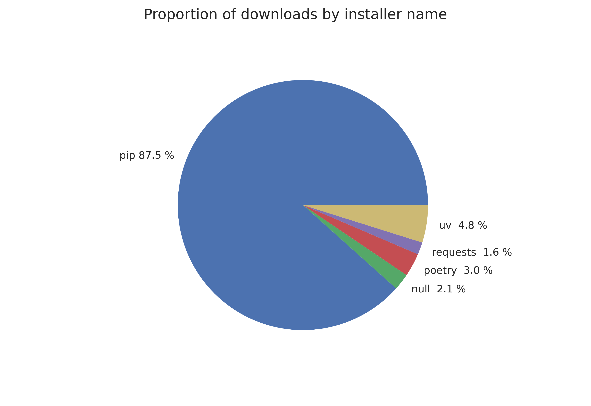
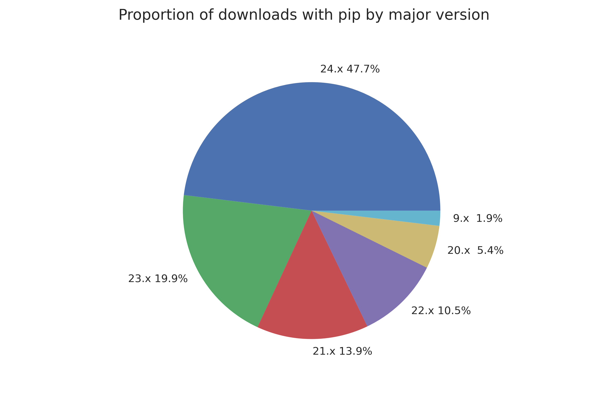

:orphan:

.. _777-pypi-download-analysis:

Appendix: Analysis of Installer Usage on PyPI
=============================================

.. note::
    This analysis is not perfect. While it uses the best available data,
    mirrors, caches used by enterprises, and other confounding factors
    could affect the numbers in this analysis. Consider the numbers as trends
    rather than concrete reliable figures.

One pertinent question to :pep:`777` is how frequently Python users update their
installer. If users update quite frequently, compatibility concerns are not as
important; users will be up-to-date by the time new features get added. On the
other hand, if users are frequently using older installers, then incompatible
wheels on PyPI would have a much wider impact. To figure out the relative share
of up-to-date vs outdated installers, we can use PyPI download statistics.

PyPI publishes a `BigQuery dataset <https://console.cloud.google.com/marketplace/product/gcp-public-data-pypi/pypi>`_,
which contains information about each download PyPI receives, including
installer name and version when available. The following query was used to
collect the data for this analysis:

.. code-block:: sql

    #standardSQL
    SELECT
      details.installer.name as installer_name,
      details.installer.version as installer_version,
      COUNT(*) as num_downloads,
    FROM `bigquery-public-data.pypi.file_downloads`
    WHERE
      -- Only query the last 6 months of data
      DATE(timestamp)
        BETWEEN DATE_TRUNC(DATE_SUB(CURRENT_DATE(), INTERVAL 6 MONTH), MONTH)
        AND CURRENT_DATE()
    GROUP BY `installer_name`, `installer_version`
    ORDER BY `num_downloads` DESC

With the raw data available, we can start investigating how up-to-date
installers that download packages from PyPI are. The below chart shows the
breakdown by installer name of all downloads on PyPI for the six month period
from March 10, 2024 to September 10, 2024.

        87.5%, uv makes up 4.8%, poetry makes up 3.0%, requests makes up 1.6%,
        and "null" makes up 2.1%.

As can be seen above, pip is the most popular installer in this time frame.
For simplicity's sake, this analysis will focus on pip installations when
considering how up-to-date installers are. pip has existed for a long
time, so analyzing the version of pip used to download packages should
provide an idea of how frequently users update their installers. Below is a
chart breaking down installations in PyPI over the same six month period, now
grouped by pip installer major version. pip uses calendar versioning, so
an installation from pip 20.x means that the user has not updated their pip
in four years.

        makes up 47.7%, 23.x makes up 19.9%, 22.x makes up 10.5%, 21.x makes up
        13.9%, 20.x makes up 5.4%, and 9.x makes up 1.9%.

Over two thirds of users currently run pip from this year or last. However,
about 7% are on a version that is at least four years old(!). This indicates that
there is a long tail of users who do not regularly update their installers.

Coming back to the initial question for PEP 777, it appears that caution should
be taken when publishing wheels with major version 2 to PyPI, as they are
likely to cause issues with a small but significant proportion of users who do
not regularly update their pip.
