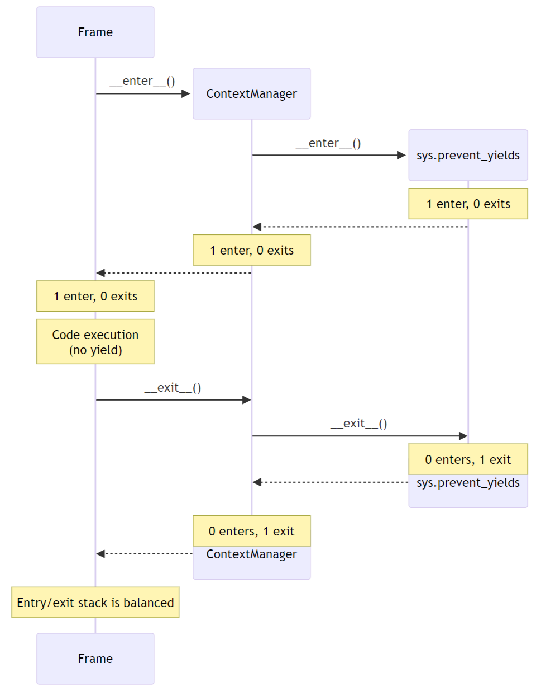
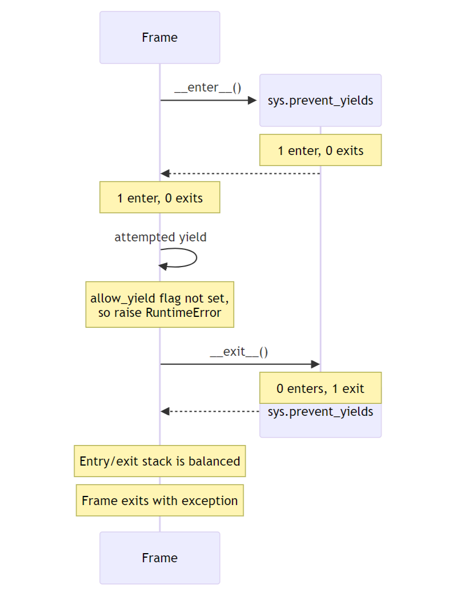
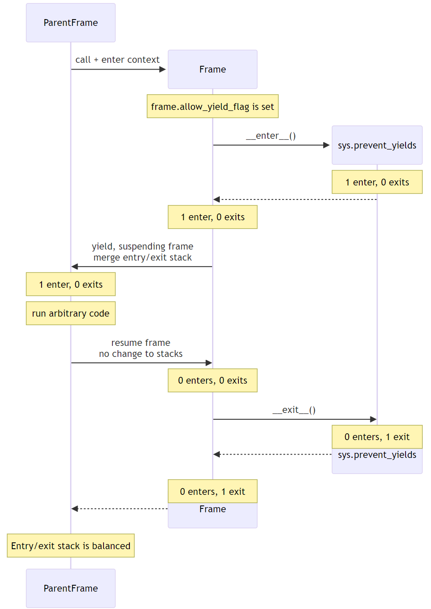

PEP: 789
Title: Preventing task-cancellation bugs by limiting yield in async generators
Author: Zac Hatfield-Dodds <zac@zhd.dev>,
        Nathaniel J. Smith <njs@pobox.com>
PEP-Delegate:
Discussions-To: https://discuss.python.org/t/preventing-yield-inside-certain-context-managers/1091
Status: Draft
Type: Standards Track
Created: 14-May-2024
Python-Version: 3.14

Abstract
========

`Structured concurrency`_ is increasingly popular in Python.  Interfaces such as
the ``asyncio.TaskGroup`` and ``asyncio.timeout`` context managers support
compositional reasoning, and allow developers to clearly scope the lifetimes of
concurrent tasks. However, using ``yield`` to suspend a frame inside such a
context leads to situations where the wrong task is canceled, timeouts are
ignored, and exceptions are mishandled. More fundamentally, suspending a frame
inside a ``TaskGroup`` violates the structured concurrency design principle that
child tasks are encapsulated within their parent frame.

To address these issues, this PEP proposes a new ``sys.prevent_yields()`` context
manager. When syntactically inside this context, attempting to ``yield`` will
raise a RuntimeError, preventing the task from yielding. Additionally, a
mechanism will be provided for decorators such as ``@contextmanager`` to allow
yields inside the decorated function.  ``sys.prevent_yields()`` will be used by
asyncio and downstream libraries to implement task groups, timeouts, and
cancellation; and a related mechanism by ``contextlib`` etc. to convert
generators into context managers which allow safe yields.

Background
==========

Structured concurrency is increasingly popular in Python, in the form of newer
:py:mod:`asyncio` interfaces and third-party libraries such as Trio and anyio.
These interfaces support compositional reasoning, *so long as* users never write
a ``yield`` which suspends a frame while inside a cancel scope.

A cancel scope is a context manager which can... cancel... whatever work occurs
within that context (...scope).  In asyncio, this is implicit in the design of
``with asyncio.timeout():`` or ``async with asyncio.TaskGroup() as tg:``, which
respectively cancel the contained work after the specified duration, or cancel
sibling tasks when one of them raises an exception.  The core functionality of
a cancel scope is synchronous, but the user-facing context managers may be
either sync or async. [#trio-cancel-scope]_ [#tg-cs]_

This structured approach works beautifully, unless you hit one specific sharp
edge: breaking the nesting structure by ``yield``\ ing inside a cancel scope.
This has much the same effect on structured control flow as adding just a few
cross-function ``goto``\ s, and the effects are truly dire:

- The wrong task can be canceled, whether due to a timeout, an error in a
  sibling task, or an explicit request to cancel some other task
- Exceptions, including ``CancelledError``, can be delivered to the wrong task
- Exceptions can go missing entirely, being dropped instead of added to an
  ``ExceptionGroup``

Problem statement
=================

Here's the fundamental issue: yield suspends a call frame. It only makes sense
to yield in a leaf frame -- i.e., if your call stack goes like A -> B -> C, then
you can suspend C, but you can't suspend B while leaving C running.

But, TaskGroup is a kind of "concurrent call" primitive, where a single frame
can have multiple child frames that run concurrently. This means that if we
allow people to mix yield and TaskGroup, then we can end up in exactly this
situation, where B gets suspended but C is actively running. This is
nonsensical, and causes serious practical problems (e.g., if C raises an
exception and A has returned, we have no way to propagate it).

This is a fundamental incompatibility between generator control flow and
structured concurrency control flow, not something we can fix by tweaking our
APIs. The only solution seems to be to forbid yield inside a TaskGroup.

Although timeouts don't leave a child task running, the close analogy and
related problems lead us to conclude that yield should be forbidden inside all
cancel scopes, not only TaskGroups.  See :ref:`just-deliver` for discussion.

Motivating examples
===================

Let's consider three examples, to see what this might look like in practice.

Leaking a timeout to the outer scope
------------------------------------

Suppose that we want to iterate over an async iterator, but wait for at most
``max_time`` seconds for each element.  We might naturally encapsulate the logic
for doing so in an async generator, so that the call site can continue to use a
straightforward ``async for`` loop:

.. code-block:: python

    async def iter_with_timeout(ait, max_time):
        try:
            while True:
                with timeout(max_time):
                    yield await anext(ait)
        except StopAsyncIteration:
            return

    async def fn():
        async for elem in iter_with_timeout(ait, max_time=1.0):
            await do_something_with(elem)

Unfortunately, there's a bug in this version: the timeout might expire after the
generator yields but before it is resumed!  In this case, we'll see a
``CancelledError`` raised in the outer task, where it cannot be caught by the
``with timeout(max_time):`` statement.

The fix is fairly simple: get the next element inside the timeout context, and
then yield *outside* that context.

.. code-block:: python

    async def correct_iter_with_timeout(ait, max_time):
        try:
            while True:
                with timeout(max_time):
                    tmp = await anext(ait)
                yield tmp
        except StopAsyncIteration:
            return

Leaking background tasks (breaks cancellation and exception handling)
---------------------------------------------------------------------

Timeouts are not the only interface which wrap a cancel scope - and if you
need some background worker tasks, you can't simply close the ``TaskGroup``
before yielding.

As an example, let's look at a fan-in generator, which we'll use to merge the
feeds from several "sensors".  We'll also set up our mock sensors with a small
buffer, so that we'll raise an error in the background task while control flow
is outside the ``combined_iterators`` generator.

.. code-block:: python

    import asyncio, itertools

    async def mock_sensor(name):
        for n in itertools.count():
            await asyncio.sleep(0.1)
            if n == 1 and name == "b":  # 'presence detection'
                yield "PRESENT"
            elif n == 3 and name == "a":  # inject a simple bug
                print("oops, raising RuntimeError")
                raise RuntimeError
            else:
                yield f"{name}-{n}"  # non-presence sensor data

    async def move_elements_to_queue(ait, queue):
        async for obj in ait:
            await queue.put(obj)

    async def combined_iterators(*aits):
        """Combine async iterators by starting N tasks, each of
        which move elements from one iterable to a shared queue."""
        q = asyncio.Queue(maxsize=2)
        async with asyncio.TaskGroup() as tg:
            for ait in aits:
                tg.create_task(move_elements_to_queue(ait, q))
            while True:
                yield await q.get()

    async def turn_on_lights_when_someone_gets_home():
        combined = combined_iterators(mock_sensor("a"), mock_sensor("b"))
        async for event in combined:
            print(event)
            if event == "PRESENT":
                break
        print("main task sleeping for a bit")
        await asyncio.sleep(1)  # do some other operation

    asyncio.run(turn_on_lights_when_someone_gets_home())

When we run this code, we see the expected sequence of observations, then a
'detection', and then while the main task is sleeping we trigger that
``RuntimeError`` in the background.  But... we don't actually observe the
``RuntimeError``, not even as the ``__context__`` of another exception!

.. code-block:: pycon

    >> python3.11 demo.py
    a-0
    b-0
    a-1
    PRESENT
    main task sleeping for a bit
    oops, raising RuntimeError

    Traceback (most recent call last):
      File "demo.py", line 39, in <module>
        asyncio.run(turn_on_lights_when_someone_gets_home())
      ...
      File "demo.py", line 37, in turn_on_lights_when_someone_gets_home
        await asyncio.sleep(1)  # do some other operation
      File ".../python3.11/asyncio/tasks.py", line 649, in sleep
        return await future
    asyncio.exceptions.CancelledError

Here, again, the problem is that we've ``yield``\ ed inside a cancel scope;
this time the scope which a ``TaskGroup`` uses to cancel sibling tasks when one
of the child tasks raises an exception.  However, the ``CancelledError`` which
was intended for the sibling task was instead injected into the *outer* task,
and so we never got a chance to create and raise an
``ExceptionGroup(..., [RuntimeError()])``.

To fix this, we need to turn our async generator into an async context manager,
which yields an async iterable - in this case a generator wrapping the queue; in
future `perhaps the queue itself
<https://github.com/python/cpython/issues/119154>`__:

.. code-block:: python

    async def queue_as_aiterable(queue):
        # async generators that don't `yield` inside a cancel scope are fine!
        while True:
            try:
                yield await queue.get()
            except asyncio.QueueShutDown:
                return

    @asynccontextmanager  #  yield-in-cancel-scope is OK in a context manager
    async def combined_iterators(*aits):
        q = asyncio.Queue(maxsize=2)
        async with asyncio.TaskGroup() as tg:
            for ait in aits:
                tg.create_task(move_elements_to_queue(ait, q))
            yield queue_as_aiterable(q)

    async def turn_on_lights_when_someone_gets_home():
        ...
        async with combined_iterators(...) as ait:
            async for event in ait:
                ...

In a user-defined context manager
---------------------------------

Yielding inside a cancel scope can be safe, if and only if you're using the
generator to implement a context manager [#redirected]_ - in this case any
propagating exceptions will be redirected to the expected task.

We've also implemented the ``ASYNC101`` linter rule in `flake8-async
<https://pypi.org/project/flake8-async/>`__, which warns against yielding in
known cancel scopes.  Could user education be sufficient to avoid these
problems?  Unfortunately not: user-defined context managers can also wrap a
cancel scope, and it's infeasible to recognize or lint for all such cases.

This regularly arises in practice, because 'run some background tasks for the
duration of this context' is a very common pattern in structured concurrency.
We saw that in ``combined_iterators()`` above; and have seen this bug in
multiple implementations of the websocket protocol:

.. code-block:: python

    async def get_messages(websocket_url):
        # The websocket protocol requires background tasks to manage the socket heartbeat
        async with open_websocket(websocket_url) as ws:  # contains a TaskGroup!
            while True:
                yield await ws.get_message()

    async with open_websocket(websocket_url) as ws:
        async for message in get_messages(ws):
            ...

Specification
=============

To prevent these problems, we propose:

1. a new context manager, ``with sys.prevent_yields(reason): ...`` which will
   raise a RuntimeError if you attempt to yield while inside it. [#also-sync]_
   Cancel-scope-like context managers in asyncio and downstream code can then
   wrap this to prevent yielding inside *their* with-block.

2. a mechanism by which generator-to-context-manager decorators can allow yields
   across one call.  We're not yet sure what this should look like; the leading
   candidates are:

   a. a code-object attribute, ``fn.__code__.co_allow_yields = True``, or

   b. some sort of invocation flag, e.g. ``fn.__invoke_with_yields__``, to avoid
      mutating a code object that might be shared between decorated and undecorated
      functions

Implementation - tracking frames
--------------------------------

The new ``sys.prevent_yields`` context manager will require interpreter support.
For each frame, we track the entries and exits of this context manager.

We're not particularly attached to the exact representation; we'll discuss it as
a stack (which would support clear error messages), but more compact
representations such as pair-of-integers would also work.

- When entering a newly-created or resumed frame, initialize empty stacks of
  entries and exits.
- When returning from a frame, merge these stacks into that of the parent frame.
- When yielding:

  - if ``entries != [] and not frame.allow_yield_flag``, raise a ``RuntimeError``
    instead of yielding (the new behavior this PEP proposes)
  - otherwise, merge stacks into the parent frame as for a return.

Because this is about yielding frames *within* a task, not switching between
tasks, syntactic ``yield`` and ``yield from`` should be affected, but ``await``
expressions should not.

We can reduce the overhead by storing this metadata in a single stack per thread
for all stack frames which are not generators.

Worked examples
---------------

No-yield example
~~~~~~~~~~~~~~~~

In this example, we see multiple rounds of the stack merging as we unwind from
``sys.prevent_yields``, through the user-defined ContextManager, back to the
original Frame.  For brevity, the reason for preventing yields is not shown;
it is part of the "1 enter" state.

..
    sequenceDiagram
        participant Frame
        create participant ContextManager

        Frame->>ContextManager: __enter__()
        create participant sys.prevent_yields
        ContextManager->>sys.prevent_yields: __enter__()
        Note over sys.prevent_yields: 1 enter, 0 exits
        sys.prevent_yields-->>ContextManager: ;
        Note over ContextManager: 1 enter, 0 exits
        ContextManager-->>Frame: ;

        Note over Frame: 1 enter, 0 exits
        Note over Frame: Code execution (no yield)

        Frame->>ContextManager: __exit__()
        ContextManager->>sys.prevent_yields: __exit__()
        Note over sys.prevent_yields: 0 enters, 1 exit
        destroy sys.prevent_yields
        sys.prevent_yields-->>ContextManager: ;
        Note over ContextManager: 0 enters, 1 exit
        destroy ContextManager
        ContextManager-->>Frame: ;
        Note over Frame: Entry/exit stack is balanced

With no ``yield`` we don't raise any errors, and because the number of enters
and exits balance the frame returns as usual with no further tracking.

Attempts-to-yield example
~~~~~~~~~~~~~~~~~~~~~~~~~

In this example, the Frame attempts to ``yield`` while inside the
``sys.prevent_yields`` context. This is detected by the interpreter,
which raises a ``RuntimeError`` instead of suspending the frame.

..
    sequenceDiagram
        participant Frame
        create participant sys.prevent_yields
        Frame->>sys.prevent_yields: __enter__()
        Note over sys.prevent_yields: 1 enter, 0 exits
        sys.prevent_yields-->>Frame: ;

        Note over Frame: 1 enter, 0 exits

        Frame->>Frame: attempted yield
        Note over Frame: allow_yield flag not set, so raise RuntimeError

        Frame->>sys.prevent_yields: __exit__()
        Note over sys.prevent_yields: 0 enters, 1 exit
        destroy sys.prevent_yields
        sys.prevent_yields-->>Frame: ;

        Note over Frame: Entry/exit stack is balanced
        Note over Frame: Frame exits with exception

Allowed-to-yield example
~~~~~~~~~~~~~~~~~~~~~~~~

In this example, a decorator has marked the Frame as allowing yields. This
could be ``@contextlib.contextmanager`` or a related decorator.

..
    sequenceDiagram
        participant ParentFrame
        create participant Frame

        ParentFrame ->> Frame: call + enter context
        Note over Frame: frame.allow_yield_flag is set

        create participant sys.prevent_yields
        Frame->>sys.prevent_yields: __enter__()
        Note over sys.prevent_yields: 1 enter, 0 exits
        sys.prevent_yields-->> Frame: ;

        Note over Frame: 1 enter, 0 exits

        Frame->>ParentFrame: yield, suspending frame merge entry/exit stack
        Note over ParentFrame: 1 enter, 0 exits
        Note over ParentFrame: run arbitrary code
        ParentFrame ->> Frame: resume frame no change to stacks
        Note over Frame: 0 enters, 0 exits

        Frame->>sys.prevent_yields: __exit__()
        Note over sys.prevent_yields: 0 enters, 1 exit
        destroy sys.prevent_yields
        sys.prevent_yields-->>Frame: ;
        Note over Frame: 0 enters, 1 exit

        destroy Frame
        Frame-->>ParentFrame: ;
        Note over ParentFrame: Entry/exit stack is balanced

When the Frame is allowed to yield, the entry/exit stack is merged into the
parent frame's stack before suspending. When the Frame resumes, its stack is
empty. Finally, when the Frame exits, the exit is merged into the parent
frame's stack, rebalancing it.

This ensures that the parent frame correctly inherits any remaining
``sys.prevent_yields`` state, while allowing the Frame to safely suspend
and resume.

Allowing yield for context managers
~~~~~~~~~~~~~~~~~~~~~~~~~~~~~~~~~~~

*TODO: this section is a placeholder, pending a decision on the mechanism for
``@contextmanager`` to re-enable yields in the wrapped function.*

- Explain and show a code sample of how ``@asynccontextmanager`` sets the flag

Note that third-party decorators such as ``@pytest.fixture`` demonstrate that
we can't just have the interpreter special-case contextlib.

Behavior if ``sys.prevent_yields`` is misused
---------------------------------------------

While unwise, it's possible to call ``sys.prevent_yields.__enter__`` and
``.__exit__`` in an order that does not correspond to any valid nesting, or get
an invalid frame state in some other way.

There are two ways ``sys.prevent_yields.__exit__`` could detect an invalid state.
First, if yields are not prevented, we can simply raise an exception without
changing the state.  Second, if an unexpected entry is at the top of the stack,
we suggest popping that entry and raising an exception -- this ensures that
out-of-order calls will still clear the stack, while still making it clear that
something is wrong.

(and if we choose e.g. an integer- rather than stack-based representation, such
states may not be distinguishable from correct nesting at all, in which case the
question will not arise)

Anticipated uses
================

In the standard library, ``sys.prevent_yields`` could be used by
``asyncio.TaskGroup``, ``asyncio.timeout``, and ``asyncio.timeout_at``.
Downstream, we expect to use it in ``trio.CancelScope``, async fixtures (in
pytest-trio, anyio, etc.), and perhaps other places.

We consider use-cases unrelated to async correctness, such as preventing
``decimal.localcontext`` from leaking out of a generator, out of scope for this
PEP.

The generator-to-context-manager support would be used by
``@contextlib.(async)contextmanager``, and if necessary in ``(Async)ExitStack``.

Backwards Compatibility
=======================

The addition of the ``sys.prevent_yields`` context manager, changes to
``@contextlib.(async)contextmanager``, and corresponding interpreter
support are all fully backwards-compatible.

Preventing yields inside ``asyncio.TaskGroup``, ``asycio.timeout``, and
``asyncio.timeout_at`` would be a breaking change to at least some code in the
wild, which (however unsafe and prone to the motivating problems above) may work
often enough to make it into production.

We will seek community feedback on appropriate deprecation pathways for
standard-library code, including the suggested length of any deprecation period.
As an initial suggestion, we could make suspending stdlib contexts emit a
DeprecationWarning only under asyncio debug mode in 3.14; then transition to
warn-by-default and error under debug mode in 3.15; and finally a hard error in
3.16.

Irrespective of stdlib usage, downstream frameworks would adopt this
functionality immediately.

How widespread is this bug?
---------------------------

We don't have solid numbers here, but believe that many projects are affected in
the wild.  Since hitting a moderate and a critical bug attributed to suspending
a cancel scope in the same week at work, we've `used static analysis
<https://flake8-async.readthedocs.io/en/latest/>`__ with some success. Three
people Zac spoke to at PyCon recognized the symptoms and concluded that they had
likely been affected.

*TODO: run the ASYNC101 lint rule across ecosystem projects, e.g. the aio-libs
packages, and get some sense of frequency in widely-used PyPI packages?
This would help inform the break/deprecation pathways for stdlib code.*

How to Teach This
=================

Async generators are very rarely taught to novice programmers.

Most intermediate and advanced Python programmers will only interact with this
PEP as users of ``TaskGroup``, ``timeout``, and ``@contextmanager``.  For this
group, we expect a clear exception message and documentation to be sufficient.

- A new section will be added to the `developing with asyncio
  <https://docs.python.org/3/library/asyncio-dev.html>`__ page, which
  briefly states that async generators are not permitted to ``yield`` when
  inside a "cancel scope" context, i.e. ``TaskGroup`` or ``timeout`` context
  manager.  We anticipate that the problem-restatement and some parts of the
  motivation section will provide a basis for these docs.

  - When working in codebases which avoid async generators entirely [#exp-report]_,
    we've found that an async context manager yielding an async iterable is a safe
    and ergonomic replacement for async generators -- and avoids the delayed-cleanup
    problems described in :pep:`533`, which this proposal does not address.

-  In the docs for each context manager which wraps a cancel scope, and thus now
   ``sys.prevent_yields``, include a standard sentence such as "If used within an
   async generator, [it is an error to ``yield`` inside this context manager]."
   with a hyperlink to the explanation above.

For asyncio, Trio, curio, or other-framework maintainers who implement
cancel scope semantics, we will ensure that the documentation of
``sys.prevent_yields`` gives a full explanation distilled from the solution and
implementation sections of this PEP.  We anticipate consulting most such
maintainers for their feedback on the draft PEP.

Rejected alternatives
=====================

PEP 533, deterministic cleanup for iterators
-----------------------------------------------
:pep:`533` proposes adding ``__[a]iterclose__`` to the iterator protocol,
essentially wrapping a ``with [a]closing(ait)`` around each (async) for loop.
While this would be useful for ensuring timely and deterministic cleanup of
resources held by iterators, the problem it aims to solve, it does not fully
address the issues that motivate this PEP.

Even with PEP 533, misfired cancellations would still be delivered to the wrong
task and could wreak havoc before the iterator is closed. Moreover, it does not
address the fundamental structured concurrency problem with ``TaskGroup``, where
suspending a frame that owns a TaskGroup is incompatible with the model of child
tasks being fully encapsulated within their parent frame.

Deprecate async generators entirely
-----------------------------------

At the 2024 language summit, several attendees suggested instead deprecating async
generators *in toto.*  Unfortunately, while the common-in-practice cases all use
async generators, Trio code can trigger the same problem with standard generators:

.. code-block:: python

    # We use Trio for this example, because while `asyncio.timeout()` is async,
    # Trio's CancelScope type and timeout context managers are synchronous.
    import trio

    def abandon_each_iteration_after(max_seconds):
        # This is of course broken, but I can imagine someone trying it...
        while True:
            with trio.move_on_after(max_seconds):
                yield

    @trio.run
    async def main():
        for _ in abandon_each_iteration_after(max_seconds=1):
            await trio.sleep(3)

If it wasn't for the bug in question, this code would look pretty idiomatic -
but after about a second, instead of moving on to the next iteration it raises:

.. code-block:: pycon

    Traceback (most recent call last):
      File "demo.py", line 10, in <module>
        async def main():
      File "trio/_core/_run.py", line 2297, in run
        raise runner.main_task_outcome.error
      File "demo.py", line 12, in main
        await trio.sleep(3)
      File "trio/_timeouts.py", line 87, in sleep
        await sleep_until(trio.current_time() + seconds)
      ...
      File "trio/_core/_run.py", line 1450, in raise_cancel
        raise Cancelled._create()
    trio.Cancelled: Cancelled

Furthermore, there are some non-cancel-scope synchronous context managers which
exhibit related problems, such as the abovementioned ``decimal.localcontext``.
While fixing the example below is not a goal of this PEP, it demonstrates that
yield-within-with problems are not exclusive to async generators:

.. code-block:: python

    import decimal

    def why_would_you_do_this():
        with decimal.localcontext(decimal.Context(prec=1)):
            yield

    one = decimal.Decimal(1)
    print(one / 3)  # 0.3333333333333333333333333333
    next(gen := why_would_you_do_this())
    print(one / 3)  # 0.3

While I've had good experiences in async Python without async generators
[#exp-report]_, I'd prefer to fix the problem than remove them from the
language.

.. _just-deliver:

Can't we just deliver exceptions to the right place?
----------------------------------------------------

If we implemented :pep:`568` (Generator-sensitivity for Context Variables; see
also :pep:`550`), it would be possible to handle exceptions from timeouts: the
event loop could avoid firing a ``CancelledError`` until the generator frame
which contains the context manager is on the stack - either when the generator
is resumed, or when it is finalized.

This can take arbitrarily long; even if we implemented :pep:`533` to ensure
timely cleanup on exiting (async) for-loops it's still possible to drive a
generator manually with next/send.

However, this doesn't address the other problem with ``TaskGroup``. The model
for generators is that you put a stack frame in suspended animation and can then
treat it as an inert value which can be stored, moved around, and maybe
discarded or revived in some arbitrary place. The model for structured
concurrency is that your stack becomes a tree, with child tasks encapsulated
within some parent frame.  They're extending the basic structured programming
model in different, and unfortunately incompatible, directions.

Suppose for example that suspending a frame containing an open ``TaskGroup``
also suspended all child tasks.  This would preserve the 'downward' structured
concurrency, in that children remain encapsulated - albeit at the cost of
deadlocking both of our motivating examples, and much real-world code.
However, it would still be possible to resume the generator in a different
task, violating the 'upwards' invariant of structured concurrency.

We don't think it's worth adding this much machinery to handle cancel scopes,
while still leaving task groups broken.

Alternative implementation - inspecting bytecode
------------------------------------------------

Jelle Zijlstra has `sketched an alternative`_, where ``sys.prevent_yields``
inspects the bytecode of callers until satisfied that there is no yield between
the calling instruction pointer and the next context exit. We expect that
support for syntatically-nested context managers could be added fairly easily.

However, it's not yet clear how this would work when user-defined context
managers wrap ``sys.prevent_yields``.  Worse, this approach ignores explicit
calls to ``__enter__()`` and ``__exit__()``, meaning that the context management
protocol would vary depending on whether the ``with`` statement was used.

The 'only pay if you use it' performance cost is very attractive.  However,
inspecting frame objects is prohibitively expensive for core control-flow
constructs, and causes whole-program slowdowns via de-optimization.
On the other hand, adding interpreter support for better performance leads
back to the same pay-regardless semantics as our preferred solution above.

Footnotes
=========

.. _Structured concurrency: https://vorpus.org/blog/notes-on-structured-concurrency-or-go-statement-considered-harmful/
.. _sketched an alternative: https://gist.github.com/JelleZijlstra/a53b17417c5189b487316628acc5555f

.. [#trio-cancel-scope]
    While cancel scopes are implicit in asyncio, the analogous
    :py:func:`trio:trio.fail_after` (sync) and :py:func:`trio:trio.open_nursery`
    (async) context managers literally wrap an instance of
    :py:class:`trio:trio.CancelScope`. We'll stick with asyncio for examples
    here, but say "cancel scope" when referring to the framework-independent
    concept.

.. [#tg-cs]
    A ``TaskGroup`` is not _only_ a cancel scope, but preventing yields would
    resolve their further problem too.  See :ref:`just-deliver`.

.. [#redirected] via e.g. ``contextlib.[async]contextmanager``, or moral
    equivalents such as ``@pytest.fixture``

.. [#also-sync]
    Note that this prevents yields in both sync and async generators, so that
    downstream frameworks can safely define sync cancel scope countexts such as
    :py:func:`trio:trio.fail_after`.

.. [#exp-report] see `Zac's experience report here
    <https://discuss.python.org/t/using-exceptiongroup-at-anthropic-experience-report/20888>`__

Copyright
=========

This document is placed in the public domain or under the
CC0-1.0-Universal license, whichever is more permissive.
