PEP: 795
Title: Deep Immutability for Efficient Sharing and Concurrency Safety
Author: Matthew Johnson <matjoh@microsoft.com>, Matthew Parkinson <mattpark@microsoft.com>, Sylvan Clebsch <sylvan.clebsch@microsoft.com>, Fridtjof Stoldt <fridtjof.stoldt@it.uu.se>, Tobias Wrigstad <tobias.wrigstad@it.uu.se>
Sponsor: Michael Droettboom <mdboom@gmail.com>
Discussions-To: https://discuss.python.org/t/pep-795-revamped-deep-immutability-for-efficient-sharing-and-concurrency-safety/105356
Status: Draft
Type: Standards Track
Created: 19-Jun-2025
Python-Version: 3.15
Post-History:
  `19-Jun-2025 <https://discuss.python.org/t/96014>`__,
  `19-Dec-2025 <https://discuss.python.org/t/105356>`__,

Abstract
########

This PEP proposes support for deeply immutable objects in Python.
It partitions all objects into two categories: **mutable**
and **deeply immutable**. Mutable objects can be updated and
reference both mutable and deeply immutable objects. Deeply
immutable objects cannot be updated, and may only point to other
deeply immutable objects. If a mutable object is **freezable**,
it can be turned into an immutable object. We refer to the act of
making a freezable object immutable as "freezing it", and we will
often say "freezable object" to mean a mutable object that is also
freezable.

There is no way to make an immutable object mutable.
However, one can make a mutable copy of an immutable object
using standard Python concepts.

From now on, we will use immutable to mean deeply immutable, and
use **shallow immutability** to mean the protection offered by
tuples and frozen sets in Python 3.14. For example, ``(42,
("Spam", None))`` is deeply immutable, but ``(42, ["Spam",
None])`` is shallowly immutable, because the list constructor
creates a mutable object, so while the tuple cannot be updated,
its list sub-object can.

The main motivation for **deep** immutability is to enable direct
sharing of immutable objects across sub-interpreters without the
need of pickling.

All functionality is exposed via a new built-in
module called ``immutable``. This allows each Python implementation
to decide if it wants to provide immutability or not. We have a
working implementation of this PEP for CPython which we aim to adjust
based on feedback and upstream on acceptance.

Motivation
##########

The motivation for immutability is four-fold:

1. With the semantics of immutability that this PEP proposes, immutable
   objects can be shared directly by reference across sub-interpreters.
   This is a big performance boost for sub-interpreters as Python
   currently requires objects to be transferred across sub-interpreters
   by pickling. This also simplifies programming with sub-interpreters.
   To make sharing safe, some changes are necessary with respect to how a
   Python interpreter manages the memory of immutable objects.
   (Sharing objects across sub-interpreters is not possible without *deep*
   immutability.)
2. Since immutable objects are safe from data races, it is possible to
   avoid some of the overhead surrounding field access that is needed
   for correct reference counting in free-threaded Python.
3. Memory for immutable objects can be managed in a leak-safe manner
   without the need for cycle detection, even when there are cycles in the
   immutable objects. This is key to sharing objects
   between sub-interpreters without needing substantial changes to cycle
   detection.
   The algorithm we use to perform this assumes that freezing an object
   does not occur in parallel with concurrent mutation. (This will always
   hold for sub-interpreters.)
4. Immutability is a very useful concept in programming that simplifies
   reasoning about state. In particular immutable objects are safe to
   share between concurrent threads without any synchronisation in the
   program.

In this PEP, we strive to create a semantics for immutable
objects that is consistent across both the per-interpreter GIL and
free-threaded concurrency paradigms.

In a future PEP, we will propose a scheme for sharing *mutable* objects
by reference across sub-interpreters, using region-based ownership to
enforce the invariants necessary for safety. There is a
short note about this at the end of this document.

Towards the end of this document we also discuss performance of our prototype
implementation. As shown in Figure 1 below, sharing objects
directly by reference across sub-interpreters is considerably faster than
by pickling and unpickling. (See `Performance of immutability`_ for
more details of what this figure actually means.)

.. figure:: pep-0795/scaling.png

   **Figure 1:** Effect on performance from direct
   sharing of immutable objects. This plot shows the scaling
   properties of sub-interpreters using immutability for user
   classes vs pickling. Mean values over ten trials are shown.
   One standard deviation is depicted as a vertical line. The
   throughput of a single process for the task is shown for
   comparison.

Design considerations due to sub-interpreters
=============================================

This PEP will enhance sub-interpreters so that immutable
objects can be shared directly by reference between sub-interpreters. This is possible because
immutability permits an object to safely forego isolation and
be accessed outside of the protection offered by a single
GIL, and having its memory managed safely using atomic reference
counting, even for cyclic garbage. This is not the case for
mutable objects, and if a mutable object could be accessed
by multiple sub-interpreters, the Python VM could crash or
be susceptible to use-after-free bugs that could corrupt
data silently. If immutability could be circumvented, the
same would be true for immutable objects. This motivates
a strict interpretation of immutability, where the
mutable and immutable “worlds” are kept apart. (Although see
`Escape hatches`_.)

Immutability is important to allow safe sharing between sub-interpreters.
To illustrate this point, let's assume that it would be possible to
share a mutable object O across two sub-interpreters (Sub 1 and
Sub 2) each with their own GIL. Because each sub-interpreter is
only synchronising with its own GIL, they are not synchronising
*with each other*. Sharing an *immutable* object avoids the need
for synchronisation (except for reference counts, which we will
return to later) -- however, if an immutable object has a mutable
sub-object, then sharing the immutable object indirectly also
shares the mutable sub-objects, which leads to the problems above.
As we cannot prevent the sub-object from being accessed, this
motivates *deep* immutability.

The picture below shows the situation above pictorially – the boxes
labelled Sub 1 and Sub 2 show the heaps of sub-interpreters 1 and 2.
Objects A and D are mutable and reside in the heap of Sub 1. Object B is
mutable and resides in the heap of Sub 2. A and B both point to a
immutable shared object C that (illegally in this PEP) references the
mutable object D. Note that object C does not belong to either
sub-interpreter, which is why it is drawn outside of their heaps.

.. figure:: pep-0795/diagram_1.svg

   **Figure 2:** Illegal reference from immutable to
   mutable object. The immutable object C is shared between two
   sub-interpreters, and keeps an illegal reference to a mutable
   object on the heap of one of the sub-interpreters.

A sub-interpreter assumes that accesses to the objects reachable
from its heap are protected by its GIL. **Note that the reference
from C to D is not legal in this PEP, and this example shows what
happens if it was allowed.** The colours on the dashed arrows show which
sub-interpreter is using a reference to access an object. We annotate
the accesses with what GIL is used to synchronise actions on the object.
Because of the reference from C to D, it is possible to have two
accesses relying on different GILs for correctness, meaning
these accesses do not synchronise. Attempts to modify object D from
different sub-interpreters may lead them to overwrite each other and
silently corrupt or crash the Python VM. Even just reading the reference
to D could cause a problem, since the reference count of D is not atomic,
which could lead to incorrect reference count updates, followed by
use-after-free bugs.

Immutable objects avoid these problems: their reference count is managed
though atomic increments and decrements, and since its fields are immutable,
they are not subject to data races.

Specification
#############

This PEP describes immutability support in Python. It first
discusses adding support for built-in types before tackling the
challenges of dealing with user-defined types.
Permitting more objects to be made immutable requires more changes to
the Python interpreter, and additionally comes with design
considerations at the language level. The separation of the PEP
into these two aspects is prompted by discussions at DPO in order
to clarify the “return on investment” for various aspects of this PEP,
and also to permit this feature to be rolled out across multiple
releases to give the Python community more time to get accustomed
to immutability. In summary:

1. **Part 1: Inherently Immutable Objects**.
   Objects and types which are `de-facto immutable`_ in Python 3.14 are
   immutable according to this PEP. Examples include tuples that only
   contain immutable objects, strings, numbers, booleans, and ``None``.
   More information on current Python immutability can be found
   in the `data model documentation`_.
2. **Part 2: Supporting User-Defined Types**.
   Extend immutability to dicts, lists, sets and user-defined types
   and their instances. Objects of these types will be freezable,
   meaning they will be mutable at creation but may be made immutable.
   Classes are freezable as well. This permits monkey-patching, i.e.
   adding and removing methods in a class before freezing it, which is
   important for many libraries, e.g. dataclasses.

.. _de-facto immutable: ttps://docs.python.org/3/glossary.html#term-immutabl
.. _data model documentation: https://docs.python.org/3/reference/datamodel.html

Semantics of immutability
=========================

This PEP partitions objects into the categories **mutable** and
**immutable**. Mutable objects can be updated and reference both
mutable and immutable objects. Immutable objects cannot be
updated, and may only point to other immutable objects. Mutable
objects can also be **freezable** meaning they can be turned into
immutable objects.

Sometimes it may be necessary for an immutable object to point to
mutable data or support some limited form of mutation. This will be
supported through `escape hatches`_.

Support for Inherently Immutable Objects
----------------------------------------

As a first step, we align the deep immutability of this PEP with the shallow
immutability in Python. All types that are immutable in Python 3.14 are
also deeply immutable in the sense of this PEP. Further, all instances
of ``int``, ``float``, ``str``, ``complex``, and ``bool`` and the
``None`` constant are deeply immutable. Instances of
**shallowly immutable** composite types like ``tuple``,
``namedtuple``, ``frozenset``, ``range`` and ``slice``
are deeply immutable if their nested objects are deeply
immutable.

So far, immutability is always established at the point of
creation, which means that there is no need for an operation that takes
a mutable object and makes it immutable (this becomes necessary when
dealing with user-defined types later). The function ``is_frozen()``
can be used to test if an object is deeply immutable, e.g. before
sharing it with another sub-interpreter.

.. code-block:: python
   :caption: **Listing 1:** Creating immutable (and one mutable) objects.

   # is_frozen(obj) returns True if obj is deeply immutable
   from immutable import is_frozen

   # Creates immutable object -- all sub-objects are immutable
   p = ("this", 15, "an", "ex parrot")
   is_frozen(p) # True

   # Does not create an immutable object -- dict is mutable so n is shallow immutable
   n = ({'x' : 'parrot'}, None)
   is_frozen(n) # False

   from collections import namedtuple
   Person = namedtuple('Person', ['name'])

   # Create deeply immutable tuple of named tuples
   monty = (Person("Eric"), Person("Graham"), Person("Terry"))
   is_frozen(monty) # returns True -- all sub-objects are immutable

For clarity, while all of the objects above except for the dictionary
are de-facto immutable today in Python, they cannot be safely shared
across sub-interpreters without the changes proposed by this PEP. The
``n`` tuple contains a mutable dictionary and is, therefore, **not**
deeply immutable and therefore not safe to share between sub-interpreters.

Sharing of Types
~~~~~~~~~~~~~~~~

To share an object it has to be deeply immutable. Recall that this means
that all objects reachable from it has to be deeply immutable too -- including the
type object stored in its ``__class__`` attribute. All types of the
currently de-facto immutable objects are immutable (*i.e.*, the type has
the ``Py_TPFLAGS_IMMUTABLE_TYPE`` flag set) and can therefore
be made safe to share across sub-interpreters while being consistent with
the definition of deep immutability and not breaking existing code.

   **Figure 3:** An immutable instance C and its immutable type D being
   shared across two sub-interpreters.

The figure above introduces our drawing notation. The boxes “Sub 1” and
“Sub 2” are the heaps of the sub-interpreters. A and B are mutable
objects living in the isolated heaps. C and D are immutable objects
living outside the sub-interpreter heaps, and are accessible by all.
Arrows are references.

Dealing with cycles
~~~~~~~~~~~~~~~~~~~

Because each sub-interpreter assumes exclusive access to objects while
it performs cycle detection, immutable objects cannot be part of cycle
detection. The per sub-interpreter cycle detection avoids the need to
stop all interpreters to perform cycle detection. However, this means
that immutable objects accessible from multiple interpreters have to be
handled differently. To this end, we "removed" all immutable objects from
the work-list of the cycle detector.

When objects are immutable at creation, immutable object graphs
cannot contain cycles. These can therefore be removed from cycle
detection without any risk of creating memory leaks.
There are a handful of types that contain cycles in the CPython
implementation, such as ``tuple``, ``type``, and ``object``. These
cycles are part of the static initialization of the interpreters
and are immortal, so they do not need to be managed by the cycle
detector either.

Adding support for turning mutable objects of user-defined
types immutable permits creation of immutable cycles. For these
we introduce a :ref:`different technique to handle cycles <scc>`
later in this PEP. Thus, the parallel garbage collection ability
of Python's sub-intepreters model is kept intact by this PEP.

Register immutable types through C
~~~~~~~~~~~~~~~~~~~~~~~~~~~~~~~~~~

The function ``register_shallow_immutable(typ)`` allows modules
that have immutable types implemented through C to register them
as such, so that they can be shared across sub-interpreters. A
type may be registered as shallow immutable if it does not contain
any mutable fields. An ``is_frozen`` check on a type which has
been registered as shallow immutable will return ``True`` if all
fields reference deeply immutable objects, else ``False``. This check
is done on a call to ``is_frozen`` on an object. This means that
there is no checking cost until immutability is actually used.

Note that checking whether a C type's fields are mutable or not is
beyond the possibilities of ``register_shallow_immutable(typ)``. The
function simply accepts this assertion from the programmer. If a type
was incorrectly registered as shallow immutable, it can lead to
undefined behaviour, including crashes and memory corruption, when
using the type across sub-interpreters. This function also requires that
the module itself is freezable (See: `freezable`_), since all
C-types have a reference to the module that defined them.

Traversing objects
~~~~~~~~~~~~~~~~~~

The changes proposed by this PEP require a way to find all objects
which are reachable from a given object. The existing mechanisms, namely
``dir()`` and ``tp_traverse``, are not sufficient since they are not
guaranteed to discover all reachable objects. For this a new
function ``tp_reachable`` is added to C-types. This function needs to be
implemented by a type to support immutability. It has the same
function signature as ``tp_traverse`` which allows easy migration
for existing C-types that already visit all reachable fields in
``tp_traverse`` by simply reusing the existing ``tp_traverse``.

.. _summary-1:

Summary -- so far
~~~~~~~~~~~~~~~~~

-  A deeply immutable object may only point to other immutable objects
   (modulo `escape hatches`_), including its class object
-  Deeply immutable objects can be created from objects which are
   already immutable in Python today -- note that for tuples, named
   tuples and frozen sets, this requires that their constituent parts are
   deeply immutable too
-  Immutable objects are always immutable at the point of creation
-  Immutable object graphs are tree shaped

Supporting user-defined types and freezing mutable isolated subgraphs
---------------------------------------------------------------------

Below we describe the support for making instances of user-defined types
immutable. This requires support for making user-defined *types*
immutable, along with their *functions*.

Now the notion of *freezable* becomes important:

  A freezable object is mutable but can be made immutable.

A freezable object is made immutable through an explicit call to
the function ``freeze()``. A call to ``freeze(o)`` will make the
object referenced by ``o`` immutable, along with all other objects
reachable from fields in ``o`` (and so on) -- including types which
are reachable from the ``__class__`` field. We refer to this as
*freeze propagation*. To make an object immutable at construction
time, simply wrap its construction inside a freeze call. The freeze
function takes a variable number of arguments which allows it to
freeze many things at once.

Types are freezable by default but must be frozen *explicitly*,
as illustrated by Listing 2. This means that the object must be
frozen by directly passing its reference to freeze (e.g. ``freeze(o)``
freezes ``o`` explicitly and ``o.__class__`` by freeze propagation;
whereas ``freeze(o, o.__class__)`` freezes both ``o`` and its class
explicitly, and at the same time).

.. code-block:: python
   :caption: **Listing 2.a:** By default, types must be frozen explicitly.

    class Foo:
        pass

    f = Foo()
    f.g = Foo()
    freeze(f) # Will fail because Foo is not immutable
    freeze(Foo) # OK because the type is frozen explicitly -- not by freeze propagation
    freeze(f) # OK because Foo is immutable
    is_frozen(f) # True
    is_frozen(Foo) # True
    if_frozen(f.g) # True (by propagation)

To permit ``freeze(f)`` to propagate to and implicitly freeze the
``Foo`` type, we can use the decorator ``@freezable`` on the class
declaration. Non type objects are implicitly freezable, but
note that freezing an object will fail unless its type is
freezable (or already made immutable). The standard types
``list``, ``dict``, and ``set`` are also freezable, meaning lists,
dicts and sets are mutable on creation but can be made immutable
later.

To make a type immutable immediately at creation time, a decorator
``@frozen`` can be used. The decorators, the ``freeze()`` function,
along with other utilities described later in this document are in
a module called ``immutable``. The listing below revisits the listing
above and uses the ``@frozen`` decorator on ``Foo``.

.. code-block:: python
   :caption: **Listing 2.b:** By default, types must be frozen explicitly.

    from immutable import freeze, is_frozen, frozen

    @frozen
    class Foo:
        pass

    is_frozen(Foo) # True
    f = Foo()
    f.g = Foo()
    freeze(f) # OK because Foo is immutable
    is_frozen(f) # True
    if_frozen(f.g) # True (by propagation)

An immutable type may not reference mutable state, and
additionally does not permit adding, removing or changing
functions. Immutable types *may not* inherit from mutable types,
but *may have* mutable subtypes. The ``object`` class and the
``type`` meta class are immutable by default as described above.

This PEP includes `escape hatches`_ that relax the restrictions on
capturing mutable state in functions and types.

As pointer out above,
with freezable objects, ``freeze()`` and ``@frozen`` come the
issue of *freeze propagation*, meaning what freezable objects can
be made immutable as a side-effect of making something else
immutable. For example, consider the figure below, ``freeze(x)``
will make ``A``, ``B`` and ``C`` immutable. Because ``y``
points to ``C``, ``freeze(x)`` becomes visible through ``y``.
An attempt at mutating ``C`` through ``y`` will result in
“TypeError: object of type T is immutable”.

.. figure:: pep-0795/diagram_3.svg

   **Figure 4:** A first look at freeze propagation. Freezing ``x`` will affect objects ``A``, ``B`` and ``C``.

Freeze propagation is similar to how static annotations such
as ``const`` from C or C++ propagate through a code base, except
at run-time instead of compile-time. This PEP limits or manages freeze
propagation by making user-defined types explicitly freezable,
providing a way to hook into the freeze mechanism, and by
allowing opting out of freezing altogether or for some limited
duration.

Pre-freeze hook
~~~~~~~~~~~~~~~

Sometimes it is necessary to run some code just before an object
is frozen. This can be done by calling ``set_pre_freeze_hook``
with a callable that will be invoked just before freezing the
object. The callable will be passed the object that is about to be
frozen as its only argument. The callable may perform
operations on this object, or its contained objects e.g. to
affect whether freezing will succeed or not. (It can also take
some mutable state and wrap it in an escape hatch etc. We use
this hook mechanism internally to handle functions and modules,
as will be described later.)

On user defined types, the definition can directly define a
``__pre_freeze__`` method that will be called as the pre-freeze
hook.

The listing below shows the pre-freeze hook which errors if the value
field is not filled and populates a cache.

.. code-block:: python
   :caption: **Listing 7:** Freezing propagates.

   @freezable
   class Foo:
       def __init__(self, field):
           self.field = field
       def __pre_freeze__(self):
           # Dynamically fail freezing based on field content
           if self.field is None:
               raise RuntimeError("Attempted to freeze empty foo")
           # Precompute some values
           self.cache = hash(field)

   f = Foo()
   freeze(f)

Note that if a freeze fails because at least one object is not
allowed to be frozen, then the system will ensure none of the
objects are frozen. *However, the effects of the pre-freeze hook
will not be undone.*

Immutable functions
~~~~~~~~~~~~~~~~~~~

An immutable function is a normal function that can be passed both
mutable and immutable arguments. It is free to mutate newly
created objects or any mutable arguments -- but it may not capture or
store a reference to mutable state as part of the function object.
Really, an immutable function is more of a "sharable function".
Making a function immutable does not prevent optimisations
which rely on mutating the code object. However, such optimisations
will need to be carried out in a way that is thread-safe without
relying on a single GIL.

(While we did not discuss immutable functions much when we limited
ourselves to built-in types, they were already there as part of the
immutable type objects.)

The major challenge with immutable functions can be illustrated
through an example. What if the following program was legal?

.. code-block:: python
   :caption: **Listing 3:** The problem with sharing functions across sub-interpreters

   import random

   x = [0, 1, 2]
   y = [0, 1, 2, 3, 4]

   def die_roll():
       return x[random.randint(0, 2)] # captures external random and x objects

   freeze_and_send_to_other_sub_interpreter(die_roll) # Problem
   # The lines below are discussed below in the text
   # freeze(die_roll)
   # x = [5, 6, 7]
   # x.append(8)

The ``die_roll()`` function above captures the ``random`` module
object of its defining sub-interpreter and the local variable ``x``.
If we pass the ``die_roll`` function object to another sub-interpreter,
we have successfully recreated the problematic situation in Figure 1 where
C is ``die_roll`` and D is ``random`` or the list in ``x``.
(Actually, the situation is
technically worse as each function object has a reference to the
globals dictionary of its defining sub-interpreter, so
``die_roll.__globals__["y"].append(5)`` will add to the list in
``y``.) Since types consist mostly of functions, and we need to
share types to share objects, we need a notion of immutable
functions in this PEP as well.

As explained above, that a function is immutable means that it is
safe to share across sub-interpreters. This means that the
function may not capture a direct reference to mutable state. The
function may be passed mutable state, and may get access to the
current interpreter's mutable state through module imports, but it
may not make one sub-interpreter's mutable state accessible to
another sub-interpreter.

A function can be made immutable either implicitly (*e.g.,*
because the type containing it is frozen) or explicitly (*e.g.,*
through a ``@frozen`` decorator or an explicit ``freeze()`` call).
When a function is frozen, we *decouple* it from its defining
context in two ways. This logic is handled transparently in the
pre-freeze hook of the function type object:

1. We re-point its captured globals to point to a copy that contains
   only the values that the function captured. (So ``random`` and ``x``
   in our example above, but not ``y``.) The copy is shallow.
2. We freeze the globals copy which freezes the *values* which
   are shared between the globals dictionaries, but keeps the
   variables in the defining context's globals dictionary mutable.
   Thus, ``x = [5, 6, 7]`` is permissible, and because that updates
   the sender's ``x`` to point to a mutable object, the subsequent
   append is permitted.

If a nested function captures values from a stack frame of another
function call, we handle those in the same way: we make a shallow
copy of the cell objects and freeze the copies. In the code below,
you can witness how freezing the ``foo`` function effectively
gives ``foo`` its own copy of the ``x`` *variable*, which
initially shares its *value* with the enclosing ``x``:

.. code-block:: python
   :caption: **Listing 4:** Freezing a function locks and freezes the current values of its captured variables, but enclosing scopes can still reassign the variables.

   x = 42
   @frozen
   def foo():
       return x

   is_frozen(foo) # True
   foo() # returns 42
   x = 4711 # OK
   print(x) # prints 4711
   foo() # returns 42

An Immutable Die
~~~~~~~~~~~~~~~~

Listing 5 below creates a ``Die`` type which is immutable at
creation. (An alternative to the ``@frozen`` decorator is to make
the type ``@freezable`` allowing ``freeze(d)`` to also freeze the
the class declaration.) As neither the
``Die`` class nor its functions capture any external mutable
state, freezing it will not lead to any external state being
frozen. The import inside of ``roll()`` illustrates the major
difference between the function importing the current
sub-interpreter’s ``random`` module on each call and a function
capturing and always calling into a specific sub-interpreter’s
random module. The default ``sides`` argument in ``__init__`` is
supported since the value is immutable.

.. code-block:: python
   :caption: **Listing 5:** A valid immutable class.

   from immutable import freeze, is_frozen, frozen

   # @frozen -- could have frozen die immediately after creation
   class Die:
       def __init__(self, sides=6):
           self.set_sides(sides)
       def set_sides(self, sides):
           self.sides = sides
       def roll(self):
           # Importing a mutable module is OK
           import random
           return random.randint(1, self.sides)

   d = Die(6)
   is_frozen(d) # False
   d.roll() # will return a number in [1,6]
   d.set_sides(12) # OK

   # freeze(d) -- will fail unless Die is @frozen or @freezable

   freeze(Die)
   is_frozen(Die) # True
   is_frozen(Die.roll) # True

   freeze(d) # turns the object d points to deeply immutable
   is_frozen(d) # True
   d.roll() # will return a number in [1,12]
   d.set_sides(6) # will raise an exception

Right before ``freeze(Die)``, we have the following object graph (with
some simplifications to reduce clutter -- recall that immutable objects
can only reference other immutable objects).

.. figure:: pep-0795/diagram_4a.svg

   **Figure 5:** Before freezing ``Die`` – immutable objects drawn in “ice
   blue” with dashed borders and references from immutable objects drawn
   with lighter blue lines.

Freezing the class also freezes its functions.

.. figure:: pep-0795/diagram_4b.svg

   **Figure 6:** Before freezing ``d`` – immutable objects drawn in “ice
   blue” with dashed borders and references from immutable objects drawn
   with lighter blue lines.

Note that the instance of ``Die`` pointed to by ``d`` is still a normal
mutable Python object. Thus we would be allowed to change the number of sides
back to 6 from 12. However, after we freeze the object, an attempt to change
its sides will raise an exception, since the object is immutable. Note
that freezing ``d`` will not prevent the value stored in the ``d``
variable to change. However, as indicated by the blue reference arrow,
``sides`` inside the immutable ``Die`` instance is fixed for life.

.. figure:: pep-0795/diagram_4c.svg

   **Figure 7:** Right after freezing ``d`` – immutable objects drawn in “ice
   blue” with dashed borders and references from immutable objects drawn
   with lighter blue lines.

Note that freezing is *in-place*; ``freeze(obj)`` freezes ``obj``, not a copy.
(For convenience, ``freeze(obj)`` also returns a reference to ``obj``.)

.. _freezable:

Freezability - Unfreezable and explicitly freezable objects
~~~~~~~~~~~~~~~~~~~~~~~~~~~~~~~~~~~~~~~~~~~~~~~~~~~~~~~~~~~

The immutable module provides the function ``set_freezable(obj, status=Yes)``
which controls if and how an object is freezable. Most
objects are freezable by default, meaning that freezing can propagate
to them. However, functions and types are explicitly freezable by
default (``set_freezable(obj, Explicit)``) meaning that freezing
will never propagate to them and they can only be frozen when they
are explicitly passed in to ``freeze()``. Objects can also be marked as
unfreezable (``set_freezable(obj, No)``) which will result in an error
when someone attempts to freeze the object. The values for ``Yes``,
``No`` and ``Explicit`` are defined in the immutable module.
The listing below shows the effects of freezability:

.. code-block:: python
   :caption: **Listing 6:** Examples of freezability

   class Cell:
       def __init__(self, value):
           self.value = value

   val1 = {"1": "One"}
   c = Cell(val1)

   freeze(c) # 💥 Fails since the Cell class must be frozen explicitly

   freeze(Cell)
   freeze(c) # Succeeds since Cell was explicitly frozen
   is_frozen(val1) # Val is now frozen as well

   val2 = {"2": "Two"}
   set_freezable(val2, Explicit)
   c = Cell(val2)

   freeze(c) # 💥 Fails because c references val2 which needs explicit freezing

   freeze(val2) # Succeeds -- explicitly freezes val2
   freeze(c) # Works since val2 is already frozen

   val3 = {"3": "Three"}
   set_freezable(val3, No)
   c = Cell(val3)

   freeze(c) # 💥 Fails because val3 is not freezable
   freeze(val3) # 💥 Fails because val3 is not freezable

By default, types must be frozen explicitly. Notably, this prevents
instances of the type from becoming immutable too, until the type has been
frozen.

Modules are unfreezable by default and require the authors to opt-in
to immutability. Modules are discussed further in :ref:`modules`

The ``immutable`` module provides decorators to easily change
freezability and act as documentation on the function or type. These
decorators are:

-  ``@frozen``: Freezes the function/type after creation
-  ``@freezable``: Allows freezing to propagate to the type
-  ``@unfreezable``: Prevents the type/function from being frozen

Here is a sketch of how the decorators may be implemented:

.. code-block:: python
   :caption: **Listing 7:** Sketch implementation of decorators.

   def unfreezable(obj):
       set_freezable(obj, No)
       return obj

   def freezable(obj):
       set_freezable(obj, Yes)
       return obj

   def frozen(obj):
       set_freezable(obj, Yes) # Explicit would also have worked
       freeze(obj)
       return obj

.. _modules:

Frozen functions capturing module state
~~~~~~~~~~~~~~~~~~~~~~~~~~~~~~~~~~~~~~~

As we have seen above, a function that imports module state can be
frozen. When that function is executed, it will get a reference to
the mutable module object of its current sub-interpreter. The
listing below shows this.

.. code-block:: python
   :caption: **Listing 9:** A frozen function performing an import

   @frozen
   def roll():
       import random
       return random.random()

   roll() # OK!
   roll() # OK! (returns different number with high probability)

This behaviour is different from a function that captures a
module object imported in the outer scope. Recall that modules
are unfreezable by default. If we allowed freezing to propagate
to module objects by default, freezing would in many cases
incapacitate modules captured by the functions.

An author can allow freezing of their module by setting its
freezability during module initialisation using the
``set_freezable()`` function. Modules that opt-in to freezing
can easily be shared across sub-interpreters like other
immutable objects. `Escape hatches`_ can be used to retain some
mutable state in an otherwise frozen module.

Some modules may support multiple sub-interpreters but not
freezing the module state. This PEP introduces an alternative
to freezing modules which supports these cases by turning the
modules into proxy objects that import the module on demand
very similar to the one behaviour proposed by :pep:`810` for
lazy imports. This behaviour is enabled by calling
``set_freezable(module, Proxy)`` on the module in question.

Before showing how ``set_freezable(module, Proxy)`` works, let's
first look at what could happen if the random module with its state
would be frozen without any internal changes to support this:

.. code-block:: python
   :caption: **Listing 10:** Freezing a module object can incapacitate the module.

   import immutable
   import random

   # This is pretty uncivilised to call on someone else's module
   immutable.set_freezable(random, immutable.Yes)

   @frozen
   def roll():
       return random.random()

   roll() # fails because the random module has been frozen!

In the code above, the programmer makes the random module
freezable by an explicit call to ``set_freezable()``. However,
the top-level ``random()`` function requires the module state
to be mutable. Any future calls to random would fail, as the
internal state can no longer be mutated.

To get around this, a module can use `escape hatches`_ for its mutable state or
use the ``Proxy`` mode. This mode allows the module object to be
frozen but keeps the underlying module state mutable. Any accesses
to the frozen module object will be delegated to the (mutable)
module state of the current sub-interpreter. An expression like
``module.function()`` will then be semantically equivalent to
``__import__(module.__name__).function()``. This will retrieve the
mutable module state of the sub-interpreter and import the module
on demand if this is the first usage of the module on the given
sub-interpreter.

Thus, the proxy mode logically turns the ``roll()`` function from
**Listing 10** into the ``roll()`` function from **Listing 9**
that moved the import statement into the function. In this way
it is basically the same as the behaviour from :pep:`810` for
lazy imports.

The proxy mode will work by installing a pre-freeze hook on the module
that turns the module object in to a proxy object before freezing it.
The proxy object is decoupled from the module, so freezing the proxy
has no effect on the module.

**This is what a module object's pre-freeze hook does on freeze
to accomplish this:**
Before it freezes a module object *m* with name *n* it first makes a
copy *m'* of *m* and stores that copy in a new ``mut_modules``
dictionary in the ``sys`` module. It then removes all module state
from *m* and turns *m* into a proxy object that transparently
delegates all accesses to *m'* via ``sys.mut_modules[n]`` on the
*current interpreter*. The proxy *m* will also import the module if
it is missing from the interpreter it is being accessed from. *m*
can now be frozen without effecting the mutable state stored in
*m'* since there is no direct reference from *m* to *m'*. This is
transparent to Python code interacting with the module and
subsequent sharing of *m* is easy as it is deeply immutable.

To set its own freezing status, a module can simply operate on
itself during initialisation.

.. code-block:: python

   # in the init part of the module
   current_module = sys.modules[__name__]
   set_freezable(current_module, immutable.Proxy)

.. _summary-2:

Summary
~~~~~~~

In addition to the immutability support for built-in types:

- Mutable, freezable objects can be made immutable if all the state
  reachable from them can be made immutable.
- Immutable types and function may not capture references to mutable state.
- Making an object immutable blocks subsequent mutation of the object.
- Types require an explicit call to ``freeze()`` by default to be made immutable.
- The ``@frozen`` decorator can be used to freeze a function or type directly
  after creation.
- The ``@freezable`` decorator can be used to allow implicit freezing of types.
- The ``@unfreezable`` decorator can be used to prevent
  freezing under all circumstances.
- An immutable type’s functions are all immutable, and methods cannot
  be added, removed, or changed.
- Instances of immutable types are mutable at creation but can be
  made immutable (unless they have been made unfreezable).
- Certain types are frozen by default such as ``dict``, ``list``, ``function``, etc.
- Any object can have a pre-freeze hook that can be used to run
  code just before an object is frozen or fail freezing.
- Modules are unfreezable by default but can opt-in to freezing.
- Modules support a special proxy mode which will delegate any
  accesses to the mutable module on the current sub-interpreter.

Escape hatches
==============

Deep immutability can sometimes be too strict. (Examples of this has
come up in DPO discussions -- for example, a class might use a mutable
cache internally, even though all its instances are technically
immutable.) To this end, we provide two escape hatches, both in the form
of a field that stays mutable even when the object containing the field
is immutable:

1. **Shared fields** which can only hold immutable objects.
2. **Interpreter-local fields**, which may hold both mutable and
   immutable objects.

A shared field’s value is visible to all sub-interpreters that read the
field. Since only immutable objects can be shared across
sub-interpreters, that means that shared fields can only contain
immutable objects. This is checked by the field on assignment, and
attempts to store a mutable objects in a shared field throws an
exception. The field takes care of synchronisation if multiple
sub-interpreters read or write the field at the same time, and ensures
that reference count manipulations are correctly handled.

An interpreter-local field transparently behaves as multiple
fields, one per sub-interpreter in the program, and each
sub-interpreter will only ever read or write “it's field”. This
ensures that two sub-interpreters accessing the same field
concurrently will not race on the value in the field, since they
are accessing different objects. When a mutable value is stored in
an interpreter-local field, it will only be accessible to the
sub-interpreter that stored it. Thus, supporting mutable values is
safe.

Shared fields
-------------

Shared fields are implemented as an object indirection. The ``shared`` object
is part of the ``immutable`` module that this PEP provides. Here is an
example that shows what programming with a shared field might look like.
The example shows a class maintaining a mutable instance counter, that
keeps working even after the class is made immutable.

.. code-block:: python
   :caption: **Listing 11:** Cell implemented using a shared field.

   import immutable  # library this PEP provides

   class Cell:
       counter = immutable.shared_field(0)

       def __init__(self, a):
           self.value = a
           while True:
               old = self.__class__.counter.get()
               new = old + 1
               immutable.freeze(new)  # shared fields can only hold immutable objects
               if self.__class__.counter.set(old, new): # stores new in counter if counter's value is old
                   self.id = new
                   return  # break out of loop on success

       def __repr__(self):
           return f"Cell({self.value}) instance number {self.id})"

   c = Cell(42)
   immutable.freeze(c)        # Note: freezes Cell
   immutable.is_frozen(Cell)  # returns True
   print(c)   # prints Cell(42) instance number 1
   d = Cell(4711)
   print(d)   # prints Cell(4711) instance number 2

Note that in free-threaded Python, it would be technically safe to
permit a shared field to store *mutable* objects, as the problem with
multiple sub-interpreters accessing a mutable value under different GILs
does not exist. However, we believe in keeping the programming model the
same regardless of whether sub-interpreters or free-theading is used.
(Programming with immutable objects is also less prone to subtle
errors.)

Let’s use the same diagrams as when explaining the problem with having a
reference to mutable state from immutable state above, to show how the
shared field is different. Let us again use two sub-interpreters that
both have a reference to a shared immutable counter declared as above:

   **Figure 8:** Shared field.

Notably, there are no references from immutable state to mutable state
inside a sub-interpreter, which we have seen causes problems. While the
shared field object poses as an immutable object in the system, it is
really mutable, which is why it is drawn in gray. As it uses its own
synchronisation internally, and only manipulates immutable objects, it
is not a problem that concurrent accesses do not synchronise with each
other (which they don’t since they use different GILs to synchronise).

Interpreter-local fields
------------------------

Interpreter-local fields are analogous to ``threading.local()`` in
Python, but keeps one value per interpreter, as opposed to one value per
thread. Thus, if two different sub-interpreters read the same field,
they may read different values; two threads in the same sub-interpreter
will always read the same value (provided there has been no interleaving
mutation).

Interpreter-local fields can store both mutable and immutable objects.
In the case of a mutable object, this object is guaranteed to live
on the heap of the only sub-interpreter that can access it through the field. It is
therefore safe to store mutable objects in such a field.

The ``immutable`` module contains the class for interpreter-local
fields. Here is what programming with such a field might look like:

.. code-block:: python
   :caption: **Listing 12:** Cache in prime factoriser implemented using an interpreter-local field.

   import immutable # library this PEP provides

   class PrimeFactoriser:
       def __init__(self):
           self.cache = immutable.local(freeze(lambda: { 2: [2], 3: [3], 4: [2, 2] }))
       def factorise(self, number):
           if self.cache.has_key(number):
               return self.cache[number]
           else:
               factors = ... # perform calculation
               self.cache[number] = factors
               return factors

   pf = PrimeFactoriser()
   immutable.freeze(pf)
   pf.factorise(7) # will update the cache as side-effect (on the current interpreter)

The example above maintains a mutable dictionary as part of a cache.
Despite ``pf`` being immutable, we can still mutate the cache, but the
mutations and the cache are only visible on the current interpreter.
Another interpreter trying to factorise 7 will have to redo the
calculations and populate its own cache. (The immutable lambda function is
used to initialise the local storage on each sub-interpreter on first
access.)

While interpreter-local fields cannot be used to implement a global
instance counter, we can use a shared field to implement the caching.
Since a shared field cannot hold mutable objects, we would have to
freeze the dictionary before storage, and to update the cache we would
have to first make a mutable copy of the current cache, add to it, and
then freeze it again before storing it back into the field. On the other
hand, we only need to cache prime factors once as opposed to
once-per-interpreter, as the cache is global.

We can illustrate the difference between the interpreter-local escape
hatch and shared fields pictorally:

   **Figure 9:** Interpreter-local field.

The interpreter-local field ensures that accesses from Sub 1 yield the
reference to E, whereas accesses from Sub 2 yield the reference to F.
Thus, all accesses to a mutable object on one interpreter’s heap is
always synchronising on the same GIL.

As one more example of how shared fields and interpreter-local fields
complement each other, we revisit the list of references from a
superclass object to its subclasses that we are not freezing. We can
implement this using a shared field in combination with an
interpreter-local field. Consider the immutable class A, to which we
want to add a new *immutable* subclass B and a new *mutable* subclass C.
Since immutable subclasses are shared, we add a shared field with an
immutable list of references to immutable subclasses. Every time we add
to that list, we create a new list from the old, add the new reference,
freeze the new list and stick it back into the shared field. In contrast
to B, the mutable subclass C should only be visible to the
sub-interpreter that defined it. Thus, we use an interpreter-local field
to keep a (mutable) list of the mutable subclasses of A. Together, these
two lists store the subclasses of a class.

Initialisation of interpreter-local fields
------------------------------------------

Interpreter-local fields can hold mutable objects which can only be
initialised from the interpreter to which the field belongs. To permit
the interpreter that defines the field to control the initialisation of
the field, the constructor ``local`` accepts an immutable function object as
input. The function is called by each sub-interpreter on first access of
the field to install its default value. Here is an example:

.. code-block:: python
   :caption: **Listing 13:** Initialising an interpreter-local field.

   from immutable import local
   sharable_field = local(freeze(lambda: 0))

The first time the sharable field is loaded by a sub-interpreter, that
sub-interpreter will call the lambda function and store its result in
the value of the local field for that sub-interpreter. (If the initial
value is an immutable object, one could also consider passing in the
object straight, rather than a function that returns it.)

Cycles involving escape hatches
---------------------------------

Cycles that involve escape hatches will not be collected
unless they are manually broken.  This is because the cycle detector
is per interpreter, and thus without adding a stop all sub-interpreters
collector it is not possible to find cycles that involve either shared
fields or interpreter-local fields.

In the free-threaded build, the new stop the world cycle detector
will find cycles involving shared fields, but not interpreter-local fields.

Controlling the propagation of freezing
=======================================

A recurring theme when discussing this proposal on DPO has been concerns
that freezing an object will propagate beyond the programmers intention, and cause
objects to be made immutable accidentally. Immutability propagation is an inherent effect in
immutability systems as witnessed by e.g. ``const`` in C and C++.
Annotating a variable or function with ``const`` typically propagates in
the source code, forcing the addition of additional ``const``
annotations, and potentially changes to the code. In C and C++, this
happens at compile-time, which helps understanding the propagation. (See
also the section on static typing for immutability later in this
document.

Freeze propagation is not possible to escape unless one
wants to limit immutability to something that happens only
at creation. This is not compatible with Python patterns like
monkey patching and cyclic structures. (Or how types are defined.)

By making classes *explicitly freezable* we avoid freezing one
object propagating to all objects of the same type at the same
time as we stop careless freezing of objects. To make a class
freezable, code must explicitly make it so, through an
``@frozen`` (at definition-time), ``@freezable`` opting in to
being frozen as a side-effect of freezing an instance, or through
an explicit call to ``freeze()`` on the type object itself. This
serves as documentation similar to the ``const`` propagation
above, even though -- as Python is a dynamically checked language --
this ``const``-like propagation will be driven by run-time errors
rather than compile-time.

Immutable Built-in Objects
--------------------------

Initially we discussed support for immutable objects
which are constructed from de-facto immutable objects in Python 3.14. As
objects can only be immutable at creation-time, there is no freeze
propagation. Object graphs must be constructed inside out from immutable
building blocks. This can be cumbersome, but the result is never
surprising.

This will allow sub-interpreters to immutably share things like strings,
integers, tuples, named tuples etc. This is expressive enough to for
example express JSON-like structures, but notably does not support
sharing arbitrary objects of user-defined type, and not arbitrary
functions.

**Propagation rules:**

- There is no such thing as freeze propagation. Objects are immutable from
  the leaves up, at construction-time. There is no need for the ``freeze()``
  function for these objects.

**Freezing rules:**

- An object which is an instance of a type that is de-facto immutable
  in Python 3.14 is immutable at creation; unless it references data
  that are mutable. Notable exception: instances of ``type`` are
  mutable; only the *type objects* we have explicitly
  listed are immutable. (Plus types registered as shallow immutable.)

**Immutability invariant:**

- An immutable object only references other immutable objects.

Objects of User-Defined Type
-----------------------------

This PEP goes beyond built-in typed to support user-defined immutable
types and functions, plus dicts, lists, and sets. These types and
instances of these types are *freezable* meaning they are mutable
objects that can be made immutable. An immutable object cannot be made
mutable, but it is possible to create a mutable copy.

To this end, we introduced freeze propagation through a
``freeze()`` function or a ``@frozen`` decorator to make
mutable objects, types, and functions immutable right after
creation. A pre-freeze
hook can be used for fine-grained control over freezing behaviour.
We used the pre-freeze hook both to implement immutable functions
and a proxy mode for modules.

**Propagation rules:**

- Freezing an object propagates to other objects that it can reach,
  directly or indirectly. This notably includes the type of the object,
  the functions in the type, and any objects referenced from the object.
- By default, types only support freezing *directly*, meaning freezing
  an object fails to not propagate to its type (causing the freezing
  of the object to fail as well). A type can opt-out of requiring
  explicit freezing, *e.g.,* through the ``@freezable`` decorator.

**Freezing rules:**

- Objects which are explicitly freezable (this includes all type
  objects) must be frozen explicitly -- not indirectly
  via freeze propagation. (Other attempts fail.)
- Freezing an object graph fails if it contains objects that cannot be frozen.
- An individual object can be made impossible to freeze by setting
  ``set_freezable(obj, No)``. A convenience decorator ``@unfreezable``
  is also available.
- Right before freezing propagates to an object, its ``__pre_freeze__``
  method will be called if it exists. If freezing fails, effects in
  the pre-freeze hook persists.
- Modules are by default not freezable, but they have a special freezability
  called ``Proxy`` that forwards all accesses to the sub-interpreter
  local state and imports the module on demand.

**Immutability invariant:**

- An immutable object only references other immutable objects, with the
  exception of mutable objects that preserve sub-interpreter isolation
  but are nevertheless marked as immutable in the system. (For example
  `escape hatches`_.)

Details and discussion
----------------------

Freezing objects
~~~~~~~~~~~~~~~~

An object can become immutable if it satisfies *all* of the
constraints below:

- It is not unfreezable.
- All the objects reachable from the object can become immutable (or are
  permitted to be frozen), including classes and functions in classes.

Failing to satisfy any of the above constraints will cause
freezing to fail, leaving all objects in their original state.
(Note that effects in pre-freeze hooks are not undone.)

Freezing functions
~~~~~~~~~~~~~~~~~~

A function can become immutable if it satisfies *all* of the constraints below:

- All the constraints on freezing objects above.
- If the function has default arguments, these can be (and will become) frozen.

For example, each of the following functions can be made immutable by a simple
call to ``freeze``:

.. code-block:: python
   :caption: **Listing 14:** Examples of freezable functions.

   # pure function -- freezing will not propagate
   def function1(a, b):
       return a + b

   # freezing will propagate to function1
   def function2(a, b):
       return function1(a, b)

   freeze(x)
   # only captures immutable state -- freezing will not propagate
   def function3(a):
       a.append(x)

   # freezing will propagate to y
   def function4(a):
       y.append(a) # Note -- will throw exception always when called

The final example shows that freeze propagation can make a function
unusable.

If class ``Foo`` defines an instance method ``bar`` or a static method
``bar``, then ``Foo.bar`` is a function object. Thus, the following
succeeds:

.. code-block:: python
   :caption: **Listing 15:** Freezing a function object directly.

   # showcase different way of supporting freezing
   @freezable
   class Foo:
       def bar(self):
           self.variable = 42
           return self.variable

   freeze(Foo.bar) # succeeds
   foo = Foo()
   foo.bar() # OK, returns 42

Note that ``freeze(foo)`` would subsequently cause ``foo.bar()`` to fail
because ``self`` inside ``foo`` would now be immutable.

If an immutable function object is bound to a method object, the method
object is mutable, and the “self” object can be mutable too.

Freezing methods
~~~~~~~~~~~~~~~~

Method objects are wrappers for function objects and the object to which
the method is bound, the “self”. Freezing a method object will propagate
to its function and self object.

Freezing types
~~~~~~~~~~~~~~

A type can become immutable if it satisfies *all* of the constraints below:

- It is not unfreezable.
- All its supertypes are immutable or freezable.
- Its meta class either is or can become immutable. (We will expand on this at a later date -- currently most meta classes cannot be frozen out of the box because of mutable state.)
- All the reachable objects from the type (function objects, class variables) can be frozen.

Note the absence of a requirement that all functions defined in the
class must be able to become immutable. **If a function fails to freeze, it will not be
possible to call that function on the immutable type.** This alternative is
preferable to failing to freeze a type if not all its functions can become
immutable and can be used to mimic statically checkable systems where it is
not possible to call e.g. "non-const methods on const receivers", which will
be checked dynamically and give a clearer error message than simply a failure
to mutate.

Thus, in the example below, ``Foo`` can become immutable, but ``Foo.method1``
cannot be called from that point on, because the function failed to
freeze.

.. code-block:: python
   :caption: **Listing 16:** When methods fail to freeze.

   def function1(a):
       return a

   x = []
   def function2(a):
       x.append(a)

   class Foo(object):
       def __init__(self, a):
           self.a = function1(a)
       @unfreezable
       def method1(self):
           function2(self.a)

   freeze(Foo) # OK
   foo = Foo() # OK
   foo.method1() # raises exception -- "method1 not safe to call when Foo is immutable"

Dealing with cyclic dependencies
~~~~~~~~~~~~~~~~~~~~~~~~~~~~~~~~

Objects that are explicitly freezable can be in a cyclic
dependency.

.. code-block:: python
   :caption: **Listing 17:** Freezing with cyclic dependencies.

   class A:
       def foo(self):
           self.value = B()

   class B:
       def bar(self):
           self.value = A()

Notably, freezing ``A`` freezes ``A.foo`` which captures ``B``.
However, since ``B`` is explicitly freezable, freezing ``A.foo``
will fail. Trying to first freeze ``B`` does not solve the
problem, as ``B.bar`` fails to freeze ``A`` which is also
explicitly freezable. The solution to this problem is to let
``freeze`` take multiple arguments which can be used to resolve
these kinds of situations: ``freeze(A, B)`` will permit ``A.foo``
to capture ``B`` because it sees that ``B`` is in the list of
things which will be made immutable. (And if ``B`` would fail for
some other reason, the effects of the entire call will be made
undone.)

For the same reason, we cannot mark ``A`` and ``B`` with ``@frozen``.
Dealing with cyclic dependencies requires freezing to happen after
all classes involved have been constructed. *This can be solved by
making freezing slightly more complicated.*

Preventing a freezable instance from becoming immutable
~~~~~~~~~~~~~~~~~~~~~~~~~~~~~~~~~~~~~~~~~~~~~~~~~~~~~~~

To prevent a freezable object from becoming immutable we can set
``set_freezable(obj, No)``. The ``immutable`` module that this PEP
provides contains a context manager that one can use to manipulate
this status at the start of a block, and restore it at the end:

.. code-block:: python
   :caption: **Listing 18:** Making objects temporarily unfreezable.

   with immutable.disabled(obj):
       # old = get_freezable(obj)
       # set_freezable(obj, immutable.No)
       ...
       call_into_some_library(obj)
       ...
       # implicitly does set_freezable(obj, old)

Immutability out-of-the-box
---------------------------

This PEP proposes that all types which have the ``Py_TPFLAGS_IMMUTABLETYPE`` flag
and which are considered immutable for hashability will be automatically made PEP795-immutable,
either in all cases or if constructed from PEP795-immutable objects. In the
case of the core language and standard library, these types consist of the following:

- ``int``
- ``float``
- ``True``, ``False``
- ``complex``
- ``str``,
- ``bytes``
- ``memoryview``
- ``range``
- ``slice``
- ``None``
- ``decimal.Decimal``

And if constructed from PEP795-immutable objects:

- ``tuple``,
- ``namedtuple``
- ``frozenset``
- ``dict``
- ``list``
- ``set``
- ``collections.defaultdict``
- ``collections.deque``
- ``array.array``
- ``ctypes`` (existing and programmer derived)
- ``xml.etree.ElementTree.Element``
- ``fraction.Fraction``
- ``ipaddress.IPv4Address``, ``ipaddress.IPv4Interface``, ``ipaddress.IPv6Address``, ``ipaddress.IPv6interface``
- ``uuid.UUID``

Whereas some of these will be like the types above and simply immutable at creation (*e.g.*, ``decimal.Decimal``)
others will require object instances to be marked as immutable (*e.g.*, all the collections).

No additional work is required on the part of the programmer to take advantage of
the immutability of these objects, our immutability simply extends the properties of
these objects to allow sharing across sub-interpreters without need for pickling or
copying.

The ``immutable`` library
=========================

In this section we describe the ``immutable`` library that contains the
user-facing functions of this PEP. Note that this PEP relies on checking
an object’s immutability status before writes, which requires many
changes to core Python.

The ``freeze`` function
-----------------------

The ``freeze`` function is arguably the most important function
in this PEP. A call to ``freeze(obj, ...)`` will traverse the
object graph starting in ``obj``. For each object it will check
the freezability of the object, if the object is freezable, the
pre-freeze hook of the object will be called. The function accepts
multiple objects as arguments, all object given to the function are
considered to be explicitly frozen, meaning that they can be frozen
even if their freezability is ``Explicit``.

If freezing fails, meaning ``obj`` can't fulfil the *immutable invariant*,
all objects will be left in the mutability state they were right
before the call. Changes made by the pre-freeze hook will not be
undone.

When freezing succeeds, we set the bit in its header that is used
to track the immutability status. All writes to fields in objects are
expected to check the status of this bit, and raise an
exception instead of carrying out the field write when the bit is set.

As part of freezing, we perform an analysis of the object graph that
finds the strongly connected components in the graph that becomes immutable.
A strongly connected component is essentially a cycle where every object
can directly or indirectly reach all other objects in the component.
This means that all objects in a strongly connected component will have
exactly the same lifetime. This in turns mean that we can use a single
reference count to manage the lifetime of all the objects in the
component. This means that no cycle detection is needed for immutable
objects.

With respect to the implementation, we select one object in the
component to hold the reference count, and turn remaining reference
counters into pointers to that object. That means that reference count
manipulations on immutable objects will need one more indirection to
find the actual counter (in the general case).

The ``is_frozen`` function
--------------------------

The ``is_frozen`` function inspects the bit in the object header
set by the ``freeze`` function and returns ``True`` if this bit is
set. If called on a shallow immutable object, and the bit is not
set, ``is_frozen`` will inspect the sub-objects and return true if
their ``is_frozen`` check succeeds.

The ``set_freezable`` function and the ``Yes``, ``No``, ``Explicit``, and ``Proxy`` constants
----------------------------------------------------------------------------------------------

Sets the freezable status of an object to either ``Yes``, ``No``,
or ``Explicit`` (default is ``Yes``). Module objects can also have
the status ``Proxy``.

The ``disabled`` context manager
--------------------------------

This is a very simple context manager that calls
``set_freezable(o, No)`` on the object ``o`` at the start of the
block (meaning the object is not freezable), and restores the
original value at the end of the block, *e.g.,* ``set_freezable(o,
Yes)``.

.. _frozen:

The ``@frozen``, ``@freezable`` and ``@unfreezable`` decorators
---------------------------------------------------------------

The decorator ``@unfreezable`` turns off support for freezing a
class or function. This allows excluding a type from a module when
the module is immutable, or a function from a type when the type is
immutable.

The ``@freezable`` decorator makes a class freezable. This is the
same as ``set_freezable(class, Yes)``.

The ``@frozen`` decorator freezes a declaration right after
creation.

Shared field
------------

Shared fields permit multiple interpreters to share a mutable field,
which may only hold immutable objects. It was described in the escape
hatch section above.

The code below is not how shared fields are implemented, but describes
the behaviour of a shared field, except that freezing the field object
does not prevent subsequent assignment to ``self.value``. (To be clear:
this cannot be implemented in pure Python since it is not safe for
freezing to exclude ``self.value``.)

.. code-block:: python
   :caption: **Listing 19:** Semantics of shared fields described through Python

   import threading
   import immutable

   def shared_field(initial_value=None):
       @frozen
       class SharedField:
           def __init__(self, initial_value):
               # Note, in this mockup, the value field stays mutable when freezing!
               self.value = initial_value
               self.lock = threading.Lock()

           def set(self, new_value):
               if not is_frozen(new_value):
                   raise RuntimeError("Shared fields only store immutable values")
               with self.lock:
                   old_value = self.value
                   self.value = new_value
               return old_value

           def get(self):
               with self.lock:
                   old_value = self.value
               return old_value

           def swap(self, expected_value, new_value):
               if not is_frozen(new_value):
                   raise RuntimeError("Shared fields only store immutable values")
               with self.lock:
                   old_value = self.value
                   if old_value != expected_value:
                       return old_value
                   else:
                       self.value = new
                       return expected_value

       return immutable.freeze(SharedField(initial_value))

Local fields
------------

Local fields permits an object to have a field that holds different
(mutable or immutable) values for different interpreters, i.e the field
is “interpreter-local”, analogous to how ``threading.local()`` works. It
was described in the escape hatch section above.

The code below is not how interpreter-local fields are implemented, but
describes the behaviour of such fields, except that freezing the field
object does not prevent subsequent updates to the ``interpreter_map``.
(To be clear: this cannot be implemented in pure Python since it is not
safe for freezing to exclude ``interpreter_map``.)

**FIXME** Check that the below corresponds with intended semantics.

.. code-block:: python
   :caption: **Listing 20:** Semantics of local fields described through Python

   import immutable

   def local(init_func=None):
       interpreter_map = {}

       @frozen # abuse of notation, interpreter_map is not made immutable
       class LocalField:
           def _resolve(self):
               import sys
               current = sys.interpreter_id
               try:
                   return interpreter_map[current]
               except KeyError:
                   value = init_func()
                   interpreter_map[current] = value
                   return value

           def __getattr__(self, name):
               target = self._resolve()
               if name == "get":
                 # used to read the value of the field, not dereference it
                 return target
               else:
                 return getattr(target, name)

           def __setattr__(self, name, value):
               if name == "set":
                 # used to set the value of the field, not update fields in the existing value
                 import sys
                 current = sys.interpreter_id
                 interpreter_map[current] = value
               else:
                 target = self._resolve()
                 setattr(target, name, value)

           def __delattr__(self, name):
               target = self._resolve()
               delattr(target, name)

           def __call__(self, *args, **kwargs):
               target = self._resolve()
               return target(*args, **kwargs)

           def __repr__(self):
               target = self._resolve().__repr__()

       return immutable.freeze(LocalField())

Implementation
##############

We will use two bits as flags per Python object: the first will be used
to track immutability; the second will be used by the SCC algorithm that
permits us to :ref:`manage cyclic immutable garbage without a cycle detector <scc>`.
This will be done without extending the size of the Python object
header.

Immutability is enforced through run-time checking. The macro
``Py_CHECKWRITE(op)`` is inserted on all paths that are guaranteed to
end up in a write to ``op``. The macro inspects the immutability flag in
the header of ``op`` and signals an error if the immutability flag is
set.

A typical use of this check looks like this:

.. code-block:: c
   :caption: **Listing 21:** Example of call to ``Py_CHECKWRITE``.

   if (!Py_CHECKWRITE(op)) {        // perform the check
       PyErr_WriteToImmutable(op);  // raise the error if the check fails
       return NULL;                 // abort the write
   }
   ... // code that performs the write

Writes are common in the CPython code base and the writes lack a common
“code path” that they pass. To this end, the PEP requires a
``Py_CHECKWRITE`` call to be inserted and there are several places in
the CPython code base that are changed as a consequence of this PEP. So
far we have identified around 150 places in core Python which needed a
``Py_CHECKWRITE`` check. Modules in the standard library have required
somewhere between 5 and 15 checks per module.

While the ``freeze(obj)`` function is available to Python programmers in
the immutable module, the actual freezing code has to live inside core
Python. This is for three reasons:

.. _freeze_in_core:

-  The core object type needs to be able to freeze just-in-time
   dictionaries created by its accessors when the object itself is
   immutable.
-  The managed buffer type needs to be immutable when the object it is
   created from is immutable.
-  Teardown of strongly connected components of immutable objects
   (discussed further down in this section) must be hooked into
   ``Py_DECREF``.

As such, we implement a function which is not in the limited API (and
thus not part of the stable C ABI) called ``_PyImmutability_Freeze``
which performs the freezing logic. This is used internally as a C Python
implementation detail, and then exposed to Python through the
``freeze(obj)`` function in the immutable module.

Atomic reference counting
=========================

As a necessary requirement for directly sharing objects across
sub-interpreters, reference counts for immutable objects must be managed
with atomic operations. This is handled in the reference counting macro
by branching on the immutability flag, and using atomic operations only
if the bit it set.

Management of immutable objects
===============================

When objects are made immutable, we remove them from the heap of their
creating interpreter. This is done by unlinking them from the GC work
list that all objects participate in. If the object ever becomes
garbage, it will be added to the interpreter with the last reference,
which will handle cleanup and finalization.

.. _scc:

Dealing with cycles in immutable object graphs
==============================================

In `previous work <https://dl.acm.org/doi/10.1145/3652024.3665507>`__,
we have identified that objects that make up cyclic immutable garbage
will always have the same lifetime. This means that a single reference
count could be used to track the lifetimes of all the objects in such a
strongly connected component (SCC).

As part of freezing, we perform an SCC analysis that creates a
designated (atomic) reference count for every SCC created as part of
freezing the object graph. Reference count manipulations on any object
in the SCC is “forwarded” to that shared reference count. In the GIL enabled
build, this can be done without bloating objects by repurposing the
existing reference counter data to be used as a pointer to the shared counter.

This technique permits handling cyclic garbage using plain reference
counting, and because of the single reference count for an entire SCC,
we will detect when all the objects in the SCC expire at once.

Weak references
=================

Weak references are turned into strong references during freezing. This
is so that an immutable object cannot be effectively mutated by a weakly
referenced nested object being garbage collected. If a weak reference
loses its object during freezing, we treat this as a failure to freeze
since the program is effectively racing with the garbage collector.

New Obligations on C Extensions
===============================

As immutability support must be opted in, there are no new *obligations*
for C extensions that do not want to add support for immutability.
C modules that do want to support immutability need to do several things:

- C-types must provide the new ``tp_reachable`` function. (Most modules
  will be able to reuse the existing ``tp_traverse``). See: `Traversing objects`_
- The module object itself must me marked as freezable by setting freezable
  to either ``Yes``, ``Explicit`` or ``Proxy``
- Add write-barriers (``Py_CHECKWRITE(obj)``) that check for mutability
  before they modify the state of any C-object. This is only needed for
  C-objects which can be made immutable.

Note that the freezability also has an effect on how module state can be
accesses. A freezability of ``Yes`` and ``Explicit`` may result in multiple
sub-interpreters accessing the (frozen) module object at once. The ``Proxy``
mode will ensure that each mutable module object is only accessed by one
interpreter at a time.

C extensions are allowed to store mutable state, this is how escape
hatches can be implemented. However, they have to ensure that all
accesses to this data is *thread-safe* and that it does not cause
a mutable object from one sub-interpreter to become accessible to
another sub-interpreter.

Changes to the C ABI
====================

``Py_CHECKWRITE(obj)``
   This macro is used to check whether the argument (which must be
   castable to ``Py_Object *``) has its immutable bit set. If the
   argument is immutable, this evaluates to ``false``. If the argument
   is writeable, it evaluates to ``true``.
``Py_IsImmutable(obj)``
   This macro is used to check whether the argument has its immutable
   bit set.
``PyErr_WriteToImmutable(PyObject* obj)``
   This raises an error of the form ``object of type %s is immutable``.

These three additions to the C ABI enable C Extension implementers to
make a C extension type compatible with immutability by
adding checks to any methods or functions which mutate objects of that type.
These checks take the common form of:

.. code-block:: c
   :caption: **Listing 22:** Example of call to ``Py_CHECKWRITE``.

   if (!Py_CHECKWRITE(op)) {        // perform the check
       PyErr_WriteToImmutable(op);  // raise the error if the check fails
       return NULL;                 // abort the write
   }
   ... // code that performs the write

Changes to the internal API
===========================

In addition to these three changes to the public API, there are a few changes
made to the internal API to aid in the implementation of this PEP. Note that some
of this functionality is exposed via the ``immutable`` module.

``int _PyImmutability_Freeze(PyObject*)``
   This function Freezes the entire object graph it is passed as an argument.
   On success, it will return ``0``. If there is an error, it will roll back the
   any changes it has made and return an error code of ``-1``. This is exposed by
   the ``immutable`` module as the ``freeze`` function.
``int _PyImmutability_RegisterShallowFreezable(PyTypeObject*)``
   Registers the type as being shallowly freezable. By calling this, the module indicates
   that this type is already shallow immutable and no operations can change the state of the object.
   Returns ``0`` on success, or ``-1`` on error. This is exposed by
   the ``immutable`` module as ``register_shallow_freezable``.

Separating costs for built-in and user-defined types
====================================================

Immutability for Built-in Types
-------------------------------

- Steal single bit in object header for the mutable /
  deeply immutable flag (*e.g.*, from the refcount)
- Ensure that all types which are made deeply immutable
  satisfy the invariants necessary for sharing. Any data
  inside these types must be deeply immutable or managed as
  laid out in the escape hatches.
- RC manipulating macros are updated with a branch for
  deeply immutable objects where RC manipulations use
  atomic operations.
- Deeply immutable objects are removed from the cycle
  detector when they get frozen.

Immutability for User-Defined Types
-----------------------------------

- Steal one more bit in object header needed to
  distinguishing between RC and a pointer to object in the SCC
  that holds the common RC for the entire SCC.
- The freeze function (which must be implemented in core
  Python for the reasons outlined :ref:`here <freeze_in_core>`).
- All freezable Python objects must have calls to
  ``Py_CHECKWRITE`` inserted on all paths to mutation to
  be able to stop attempts at mutating deeply immutable
  objects. This requires changes in ~150 places in core
  Python. In particular, dictionaries, lists, and sets
  are updated to perform ``Py_CHECKWRITE`` calls in the
  appropriate places.
- Add additional synchronisation for updating the code
  objects of function objects due to optimisations in the
  interpreter. (Such synchronisation is already in place
  in free-threaded Python.)
- Make weak references freezable.

Performance of immutability
###########################

Below we share some *preliminary* numbers on performance based on
our current prototype. Note that we have not worked on optimisation
yet, our focus has been on correctness.

Effect on existing programs
===========================

To understand the impact of immutability on *existing* Python code
that does not use it, we compared the time it takes to run the
full CPython test suite with the time it takes to run it with our
changes on-top of it. Because of some intermittent tests failing
on the CPython baseline, these tests were performed with our
changes rebased on-top of CPython 3.14 (sha ``754e7c9b``). The
test suite contained 1,109 Python files containing a total of
627,917 LOC. While performance of test code is not
necessarily indicative of performance of production code, the
breadth and volume of the code gives a good indication of how
successful we are in meeting our goal. On average over 10 runs on
a single core to reduce jitter we found that our patch runs the
tests 1.7% slower on average, which we consider a strong result
given that we have added a write-barrier and not yet optimised any
of our code. The baseline finished in 334.6s +-0.89s; our
build in 340.6s +-1.09s. Our build ran all the passing
tests of the baseline, suppressing one error due to missing
documentation.

Freezing vs. Picking and Unpickling
===================================

To understand the performance of the freeze function in our
prototype (which has yet to see any optimisation work), we
compared the time required to successfully freeze data structures
(lists, trees, dictionaries) against the time require to pickle
and unpickle the same data structures.

Our benchmark generates 1,000,000 strings with eight characters and
inserts them into the respective data structures. We have two
tests for dictionaries, both using random strings as keys, with
one mapping to integers (dict-int) and the other mapping to
user-defined student objects with a name and age field
(dict-student). We then measured the time to freeze, pickle and
unpickle the data structures over 10 runs.

The results in Table 1 show that freezing is faster than both
pickling and unpickling except for when freezing the built-in
tuple data structure. However, freezing a tuple is faster than
pickling and unpickling a tuple.

.. figure:: pep-0795/table.png

   **Table 1:** Comparing the performance of freezing to
   pickling and unpickling. F=Freezing; P=Pickling; U=Unpicking.
   The fastest result is marked green.

Impact on freezing on communication
===================================

To demonstrate sharing across sub-interpreters, and what kinds of
performance can be expected when using direct object sharing in
comparison with pickling, we built a small benchmark that
constructs (per worker) 200000 4x4 matrices of random values,
implemented as a user-defined Matrix class. A producer-interpreter
shares lists of matrices with consumer-interpreters that process
them and return how many of the matrices were invertible back to
the producer. Thus, this benchmark mixes local compute with
communication. Our goal is to reduce the overhead of communication
by eliminating pickling. Thus, if communication takes C% of the
time, we should expect less than C% improvement for the entire
benchmark. Note that we do not time freezing itself since the
''return on investment'' in freezing will be dependent on object
lifetimes.

Communication between sub-interpreters is done via a Python C
extension we authored which exposes Erlang-like send and receive
functions, which allow selective receive on a lockless message
queue. The Pickled line shows the throughput of Python 3.15 when
matrices are not frozen, in which case the data must be pickled to
be sent, and unpickled upon delivery. The line marked Immutable
represents the same operation but with a frozen Matrix class and
frozen Matrix instances. The code run on the consumer-interpreters
is visible in Figure 1. At the peak 32 sub-interpreter mark,
freezing is roughly 4 times faster than pickling. This
demonstrates that data-race free, direct sharing of immutable
objects has the potential to improve Python's performance.

.. figure:: pep-0795/scaling.png

   **Figure 10:** (Repeat of Figure 1 to avoid scrolling.)
   Effect on performance from direct
   sharing of immutable objects. This plot shows the scaling
   properties of sub-interpreters using immutability for user
   classes vs pickling. Mean values over ten trials are shown.
   One standard deviation is depicted as a vertical line. The
   throughput of a single process for the task is shown for
   comparison.

Rejected alternatives
#####################

The proposed approach is not the only possible way to add
immutability to Python. In this section we discuss some
alternatives that were considered but ultimately rejected.

The primary reason for rejecting these alternatives is that they either do
not make sufficient guarantees about immutability to protect the sub-interpreters
use case, or that they impose too high a cost on performance.

Immutable objects have different types
======================================

This PEP proposes to make objects immutable in-place. An alternative
approach would be to create a new type for the immutable version of
each mutable type. This is epitomised by the existing ``frozenset``,
which is an immutable version of ``set``.

This approach has several disadvantages:

- It requires duplicating much of the code for each type, leading
  to code bloat and maintenance issues.
- It requires copying the entire object graph to create an immutable
  version of an object, which can be expensive both in time and
  memory.
- It requires programmers to change the types they use when they
  want immutability, leading to code changes and potential
  compatibility issues.

It also has some advantages:

- It can lead to better performance for immutable objects, as
  the implementation can be optimized for immutability.  (Implementation could detect
  dynamic immutability and change the type in-place, but this adds complexity.)
- It can lead to clearer semantics, as the type of an object clearly
  indicates whether it is mutable or immutable.

We feel that the disadvantages outweigh the advantages, and that
making objects immutable in-place is the better approach for Python.

The concept of the state of the type already exists in Python for example,
a file cannot be read from or written to when it is closed. Thus,
making an object immutable in-place can be viewed as consistent with existing
Python mental model.  There are also many places where an API takes a container
but is not expected to mutate the contents of that container.

We rejected this alternative if favour of the proposed approach due to the performance
benefits of in-place immutability, and the reduced complexity of not requiring
an additional set of types.

Deep copy
=========

Another alternative would be to use a deep copy approach to create
immutable copies of objects. This would involve creating a new object
graph that is a deep copy of the original, but with all objects marked
as immutable.  This similar to the previous, but would not require the creation of a
separate type for each mutable type.

This has the advantage of not affecting any existing aliases to an object.
However, it still has the performance overheads of copying the entire object graph.

We rejected this alternative due to the performance overheads of copying.

``__freeze__`` method on objects
================================

We could expose a ``__freeze__`` method on objects that would be called
to freeze the object. This would allow objects to implement their own
freezing logic, and could potentially allow for more efficient freezing
of certain types.  This would allow for custom types to define how they should be frozen.
However, this approach has several disadvantages:

- It would not provide a mechanism to safely share objects across
  sub-interpreters.  This proposal alters reference counting and garbage collection
  to ensure that immutable objects can be safely shared across sub-interpreters.
- It would require all types to implement their own freezing logic,
  leading to code bloat and maintenance issues.
- It would make it harder to reason about the immutability of objects,
  as the freezing logic could vary between types.
- It could lead to inconsistencies in the immutability guarantees
  provided by different types.

We rejected this alternative due to the lack of guarantees about
immutability across sub-interpreters, and the increased complexity
of requiring all types to implement their own freezing logic.

Our proposal provides the pre-freeze hook that allows types to customize
the freezing process without losing the guarantees about immutability
across sub-interpreters.

Proxies for sharing between sub-interpreters
============================================

Another alternative would be to use proxies to share objects between
sub-interpreters. This would involve creating a proxy object in each
sub-interpreter that forwards operations to the original object in its
own sub-interpreter. This approach has several disadvantages:

- It would introduce significant overhead for accessing shared
  objects, as each operation would need to be forwarded through
  the proxy.
- For complex object graphs, each individual object would need to be
  proxied, leading to significant overhead and allocations of proxies.
- It would complicate the semantics of object identity, as two
  proxies for the same object may not be the same object.

For contained mutable objects, proxies could provide an additional mechanism
for sharing state between sub-interpreters.

We rejected this alternative as not part of this PEP, but see it as a
possible future extension to provide additional mutable sharing mechanisms
between sub-interpreters.

Future extensions and considerations
####################################

Notes on hashing
================

Deep immutability opens up the possibility of any freezable object being
hashable, due to the fixed state of the object graph making it possible
to compute stable hash values over the graph as is the case with tuple
and frozenset . However, there are several complications (listed below)
which should be kept in mind for any future PEPs which build on this
work at add hashability for immutable objects:

Instance versus type hashability
----------------------------------

At the moment, the test for hashability is based upon the presence (or
absence) of a ``__hash__`` method and an ``__eq__`` method. Places where
``PyObject_HashNotImplemented`` is currently used would need to be
modified as appropriate to have a contextual logic which provides a
default implementation that uses ``id()`` if the object instance is
immutable, and throws a type error if not.

This causes issues with type checks, however. The check of
``isinstance(x, Hashable)`` would need to become contextual, and
``issubclass(type(x), Hashable)`` would become underdetermined for many
types. Handling this in a way that is not surprising will require
careful design considerations.

Equality of immutable objects
-----------------------------

One consideration with the naive approach (i.e., hash via id()) is that
it can result in confusing outcomes. For example, if there were to be
two lists:

.. code-block:: python

   a = [1, 2, 3, 4]
   b = [1, 2, 3, 4]
   assert(hash(a) == hash(b))

There would be a reasonable expectation that this assertion would be
true, as it is for two identically defined tuples. However, without a
careful implementation of ``__hash__`` and ``__eq__`` this would not be
the case. Our opinion is that an approach like that used in tuplehash is
recommended in order to avoid this behavior.

Types
=====

Support for immutability in the type system is worth exploring in the
future.

Currently, in Python, ``x: Foo`` does not give very strong guarantees
about whether ``x.bar(42)`` will work or not, because of Python’s strong
reflection support that permits changing a class at run-time, or even
changing the type of an object. Making objects immutable in-place
exacerbates this situation as ``x.bar(42)`` may now fail because ``x``
has been made immutable. However, in contrast to failures due to
reflective changes of a class, a ``NotFreezableError`` will point to the
place in the code where the object was made immutable. This should facilitate
debugging.

It is possible that there are aliases of an object that is being
frozen. Thus the type change will lead to exceptions if those
aliases are accessed in a mutating way. This is the same as the
current situation in Python where an object may be mutated in
unexpected ways that can affect the objects type.

Making freeze a soft keyword as opposed to a function has been proposed
to facilitate flow typing. We believe this is an excellent proposal to
consider for the future in conjunction with work on typing immutability.

Data-race free Python
=====================

This PEP adds support for immutable objects to Python and importantly
permits sub-interpreters to directly share *immutable* objects. As a
future PEP will we propose an extension that also permits directly
sharing *mutable* objects. We refer to this proposal as “data-race free
Python” or “DRF Python” for short. In that future proposal, mutable
objects will only be accessible to one sub-interpreter at a time, but
can be passed around and shared by reference. We believe that making
Python data-race free is the right programming model for the language,
and aim to be compatible with both sub-interpreters and free-threaded
Python.

DRF Python will borrow concepts from ownership (namely region-based
ownership, see e.g. `Cyclone <https://cyclone.thelanguage.org/>`__) to
make Python programs data-race free by construction. A description of
the ownership model that we envision can be found in our PLDI 2025:
`Dynamic Region Ownership for Concurrency
Safety <https://wrigstad.com/pldi2025.pdf>`__.

It is important to point out that data-race free Python is different
from free-threaded Python, but aims to be fully compatible with it, and
we believe that they can benefit from each other. In essence
free-threaded Python focuses on making the CPython run-time resilient
against data races in Python programs: a poorly synchronized Python
program should not be able to corrupt reference counts, or other parts
of the Python interpreter. The complementary goal pursued by DRF Python
is to make it impossible for Python programs to have data races. Support
for deeply immutable data can be seen as the first step towards this
goal.

Reference implementation
########################

Our `reference implementation`_, which we have made publicly available on
Github, implements all of the features described above.
We steal a bit from the top of the reference count in the object header. In 64-bit
Python this comes from the (currently unused) top word and thus has no impact at
all on the runtime. In 32-bit Python, the second bit of the word is used (since negative
reference counts are used as necessary error conditions. The core functionality
for immutability is provided in an (internal) ``immutability.h`` header and
additional ``immutability.c`` file, though the C ABI macros and error function are
defined in the appropriate public headers.

.. _reference implementation: https://github.com/mjp41/cpython/tree/immutable-main

Making various types in the core and the standard library freezable (and adding/augmenting
tests) make up the majority of the other changes. We also expose the immutability
functionality as the ``immutable`` module, which includes the ``NotFreezable`` type, the
``freeze`` method, the ``register_freezable`` method, and the ``isfrozen`` method. Notably, we
do not at this moment provide the decorators (*e.g.*, ``@frozen``) at present, though
they are trivial to implement using the existing tools and functionality.

Open questions to resolve before publishing
###########################################

- Do we cover C extensions enough?
- Do we need a separate discussion about backwards compatibility?
- We currently do not discuss builtins
- We should discuss locks being morally immutable
- What about libraries like math, random etc.?
- Meta classes, ABCMeta in particular
- Need an example that shows sharing across sub-interpreters

Feedback to address
===================
- Use tp_traverse to traverse, or add a new type operation that
  is required for freezable types?

Copyright
#########

This document has been placed in the public domain.
