PEP: 795
Title: Deep Immutability for Efficient Sharing and Concurrency Safety
Author: Matthew Johnson <matjoh@microsoft.com>, Matthew Parkinson <mattpark@microsoft.com>, Sylvan Clebsch <sylvan.clebsch@microsoft.com>, Fridtjof Peer Stoldt <fridtjof.stoldt@it.uu.se>, Tobias Wrigstad <tobias.wrigstad@it.uu.se>
Sponsor: Michael Droettboom <mdroettboom@microsoft.com>
Discussions-To: TBD
Status: Draft
Type: Standards Track
Content-Type: text/x-rst
Created: 27-Feb-2025
Python-Version: 3.15
Post-History: 
Resolution:

Deep Immutability for Efficient Sharing and Concurrency Safety
==============================================================

This PEP proposes support for deeply immutable objects in Python. This
PEP distinguishes between objects which are **mutable**, **deeply
immutable**, or **freezable**. Mutable objects can be updated and
reference both mutable and deeply immutable objects. Deeply immutable
objects cannot be updated, and may only point to other deeply immutable
objects. A freezable objects is like a mutable objects except that it
can be turned into an immutable object. We refer to the act
of making a freezable object immutable as “freezing it”.
There is no way to make an immutable object mutable again.
However, one can make a mutable copy of an immutable object.

From now on, we will use immutable to mean deeply immutable, and use
**shallow immutability** to mean the protection offered by tuples and
frozen sets in Python 3.14. For example, ``(42, (4711, None))`` is
deeply immutable, but ``(42, [4711, None])`` is only shallowly
immutable, because the list constructor creates a mutable object.

Motivation
----------

The motivation for immutability is four-fold:

1. Immutability is a very useful concept in programming that simplifies
   reasoning about state. In particular immutable objects are safe to
   share between concurrent threads without any synchronisation in the
   program.
2. With the semantics of immutability that this PEP proposes, immutable
   objects can be shared directly by reference across sub-interpreters.
   This is a big performance boost for sub-interpreters as Python
   currently requires objects to be transferred across sub-interpreters
   by pickling. This also simplifies programming with sub-interpreters.
   To make this safe, some changes are necessary with respect to how a
   Python interpreter manages the memory of immutable objects. (Note
   that this is not possible without *deep* immutability.)
3. Since immutable objects are safe from data races, it is possible to
   avoid some of the overhead surrounding field access that is needed
   for correct reference counting in free-threaded Python.
4. Memory for immutable objects can be safely managed without leaks
   without cycle detection, even when there are cycles in the immutable
   objects. This takes pressure off normal cycle detection in both
   sub-interpreters and free-threading, and is key to sharing objects
   between sub-interpreters without needing substantial changes to cycle
   detection.

In this PEP, we strive to create a semantics for immutable objects that
is consistent across both sub-interpreters and free-threaded Python.
This is a difficult problem as sub-interpreters rely on isolation plus a
per-interpreter GIL for correctness, whereas free-threading has no GIL.

In a future PEP, we will propose a scheme for sharing *mutable* objects
by reference across sub-interpreters. There is a short note about this
at the end of this document.

About the structure of this PEP
-------------------------------

This PEP describes three stages of immutability support in Python. Each
stage permit more objects to be immutable. Permitting more objects to be
immutable requires more changes to the Python interpreter, and
additionally come with design considerations at the language level.
While we foresee no technical problems with getting to the third stage
already in Python 3.15, discussions at DPO prompted the split of this
PEP into stages to clarify the “return on investement” for each step and
also permitting this change to be rolled out across multiple releases to
give the Python community more time to get accustomed to immutability.
At a high-level, the three stages are:

1. Objects and types which are de-facto immutable in Python 3.14 are
   immutable according to this PEP
2. Extend immutability to user-defined types and their instances – but
   no “monkey patching” of types (e.g. adding and removing methods, or
   class variables)
3. Permit monkey patching of types before they become immutable

This PEP is a complete rewrite of the original PEP after `discussions on
DPO <https://discuss.python.org/t/pep-795-add-deep-immutability-to-python/96014>`__
and elsewhere. Based on feedback from DPO this rewrite:

-  Focuses more on programming model, not just implementation details
-  Aims to be clearer about what the costs are for different parts of
   the design, both in terms of complexity for programmers and
   implementers of this PEP
-  Aims to make the semantics of freezing clearer, and provide more
   examples of how freezing propagates
-  Adds a new design that limits freeze propagation
-  Adds escape hatches
-  Motivates the design by linking it clearer to sharing objects across
   sub-interpreters
-  Made minor naming changes to avoid confusion with frozen modules
-  Aims to be clearer about the semantics of immutable functions (and why
   they are unavoidable)
-  Discusses the role of types and future plans for types
-  Includes direct sharing of immutable objects across sub-interpreters,
   rather than making a separate PEP for this
-  Removes a lot of the rejected alternatives from the original PEP;
   this is motivated by this PEP already being very long, and because
   the inclusion of direct sharing across sub-interpreters motivate many
   of the design decisions

We are very greatful to the many comments and threads on DPO that have
contributed to this PEP.

Design considerations due to sub-interpreters
---------------------------------------------

Because this PEP makes immutable objects directly sharable across
sub-interpreters, the design is influenced by constraints in the
sub-interpreter model. This section explains those at a high-level.

In this PEP, when we talk about sub-interpreters, we always mean
sub-interpreters configured to use their own GIL
(``PyInterpreterConfig_OWN_GIL``) so as to permit efficient use of
multiple cores in a Python program. Quoting from Python/C API Reference
manual, the section on Initialization, Finalization, and Threads, in
`Sub-interpreter
support <https://docs.python.org/3/c-api/init.html#sub-interpreter-support>`__:

   Sub-interpreters are most effective when isolated from each other,
   with certain functionality restricted

The restriced functionality notably includes that sub-interpreters may
not share objects by reference – each sub-interpreter should be
isolated. This isolation permits a sub-interpreter to use its own GIL to
ensure that reference count manipulation and cycle detection cannot be
corrupted due to concurrency in the Python program. Quoting again from
the `same source as
above <https://docs.python.org/3/c-api/init.html#a-per-interpreter-gil>`__:

   If you preserve isolation then you will have access to proper
   multi-core computing without the complications that come with
   free-threading. Failure to preserve isolation will expose you to the
   full consequences of free-threading, including races and
   hard-to-debug crashes.

This PEP will enhance sub-interpreters so that immutable objects can be
shared directly. The technical aspects of making this possible will be
discussed further down in this document, but in essence, the fact that
an object is immutable permits the object to safely forego isolation and
be accessed outside of the protection offered by a single a GIL, and its
memory managed safely without using the sub-interpreters’ cycle
detectors. This is not the case for mutable objects, and if a mutable
object could be accessed by multiple sub-interpreters, the Python VM
could crash or be susceptible to use-after-free bugs that could corrupt
data silently. If immutability could be circumvented, the same would be
true for immutable objects. This motivates a rather strict
interpretation of immutability, where the mutable and immutable “worlds”
are kept apart. (Although see esacpe hatches below.)

This explains (at a high-level) why an immutable object may only refer
to other immutable objects. Recall that all mutable objects live inside
their creating sub-interpreter. Assume it was possible to share an
immutable object (including function) with a reference to a mutable
object O in one sub-interpreter, Sub 1, with another sub-interpreter,
Sub 2. Now both Sub 1 and Sub 2 can access the shared mutable object –
Sub 1 uses its GIL to ensure that manipulations of O are carried out
correctly, while Sub 2 uses its GIL. Since these GIL’s are different,
operations that must be atomic may in fact not be.

The picture below shows the situation above pictorially – the boxes
labelled Sub 1 and Sub 2 show the heaps of sub-interpreters 1 and 2.
Objects A and D are mutable and reside in the heap of Sub 1. Object B is
mutable and resides in the heap of Sub 2. A and B both point to an
immutable shared object C. A sub-interpreter assumes that accesses to
the objects in its heap are protected by its GIL. Note that object C
does not belong to either sub-interpreter, which is why it is drawn
outside of their heaps. **Note that the reference
from C to D is not legal in this PEP, and this example shows what
happens if it was allowed.** The colours on the dashed arrows show which
sub-interpreter is using a reference to access an object. We annotate
the accesses with what GIL is used to synchronise actions on the object.
Because of the reference from C to D, it is possible to have two
accesses relying on different GILs for correctness, meaning
these accesses do not synchronise. This can cause objects
to become prematurely collected, etc. If we forget about
cycle detection, the problem with the different GILs not
synchronising can be mitigated by very stringent locking in
the program around accesses to D (that notably may **not**
permit multiple concurrent **readers** since this this
could lead to a race on reference count manipulations), but
now improper locking can lead to corrupting memory and/or
crashing the interpreter, which is unacceptable.

   **Figure 1:** Illegal reference from immutable to mutable object. The
   immutable object C is shared between two sub-interpreters, and keeps an
   illegal reference to a mutable object on the heap of one of the
   sub-interpreters.

In a nutshell, to make objects sharable directly across
sub-interpreters, we must ensure that accesses to shared objects do not
need synchronisation. This in turn means that we cannot rely on normal
cycle detection for immutable objects, unless we stop all
sub-interpreters to collect garbage. To avoid such pauses, this PEP will
instead remove immutable objects from cycle detection. This can be done
without memory leaks or giving up on promptness of reclamation.

Semantics of immutability
=========================

This PEP distinguishes between objects which are **mutable**,
**immutable**, or **freezable**. Mutable objects can be updated and
reference both mutable and immutable objects. Immutable objects cannot
be updated, and may only point to other immutable objects. Freezable
objects behave like mutable objects until they are frozen; after that
point they become immutable objects.

Sometimes it may be necessary for an immutable object to point to
mutable data or support some limited form of mutation. This will be
supported through escape hatches which are described `further down in
this document <Escape hatches>`_.

This section proceeds by introducing three stages of increasing support
for making objects immutable, where each stage builds on the previous.

Stage 1 – inherently immutable objects
--------------------------------------

In stage 1, we align the deep immutability of this PEP with the shallow
immutability in Python. All types that are immutable in Python 3.14 are
also deeply immutable in the sense of this PEP. Further, all instances
of ``int``, ``float``, ``str``, ``complex``, and ``bool`` and the
``None`` constant are deeply immutable. Instances of composite objects
like ``tuple``, named tuple, ``frozenset``, ``range`` and ``slice`` are
deeply immutable if their nested objects are deeply immutable.

In this stage, immutability is always established at the point of
creation, which means that there is no need for an operation that takes
a mutable object and makes it immutable (this is necessary in stage 2
and 3).

.. code-block:: python
   :caption: **Listing 1:** Creating immutable (and one mutable) objects.

   # is_immutable(obj) returns True if obj is deeply immutable
   from immutable import is_immutable

   # Creates immutable object --  all subobjects are immutable
   p = ("this", 15, "an", "ex parrot")
   is_immutable(p) # True

   # Does not create an immutable object -- dict is mutable so n is shallow immutable
   n = ({'x' : 'parrot'}, None)
   is_immutable(n) # False

   from collections import namedtuple
   Person = namedtuple('Person', ['name'])

   # Create deeply immutable tuple of named tuples
   monty = (Person("Eric"), Person("Graham"), Person("Terry"))
   is_immutable(monty) # returns True -- all subobjects are immutable

For clarity, while all of the objects above except for the dictionary
are de-facto immutable today in Python, these cannot be safely shared
across sub-interpreters without the changes proposed by this PEP. As the
``n`` tuple contains a mutable dictionary it is **not** deeply immutable
and therefore not safe to share between sub-interpreters even with the
changes this PEP proposes.

Sharing of types
~~~~~~~~~~~~~~~~

As all immutable objects’ types are also immutable, they can be shared
across sub-interpreters, and an object’s ``__class__`` references
another immutable object. This is consistent with the definition of deep
immutability – as soon as we follow a reference from a mutable object
inside a sub-interpreter’s heap to an immutable object, we leave the
sub-interpreter’s heap, and there are no references that we may follow
that lead back to a sub-interpreter heap.

.. figure:: pep-0795/diagram_2.svg
 
   **Figure 2:** An immutable instance C and its immutable type D being
   shared across two sub-interpreters.

The figure above introduces our drawing notation. The boxes “Sub 1” and
“Sub 2” are the heaps of the sub-interpreters. A and B are mutable
objects living in the isolated heaps. C and D are immutable objects
living outside the sub-interpreter heaps, and are accessible by all.
Arrows are references.

Dealing with cycles
~~~~~~~~~~~~~~~~~~~

When objects are immutable at creation, immutable object graphs cannot
contain cycles. Therefore, immutable objects do not need to participate
in cycle detection. This is important, as each sub-interpreter operates
under the assumption that the objects traversed by its cycle detector
are not mutated by program threads while the cycle detector is running.
While making it impossible to have immutable cycles is limiting the
power of immutability, it avoids a technical problem in memory
management.

Summary
~~~~~~~

-  A deeply immutable object may only point to other immutable objects
   (modulo escape hatches discussed below), including its class object
-  Deeply immutable objects can be created from objects which are
   already immutable in Python today – note that for tuples, named
   tuples and frozen sets, this require that their constituent parts are
   deeply immutable too
-  Immutable objects are always immutable at the point of creation
-  Immutable object graphs are tree shaped

Stage 2 – supporting user-defined types and freezing mutable isolated subgraphs
-------------------------------------------------------------------------------

Stage 2 adds support for immutable user-defined types and function
objects and freezable instances of user-defined types. Instances of
immutable types are freezable, meaning they are mutable, but can be made
immutable by freezing them through an explicit call to a ``freeze()``
function. We also make the types ``list`` and ``dict`` immutable and
their instances freezable, meaning lists and dicts are mutable on
creation but can be made immutable later.

An immutable function is a normal function that can be
passed both mutable and immutable arguments, and is free
to mutate any mutable arguments -- but it may not capture a
reference to mutable state as part of the function object.

An immutable type may not capture mutable state, and additionally does
not permit adding, removing or changing functions. Immutable types may
not inherit from mutable types, but may have mutable subtypes.

Further down in this document, we will discuss escape hatches that relax
the restrictions on capturing mutable state in functions and types. Note
that while we did not discuss immutable types and functions much in
stage 1, they already exist there, but since these are functions that
are part of core Python, it is easy to ensure that these are
well-behaved with respect to this PEP.

With freezable objects and a ``freeze()`` function comes the issue of
*freeze propagation*, meaning what freezable objects can be made
immutable as a side-effect of a call to ``freeze()``. To limit freeze
propagation, an object graph can only be made immutable if it is
**self-contained**, meaning there are no references into the object
graph from outside the object graph, except the reference passed to
``freeze()``. For example, ``freeze(x)`` below will fail because of the
reference to ``D`` in ``y``. However, if that reference is removed, or
if ``D`` was already immutable, ``freeze(x)`` will succeed. Note the
cycle between A and B – immutable are no longer neccessarily tree
shaped.

   
   **Figure 3:** Explaining the meaning of self-contained object graphs in
   freezing.

In other words, freezing requires that all incoming references to
objects that will become immutable as a result of a call ``freeze(x)``
originate from the object graph rooted at ``x``. This ensures that a
mutable object will not suddenly become immutable “under foot”. After an
object of type T has been made immutable, subsequent attempts to write
to its fields will result in “TypeError: object of type T is
immutable”.)

Note that in stage 2, types and functions are either inherently
immutable or inherently mutable (at creation). Freezing objects can
never lead to types or functions becoming immutable. By extension, that
means that objects with mutable types cannot be made immutable
themselves, as each object has a reference to its type.

To declare an immutable function or type we use a ``@immutable`` decorator,
which will be explained below. Immutable functions are necessary as type
objects typically consist mostly of function objects.

The major challenge with immutable declarations can be illustrated
easily through an example. What if the following program was legal?

.. code-block:: python
   :caption: **Listing 2:** An illegal immutable function.

   import random
   from immutability import immutable, is_immutable

   @immutable
   def die_roll():
       return random.randint(1, 6) # captures external random object

   is_immutable(die_roll) # True in this hypothetical example
   send_to_other_sub-interpreter(die_roll) # Problem

The ``die_roll()`` function above captures the ``random`` module object
of its defining sub-interpreter. If we pass the ``die_roll`` function
object to another sub-interpreter, we have successfully recreated the
problematic situation in Figure 1 where C is ``die_roll`` and D is
``random``. **In stage 2, a function which is declared @immutable may
only capture immutable objects.** The code above will raise an exception
saying that ``die_roll()`` cannot be made immutable. Note that freezing a module
object is not possible in stage 2 since the ``module`` type object is mutable. This
is not ideal, but unavoidable for now. Later, we will show how escape
hatches can be used to permit the code above to work by using a proxy
for the ``random`` module that directs calls to ``randint()`` to the
correct sub-interpreter.

When a type is declared ``@immutable``, all its containing methods are
implicitly declared ``@immutable`` as well.

.. code-block:: python
   :caption: **Listing 3:** A valid immutable class.

   from immutability import freeze, immutable, is_immutable

   @immutable
   class Die:
       def __init__(self, sides=6):
           self.set_sides(sides)
       def set_sides(self, sides):
           self.sides = sides
       def roll(self):
           # Clunky but just to illustrate that this is OK
           import random
           return random.randint(1, self.sides)

   is_immutable(Die) # True
   is_immutable(Die.roll) # True

   d = Die(6)
   is_immutable(d) # False
   d.roll() # will return a number in [1,6]
   d.change_sides(12) # OK

   freeze(d) # turns the object d points to immutable
   is_immutable(d) # True
   d.roll() # will return a number in [1,12]
   d.change_sides(6) # will raise an exception

Listing 3 creates a ``Die`` type which is immutable at creation. Neither
the ``Die`` class nor its functions capture any external mutable state,
so this declaration is valid. The import inside of ``roll()`` is clunky
but illustrates the major difference between the function importing the
current sub-interpreter’s ``random`` module on each call and a function
capturing and always calling into a specific sub-interpreter’s random
module. The default ``sides`` argument in ``__init__`` is supported
since the value is immutable.

Right before ``freeze(d)``, we have the following object graph (with
some simplifications to reduce clutter – recall that immutable objects
can only reference other immutable objects).

   **Figure 4:** Before freezing ``d`` – immutable objects drawn in “ice
   blue” and references from immutable objects drawn in blue.

Note that the instance of ``Die`` pointed to by ``d`` is a normal
mutable Python object. Thus we are allowed to change the number of sides
from 6 to 12. However, after we freeze the object, an attempt to change
its sides will raise an exception, since the object is immutable. Note
that freezing ``d`` will not prevent the value stored in the ``d``
variable to change. However, as indicated by the blue reference arrow,
``sides`` inside the immutable ``Die`` instance is fixed for life.

   **Figure 5:** Right after freezing ``d`` – immutable objects drawn in
   “ice blue” and references from immutable objects drawn in blue.

Note that freezing is *in-place*; ``freeze(obj)`` freezes ``obj`` and
for convenience also returns a reference to (now immutable) ``obj``.

A note on immutable functions is in order. An immutable function that
captures variables from an enclosing scope will not prevent reassigning
those variables, but the function will not be affected:

.. code-block:: python
   :caption: **Listing 4:**

   x = 42
   @immutable
   def foo():
       return x

   is_immutable(foo) # True
   foo() # returns 42
   x = 4711 # OK
   print(x) # prints 4711
   foo() # returns 42

.. _summary-1:

Summary
~~~~~~~

In addition to stage 1:

-  Declarations (types and functions) can be made immutable at creation
-  Immutable declarations may not capture references to mutable state
-  An immutable class’ functions are all immutable, and methods cannot
   be added, removed, or changed
-  Instances of immutable types are mutable at creation but can be made
   immutable
-  Making a mutable object graph immutable fails if the object graph is
   not self-contained
-  Making an object immutable blocks subsequent mutation of the object

Stage 3 – more dynamic freezing to permit monkey patching
---------------------------------------------------------

Stage 3 adds support for freezable types and functions, and adds new
rules for how freezing can propagate. In particular, declarations can be
given explicit permission to propagate to objects through white-listing;
also freezing a function object is permitted to freeze other function
objects allowing entire call chains to be frozen by a single call to
``freeze()``.

As a companion to the ``@immutable`` decorator, stage 3 adds a
``@freezable`` annotation which permits the creation of mutable classes
and functions, which may be “monkey-patched” (methods added or removed,
fields added or removed, etc.) before eventually becoming immutable. It
also adds an ``@unfreezable`` decorator to explicitly opt-out of support
for freezing. In stage 3, the `module` type object is
immutable. A module may declare all its members freezable
by setting a ``__freezable__`` field to the value ``1``.
To permit a declaration to freeze state in a variable
that it captures, the declaration must be ``@immutable`` or
``@freezable``, and the decorator must be passed the name of
the variable as an argument.

.. code-block:: python
   :caption: **Listing 5:** Freezing objects.

   @freezable
   class Person:
       def __init__(self, name): # "inherits" @freezable from Person
           self.name = name

   monty = [Person("Erik"), Person("Graham"), Person("Terry")]
   is_immutable(Person) # False
   is_immutable(monty) # False

   freeze(Person)
   is_immutable(Person) # True
   is_immutable(monty) # False
   monty[0].name = "Eric" # OK

   freeze(monty)
   is_immutable(Person) # True
   is_immutable(monty) # True

   monty.append(Person("John")) # throws exception because monty is immutable
   monty.pop()                  # --''--

   monty[0].name = "John"       # throws exception because all person objects 
                                # in monty are immutable too

Making an object immutable means that subsequent attempts to write to
its fields will raise an exception. (The attempt to append or pop above
will both result in ``TypeError: object of type list is immutable``.) As
in stage 1 and 2, immutability is deep. We will use the following
running example to explain what happens when we freeze types and
functions in stage 3. We start by explaining the simplest and most
permissive model of freezing, and later discuss how to limit how
freezing may propagate through a program.

.. code-block:: python
   :caption: **Listing 6:** Fraction class.

   ...

   __freezable__ = 1 # make gcd, print_fraction and Fraction @freezable

   def gcd(a, b):
       while b:
           a, b = b, a % b
       return a

   def print_fraction(f):
       counter += 1
       print("Fraction: {f} (fractions printed in total: {counter})")

   class Fraction:
       def __init__(self, numerator, denominator):
           d = gcd(numerator, denominator)
           self.n = numerator // d
           self.d = denominator // d

       def __add__(self, other):
           num = self.n * other.d + other.n * self.d
           den = self.d * other.d
           return Fraction(num, den)

       def __repr__(self):
           return f"{self.n}/{self.d}"

   f1 = Fraction(1, 3)
   f2 = Fraction(2, 7)
   freeze(Fraction, f1) # freeze class and f1 instance
   f1 = f1 + f2

Let us first focus on “normal Python objects” that the user has
explicitly created, meaning we ignore “declaration objects” such as
functions and types. We will use the same drawing notation as in
previous figures.

Right before freezing, we have the following object graph.

   **Figure 6:** Right before ``freeze(Fraction, f1)``.

After we have executed ``freeze(Fraction, f1)``, the “ice blue” objects will have
been made immutable:

   **Figure 7:** Right after ``freeze(Fraction, f1)``.

Lines drawn in blue denote references that are stored in a field of an
immutable object. Thus, the contents of ``f1.n`` and ``f1.d`` cannot
change, but the stack variable ``f1`` can be made to point to an
entirely different object. (As happens in the next line of the example
``f1 = f1 + f2``.)

Let’s now bring in functions, modules, and types. To reduce clutter, we
will not draw the full object graph, since there are lots of other
default functions e.g. \ ``__eq__`` in every type, etc. So with some
simplifications, the object graph of our example above looks like this
right before freezing:

   **Figure 8:** Almost full object graph, right before freezing.

Note the line from ``Function 3`` (``Fractions.__init__``) to
``Function 1`` (``gcd``). This is the reference that ``__init__``
captures to the declaration of ``gcd`` in the enclosing state. If
``gcd`` was the result of an import, the result would have been the
same.

To see what should be the effect of successfully freezing, we can walk
the object graph from the starting point of the call to ``freeze()`` and
follow all outgoing references and freeze all mutable objects that we
discover, and continue until there are no more mutable objects to
freeze. Here is the result:

   **Figure 9:** Almost full object graph, right after freezing.

In the initial version of this PEP, ``freeze(f1)`` would have sufficed
to freeze the above. However, to limit freeze propagation, we do no
longer permit freezing of objects to propagate to freezing types.
Hence the ``freeze(Fraction, f1)`` above. (The order of
the two arguments is insignificant, but if we split the call
into two, order matters: freezing ``f1`` before ``Fraction``
would not work as the first call to freeze would fail
because the ``Fraction`` type is mutable.)

When the ``Fraction`` class is made immutable all its function objects,
such as ``__init__``, ``__add__``, and ``__repr__`` must be immutable
too, or they are no longer callable. Of the three functions in
``Fraction``, only ``__init__`` captures external state: a reference to
``gcd``. This means that the ``gcd`` function must be made immutable
too. Notably, ``__add__`` has a reference to ``Fraction`` which would
also have to be made immutable, but is alredy immutable in this example.
(It’s becoming immutable is what causes ``__add__`` to become immutable
in the first place.)

Note that the ``gcd`` variable in the stack frame did not become
immutable, although it is pointing to an immutable object. It is still
possible to reassign that variable. Also note that while a Python class
technically has a reference to all its subclasses, we do not freeze
subclasses, only superclasses, when a class is immutable. We will return to
this later and explain when it is possible to make exceptions such as
this one.

Let us revisit the immutable ``foo`` function from stage 2 but use the
``@freezable`` annotation to show the effect of delaying freezing until
an arbitrary point later in the program:

.. code-block:: python
   :caption: **Listing 7:**

   x = 42
   @freezable
   def foo():
       return x

   is_immutable(foo) # False
   foo() # returns 42
   x = 4711 # OK
   print(x) # prints 4711
   foo() # returns 4711

   freeze(foo)
   is_immutable(foo) # True
   x = 42 # OK
   print(x) # prints 42
   foo() # returns 4711

.. _summary-2:

Summary
~~~~~~~

In addition to stage 2:

-  Support for freezable types and functions that permits delaying
   freezing until after monkey patching
-  Making a freezable class immutable makes its functions and any class
   state immutable, and blocks changes to the class; functions that
   could not be made immutable are no longer callable
-  A module may declare all its members freezable

Escape hatches
==============

Deep immutability can sometimes be too strict. (Examples of this has
come up in DPO discussions – for example, a class might use a mutable
cache internally, even though all its instances are technically
immutable.) To this end, we provide two escape hatches, both in the form
of a field that stays mutable even when the object containing the field
is immutable:

1. **Shared fields** which can only hold immutable objects.
2. **Interpreter-local fields**, which may hold both mutable and
   immutable objects.

A shared field’s value is visible to all sub-interpreters that read the
field. Since only immutable objects can be shared across
sub-interpreters, that means that shared fields can only contain
immutable objects. This is checked by the field on assignment, and
attempts to store a mutable objects in a shared field throws an
exception. The field takes care of synchronisation if multiple
sub-interpreters read or write the field at the same time, and ensures
that reference count manipulations are correctly handled.

An interpreter-local field ``f`` transparently behaves as multiple
fields, one per sub-interpreter in the program, and each sub-interpreter
will only ever read or write “its field”. This ensures that two
sub-interpreters accessing the same field concurrently will not race on
the value in the field, since they are accessing different objects. When
a mutable value is stored in an interpreter-local field, it will only be
accessible to the sub-interpreter that stored it. Thus, supporting
mutable values is safe.

Shared fields
-------------

Shared fields are implemented as an object indirection. The shared field
is part of the ``immutable`` module that this PEP provides. Here is an
example that shows what programming with a shared field might look like.
The example shows a class maintaining a mutable instance counter, that
keeps working even after the class is made immutable.

.. code-block:: python
   :caption: **Listing 8:** Cell implemented using a shared field.

   import immutable  # library this PEP provides

   class Cell:
       counter = immutable.shared(0)

       def __init__(self, a):
           self.value = a
           while True:
               old = self.__class__.counter.get()
               new = old + 1
               immutable.freeze(new)  # shared fields can only hold immutable objects
               if self.__class__.counter.set(old, new): # stores new in counter if counter's value is old
                   return  # break out of loop on success

       def __repr__(self):
           return f"Cell({self.imm}) instance number {self.__class__.counter.get()})"

   c = Cell(42)
   immutable.freeze(c)        # Note: freezes Cell
   immutable.is_immutable(Cell)  # returns True
   print(c)   # prints Cell(42) instance number 1
   d = Cell(4711)
   print(d)   # prints Cell(4711) instance number 2

Note that in free-threaded Python, it would be technically safe to
permit a shared field to store mutable objects, as the problem with
multiple sub-interpreters accessing a mutable value under different GILs
does not exist. However, we believe in keeping the programming model the
same regardless of whether sub-interpreters or free-theading is used.
(Programming with immutable objects is also less prone to subtle
errors.)

Let’s use the same diagrams as when explaining the problem with having a
reference to mutable state from immutable state above, to show how the
shared field is different. Let us again use two sub-interpreters that
both have a reference to a shared immutable counter declared as above:

.. figure:: pep-0795/diagram_10.svg

   **Figure 10:** Shared field.

Notably, there are no references from immutable state to mutable state
inside a sub-interpreter, which we have seen causes problems. While the
shared field object poses as an immutable object in the system, it is
really mutable, which is why it is drawn in gray. As it uses its own
synchronisation internally, and only manipulates immutable objects, it
is not a problem that concurrent accesses do not synchronise with each
other (which they don’t since they use different GILs to synchronise).

Interpreter-local fields
------------------------

Interpreter-local fields are analogous to ``threading.local()`` in
Python, but keeps one value per interpreter, as opposed to one value per
thread. Thus, if two different sub-interpreters read the same field,
they may read different values; two threads in the same sub-interpreter
will always read the same value (provided there has been no interleaving
mutation).

Interpreter-local fields can store both mutable and immutable objects.
In the case of a mutable object, this object will be guaranteed to live
on the heap of the sub-interpreter that accesses the field. It is
therefore safe to store mutable objects in such a field.

The ``immutable`` module contains the class for interpreter-local
fields. Here is what programming with such a field might look like:

.. code-block:: python
   :caption: **Listing 9:** Cache in prime factorised implemented using an interpreter-local field.

   import immutable # library this PEP provides

   class PrimeFactoriser:
       def __init__(self):
           self.cache = immutable.local(freeze(lambda: { 2: [2], 3: [3], 4: [2, 2] }))
       def factorise(self, number):
           if self.cache.has_key(number):
               return self.cache[number]
           else:
               factors = ... # perform calculation
               self.cache[number] = factors
               return factors

   pf = PrimeFactoriser()
   immutable.freeze(pf)
   pf.factorise(7) # will update the cache as side-effect (on the current interpreter)

The example above maintains a mutable dictionary as part of a cache.
Despite ``pf`` being immutable, we can still mutate the cache, but the
mutations and the cache are only visible on the current interpreter.
Another interpreter trying to factorise 7 will have to redo the
calculations and populate its own cache. (The immutable lambda function is
used to initialise the local storage on each sub-interpreter on first
access.)

While interpreter-local fields cannot be used to implement a global
instance counter, we can use a shared field to implement the caching.
Since a shared field cannot hold mutable objects, we would have to
freeze the dictionary before storage, and to update the cache we would
have to first make a mutable copy of the current cache, add to it, and
then freeze it again before storing it back into the field. On the other
hand, we only need to cache prime factors once as opposed to
once-per-interpreter, as the cache is global.

We can illustrate the difference between the interpreter-local escape
hatch and shared fields pictorally:

.. figure:: pep-0795/diagram_11.svg

   **Figure 11:** Interpreter-local field.

The interpreter-local field ensures that accesses from Sub 1 yield the
reference to E, whereas accesses from Sub 2 yield the reference to F.
Thus, all accesses to a mutable object on one interpreter’s heap is
always synchronising on the same GIL.

As one more example of how shared fields and interpreter-local fields
complement each other, we revisit the list of references from a
superclass object to its subclasses that we are not freezing. We can
implement this using a shared field in combination with an
interpreter-local field. Consider the immutable class A, to which we
want to add a new *immutable* subclass B and a new *mutable* subclass C.
Since immutable subclasses are shared, we add a shared field with an
immutable list of references to immutable subclasses. Every time we add
to that list, we create a new list from the old, add the new reference,
freeze the new list and stick it back into the shared field. In contrast
to B, the mutable subclass C should only be visible to the
sub-interpreter that defined it. Thus, we use an interpreter-local field
to keep a (mutable) list of the mutable subclasses of A. Together, these
two lists store the subclasses of a class.

Initialisation of interpreter-local fields
------------------------------------------

Interpreter-local fields can hold mutable objects which can only be
initialised from the interpreter to which the field belongs. To permit
the interpreter that defines the field to control the initialisation of
the field, the constructor ``local`` accepts an immutable function object as
input. The function gets the interpreter-local field as argument and can
install (possibly mutable) values. Here is an example:

.. code-block:: python
   :caption: **Listing 10:** Initialising an interpreter-local field.

   from immutable import local
   sharable_field = local(freeze(lambda: 0))

The first time the sharable field is loaded by a sub-interpreter, that
sub-interpreter will call the lambda function and store its result in
the value of the local field for that sub-interpreter. (If the initial
value is an immutable object, one could also consider passing in the
object straight, rather than a function that returns it. However, local
fields are very likely to be rare enough that this extra finger typing
is not a problem.)

Escape hatches and modules
==========================

Let us come back to modules. Assume that the ``gcd`` function in the
fractions example from stage 3 was imported from the module
``useful_stuff`` like so: ``from useful_stuff import gcd``. In this
case, ``Fraction.__init__`` would capture just the ``gcd`` function
object which would be made immutable if we freeze the ``Fraction``
class.

Let us see what would happen if ``gcd`` had been called from
``__init__`` like this: ``useful_stuff.gcd()``? While this is not very
different from the less common form above, the ability to reliably
analyse Python code without access to the source stops at capturing
state, which can be queried directly from the function object. Thus, we
have no other option than to freeze the module object, which will
propagate to ``gcd``. This is not a perfect solution.

Luckily, the interpreter-local field permits an immutable object to
store pointers to mutable objects without compromising safety in the
sub-interpreters model. This can be used together with modules and
functions to permit an immutable function to call functions that rely on
mutating state. For example, let us define a module for logging thus:

.. code-block:: python
   :caption: **Listing 11:** Running module example.

   # logger.py
   messages = []

   def log(msg):
       messages.append(msg)

   def flush(file):
       file.writelines(messages)
       messages.clear()

And let’s use the module:

.. code-block:: python
   :caption: **Listing 12:** Running module example – use-site.

   import logger

   def simulate_work():
       logger.log("simulate")

   for _ in range(0, 10):
       simulate_work()

   with open("log.txt", "w") as f:
       logger.flush(f)

If we wanted to freeze ``simulate_work()`` and pass it around so that
any sub-interpreter could call it, we have to do some refactoring of the
module first. For example, it is not thread-safe right now, meaning that
concurrent calls to log could drop some messages, etc. But more
importantly, it is not safe for different sub-interpreters to manipulate
the same mutable ``messages`` list object.

Let’s go through our options. For completeness, we start with some
options that do *not* rely on escape hatches. These all involve
rethinking the ``logger`` design.

Do nothing
----------

While this is not an option here, for completeness, let us explore doing
nothing. If we simply make ``logger`` immutable, the ``messages`` list
becomes immutable and calls to ``log`` will result in exceptions on
every attempt to append to ``messages``, which means we have
“incapacitated the module”. For a module which is stateless, or that
only had immutable constants, this would have worked.

Make the module stateless
-------------------------

We can refactor the module to become stateless:

.. code-block:: python
   :caption: **Listing 13:** Stateless logger module.

   # logger.py

   def log(msg):
       print(msg)

   def flush(file):
       """Deprecated, should no longer be used"""
       pass

This is probably not what we want to do, but shows that printing from an
immutable function is not a problem (because the ``print`` method is
considered immutable in this PEP). This strategy might work in cases that
can be rewritten in terms of immutable builtins, but is not a general
solution.

Move the module’s state out of the logger module
------------------------------------------------

We can refactor the module to use external state which is passed in to
the logger. The code below permits the module to be used as before, but
now switches behaviour to rely on the user passing in a mutable list to
``log`` and ``flush`` if ``messages`` are immutable.

.. code-block:: python
   :caption: **Listing 14:** Logger module with external state.

   # logger.py
   from immutable import is_immutable
   messages = []

   def log(msg, msgs=None):
       if is_immutable(messages):
           if msgs is None:
               raise RuntimeError("Nowhere to log messages")
           else:
               msgs.append(msg)
       else:
           messages.append(msg)

   def flush(file, msgs=None):
       if is_immutable(messages):
           if msgs:
               file.writelines(msgs)
               msgs.clear()
       else:
           file.writelines(messages)
           messages.clear()

This is a rather large refactoring, and probably not what we want in
this case, but maybe in others.

The remaining cases use our escape hatches to permit the module to hang
on to some mutable state.

Move the module’s state out of sub-interpreter isolation
--------------------------------------------------------

Keeping the module’s state but moving it out of sub-interpreter
isolation requires that all objects in the state, except for the escape
hatch, are immutable.

.. code-block:: python
   :caption: **Listing 15:** Logger module with shared field.

   # logger.py
   from immutable import shared, freeze
   messages = shared(freeze([]))

   def log(msg):
       new_messages = messages.get()[:]
       new_messages.append(msg)
       freeze(new_messages)
       messages.set(new_messages)

   def flush(file):
       file.writelines(messages.get())
       messages.set(freeze([]))

This module can now be made immutable without incapacitating it – the
``messages`` variable will effectively remain mutable (through an
indirection), and can be updated with new messages. Importantly, there
will now only be a single logger shared across all sub-interpreters. (To
that end, we should add some synchronisation to ``log`` and ``flush``
but that is standard concurrency and not specific to this PEP. On a
related note, locks are considered immutable so pose no problem –
imagine implementing them using a shared field to get an idea of how
they could work.)

Keep one logger per sub-interpreter
-----------------------------------

If we have a multi-phase initialization module, it may make more sense
to have one logger state per sub-interpreter. There are two ways to go
about this. Let’s start with the analog of the above solution using an
interpreter-local field.

.. code-block:: python
   :caption: **Listing 16:** Logger module with interpreter-local field.

   # logger.py
   from immutable import local
   messages = local(freeze(lambda: []))

   def log(msg):
       messages.append(msg)

   def flush(file):
       file.writelines(messages.get())
       messages.set([])

The interpreter-local field is initialised on first access using a
immutable lambda function. The function needs to be immutable to be shared
across sub-interpreters. When the function is called it creates a
**mutable** empty list which is stored as the initial value of the
current sub-interpreter’s ``messages`` field.

We do not need to change ``log`` and only change ``flush`` to call
``set()`` and ``get()`` on the messages field – the logic is otherwise
unchanged. Now freezing log and flush is unproblematic as freezing does
not propagate through ``messages``. A call to the shared ``log``
function from a sub-interpreter will store the log message on that
sub-interpreter’s ``message`` list.

Keep one logger per sub-interpreter – take 2
--------------------------------------------

We can achieve the same effects as above without changing the logger
module, but instead change how we import it. Let’s first do that
manually, and then introduce some tools that are part of the
``immutable`` library in this PEP.

.. code-block:: python
   :caption: **Listing 17:** Sketching support for wrapping modules behind immutable proxies.

   @immutable
   def import_and_wrap(module):
       from immutable import local
       
       @immutable # note -- assumes module is immutable
       def local_import():
           return __import__(module)
           
       return local(local_import)

   logger = import_and_wrap("logger")
   # everything below unchanged

   def simulate_work():
       logger.log("simulate")

   for _ in range(0, 10):
       simulate_work()

   with open("log.txt", "w") as f:
       logger.flush(f)

The ``import_and_wrap`` function wraps the module object for the logger
module in an interpreter-local field. Thus, ``logger`` will not be
made immutable when we freeze ``simulate_work``. The first time a
sub-interpreter tries to access the shared ``logger`` object as part of
a call to ``logger.log()`` inside ``simulate_work``, the sub-interpreter
will import the module and subsequent calls on the local field will be
forwarded to the module object.

To ensure that any library that imports ``logger`` automatically gets
the wrapper, it is possible to replace the entry in
``sys.modules['logger']`` with the wrapper. The ``immutability`` library
in the PEP provides utilities for importing and wrapping, wrapping an
already imported module, and ensuring that subsequent ``import``
statements import the wrapper.

The ``immutable`` module provided by this PEP contains one function for
wrapping a module object in an immutable proxy and another function for
installing a proxy in ``sys.modules`` so that subsequent ``import``
statements get the proxy.

Controlling the propagation of freezing
=======================================

A recurring theme when discussing this proposal on DPO has been concerns
that freezing an object will propagate beyond the intension, and cause
objects to be made immutable accidentally. This is an inherent effect in
immutability systems at witnessed by e.g. ``const`` in C and C++.
Annotating a variable or function with ``const`` typically propagates in
the source code, forcing the addition of additional ``const``
annotations, and potentially changes to the code. In C and C++, this
happens at compile-time, which helps understanding the propagation. (See
also the section on static typing for immutability later in this
document.)

Freeze propagation in stage 1
-----------------------------

The stage 1 support for immutability only supports immutable objects
which are constructed from de-facto immutable objects in Python 3.14. As
objects can only be immutable at creation-time, there is no freeze
propagation. Object graphs must be constructed inside out from immutable
building blocks. This can be cumbersome, but the result is never
surpising.

This will allow sub-interpreters to immutably share things like strings,
integers, tuples, named tuples etc. This is expressive enough to for
example express JSON-like structures, but notably does not support
sharing arbitrary objects of user-defined type, and not functions.

**Propagation rules:**

-  There is no such thing as freeze propagation. Objects are immutable from
   the leaves up, at construction-time. There is no ``freeze()``
   function.

**Freezing rules:**

-  An object which is an instance of a type that is de-facto immutable
   in Python 3.14 is immutable at creation; unless it references data
   that is not immutable. Notable exception: instances of ``type``
   create mutable objects; only the type objects we have explicitly
   listed are immutable.

**Immutability invariant:**

-  An immutable object only references other immutable objects.

Freeze propagation in stage 2
-----------------------------

Stage 2 adds support for user-defined immutable types and functions.

Stage 2 introduces freeze propagation as it adds a ``freeze()`` function
to turn freezable objects immutable. Freezing is only supported for
self-contained object graphs. This ensures that the code in Listing 18
will never raise an exception due to a mutation error on the last
assignment to ``y.f``.

.. code-block:: python
   :caption: **Listing 18:** In stage 2, freeze propagation cannot affect shared state.

   y.f = 41
   freeze(x) # if succeeds, guaranteed to not have affected y
   y.f += 1 

If freezing ``x`` could propagate to ``y``, then the object graph rooted
in ``x`` is not self-contained, which will cause ``freeze(x)`` to fail.
Similarly, since passing a reference to a function guarantees that the
reference at the call-site remains, a function cannot freeze its
arguments. Notably, this avoids freezing accidentally incapacitating a
module. Freezing a list object that happens to be part of a module’s
state that should stay mutable will incapacitate the module will fail
because the list is not self-contained.

This is a guarantee that “cuts both ways”: it is very hard to pass an
object around without making it impossible to freeze.

**Propagation rules:**

-  Declaring a type as immutable propagates to its functions, but not to
   any other types or functions, or non-declaration objects.
-  Freezing an object propagates to other objects, but not to
   declarations.

**Freezing rules:**

-  Objects that are instances of immutable types are freezable by
   default, but freezing an object graph will fail unless the graph is
   self-contained.
-  An object can be made impossible to freeze by setting
   ``__freezable__ = 0``.

**Immutability invariant:**

-  An immutable object only references other immutable objects, with the
   exception of mutable objects that preserve sub-interpreter isolation
   but are nevertheless marked as immutable in the system. (For example
   escape hatches.)

Freeze propagation in stage 3
-----------------------------

Stage 3 permits freezable types and functions. To avoid freezing types
and functions rendering them unusable, we permit freezing to propagate
through declarations but not from declarations to objects unless
permission has been explicitly given by the programmer by giving
arguments to ``@immutable`` and ``@freezable``.

**Propagation rules:**

-  Freezing an object propagates to other objects, but not to
   declarations (i.e. types and functions).
-  Freezing a function propagates to other functions.
-  Freezing a type propagates to its super types and functions in the
   type and supertypes.
-  Freezing a module object propagates to any object or declaration
   reachable from the module object, directly or indirectly. (Notably,
   this may include submodules.)
-  Freezing a declaration decorated with ``@immutable`` or ``@freezable``
   may propagate to objects (causing them to become immutable).

**Freezing rules:**

-  Module objects must opt-in to support freezing.
-  Freezing a declaration inside a module that does not support freezing
   will fail unless the declaration is decorated with ``@freezable``.
-  Freezing a declaration that captures mutable state will fail unless
   the declaration is decorated with ``@immutable`` or ``@freezable`` that
   explicitly name the state becoming immutable.
-  Objects “inherit” their support for freezing from its class. This can
   be overridden.

**Immutability invariant:**

-  An immutable object only references other immutable objects, with the
   exception of mutable objects that preserve sub-interpreter isolation
   but are nevertheless marked as immutable in the system. (For example
   escape hatches.)

Details and discussion
----------------------

Freezing objects
~~~~~~~~~~~~~~~~

In stage 2 and 3, an object can become immutable if it satisfies *all* of the
constraints below:

-  Its type is immutable
-  Is does not have a field ``__freezable__`` with a value other than 1
-  All the objects reachable from the object can become immutable
-  All references to this object are stored in objects being made immutable at
   the same time as the object (or is the argument to the ``freeze``
   call)

Failing to satisfy any of the above constraints will cause freezing to
fail, leaving all objects in their original state.

Freezing functions
~~~~~~~~~~~~~~~~~~

A function can become immutable if it satisfies *all* of the constraints below:

-  It is declared in a module that opts-in support for freezing and the
   function is not declared ``@unfreezable``, or the function is
   declared ``@immutable`` or ``@freezable``
-  All function objects the function captures can become immutable
-  The function either does not capture any mutable objects, or it is
   declared ``@immutable`` or ``@freezable``, the state that becomes immutable is
   in the white list, and those objects freeze successfully. Default
   arguments are always permitted to freeze.

Each of the following functions can be made immutable by a simple call to
``freeze``:

.. code-block:: python
   :caption: **Listing 19:** Examples of freezable functions.

   # opt-in to support freezing the current module
   __freezable__ = 1

   # pure function OK to freeze
   def function1(a, b):
       return a + b

   # only captures other function so freeze propagates
   def function2(a, b):
       return function1(a, b)

   x = freeze(something)
   # only captures immutable state
   def function3(a):
       a.append(x)

   # only captures immutable state
   def function4(a):
       x.append(a) # Note -- will throw exception always when called

Freezing ``function3`` and ``function4`` will succeed only if the
current value of ``x`` is immutable. Furthermore, it “locks” the value
of ``x`` in the immutable functions, so even if ``x`` is reassigned in the
outer scope, the immutable functions will still see the old immutable value.
If ``function3`` or ``function4`` were declared ``@freezable("x")``,
they would have made the contents of ``x`` immutable.

Also note that ``function1`` will become immutable as a side-effect of freezing
``function2``.

The final example shows that freeze propagation can make a function
unusable. However, because of the rules of freeze propagation,
``freeze(function4)`` will not work unless ``x`` is immutable, so a
programmer needs to perform multiple steps to end up in this situation.
To prevent ``function4`` from becoming immutable, we can use the
``@unfreezable`` decorator that the ``immutable`` library provides.

If class ``Foo`` defines an instance method ``bar`` or a static method
``bar``, then ``Foo.bar`` is a function object. Thus, the following
succeeds:

.. code-block:: python
   :caption: **Listing 20:** Freezing a function object directly.

   # showcase different way of supporting freezing
   @freezable
   class Foo:
       def bar(self):
           self.variable = 42
           return self.variable

   freeze(Foo.bar) # succeeds
   foo = Foo()
   foo.bar() # OK, returns 42

Note that ``freeze(foo)`` would subsequently cause ``foo.bar()`` to fail
because ``self`` inside ``foo`` would now be immutable.

If an immutable function object is bound to a method object, the method
object is mutable, and the “self” object can be mutable too.

Freezing methods
~~~~~~~~~~~~~~~~

Method objects are wrappers for function objects and the object to which
the method is bound, the “self”. A method object can become immutable if the
function **can become** (or is already) immutable, and the self object **is already**
immutable. Thus, the following example will fail to freeze:

.. code-block:: python
   :caption: **Listing 21:** Freezing method objects.

   # opt-in to support freezing the current module
   __freezable__ = 1

   class Foo:
       def bar(self):
           self.variable = 42
           return self.variable

   foo = Foo()
   freeze(foo.bar) # fails because foo is not immutable

Freezing types
~~~~~~~~~~~~~~

A type can become immutable if it satisfies *all* of the constraints below:

-  It is declared in a module that opts-in support for freezing and the
   type is not declared ``@unfreezable``, or the type is declared
   ``@immutable`` or ``@freezable``
-  All its supertypes can become immutable
-  Its meta class can become immutable
-  The type either does not define any mutable class state, or it is
   declared ``@immutable`` or ``@freezable`` and all mutable objects it
   captures can become immutable, and are named by the decorators.

Note that while functions can be reassigned we do not count this as
class state. We also do not consider implicitly defined mutable state
such as the ``__bases__`` field or the ``__class__`` field.

Note the absence of a requirement that all functions defined in the
class must be able to become immutable. **If a function fails to freeze, it will not be
possible to call that function on the immutable type.** This alternative is
preferrable to failing to freeze a type if not all its functions can become
immutable.

Thus, in the example below, ``Foo`` can become immutable, but ``Foo.method1``
cannot be called from that point on, because the function failed to
freeze.

.. code-block:: python
   :caption: **Listing 22:** Module object freezing.

   # opt-in to support freezing the current module
   __freezable__ = 1

   def function1(a): # can become immutable
       return a

   x = []
   def function2(a): # cannot become immutable
       x.append(a)

   class Foo(object):
       def __init__(self, a): # can become immutable
           self.a = function1(a)
       def method1(self): # cannot become immutable
           function2(self.a)

   freeze(Foo) # OK
   foo = Foo() # OK
   foo.method1() # raises exception -- method1 not safe to call when Foo is immutable

Note that a class that defines class state may not be made immutable unless the
class is explicitly declared ``@immutable`` or ``@freezable``. This is to
avoid accidentally incapacitating a class by freezing it. Thus, the
following class cannot be made immutable:

.. code-block:: python

   # opt-in to support freezing the current module
   __freezable__ = 1

   class Foo:
       constant_state = 3.14

To permit it to be made immutable, simply opt-in support for immutability
explicitly, for example:

.. code-block:: python

   @freezable
   class Foo:
       constant_state = 3.14

Or make the class immutable right after declaration:

.. code-block:: python

   @immutable
   class Foo:
       constant_state = 3.14

Although ``3.14`` was already an immutable object, making the class
immutable prevents reassigning the ``constant_state`` field. By
annotating the class as ``@immutable`` or ``@freezable``, the programmer
explicitly permits turning the mutable field into a constant.

If the constant state is not an immutable object, an explicit freeze
call is needed:

.. code-block:: python

   @immutable
   class Foo:
       constant_state = freeze([3.14])

Consequences of this design on freeze propagation
~~~~~~~~~~~~~~~~~~~~~~~~~~~~~~~~~~~~~~~~~~~~~~~~~

In this PEP, freezing a type or function will never propagate to normal
objects in the program, unless the programmer gave explicit permission
to do so by adding a ``@immutable`` or ``@freezable`` decorator. In other
words, freezing such declarations should not lead to accidental freezing
of program state. Freezing a function cannot “escalate” to freeze types
or modules, and freezing a type cannot escalate beyond its supertypes
(without explicit permission through use of a decorator).

There are two ways to freeze state:

1. Explicitly call ``freeze`` on a non-declaration object
2. Explicitly call ``freeze`` on a module object

Because module objects opt-out of freezing by default, it should be hard
to accidentally incapacitate a module. The module has to explicitly turn
on that support. Creating a module with some types or functions that
support freezing is possible by explicitly opting in to freezing in
those declarations. If these declarations capture mutable module state
outside of the permissions given to these declarations, then freezing
will fail. The module implementer needs to either make that state
immutable or use an escape hatch (or increase the permissions).

Below is an example of a program with some objects and modules with
types, functions and state. We will use this example for illustration.

   **Figure 12:** Module structure.

For concreteness, assume that all modules opt-in to freezing, nothing
opts out, and nothing is immutable directly on declaration. Now,
``freeze(y)`` will fail unless ``Module1.Type1`` is immutable. To make
``Module1.Type1`` immutable, we can either do ``freeze(Module1)`` which
will freeze everything in ``Module1`` or we can just do
``freeze(Module1.Type1)``. The latter will attempt to freeze ``Func1``
which will fail because it captures the state in ``Var1``. We are still
allowed to freeze ``Type1``, but not call any of its methods that call
``Func1``. We could go in and freeze ``Var1`` to resolve this, but we
might be discouraged by code comments, documentation, a “private name”
etc. Freezing ``Module3.Type4`` will freeze ``Module3.Type3``, but
cannot end up freezing ``Func3`` or ``Var3``. Finally, freezing
``Func3`` explicitly cannot propagate through the import to ``Module3``
since freezing a function cannot escalate to a module (unless ``Func3``
was declared ``@freezable``).

Backing up to our initial example with the ``Fraction`` class, here is
how we would have approached freezing ``f1``:

**Listing 23:** Freezing in steps.

.. code-block:: python

   # Step 1: Opt in freezing in the current module (__main__)
   __freezable__ = 1

   # Step 2: Freeze the type
   # The type must be made immutable. 
   # Propagates from Fraction to __init__, __add__, and __repr__,
   # and from __init__ to gcd.
   freeze(Fraction)

   # Step 3: freeze the fraction object
   # This freezes Fraction instance 1. The ints 1 and 3 are
   # already immutable, and so is the int type.
   freeze(f1)

Dealing with cyclic dependencies
~~~~~~~~~~~~~~~~~~~~~~~~~~~~~~~~

Since freezing a type can only propagate to other types that are super
types of the first type, we need a way to deal with cyclic dependencies
such as this:

.. code-block:: python
   :caption: **Listing 24:** Freezing with cyclic dependencies.

   class A:
       def foo(self):
           self.value = B()

   class B:
       def bar(self):
           self.value = A()

Notably, freezing ``A`` freezes ``A.foo`` which captures ``B``. However,
since ``B`` is not immutable, freezing ``A.foo`` will fail according
to the rules above. Trying to first freeze ``B`` does not solve the
problem, as ``B.bar`` fails to freeze. The solution to this problem is
to let ``freeze`` take multiple arguments which can be used to resolve
these kinds of situations: ``freeze(A, B)`` will permit ``A.foo`` to
capture ``B`` because it sees that ``B`` is in the list of things which
will be made immutable. (And if ``B`` would fail for some other reason, the
effects of the entire call will be made undone.)

For the same reason, we cannot make ``A`` and ``B`` ``@immutable``. Dealing
with cyclic dependencies requires freezing to happen after all classes
involved have been constructed.

Preventing a freezable instance from becoming immutable
~~~~~~~~~~~~~~~~~~~~~~~~~~~~~~~~~~~~~~~~~~~~~~~~~~~~~~~

To prevent a freezable object from becoming immutable we can set
``__freezable__ = 0`` (or any other value than 1). The ``immutable``
module that this PEP provides contains a context manager that one can
use to set ``__freezable__ = 0`` at the start of a block, and restores
it at the end:

.. code-block:: python
   :caption: **Listing 25:** Making objects temporarily unfreezable.

   with immutable.disabled(obj):
       # old = getattr(obj, '__freezable__', 1)
       # obj.__freezable__ = 0
       ...
       call_into_some_library(obj)
       ...
       # implicitly does obj.__freezable__ = old

Immutability out-of-the-box
---------------------------

This PEP proposes that all types which are already immutable in CPython
are made PEP795-immutable and shared across sub-interpreters. For
clarity, these are:

-  **TODO** @MattJ
-  ``int``
-  ``float``
-  ``bool``
-  ``complex``
-  ``str``
-  ``bytes``
-  ``tuple`` (if all elements are themselves immutable)
-  ``frozenset``
-  ``range``
-  ``slice``
-  ``dict``
-  ``list``
-  ``NoneType`` (``type(None)``)
-  ``ellipsis`` (``type(...)``)
-  ``NotImplementedType`` (``type(NotImplemented)``)
-  ``code`` (``types.CodeType``)
-  ``function`` (``types.FunctionType``)
-  ``builtin_function_or_method`` (``types.BuiltinFunctionType``)
-  ``method_descriptor`` (e.g. ``str.upper``)
-  ``wrapper_descriptor`` (e.g. ``int.__add__``)
-  ``member_descriptor`` (e.g. ``__slots__`` members)
-  ``staticmethod``
-  ``classmethod``
-  ``property``
-  ``type``
-  ``function``
-  ``object``

In addition to these, the following types should support immutability
out-of-the-box:

-  **TODO** @MattJ
-  ``fractions.Fraction``
-  …
-  ``threading.Lock``
-  ``threading.RLock``
-  ``threading.Semaphore``
-  ``threading.Condition``
-  functools stuff… LRU cachhe
-  meta classes like ABCMeta

Permitting lock objects to be immutable is key to permit concurrent
sub-interpreters to coordinate their actions. While this is not
necessary to avoid data races (modulo shared fields), it may be needed
to correctly capture the intended program logic.

The ``immutable`` library
=========================

In this section we describe the ``immutable`` library that contains the
user-facing functions of this PEP. Note that this PEP relies on checking
an object’s immutability status before writes, which requires many
changes to core Python. We annotate each section below with the stage
where each definition is added.

The ``freeze`` function (stage 2 and 3)
---------------------------------------

The ``freeze`` function is arguably the most important function in this
PEP. A call to ``freeze(obj)`` will traverse the object graph starting
in ``obj``; it follows the *propagation rules* to determine how far
freezeing ``obj`` may propagate, and it follows the *freezing rules* to
determine whether an object can become immutable or not. If in the end, ``obj``
would fail to meet the *immutability invariant*, the entire freeze
operation fails, and ``obj`` is left in state it was right before the
call.

When an object is immutable, we set a bit in the object header that is used
to track the immutability status of all objects. All writes to fields in
the object are expected to check the status of this bit, and raise an
exception instead of carrying out the field write when the bit is set.

As part of freezing, we perform an analysis of the object graph that
finds the strongly connected components in the graph that gets immutable. A
strongly connected component is essentially a cycle where every object
can directly or indirectly reach all other objects in the component.
This means that all objetcs in a strongly connected component will have
exactly the same lifetime. This in turns mean that we can use a single
reference count to manage the lifetime of all the objects in the
component. This means that no cycle detection is needed for immutable
objects.

With respect to the implementation, we will select one object in the
component to hold the reference count, and turn remaining reference
counters into pointers to that object. That means that reference count
manipulations on immutable objects will need one more indirection to
find the actual counter (in the general case).

The ``is_immutable`` function (stage 1)
---------------------------------------

The ``is_immutable`` function inspects the bit in the object header set by
the ``freeze`` function and returns ``True`` if this bit is set. If
called on a shallow immutable object, and the bit is not set,
``is_immutable`` will call ``is_immutable`` on all the members. If the result
is true, it will be “cached” in the object by setting the bit.

The ``NotFreezable`` type (stage 3)
-----------------------------------

This is the exception type that ``freeze`` or ``@immutable`` throws when
failing to freeze an object.

The ``disabled`` context manager (stage 1)
------------------------------------------

This is a very simple context manager that adds a field
``__freezable__`` to the object at the start of the block with value 0
(meaning the object isn’t freezable), and restores the original value at
the end of the block.

TODO (stage 2 and 3)
--------------------

**NOTE: come up with good names** - ``make_module_shared`` -
``import_as_shared``

The ``@immutable`` (stage 2), ``@freezable`` and ``@unfreezable`` decorators (stage 3)
--------------------------------------------------------------------------------------

The decorator ``@unfreezable`` turns off support for freezing a class or
function. This decorator is only needed when an enclosing scope opts-in
support for freezing. This allows excluding a type from a module when
the module is immutable, or a function from a type when the type is immutable.

The ``@freezable`` decorator turns on support for freezing a class or
function. When the decorator is used without arguments, it does **not**
permits objects captured by the decorated declaration to be immutable. When
given arguments, it **permits** objects to become immutable.

The ``@immutable`` decorator behaves exactly like ``@freezable``, except
that is freezes the declaration. This decorator can be used to define a
class that is immutable immediately after its definition has been
evaluated.

When used on a class, the decorators propagate to any directly nested
declaration. For example,

.. code-block:: python

   @freezable
   class Foo:
       def frob(self, a, b, c):
           class Bar:
               pass
       class Baz:
           def quux(self, a, b, c):
               pass

is equivalent to

.. code-block:: python

   @freezable
   class Foo:
       @freezable # from Foo
       def frob(self, a, b, c):
           class Bar:
               pass
       @freezable # from Foo
       class Baz:
           @freezable # from Foo via Baz
           def quux(self, a, b, c):
               pass

The reason why the decoration does not propagate to ``Bar`` is because
of technical limitations and a desire to keep complexity down. Any
arguments to a decorator are propagated along with the decorator.

Propagation can cause a declaration to become multiply decorated when an
outer decorator is propagated to a nested declaration. The list below
explains what happens in this case. The leftmost is the outer decorator
and the rightmost the inner.

-  ``@immutable`` + ``@immutable`` = ``@immutable``
-  ``@immutable`` + ``@freezable`` = ``@immutable``
-  ``@immutable`` + ``@unfreezable`` = raises exception
-  ``@freazable`` + ``@immutable`` = ``@immutable``
-  ``@freazable`` + ``@freezable`` = ``@freezable``
-  ``@freazable`` + ``@unfreezable`` = ``@unfreezable``
-  ``@unfreezable`` + ``@immutable`` = ``@immutable``
-  ``@unfreezable`` + ``@freezable`` = ``@freezable``
-  ``@unfreezable`` + ``@unfreezable`` = ``@unfreezable``

For clarity, the first line means that two ``@immutable`` decorators is
equivalent to a single ``@immutable`` decorator. Note that nesting
something ``@unfreezable`` inside something that is ``@immutable`` raises
an exception since this is not meaningful (the ``@unfreezable`` thing
will not be reachable in the program so this is most likely an error).

Arguments are always joined together, so if ``@immutable("a", "b")`` is
nested inside ``@freezable("b", "c")``, the result is
``@immutable("a", "b", "c")``.

Decorator arguments – white listing to enable freeze propagation
~~~~~~~~~~~~~~~~~~~~~~~~~~~~~~~~~~~~~~~~~~~~~~~~~~~~~~~~~~~~~~~~

Without explicit annotations, declarations can become immutable if the module
that declares them sets a ``__freezable__`` field to 1. Freezing such
functions will fail if they capture mutable state.

.. code-block:: python

   __freezable__ = 1

   x = [47]
   y = [11]
   def foo(a):
       x.append(a)
       y.pop()
   freeze(foo) # fails

With an ``@freezable`` annotation, freezing the function succeeds if the
mutable state it captures is found in the variables mentioned as
arguments to the decorator, and that state can be successfully made immutable.

.. code-block:: python

   x = [47]
   y = [11]
   @freezable("x", "y")
   def foo(a):
       x.append(a)
       y.pop()
   freeze(foo) # succeeds

The behaviour is the same, regardless of whether the variables captured
are from globals or an enclosing frame.

.. code-block:: python

   def outer():
       x = [47]
       y = [11]
       @freezable("x", "y")
       def foo(a):
           x.append(a)
           y.pop()
       return foo

   foo = outer()
   freeze(foo) # succeeds

Explicitly naming what may become immutable as a side-effect of freezing a
function (or type) can serve as documentation and could be useful input
to a linter.

Note that the white listing in arguments to ``@freezable`` looks at the
*contents* of variables (at the time of freezing) so the following works
as ``x`` and ``y`` alias.

.. code-block:: python

   x = [47]
   y = x
   @freezable("x")
   def foo(a):
       x.append(a)
       y.pop()
   freeze(foo) # succeeds

Also note that we only care about freezing mutable state. If we capture
a variable outside of the list of permitted variables, but that variable
contains an immutable object, freezing will not fail. Thus, the second
call to ``freeze`` below will succeed.

.. code-block:: python

   x = [47]
   z = [11]
   y = z
   @freezable("x")
   def foo(a):
       x.append(a)
       y.pop()
   freeze(z)   # freeze the list object referenced by y and z
   freeze(foo) # succeeds

To permit a freezable function to freeze anything that it captures:
``@freezable("*")``.

Detecting freezing outside of the permitted set
~~~~~~~~~~~~~~~~~~~~~~~~~~~~~~~~~~~~~~~~~~~~~~~

The decorator is an effect annotation, similar to a ``throws``
declaration in Java. Now we discuss the meaning of capturing variables
(referencing mutable objects) which were not explicitly listed as OK to
freeze.

**Strict:** throw an exception. If a function evolves so that freezing
it propagates outside of the permitted set, this is a design error that
should be fixed.

**Relaxed:** replace any captured value outside of the permitted set by
an immutable dummy value. This permits the function to be made immutable, but
protects all values we hadn’t explicitly permitted to become immutable.
This may cause the function to become incapacitated, but
it also enables writing functions that behave differently depending on
whether they are immutable or not:

.. code-block:: python

   x = [47]
   y = [11]
   @freezable("x")
   def foo(a):
       x.append(a)
       if not is_immutable(foo):
           y.pop()

Freezing ``foo`` above will not cause ``y`` to become immutable, and the
function is implemented in such a way that it does not try to mutate
``y`` if it is immutable. Note that it is not possible to analyse functions
to see if they might access the dummy value if they are immutable. These
kinds of errors will always be caught dynamically.

For ``@immutable``, only the strict semantics is meaningful. For
``@freezable``, there are pros and cons with both.

**TODO** make a decision before posting this PEP – maybe just use strict
to keep complexity down?

Shared field (stage 2)
----------------------

Shared fields permit multiple interpreters to share a mutable field,
which may only hold immutable objects. It was described in the escape
hatch section above.

The code below is not how shared fields are implemented, but describes
the behaviour of a shared field, except that freezing the field object
does not prevent subsequent assignment to ``self.value``. (To be clear:
this cannot be implemented in pure Python since it is not safe for
freezing to exclude ``self.value``.)

.. code-block:: python
   :caption: **Listing 26:** Semantics of shared fields described through Python

   import threading
   import immutable

   def shared(initial_value=None):
       @immutable
       class SharedField:
           def __init__(self, initial_value):
               # Note, this field stays mutable when freezing
               self.value = initial_value
               self.lock = threading.Lock()

           def set(self, new_value):
               if not is_immutable(new_value):
                   raise RuntimeError("Shared fields only store immutable values")
               with self.lock:
                   old_value = self.value
                   self.value = new_value
               return old_value

           def get(self):
               with self.lock:
                   old_value = self.value
               return old_value

           def swap(self, expected_value, new_value):
               if not is_immutable(new_value):
                   raise RuntimeError("Shared fields only store immutable values")
               with self.lock:
                   old_value = self.value
                   if old_value != expected_value:
                       return old_value
                   else:
                       self.value = new
                       return expected_value

       return immutable.freeze(SharedField(initial_value))

Local fields (stage 2)
----------------------

Local fields permits an object to have a field that holds different
(mutable or immutable) values for different interpreters, i.e the field
is “interpreter-local”, analogous to how ``threading.local()`` works. It
was described in the escape hatch section above.

The code below is not how interpreter-local fields are implemented, but
describes the behaviour of such fields, except that freezing the field
object does not prevent subsequent updates to the ``interpreter_map``.
(To be clear: this cannot be implemented in pure Python since it is not
safe for freezing to exclude ``interpreter_map``.)

.. code-block:: python
   :caption: **Listing 27:** Semantics of local fields described through Python

   import immutable

   def local(init_func=None):
       interpreter_map = {}

       @immutable("interpreter_map") # abuse of notation, interpreter map is not made immutable
       class LocalField:
           def _resolve(self):
               import sys
               current = sys.interpreter_id
               try:
                   return interpreter_map[current]
               except KeyError:
                   value = init_func()
                   interpreter_map[current] = value
                   return value

           def __getattr__(self, name):
               target = self._resolve()
               if name == "get":
                 # used to read the value of the field, not dereference it
                 return target
               else:
                 return getattr(target, name)

           def __setattr__(self, name, value):
               if name == "set":
                 # used to set the value of the field, not update fields in the existing value
                 import sys
                 current = sys.interpreter_id
                 interpreter_map[current] = value
               else:
                 target = self._resolve()
                 setattr(target, name, value)

           def __delattr__(self, name):
               target = self._resolve()
               delattr(target, name)

           def __call__(self, *args, **kwargs):
               target = self._resolve()
               return target(*args, **kwargs)

           def __repr__(self):
               target = self._resolve().__repr__()

       return immutable.freeze(LocalField())

Implementation
==============

We will use two bits as flags per Python object: the first will be used
to track immutability; the second will be used by the SCC algorithm.
This will be done without extending the size of the Python object
header.

Immutability is enforced through run-time checking. The macro
``Py_CHECKWRITE(op)`` is inserted on all paths that are guaranteed to
end up in a write to ``op``. The macro inspects the immutability flag in
the header of ``op`` and signals an error if the immutability flag is
set.

A typical use of this check looks like this:

.. code-block:: c
   :caption: **Listing 28:** Example of call to ``Py_CHECKWRITE``.

   if (!Py_CHECKWRITE(op)) {        // perform the check
       PyErr_WriteToImmutable(op);  // raise the error if the check fails
       return NULL;                 // abort the write
   }
   ... // code that performs the write

Writes are common in the CPython code base and the writes lack a common
“code path” that they pass. To this end, the PEP requires a
``Py_CHECKWRITE`` call to be inserted and there are several places in
the CPython code base that are changed as a consequence of this PEP. So
far we have identified around 70 places in core Python which needed a
``Py_CHECKWRITE`` check. Modules in the standard library have required
somewhere between 5 and 15 checks per module.

While the ``freeze(obj)`` function is available to Python programmers in
the immutable module, the actual freezing code has to live inside core
Python. This is for three reasons:

-  The core object type needs to be able to freeze just-in-time
   dictionaries created by its accessors when the object itself is
   immutable.
-  The managed buffer type needs to be immutable when the object it is
   created from is immutable.
-  Teardown of strongly connected components of immutable objects
   (discussed further down in this section) must be hooked into
   ``Py_DECREF``.

As such, we implement a function which is not in the limited API (and
thus not part of the stable C ABI) called ``_PyImmutability_Freeze``
which performs the freezing logic. This is used internally as a C Python
implementation detail, and then exposed to Python through the
``freeze(obj)`` function in the immutable module.

Atomic reference counting
-------------------------

Note: This section does not apply to free-threaded Python.

As a necessary requirement for directly sharing objects across
sub-interpreters, reference counts for immutable objects must be managed
with atomic operations. This is handled in the reference counting macro
by branching on the immutability flag, and using atomic operations only
if the bit it set.

Management of immutable objects
-------------------------------

Note: This section does not apply to free-threaded Python.

When objects are made immutable, we remove them from the heap of their
creating interpreter. This is done by unlinking them from the GC work
list that all objects participate in. If the object ever becomes
garbage, it will be added back to its creating interpreter, which will
handle cleanup and finalization.

Dealing with cycles in immutable object graphs
----------------------------------------------

In `previous work <https://dl.acm.org/doi/10.1145/3652024.3665507>`__,
we have identified that objects that make up cyclic immutable garbage
will always have the same lifetime. This means that a single reference
count could be used to track the lifetimes of all the objects in such a
strongly connected component (SCC).

As part of freezing, we perform an SCC analysis that creates a
designated (atomic) reference count for every SCC created as part of
freezing the object graph. Reference count manipulations on any object
in the SCC is “forwarded” to that shared reference count. This can be
done without bloating objects by repurposing the existing reference
counter data to be used as a pointer to the shared counter.

This technique permits handling cyclic garbage using plain reference
counting, and because of the single reference count for an entire SCC,
we will detect when all the objects in the SCC expire at once.

Weak references
---------------

Weak references are turned into strong references during freezing. This
is so that an immutable object cannot be effectively mutated by a weakly
referenced nested object being garbage collected. If a weak reference
loses its object during freezing, we treat this as a failure to freeze
since the program is effectively racing with the garbage collector.

New Obligations on C Extensions
-------------------------------

**TODO** @MattJ -- is the below still correct?

As immutability support must be opted in, there are no *obligations* for
C extensions that do not want to add support for immutability.

Because our implementation builds on information available to the
CPython cycle detector, types defined through C code will support
immutability “out of the box” as long as they use Python standard types
to store data and uses the built-in functions of these types to modify
the data.

To make its instances freezable, a type that uses C extensions that adds
new functionality implemented in C must register themselves using
``register_freezable(type)``. Example:

.. code-block:: python
   :caption: **Listing 29:**

   PyObject *register_freezable = _PyImport_GetModuleAttrString("immutable", "register_freezable");
   if(register_freezable != NULL)
   {
       PyObject* result = PyObject_CallOneArg(register_freezable, (PyObject *)st->Element_Type);
       if(result == NULL){
           goto error;
       }
       Py_DECREF(register_freezable);
   }

If you construct a C type using freezable metaclasses it will itself be
freezable, without need for explicit registration.

To properly support immutability, C extensions that directly write to
data which can be made immutable should add the ``Py_CHECKWRITE`` macro
shown above on all paths in the code that lead to writes to that data.
Notably, if C extensions manage their data through Python objects, no
changes are needed.

C extensions that define data that is outside of the heap traced by the
CPython cycle detector should either manually implement freezing by
using ``Py_CHECKWRITE`` or ensure that all accesses to this data is
*thread-safe* and that it does not cause a mutable object from one
sub-interpreter to become accessible to another sub-interpreter.

Changes to the C ABI
--------------------

-  ``Py_CHECKWRITE``
-  ``_Py_IsImmutable``
-  ``PyErr_WriteToImmutable``

Changes to the internal API
---------------------------

-  ``_PyType_HasExtensionSlots(PyTypeObject*)`` – determines whether a
   type object adds novel functionality in C
-  ``_PyNotFreezable_Type``
-  ``_PyImmutability_Freeze``
-  ``_RegisterFreezable``
-  ``_PyImmutability_IsFreezable``

Mapping changes to stages
-------------------------

**TODO** @MattJ -- please check if this seems right

Stage 1
~~~~~~~

-  is_immutable
-  the immutable types shared across interpreters
-  sharing immutable objects across interpreters
-  atomic RC for immutable objects
-  remove immutable objects from sub-interpreter heap (and put back)
-  disabled
-  make certain types and objects immutable

Stage 2
~~~~~~~

-  scc
-  freeze function
-  @immutable
-  shared and local fields
-  make certain types and objects immutable

Stage 3
~~~~~~~

-  NotFreezable
-  make_module_shared
-  import_as_shared
-  @freezable and @unfreezable
-  make certain types and objects immutable
-  sharing of immutable module objects

Future extensions and considerations
====================================

Notes on hashing
----------------

Deep immutability opens up the possibility of any freezable object being
hashable, due to the fixed state of the object graph making it possible
to compute stable hash values over the graph as is the case with tuple
and frozenset . However, there are several complications (listed below)
which should be kept in mind for any future PEPs which build on this
work at add hashability for immutable objects:

Instance versus type hashability
~~~~~~~~~~~~~~~~~~~~~~~~~~~~~~~~

At the moment, the test for hashability is based upon the presence (or
absence) of a ``__hash__`` method and an ``__eq__`` method. Places where
``PyObject_HashNotImplemented`` is currently used would need to be
modified as appropriate to have a contextual logic which provides a
default implementation that uses ``id()`` if the object instance is
immutable, and throws a type error if not.

This causes issues with type checks, however. The check of
``isinstance(x, Hashable)`` would need to become contextual, and
``issubclass(type(x), Hashable)`` would become underdetermined for many
types. Handling this in a way that is not surprising will require
careful design considerations.

Equality of immutable objects
~~~~~~~~~~~~~~~~~~~~~~~~~~~~~

One consideration with the naive approach (i.e., hash via id()) is that
it can result in confusing outcomes. For example, if there were to be
two lists:

.. code-block:: python

   a = [1, 2, 3, 4]
   b = [1, 2, 3, 4]
   assert(hash(a) == hash(b))

There would be a reasonable expectation that this assertion would be
true, as it is for two identically defined tuples. However, without a
careful implementation of ``__hash__`` and ``__eq__`` this would not be
the case. Our opinion is that an approach like that used in tuplehash is
recommended in order to avoid this behavior.

Types
-----

Support for immutability in the type system is worth exploring in the
future.

Currently in Python, ``x: Foo`` does not give very strong guarantees
about whether ``x.bar(42)`` will work or not, because of Python’s strong
reflection support that permits changing a class at run-time, or even
changing the type of an object. Making objects immutable in-place
exacerbates this situation as ``x.bar(42)`` may now fail because ``x``
has been made immutable. However, in contrast to failures due to
reflective changes of a class, a ``NotFreezableError`` will point to the
place in the code where the object was made immutable. This should facilitate
debugging.

In short: the possibility of making objects immutable in-place does not
weaken type-based reasoning in Python on a fundamental level. However,
if immutability becomes very frequently used, it may lead to the
unsoundness which already exists in Python’s current typing story
surfacing more frequently.

There are several challenges when adding immutability to a type system
for an object-oriented programming language. First, self typing becomes
more important as some methods require that self is mutable, some
require that self is immutable (e.g. to be thread-safe), and some
methods can operate on either self type. The latter subtly needs to
preserve the invariants of immutability but also cannot rely on
immutability. We would need a way of expressing this in the type system.
This could probably be done by annotating the self type in the three
different ways above – mutable, immutable, and works either way.

A possibility would be to express the immutable version of a type ``T``
as the intersection type ``immutable & T`` and a type that must preserve
immutability but may not rely on it as the union of the immutable
intersection type with its mutable type ``(immutable & T) | T``.

Furthermore, deep immutability requires some form of “view-point
adaption”, which means that when ``x`` is immutable, ``x.f`` is also
immutable, regardless of the declared type of ``f``. View-point
adaptation is crucial for ensuring that immutable objects treat
themselves correctly internally and is not part of standard type systems
(but well-researched in academia).

Making freeze a soft keyword as opposed to a function has been proposed
to facilitate flow typing. We believe this is an excellent proposal to
consider for the future in conjunction with work on typing immutability.

Data-race free Python
---------------------

This PEP adds support for immutable objects to Python and importantly
permits sub-interpreters to directly share *immutable* objects. As a
future PEP will we propose an extension that also permits directly
sharing *mutable* objects. We refer to this proposal as “data-race free
Python” or “DRF Python” for short. In that future proposal, mutable
objects will only be accessible to one sub-interpreter at a time, but
can be passed around and shared by reference. We believe that making
Python data-race free is the right programming model for the langauge,
and aim to be compatible with both sub-interpreters and free-threaded
Python.

DRF Python will borrow concepts from ownership (namely region-based
ownership, see e.g. `Cyclone <https://cyclone.thelanguage.org/>`__) to
make Python programs data-race free by construction. A description of
the ownership model that we envision can be found in our PLDI 2025:
`Dynamic Region Ownership for Concurrency
Safety <https://wrigstad.com/pldi2025.pdf>`__.

It is important to point out that data-race free Python is different
from free-threaded Python, but aims to be fully compatible with it, and
we believe that they can benefit from each other. In essence
free-threaded Python focuses on making the CPython run-time resilient
against data races in Python programs: a poorly synchronized Python
program should not be able to corrupt reference counts, or other parts
of the Python interpreter. The complementary goal pursued by DRF Python
is to make it impossible for Python programs to have data races. Support
for deeply immutable data can be seen as the first step towards this
goal.

Reference implementation
========================

**TODO** @MattJ? Write up the relationship between the above and what is
in our prototype.

TODOs
=====

-  Do we cover C extensions enough?
-  Do we need a separate discussion about backwards compatibility?
-  We currently do not discuss builtins
-  We should discuss locks being morally immutable
