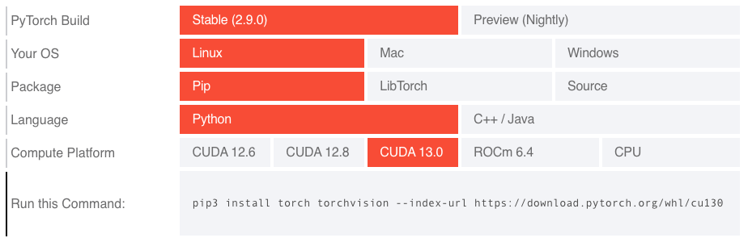

PEP: 817
Title: Wheel Variants: Beyond Platform Tags
Author: Jonathan Dekhtiar <jonathan@dekhtiar.com>,
        Michał Górny <mgorny@quansight.com>,
        Konstantin Schütze <konstin@mailbox.org>,
        Ralf Gommers <ralf.gommers@gmail.com>,
        Andrey Talman <atalman@meta.com>,
        Charlie Marsh <charlie@astral.sh>,
        Michael Sarahan <msarahan@gmail.com>,
        Eli Uriegas <eliuriegas@meta.com>,
        Barry Warsaw <barry@python.org>,
        Donald Stufft <donald@stufft.io>,
        Andy R. Terrel <andy.terrel@gmail.com>
Discussions-To: Pending
Status: Draft
Type: Standards Track
Topic: Packaging
Created: 10-Dec-2025
Post-History:

Abstract
========

The Python wheel packaging format uses
:doc:`packaging:specifications/platform-compatibility-tags` to specify
a given wheel's supported environments. These tags are unable to express
features of modern hardware configurations, such as the availability of
GPU acceleration, or to provide custom package variants, such as builds
against different dependency ABIs. This is particularly challenging for
the scientific computing, artificial intelligence (AI), machine learning
(ML), and high-performance computing (HPC) communities.

This PEP proposes "Wheel Variants", an extension to the
:doc:`packaging:specifications/binary-distribution-format`.  This
extension introduces a mechanism for package maintainers to declare
multiple build variants for the same package version, while allowing
installers to automatically select the most appropriate variant based on
system hardware and software characteristics. More specifically, it
proposes:

- An evolution of the wheel format called **Wheel Variant** that allows
  wheels to be distinguished by hardware or software attributes.

- A **variant provider plugin** interface that allows installers to
  dynamically detect platform attributes and select the most suitable
  wheel.

The goal is for a familiar ``[uv] pip install <package>`` to provide
the best user experience.

Motivation
==========

The Python packaging ecosystem has evolved to support increasingly
diverse computing environments. The current software ecosystem often
relies on platform-specific features to determine which binaries are
compatible with a particular machine. Unfortunately the current wheel
format cannot adequately express the diversity of features present
in modern hardware.

For example, packages such as `PyTorch <https://pytorch.org/>`_ need to
be built for specific CUDA or ROCm versions, and that information cannot
currently be included in the wheel tag. Having to build multiple wheels
targeting very different hardware configurations forces maintainers into
various distribution strategies that are suboptimal, and create friction
for users and authors of other software who wish to depend on the
package in question.

A few existing approaches are explored in the subsequent subsections.
These include maintaining separate package indexes for different
hardware configurations, bundling all potential variants into a single
wheel of considerable size, or using separate package names
(``mypackage-gpu``, ``mypackage-cpu``, etc.). Each of these approaches
has significant drawbacks.

According to the `2024 Python Developers Survey
<https://lp.jetbrains.com/python-developers-survey-2024/#purposes-for-using-python>`__,
a significant portion of respondents over the last years have been
successively using Python for scientific computing purposes, covering
such areas as Data analysis (steadily over 40% respondents), Machine
learning (grown to 40% in 2024) and Data engineering (around 30%).
Many of these use cases are directly impacted by suboptimal
packaging.

This issue is often crossing the boundaries of scientific computing.
Wheels currently cannot express more specific CPU requirements, forcing
the maintainers to build and ship only for the oldest CPU baseline they
wish to support. Newer CPU features are sometimes utilized through
runtime dispatching, but for example this does not let software benefit
from the performance improvements related to auto-vectorization for
x86-64-v4 CPUs.

As illustrated by `archspec <https://github.com/archspec/archspec>`_,
the ability to optimize a package for a specific architecture can lead
to significant performance improvement.

    .. figure:: pep-0817/avx512_gromacs_benchmark.svg
        :alt: A bar graph comparing GROMACS performance (in ns/day) with
              various targets. The first two bars are labeled "yum
              (2018.8)" and "generic (SSE2)", reach about 1.0 ns/day and
              are both marked as "SSE2". The next bar is labeled
              "ivybridge" ("AVX") and reaches almost 1.5 ns/day.  Two
              following bars are labeled "haswell" and "broadwell" (both
              "AVX2") and exceed 1.5 ns/day slightly.  The last two bars
              are labeled "skylake_avx512" and "cascadelake" (both
              "AVX512") and reach almost 2.0 ns/day.

        Performance of GROMACS 2020.1 built for different generations of
        CPUs.  Vertical axis shows performance expressed in ns/day, a
        GROMACS-specific measure of simulation speed (higher is better).

    Compiling `GROMACS <https://www.gromacs.org/>`_ for architectures
    that can exploit the AVX-512 instructions supported by the Intel
    Cascade Lake microarchitecture gives an additional 18% performance
    improvement relative to using AVX2 instructions, with a speedup of
    about 70% compared to a generic GROMACS installation with only SSE2.

    — `archspec: A library for detecting, labeling, and reasoning about
    microarchitectures
    <https://tgamblin.github.io/pubs/archspec-canopie-hpc-2020.pdf>`__

The limitations of platform compatibility tags
----------------------------------------------

The current wheel format encodes compatibility through three platform
tags:

1. **Python tag**: encoding the minimum Python version and optionally
   restricting Python distributions (e.g., ``py3`` for any Python 3,
   ``py313`` for Python 3.13 or newer, ``cp313`` for specifically
   CPython, 3.13 or newer).
2. **ABI tag**: encoding the Python ABI required by any extension
   modules (e.g., ``none`` for no requirement, ``abi3`` for the CPython
   stable ABI, ``cp313`` for extensions requiring CPython 3.13 ABI).
3. **Platform tag**: currently encoding the operating system,
   architecture and core system libraries (e.g., ``any`` for any
   platform, ``manylinux_2_34_x86_64`` for x86-64 Linux system with
   glibc 2.34 or newer, ``macosx_14_0_arm64`` for arm64 macOS 14.0
   or newer system.

While these tags effectively handle traditional compatibility
dimensions, they cannot express modern requirements:

**GPU Accelerated Frameworks:** A wheel filename like
``torch-2.9.0-cp313-cp313-manylinux_2_28_x86_64.whl`` provides no
indication whether it supports NVIDIA CUDA, AMD ROCm,
Intel XPU, or is CPU-only. Users cannot determine compatibility
with their GPU hardware or drivers.

**CPU Instruction Sets:** A wheel filename like
``numpy-2.3.2-cp313-cp313-manylinux_2_27_x86_64.manylinux_2_28_x86_64.whl``
provides no indication whether it uses optimized instructions
for modern processors with AVX512, SHA-NI, and other specialized
instruction sets. Packages cannot indicate whether they
require specific CPU baseline. This forces maintainers to either use
inconvenient runtime dispatching, or rely on the lowest common
denominator, leaving performance improvements on the table.

**Runtime Dependencies:** Scientific computing packages often depend on
specific BLAS implementations (OpenBLAS vs Intel MKL), MPI providers
(OpenMPI vs MPICH), or other system libraries that affect both
functionality and performance. The current wheel format is not able to
encode that dependency.

This lack of flexibility has led many projects to find sub-optimal - yet
necessary - workarounds, such as the manual installation command
selector provided by the PyTorch team. This complexity represents a
fundamental scalability issue with the current tag system.

This problem is not unique to PyTorch. Projects like `JAX
<https://docs.jax.dev/en/latest/>`_, `NumPy <https://numpy.org/>`_,
`SciPy <https://scipy.org/>`_, `scikit-learn
<https://github.com/scikit-learn/scikit-learn>`_ and many others in the
scientific Python ecosystem face
similar hurdles. The core issue is that wheel tags are not extensible
enough to handle the combinatorial complexity of build options. Wheel
variants can capture GPU compatibility in wheel metadata and select
the correct wheel at install time.

Current workarounds and their limitations
-----------------------------------------

Separate package indexes as variants
''''''''''''''''''''''''''''''''''''

Projects such as `PyTorch <https://pytorch.org/get-started/locally/>`__
and `RAPIDS <https://docs.rapids.ai/install/#selector>`__
currently distribute packages that approximate "variants" through
separate package indexes with custom URLs. We will use the
example of PyTorch, while the problem, the workarounds and the impact
for users also apply to other packages.

          provide the choice of PyTorch Build (stable or nightly),
          operating system (Linux, Mac, Windows), package (Pip,
          LibTorch, Source), language (Python, C++ / Java), and Compute
          Platform (CUDA 12.6, CUDA 12.8, CUDA 13.0, ROCM 6.4, CPU).
          Below these rows, the pip install command for the selected
          variant is provided, utilizing the --index-url parameter.

    The PyTorch install selector
    (https://pytorch.org/get-started/locally/, captured 22-Aug-2025)

PyTorch uses a combination of index URLs per accelerator type and local
version segments as accelerator tag (such as ``+cu130``, ``+rocm6.4`` or
``+cpu``) . Users need to first determine the correct index URL for
their system, and add an index specifically for PyTorch.

.. code:: bash

    pip install torch --index-url https://download.pytorch.org/whl/cu129

Tools need to implement special handling for the way PyTorch uses local
version segments. These requirements break the pattern that packages
are usually installed with. Problems with installing PyTorch
are a very common point of user confusion. To quantify this, on
2025-12-05, 552 out of 8136, or 6.8%, of issues on `uv's issue tracker
<https://github.com/astral-sh/uv/issues/>`__ contained the term "torch".

Wheel variants remove this special casing and make GPU and TPU packages
work just as well as regular packages with native code. They also reduce
the burden on the maintainers to run separate infrastructure and to find
and use non-standard features such as local version segments present on
an index.

**Induced Security Risk:** This approach has unfortunately led to supply
chain attacks - more details on the `PyTorch Blog
<https://pytorch.org/blog/compromised-nightly-dependency/>`__. It's a
non-trivial problem to address which has forced the PyTorch team to
create a complete mirror of all their dependencies, and is one of the
core motivations behind :pep:`766`.

The complexity of configuration often leads to projects providing ad-hoc
installation instructions rather than covering permanent settings. This
can lead to users being unable to cleanly upgrade the packages, or the
upgraded packages being reverted to the default variant on subsequent
upgrades.

Package names as variants
'''''''''''''''''''''''''

Packages such as `XGBoost
<https://xgboost.readthedocs.io/en/stable/install.html>`__ use different
package names to approximate variants:

.. code:: bash

    pip install xgboost      # NVIDIA GPU variant
    pip install xgboost-cpu  # CPU-only variant

Maintainers of other software cannot express that they depend on either
of the available variants being selected. They need to
either depend on a specific variant, provide multiple alternative
dependency sets using extras, or even publish their own software using
multiple package names matching upstream variants.

Commonly, these packages install overlapping files. Since Python
packaging does not support expressing that two packages are mutually
exclusive, installers can install both of them to the same environment,
with the package installed second overwriting files from the one
installed first. This leads to runtime errors, and
the possibility of incidentally switching between variants depending on
the way package upgrades are ordered.

An additional limitation of this approach is that publishing a new
release synchronously across multiple package names is not currently
possible.  :pep:`694` proposes adding such a mechanism for multiple
wheels within a single package, but extending it to multiple packages is
not a goal.

**Induced Security Risk:** proliferation of suffixed variant packages
leads users to expect these suffixes in other packages, making name
squatting much easier. For example, one could create a malicious
``numpy-cuda`` package that users will be lead to believe it's a CUDA
variant of NumPy.

`CuPy <https://cupy.dev/>`_ had to build
a total of 52 different packages - all with different names - which
clearly highlights the limit of such an approach. End users need to
carefully read the CuPy installation documentation to figure out
which package they need. Continuously having to create new PyPI
packages, request increasing limits and keep the build infrastructure
and documentation in sync, requires significant effort from software
maintainers.

.. code:: text

    cupy-cuda70 cupy-cuda75 cupy-cuda80 cupy-cuda90 cupy-cuda91
    cupy-cuda92 cupy-cuda100 cupy-cuda101 cupy-cuda102 cupy-cuda110
    cupy-cuda111 cupy-cuda112 cupy-cuda113 cupy-cuda114 cupy-cuda115
    cupy-cuda116 cupy-cuda117 cupy-cuda118 cupy-cuda119 cupy-cuda11x
    cupy-cuda120 cupy-cuda121 cupy-cuda122 cupy-cuda123 cupy-cuda124
    cupy-cuda125 cupy-cuda126 cupy-cuda127 cupy-cuda128 cupy-cuda129
    cupy-cuda12x cupy-cuda13x
    cupy-rocm-4-0 cupy-rocm-4-1 cupy-rocm-4-2 cupy-rocm-4-3
    cupy-rocm-4-4 cupy-rocm-4-5 cupy-rocm-5-0 cupy-rocm-5-1
    cupy-rocm-5-2 cupy-rocm-5-3 cupy-rocm-5-4 cupy-rocm-5-5
    cupy-rocm-5-6 cupy-rocm-5-7 cupy-rocm-5-8 cupy-rocm-5-9
    cupy-rocm-6-0 cupy-rocm-6-1 cupy-rocm-6-2 cupy-rocm-6-3

Extra-Dependency as variants
''''''''''''''''''''''''''''

`JAX <https://docs.jax.dev/en/latest/installation.html>`__ uses a
plugin-based approach. The central ``jax`` package provides a number of
extras that can be used to install additional plugins,
e.g. ``jax[cuda12]`` or ``jax[tpu]``. This is far from ideal as
``pip install jax`` (with no extra) leads to a nonfunctional
installation, and consequently dependency chains, a fundamental expected
behavior in the Python ecosystem, are dysfunctional.

JAX includes 12 extra selectors to cover all use cases - many of which
overlap and could be misleading to users if they don't read the
documentation in detail.

It should be noted that most of these "extras" are technically mutually
exclusive, though it is currently impossible to correctly express this
within the package metadata.

.. code:: email

    Provides-Extra: minimum-jaxlib
    Provides-Extra: cpu
    Provides-Extra: ci
    Provides-Extra: tpu
    Provides-Extra: cuda
    Provides-Extra: cuda12
    Provides-Extra: cuda13
    Provides-Extra: cuda12-local
    Provides-Extra: cuda13-local
    Provides-Extra: rocm
    Provides-Extra: k8s
    Provides-Extra: xprof

Bundled universal packages - monolithic builds
''''''''''''''''''''''''''''''''''''''''''''''

Including all possible variants in a single wheel is another option, but
this leads to excessively large artifacts, wasting bandwidth and leading
to slower installation times for users who only need one specific
variant. In some cases, such artifacts cannot be hosted on PyPI because
they exceed its size limits.

Wheel variant selection via source distribution
'''''''''''''''''''''''''''''''''''''''''''''''

`FlashAttention <https://github.com/Dao-AILab/flash-attention>`__ does
not publish wheels on PyPI at all, but instead publishes a customized
source distribution that performs platform detection, downloads the
appropriate wheel from an upstream server, and then provides it to the
installer. This approach can select the optimal variant automatically,
but it prevents binary-only installs from working, requires a slow and
error-prone build via a source distribution, and breaks common caching
assumptions tied to the wheel filename. It also requires a specially
prepared build environment that contains the ``torch`` package matching
the version that the software will run against, which requires building
without build isolation. On the project side, it requires hosting wheels
separately.

**Induced Security Risk:** Similar to regular source builds, this
model requires running arbitrary code at install time. The wheels
are downloaded entirely outside package manager's control, extending
the attack surface to two separate wheel download implementations and
preventing proper provenance tracking.

Ecosystem fragmentation
'''''''''''''''''''''''

The lack of standardized variant support has led to ecosystem
fragmentation:

**Inconsistent User Experience**: Each package uses different
installation methods, creating confusion and reducing discoverability.

**Development Tool Complications**: Installation tools, IDEs, and CI/CD
systems struggle to handle non-standard installation requirements.

**Error-proneness**: The established workarounds are often error-prone,
and in the past they have lead to issues such as downloading incorrect
artifacts.

Impact on scientific computing and AI/ML workflows
--------------------------------------------------

The packaging limitations particularly affect scientific computing and
AI/ML applications where performance optimization is critical:

    The current wheel format's lack of hardware awareness creates a
    suboptimal experience for hardware-dependent packages. While plugins
    help with smaller and well scoped packages, users must currently
    manually identify the correct variant (e.g., ``jax[cuda13]``) to
    avoid generic defaults or incompatible combinations. We need a
    system where ``pip install jax`` automatically selects packages
    matching the user's hardware, unless explicitly overridden.

    Wheel variants are a clear step in the right direction in this
    regard.

    — Michael Hudgins, JAX_ Developer Infrastructure Lead

They affect everyone from package authors to end users of all skill
levels, including students, scientists and engineers:

    Accessing compute to run models and process large datasets has been
    a pain point in scientific computing for over a decade. Today,
    researchers and data scientists still spend hours to days installing
    core tools like PyTorch before they can begin their work. This
    complexity is a significant barrier to entry for users who want to
    use Python in their daily work. The WheelNext Wheel Variants
    proposal offers a pathway to address persistent installation and
    compute-access problems within the broader packaging ecosystem
    without creating another, new and separate solution. Let's focus on
    the big picture of enhancing user experience - it will make a real
    difference.

    — Leah Wasser, Executive Director and Founder of `pyOpenSci
    <https://www.pyopensci.org/>`_

Heterogeneous computing environments
''''''''''''''''''''''''''''''''''''

Research institutions and cloud providers often manage heterogeneous
computing clusters with different architectures (CPU, Hardware
accelerators, ASICS, etc.). The current system requires
environment-specific installation procedures, making reproducible
deployment difficult. This situation also contributes to making
"scientific papers" difficult to reproduce. Application authors focused
on improving that are hindered by the packaging hurdles too:

    We've been developing a package manager for Spyder, a Python IDE for
    scientists, engineers and data analysts, with three main aims.
    First, to make our users' life easier by allowing them to create
    environments and install packages using a GUI instead of introducing
    arcane commands in a terminal. Second, to make their research code
    reproducible, so they can share it and its dependencies with their
    peers. And third, to allow users to transfer their code to machines
    in HPC clusters or the cloud with no hassle, so they can leverage
    the vast compute resources available there. With the improvements
    proposed by this PEP, we'd be able to make that a reality for all
    PyPI users because installing widely used scientific libraries (like
    PyTorch and CuPy) for the right GPU and instruction set and would be
    straightforward and transparent for tools built on top of uv/pip.

    — Carlos Córdoba, lead developer of the `Spyder IDE
    <https://www.spyder-ide.org/>`_

Artificial intelligence, machine learning, and deep learning
''''''''''''''''''''''''''''''''''''''''''''''''''''''''''''

The recent advances in modern AI workflows increasingly rely on GPU
acceleration, but the current packaging system makes deployment complex
and adds a significant burden on open source developers of the entire
tool stack (from build backends to installers, not forgetting the
package maintainers).

    PyTorch's extensive wheel support was always state of the art and
    provided hardware accelerator support from day zero via our `package
    selector <https://pytorch.org/get-started/locally/>`__. We believe
    this was always a superpower of PyTorch to get things working out of
    the box for our users. Unfortunately, the infrastructure supporting
    these is very complex, hard to maintain and inefficient (for us, our
    users and package repositories).

    With the number of hardware we support growing rapidly again, we are
    very supportive of the wheel variants efforts that will allow us to
    get PyTorch install instructions to be what our users have been
    expecting since PyTorch was first released: ``pip install torch``

    — The PyTorch_ Core Maintainers

The lead maintainer of `XGBoost <https://xgboost.ai/>`_ enumerates a
number of problems XGBoost has that he expects will be addressed by
wheel variants:

    * Large download size, due to the use of "fat binaries" for multiple
      SMs [GPU targets]. Currently, XGBoost builds for 11 different SMs.

    * The need for a separate packaging name for CPU-only package.
      Currently we ship a separate package named ``xgboost-cpu``,
      requiring users to maintain separate ``requirements.txt`` files.
      See `xgboost#11632
      <https://github.com/dmlc/xgboost/issues/11632>`_ for an example.

    * Complex dispatching logic for multiple CUDA versions. Some
      features of XGBoost require new CUDA versions (12.5 or 12.8),
      while the XGBoost wheel targets 12.0. As a result, we maintain a
      fairly complex dispatching logic to detect CUDA and driver
      versions at runtime. Such dispatching logic should be best
      implemented in a dedicated piece of software like the NVIDIA
      provider plugin, so that the XGBoost project can focus on its core
      mission.

    * Undefined behavior due to presence of multiple OpenMP runtimes.
      XGBoost is installed in a variety of systems with different OpenMP
      runtimes (or none at all). So far, XGBoost has been vendoring a
      copy of OpenMP runtime, but this is increasingly untenable. Users
      get undefined behavior such as crashes or hangs when multiple
      incompatible versions of OpenMP runtimes are present in the
      system. (This problem was particularly bad on MacOS, so much so
      that the MacOS wheel for XGBoost no longer bundles OpenMP.)

    — Philip Hyunsu Cho, a lead maintainer of XGBoost_

The potential for improvement can be summarized as:

    This PEP is a significant step forward in improving the deployment
    challenges of the Python ecosystem in the face of increasingly
    complex and varied hardware configurations. By enabling multiple
    deployment targets for the same libraries in a standard way, it will
    consolidate and simplify many awkward and time-consuming
    work-arounds developers have been pursuing to support the rapidly
    growing AI/ML and scientific computing worlds.

    — Travis Oliphant, the author of NumPy_ and SciPy_ and Chief AI
    Architect at OpenTeams

Motivation summary
------------------

As highlighted in the previous section, the current Python packaging
system cannot adequately serve the needs of modern heterogeneous
computing environments. These aforementioned limitations force package
authors into complex workarounds that create friction for users,
increase maintenance burden, and fragment the ecosystem.

**Wheel Variants provide a standardized solution that:**

- Enables automatic hardware-appropriate package selection.
- Maintains full backward compatibility with existing tools (i.e.,
  non-variant aware installers, tools, and indexes remain unaffected).
- Simplifies package maintenance by offering a unified and flexible
  solution to the challenge of managing multiple platform-specific
  package builds and distributions.
- Provides a seamless and predictable experience for users, with
  little-to-no user input required.
- Supports the full spectrum of modern computing hardware.
- Provides a future-proof and flexible system that can evolve with the
  ecosystem and future use cases.

Out-of-scope features
---------------------

This PEP tries to present the minimal scope required and leaves aspects
to tools to evolve. A non-exhaustive list:

- The format of a static file to select variants deterministically or
  include variants in a ``pylock.toml`` file,
- The list of variant providers that are vendored or re-implemented by
  installers,
- The specific opt-in mechanisms and UX for allowing an installer to run
  non-vendored variant providers,
- How to instruct build backends to emit variants through the :pep:`517`
  mechanism.

Prior art
---------

This problem is not unique to the Python ecosystem, different groups and
ecosystems have come up with various answers to that very problem. This
section will focus on highlighting the strengths and weaknesses of the
different approaches taken by various communities.

Conda - conda-forge
'''''''''''''''''''

`Conda <https://docs.conda.io>`__ is a binary-only package ecosystem
that uses aggregated metadata indexes for resolution rather than
filename parsing. Unlike the
:doc:`packaging:specifications/simple-repository-api`, conda's
resolution relies on `repodata indexes per platform
<https://docs.conda.io/projects/conda-build/en/stable/concepts/generating-index.html>`__
containing full metadata, making filenames purely identifiers with no
parsing requirements.

**Variant System**: In `2016-2017
<https://www.anaconda.com/blog/package-better-conda-build-3>`__,
conda-build introduced variants to differentiate packages with identical
name/version but different dependencies.

.. code:: bash

    pytorch-2.8.0-cpu_mkl_py313_he1d8d61_100.conda      # CPU + MKL variant
    pytorch-2.8.0-cuda128_mkl_py313_hf206996_300.conda  # CUDA 12.8 + MKL variant
    pytorch-2.8.0-cuda129_mkl_py313_he100a2c_300.conda  # CUDA 12.9 + MKL variant

A hash (computed from variant metadata) prevents filename collisions;
actual variant selection happens via standard dependency constraints in
the solver. No special metadata parsing is needed—installers simply
resolve dependencies like:

.. code:: bash

    conda install pytorch mkl

**Mutex Metapackages**: Python metadata and conda metadata do not have
good ways to express ideas like "this package conflicts with that one."
The main mechanism for enforcement is sharing a common package name -
only one package with a given name can exist at one time. Mutex
metapackages are sets of packages with the same name, but different
build string. Packages depend on specific mutex builds (e.g.,
``blas=*=openblas`` vs ``blas=*=mkl``) to avoid problems with related
packages using different dependency libraries, such as NumPy_ using
`OpenBLAS <https://www.openmathlib.org/OpenBLAS/>`_ and SciPy_ using
`MKL
<https://www.intel.com/content/www/us/en/developer/tools/oneapi/onemkl.html>`_.

**Example software variants**:
`BLAS <https://conda-forge.org/docs/maintainer/knowledge_base/#blas>`__,
`MPI
<https://conda-forge.org/docs/maintainer/knowledge_base/#message-passing-interface-mpi>`__,
`OpenMP
<https://conda-forge.org/docs/maintainer/knowledge_base/#openmp>`__,
`noarch vs native
<https://conda-forge.org/blog/2024/10/15/python-noarch-variants/>`__

**Virtual Packages**: `Introduced in 2019
<https://github.com/conda/conda/pull/8267>`__, virtual packages inject
system detection (CUDA version, glibc, CPU features) as solver
constraints. Built packages express dependencies like ``__cuda >=12.8``,
and the installer verifies compatibility at install time. Current
virtual packages include ``archspec`` (CPU capabilities), OS/system
libraries, and CUDA driver version. Detection logic is tool-specific
(`rattler
<https://github.com/conda/rattler/tree/main/crates/rattler_virtual_packages/src>`__,
`mamba
<https://github.com/mamba-org/mamba/blob/main/libmamba/src/core/virtual_packages.cpp>`__).

Spack / Archspec
''''''''''''''''

`archspec <https://github.com/archspec/archspec>`_ is a library for
detecting, labeling, and reasoning about CPU microarchitecture variants,
developed for the `Spack <https://spack.io/>`_ package manager.

**Variant Model:** CPU Microarchitectures (e.g., ``haswell``,
``skylake``, ``zen2``, ``armv8.1a``) form a `Directed Acyclic Graph
(DAG) encoding binary compatibility
<https://tgamblin.github.io/pubs/archspec-canopie-hpc-2020.pdf>`__,
which helps at resolve to express that ``packageB`` depends on
``packageA``. The ordering is partial because (1) separate ISA families
are incomparable, and (2) contemporary designs may have incompatible
feature sets—cascadelake and cannonlake are incomparable despite both
descending from skylake, as each has unique AVX-512 extensions.

**Implementation:** A language-agnostic JSON database stores
microarchitecture metadata (features, compatibility relationships,
compiler-specific optimization flags). Language bindings provide
detection (queries ``/proc/cpuinfo``, matches to microarchitecture with
largest compatible feature subset) and compatibility comparison
operators.

**Package Manager Integration:** Spack records target microarchitecture
as package provenance (``spack install fftw target=broadwell``),
automatically selects compiler flags, and enables
microarchitecture-aware binary caching. The `European Environment for
Scientific Software Installations (EESSI)
<https://onlinelibrary.wiley.com/doi/full/10.1002/spe.3075>`__
distributes optimized builds in separate subdirectories per
microarchitecture (e.g., ``x86_64``, ``armv8.1a``, ``haswell``);
runtime initialization uses ``archspec`` to select best compatible build
when no exact match exists.

Gentoo Linux
''''''''''''

`Gentoo Linux <https://www.gentoo.org>`_ is a source-first distribution
with support for extensive package customization. This is primarily
achieved via `USE flags
<https://devmanual.gentoo.org/general-concepts/use-flags/index.html>`__:
boolean flags exposed by individual packages and permitting fine-tuning
the enabled features, optional dependencies and some build parameters
(e.g. ``jpegxl`` for JPEG XL image format support,
``cpu_flags_x86_avx2`` for AVX2 instruction set use). Flags can be
toggled individually, and separate binary packages can be built for
different sets of flags. The package manager can either pick a binary
package with matching configuration or build from source.

API and ABI matching is primarily done through use of `slotting
<https://devmanual.gentoo.org/general-concepts/slotting/index.html>`__.
Slots are generally used to provide multiple versions or variants of
given package that can be installed alongside (e.g. different major GTK+
or LLVM versions, or GTK+3 and GTK4 builds of WebKitGTK), whereas
subslots are used to group versions within a slot, usually corresponding
to the library ABI version. Packages can then declare dependencies bound
to the slot and subslot used at build time. Again, separate binary
packages can be built against different dependency slots. When
installing a dependency version falling into a different slot or
subslot, the package manager may either replace the package needing that
dependency with a binary packages built against the new slot, or rebuild
it from source.

Normally, the use of slots assumes that upgrading to the newest version
possible is desirable. When more fine-grained control is desired, slots
are used in conjunction with USE flags. For example,
``llvm_slot_{major}`` flags are used to select a LLVM major version to
build against.

Rationale
=========

Modified wheel filename
-----------------------

One of the core requirements of the design is to ensure that installers
predating this PEP will ignore wheel variant files. This makes it
possible to publish both variant wheels and non-variant wheels on a
single index, with installers that do not support variants securely
ignoring the former, and falling back to the latter.

A variant label component is added to the filename for the twofold
purpose of providing a unique mapping from the filename to a set of
variant properties, and providing a human-readable identification for
the variant. The label is kept short and lowercase to avoid issues with
different filesystems. It is added as a ``-``-separated component at the
end to ensure that the existing filename validation algorithms reject
it:

- If both the build tag and the variant label are present, the filename
  contains too many components.

  Example:
  ``numpy-2.3.2-1-cp313-cp313t-musllinux_1_2_x86_64-x86_64_v3.whl``

- If only the variant label is present, the Python tag at third position
  will be misinterpreted as a build number. Since the build number must
  start with a digit and no Python tags at the time start with digits,
  the filename is considered invalid.

  Example:
  ``numpy-2.3.2-cp313-cp313t-musllinux_1_2_x86_64-x86_64_v3.whl``

This behavior was confirmed for a number of existing tools:
`auditwheel
<https://github.com/pypa/auditwheel/blob/6839107e9b918e035ab2df4927a25a5f81f1b8b6/src/auditwheel/repair.py#L61-L64>`__,
`packaging
<https://github.com/pypa/packaging/blob/78c2a5e4f5c04fd782a5729d93892c3a3eafe365/src/packaging/utils.py#L94-L134>`__,
`pdm
<https://github.com/pdm-project/pdm/blob/66c86908c9b9d07ad8d101d07879d69a55de5c54/src/pdm/models/requirements.py#L259-L286>`__,
`pip
<https://github.com/pypa/pip/blob/c46141c29c3646a3328bc4e51d354cc732fb1432/src/pip/_internal/models/wheel.py#L38-L46>`__,
`poetry
<https://github.com/python-poetry/poetry/blob/1c04c65149776ae4993fa508bef53373f45c66eb/src/poetry/utils/wheel.py#L23-L27>`__,
`uv
<https://github.com/astral-sh/uv/blob/f6a9b55eb73be4f1fb9831362a192cdd8312ab96/crates/uv-distribution-filename/src/wheel.rs#L182-L299>`__.

Variant properties system
-------------------------

Variant properties serve the purpose of expressing the characteristics
of the variant. Unlike platform compatibility tags, they are stored in
the variant metadata and therefore do not affect the wheel filename
length. They follow a hierarchical key-value design, with the key
further broken into a namespace and a feature name.  Namespaces are used
to group features defined by a single provider, and to avoid conflicts
should multiple providers define a feature with the same name. This
permits independent governance and evolution of every namespace.

The keys are restricted to lowercase letters, digits and underscores.
Uppercase characters are disallowed to avoid different spellings of the
same name. The character set for values is more relaxed, to permit
values resembling versions.

Variant features can be declared as allowing multiple values to be
present within a single variant wheel. If that is the case, these values
are matched as a logical disjunction, i.e. only a single value needs to
be compatible with the system for the wheel to be considered supported.
On the other hand, features are treated conjunctively, i.e. all of them
need to be compatible. This provides some flexibility in designating
variant compatibility while avoiding having to implement a complete
boolean logic.

Variant properties are serialized into a structured 3-tuple format
inspired by Trove Classifiers in :pep:`301`:

::

    {namespace} :: {feature_name} :: {feature_value}

Null variant
------------

The concept of a null variant makes it possible to distinguish a
fallback wheel variant from a regular wheel published for backwards
compatibility. For example, a package that features optional GPU support
could publish the following wheels during the transition period:

- One or more wheel variants built for specific hardware, that will be
  installed on systems with an installer supporting variants and
  suitable hardware.

- A CPU-only null variant, that will be installed on systems with an
  installer supporting variants, but without hardware suitable for any
  other variants.

- A GPU+CPU regular wheel, that will be installed on systems without an
  installer supporting variants.

Notably, this makes it possible to publish a smaller null variant for
systems that do not feature suitable hardware, with a fallback regular
wheel with support for CPU and all GPUs for systems where variants are
not supported and therefore GPU support cannot be determined.

Publishing a null variant is optional. If one is published, a wheel
variant-enabled installer will prefer it over the non-variant wheel. If
it is not, it will fall back to the non-variant wheel instead. The
non-variant wheel is also used if variant support is explicitly disabled
by an installer flag.

The null variant uses a reserved ``null`` label to make it clearly
distinguishable from regular variants.

Install-time and Ahead-of-Time providers
----------------------------------------

The specification covers two related use cases for package variants:

1. Variants that need to query the user system to determine their
   compatibility with it. For example, these are the variants utilizing
   GPUs or requiring CPU instruction sets beyond what platform tags
   provide.

2. Variants that can always be installed, and therefore only provide a
   choice between different installation options. For example, software
   built against different BLAS / LAPACK providers or debug builds of
   packages.

The first class of variants requires querying provider plugins to
determine package compatibility, and therefore involves the potential
risks highlighted in the `security implications`_ section. The proposed
mitigations incur a cost on installer implementations, making it
desirable to avoid plugin use at install time for the second class of
variants, where it is not strictly necessary.

To account for this, the specification proposes two classes of
providers:

a. Install-time providers that require executing code to determine
   the wheel compatibility, and therefore satisfy the variants needing
   that.

b. Ahead-of-Time (AoT) providers that entirely rely on static metadata
   for the purpose of wheel selection, and that can be used for the
   other class of variants to avoid the additional problems posed
   by install-time providers.

For user convenience and better consistency across different packages,
AoT providers can also feature plugin packages, but they are only used
at build time (where executing code from additional packages is already
a risk) to verify the variant properties specified by the maintainer
and automatically generate the static metadata.

Both kinds of provider plugins expose the same API. However, an AoT
provider must always consider all valid variant properties supported,
and it must always return the same ordered list of supported properties
irrespective of the user system. All AoT providers can be technically
used as install-time providers, but not the other way around.

Plugin stability and versioning
-------------------------------

Given that calling provider plugins may be necessary while installing
variant wheels published in the past, it is important that provider
plugin behavior remain stable within their lifetime. Ideally, no
properties previously supported should ever be removed.

If a breaking change needs to be performed, it is recommended to either
introduce a new provider package for that, or add a new plugin API
endpoint to the existing package. In both cases, it may be necessary to
preserve the old endpoint in minimal maintenance mode, to ensure that
old wheels can still be installed. The old endpoint can trigger
deprecation warnings in the ``get_all_configs()`` hook that is used when
building packages.

An alternative approach is to use semantic versioning to cut off
breaking changes. However, this relies on package authors reliably using
caps on dependencies, as otherwise old wheels will start using
incompatible plugin versions. This is already a problem with Python
build backends used today.

When vendoring or reimplementing plugins, installers need to follow
their current behavior. In particular, they should recognize the
relevant provider versions numbers, and possibly fall back to installing
the external plugin when the package in question is incompatible with
the installer's implementation.

Example use cases
-----------------

PyTorch CPU/GPU variants
''''''''''''''''''''''''

As of October 2025, `PyTorch
<https://pytorch.org/get-started/locally/>`__ publishes builds a total
of seven variants for every release: a CPU-only variant, three CUDA
variants with different minimal CUDA runtime versions and supported
GPUs, two ROCm variants and a Linux XPU variant.

This setup could be improved using GPU/XPU plugins that query the
installed runtime version and installed GPUs/XPUs to filter out the
wheels for which the runtime is unavailable, it is too old or the user's
GPU is not supported, and order the remaining variants by the runtime
version.  The CPU-only version is published as a null variant that is
always supported.

If a GPU runtime is available and supported, the installer automatically
chooses the wheel for the newest runtime supported. Otherwise, it falls
back to the CPU-only variant. In the corner case when multiple
accelerators are available and supported, PyTorch package maintainers
indicate which one takes preference by default.

Optimized CPU variants
''''''''''''''''''''''

Wheel variants can be used to provide variants requiring specific CPU
extensions, beyond what platform tags currently provide. They can be
particularly helpful when runtime dispatching is impractical, when the
package relies on prebuilt components that use instructions above the
baseline, when availability of instruction sets implies library ABI
changes, or simply to benefit from compiler optimizations such as
auto-vectorization applied across the code base.

For example, an x86-64 CPU plugin can detect the capabilities for the
installed CPU, mapping them onto the appropriate x86-64 architecture
level and a set of extended instruction sets. Variant wheels indicate
which level and/or instruction sets are required. The installer filters
out variants that do not meet the requirements and select the best
optimized variant.  A non-variant wheel can be used to represent the
architecture baseline, if supported.

Implementation using wheel variants makes it possible to provide
fine-grained indication of instruction sets required, with plugins that
can be updated as frequently as necessary. In particular, it is neither
necessary to cover all available instruction sets from the start, nor to
update the installers whenever the instruction set coverage needs to be
improved.

BLAS / LAPACK variants
''''''''''''''''''''''

Packages such as NumPy_ and SciPy_ can be built using different BLAS /
LAPACK libraries. Users may wish to choose a specific library for
improved performance on a particular hardware, or based on license
considerations.  Furthermore, different libraries may use different
OpenMP implementations, whereas using a consistent implementation across
the stack can avoid degrading performance through spawning too many
threads.

BLAS / LAPACK variants do not require a plugin at install time, since
all variants built for a particular platform are compatible with it.
Therefore, an ahead-of-time provider (with ``install-time = false``)
that provides a predefined set of BLAS / LAPACK library names can be
used. When the package is installed, normally the default variant is
used, but the user can explicitly select another one.

Debug package variants
''''''''''''''''''''''

A package may wish to provide a special debug-enabled builds for
debugging or CI purposes, in addition to the regular release build. For
this purpose, an optional ahead-of-time provider can be used
(``install-time = false`` with ``optional = true``), defining a custom
property for the debug builds. Since the provider is disabled by
default, users normally install the non-variant wheel providing the
release build. However, they can easily obtain the debug build by
enabling the optional provider or selecting the variant explicitly.

Package ABI matching
''''''''''''''''''''

Packages such as `vLLM <https://docs.vllm.ai/en/latest/index.html>`_
need to be pinned to the PyTorch version they were built against to
preserve Application Binary Interface (ABI) compatibility. This often
results in unnecessarily strict pins in package versions, making it
impossible to find a satisfactory resolution for an environment
involving multiple packages requiring different versions of PyTorch, or
resorting to source builds. Variant wheels can be used to publish
variants of vLLM built against different PyTorch versions, therefore
enabling upstream to easily provide support for multiple versions
simultaneously.

The optional ``abi_dependency`` extension can be used to build multiple
``vllm`` variants that are pinned to different PyTorch versions, e.g.:

- ``vllm-0.11.0-...-torch29.wheel`` with
  ``abi_dependency :: torch :: 2.9``
- ``vllm-0.11.0-...-torch28.wheel`` with
  ``abi_dependency :: torch :: 2.8``
- ``vllm-0.11.0-...-torch27.wheel`` with
  ``abi_dependency :: torch :: 2.7``

Security implications
=====================

The proposal introduces a plugin system for querying the system
capabilities in order to determine variant wheel capability. The system
permits specifying additional Python packages providing the plugins
in the package index metadata. Installers and other tools that need
to determine whether a particular wheel is installable, or select
the most preferred variant among multiple variant wheels, may need
to install these packages and execute the code within them while
resolving dependencies or processing wheels.

This elevates the supply-chain attack potential by introducing two new
points for malicious actors to inject arbitrary code payload:

1. Publishing a version of a variant provider plugin or one of its
   dependencies with malicious code.

2. Introducing a malicious variant provider plugin in an existing
   package metadata.

While such attacks are already possible at the package dependency level,
it needs to be emphasized that in some scenarios the affected tools are
executed with elevated privileges, e.g. when installing packages for
multi-user systems, while the installed packages are only used with
regular user privileges afterwards. Therefore, variant provider plugins
could introduce a Remote Code Execution vulnerability with elevated
privileges.

A similar issue already exists in the packaging ecosystem when packages
are installed from source distributions, whereas build backends
and other build dependencies are installed and executed. However,
various tools operating purely on wheels, as well as users using
tool-specific options to disable use of source distributions,
have been relying on the assumption that no code external to the system
will be executed while resolving dependencies, installing a wheel or
otherwise processing it. To uphold this assumption, the proposal
explicitly requires that provider plugin packages are never installed
without explicit user consent.

The `Overview`_ section of the specification provides further
suggestions that aim to improve both security and the user experience.
It is expected that a limited subset of popular provider plugins will
be either vendored by the installer, eliminating the use of packages
external to the tool altogether, or pinned to specific versions,
providing the same level of code auditing as the tools themselves.
This will lead to the majority of packages focusing on these specific
plugins. External plugins requiring explicit opt-in should be rare,
minimizing the workflow disruption and reducing the risk that users
blanket-allow all plugins.

Furthermore, the specification permits using static configuration as
input to skip running plugins altogether.

Specification
=============

This PEP proposes a set of extensions to the
:ref:`packaging:binary-distribution-format` specification that enable
building additional variants of wheels that can be installed by
variant-aware tools while being ignored by programs that do not
implement this specification.

Definitions
-----------

The key words "MUST", "MUST NOT", "REQUIRED", "SHALL", "SHALL NOT",
"SHOULD", "SHOULD NOT", "RECOMMENDED", "MAY", and "OPTIONAL" in this
document are to be interpreted as described in :rfc:`2119`.

Wheel variant glossary
----------------------

This section focuses specifically on the vocabulary used by the proposed
"Wheel Variant" standard:

Variant Wheels
    Wheels that share the same distribution name, version, build number,
    and platform compatibility tags, but are distinctly identified by an
    arbitrary set of variant properties.

Variant Namespace
    An identifier used to group related features provided by a single
    provider (e.g., ``nvidia``, ``x86_64``, ``arm``, etc.).

Variant Feature
    A specific characteristic (key) within a namespace (e.g.,
    ``version``, ``avx512_bf16``, etc.) that can have one or more
    values.

Variant Property
    A 3-tuple (``namespace :: feature-name :: feature-value``)
    describing a single specific feature and its value. If a feature has
    multiple values, each is represented by a separate property.

Variant Label
    A string (up to 16 characters) added to the wheel filename to
    uniquely identify variants.

Null Variant
    A special variant with zero variant properties and the reserved
    label ``null``. Always considered supported but has the lowest
    priority among wheel variants, while being preferably chosen over
    non-variant wheels.

Variant Provider
    A provider of supported and valid variant properties for a specific
    namespace, usually in the form of a Python package that implements
    system detection.

Install-time Provider
    A provider implemented as a plugin that can be queried during wheel
    installation.

Ahead-of-Time Provider
    A provider that features a static list of supported properties which
    is then embedded in the wheel metadata.  Such a list can either be
    embedded in ``pyproject.toml`` or provided by a plugin queried at
    build time.

Overview
--------

Wheel variants introduce a more fine-grained specification of built
wheel characteristics beyond what existing wheel tags provide.
Individual wheels are characterized by sets of `variant properties`_
that are organized into a hierarchical structure of namespaces, features
and feature values.  When evaluating wheels to install, the installer
must determine whether variant properties are compatible with the
system, and perform `variant ordering`_ based on the priority of the
compatible variant properties. This is done in addition to determining
the compatibility and ordering through tags. The ordering by variant
properties takes precedence over ordering by tags.  Null variants
(variants with no variant properties) are preferred over non-variant
wheels with the same tags.

Every variant namespace is governed by a variant provider. There are two
kinds of variant providers: install-time providers and ahead-of-time
(AoT) providers. Install-time providers require plugins that are queried
while installing wheels to determine the set of supported properties and
their preference order. For AoT providers, this data is static and
embedded in the wheel; it can be either provided directly by the
wheel maintainer or queried at wheel build time from an AoT plugin. Both
kinds of plugins are usually implemented as Python packages which
implement the `provider plugin API`_.

Installers, as well as other tools that need to verify variant wheel
compatibility and are run in security-sensitive context, must not
install or run code from any untrusted package for variant resolution
without explicit user opt-in. Provider packages should take measures to
guard against supply chain attacks, for example by vendoring all
dependencies. Pinning dependencies is discouraged to comply with
:pep:`517`
build process, as provider plugins may be needed at build time and
dependencies pinned to different versions could prevent different
plugins from being installed simultaneously in the same environment.

It is recommended that these tools vendor, reimplement or lock the most
commonly used plugins to specific specific wheels after verifying
their trustworthiness, to enable the ability to securely install variant
wheels out-of-the-box. To reduce the maintenance costs, repositories of
such vetted plugins could be maintained collaboratively and shared
between different tools.

For plugins and their dependencies not in such a pre-approved list,
a trust-on-first-use mechanism for every version is recommended. In
interactive sessions, the tool can explicitly ask the user for approval.
In non-interactive sessions, the approval can be given using
command-line interface options. It is important that the user is
informed of the risk before giving such an approval.

For a consistent experience between tools, variant wheels should be
supported by default. Tools may provide an option to only use
non-variant wheels. For scenarios requiring more control, providers can
be marked as optional and then must be explicitly enabled by the user
for the wheels to become available for installation.

Summary of changes
-------------------

The Wheel Variant PEP introduces four key components:

1. `Extended wheel filename`_: Variant wheels include a variant label
   in their filename to ensure:

   a. that every distinct variant has a unique filename
   b. that variant wheels are not accidentally installed by
      non-variant-aware tools.

2. `Variant metadata`_ format: Standardized metadata describing variant
   properties and provider requirements.

   a. Metadata specification at "project level" inside
      ``pyproject.toml``
   b. Metadata specification of "built packages" inside two JSON files:

      i. ``*.dist-info/variant.json``: Individual wheel variant
         metadata.
      ii. ``*-variants.json``: Variant metadata file aggregated on the
          package index.

3. `Provider plugin API`_: Plugin interface to allow detection of
   system capabilities and validate variant compatibility.

4. `Variant environment markers`_: New environment markers to declare
   dependencies that are applicable to a subset of variants only.

Extended wheel filename
-----------------------

This PEP changes the wheel filename template originally defined by
:pep:`427` to:

.. code:: text

    {distribution}-{version}(-{build tag})?-{python tag}-{abi tag}-{platform tag}(-{variant label})?.whl

Wheels using extensions introduced by this PEP must feature the variant
label component. The label must adhere to the following rules:

- Lower case only (to prevent issues with case-sensitive
  vs. case-insensitive filesystems)
- Between 1-16 characters
- Using only ``0-9``, ``a-z``, ``.`` or ``_`` ASCII characters

This is equivalent to the following regular expression:
``^[0-9a-z._]{1,16}$``.

Every label must uniquely correspond to a specific set of variant
properties, same for all wheels using the same label within a single
package version. Variant labels should be specified at wheel build time,
as human-readable strings. The label ``null`` is reserved for the null
variant and must use an empty set of variant properties.

Installers that do not implement this specification must ignore wheels
with variant label when installing from an index, and fall back to a
wheel without such label if it is available. If no such wheel is
available, the installer should output an appropriate diagnostic,
in particular warning if it results in selecting an earlier package
version or a clear error if no package version can be installed.

Examples:

- Non-variant wheel:
  ``numpy-2.3.2-cp313-cp313t-musllinux_1_2_x86_64.whl``
- Wheel with variant label:
  ``numpy-2.3.2-cp313-cp313t-musllinux_1_2_x86_64-x86_64_v3.whl``

Variant properties
------------------

Every variant wheel must be described by zero or more variant
properties. A variant wheel with exactly zero properties represents the
null variant. The properties are specified when the variant wheel is
being built, using a mechanism defined by the project's build backend.

Each variant property is described by a 3-tuple that is serialized into
the following format:

::

    {namespace} :: {feature_name} :: {feature_value}

The namespace must consist only of ``0-9``, ``a-z`` and ``_`` ASCII
characters (``^[a-z0-9_]+$``). It must correspond to a single variant
provider.

The feature name must consist only of ``0-9``, ``a-z`` and ``_`` ASCII
characters (``^[a-z0-9_]+$``). It must correspond to a valid feature
name defined by the respective variant provider in the namespace.

The feature value must consist only of ``0-9``, ``a-z``, ``_`` and ``.``
ASCII Characters (``^[a-z0-9_.]+$``). It must correspond to a valid
value defined by the respective variant provider for the feature.

If a feature is marked as "multi-value" by the provider plugin, a single
variant wheel may define multiple properties sharing the same namespace
and feature name. Otherwise, only a single value can correspond to a
single pair of namespace and feature name within a variant wheel.

For a variant wheel to be considered compatible with the system, all of
the features defined within it must be determined to be compatible. For
a feature to be compatible, at least a single value corresponding to it
must be compatible.

Examples:

.. code:: text

    # all of the following must be supported
    x86_64 :: level :: v3
    x86_64 :: avx512_bf16 :: on
    nvidia :: cuda_version_lower_bound :: 12.8
    # additionally, at least one of the following must be supported
    nvidia :: sm_arch :: 120_real
    nvidia :: sm_arch :: 110_real

Variant metadata
----------------

This section describes the metadata format for the providers, variants
and properties of a package and its wheels. The format is used in three
locations, with slight variations:

1. in the source tree, inside the ``pyproject.toml`` file
2. in the built wheel, as a ``*.dist-info/variant.json`` file
3. on the package index, as a ``{name}-{version}-variants.json`` file.

All three variants metadata files share a common JSON-compatible
structure:

.. code:: text

    (root)
    |
    +- providers
    |  +- {namespace}
    |     +- enable-if     : str | None = None
    |     +- install-time  : bool       = True
    |     +- optional      : bool       = False
    |     +- plugin-api    : str | None = None
    |     +- requires      : list[str]  = []
    |
    +- default-priorities
    |  +- namespace        : list[str]
    |  +- feature
    |     +- {namespace}   : list[str]  = []
    |  +- property
    |     +- {namespace}
    |        +- {feature}  : list[str]  = []
    |
    +- static-properties
    |  +- {namespace}
    |     +- {feature}     : list[str]  = []
    |
    +- variants
      +- {variant_label}
         +- {namespace}
            +- {feature}   : list[str]  = []

The top-level object is a dictionary rooted at a specific point in the
containing file. Its individual keys are sub-dictionaries that are
described in the subsequent sections, along with the requirements for
their presence. The tools must ignore unknown keys in the dictionaries
to permit future backwards compatible updates to the PEP. However, users
should not introduce custom keys to avoid potential future conflicts.

A `JSON schema <https://json-schema.org/>`_ is included in the Appendix
of this PEP, to ease comprehension and validation of the metadata
format. This schema will be updated with each revision to the variant
metadata specification. The schema is available in
:ref:`0817-variant-json-schema`.

Ultimately, the variant metadata JSON schema should be served by
`packaging.python.org <https://packaging.python.org/>`__.

Provider information
''''''''''''''''''''

``providers`` is a dictionary, the keys are namespaces, the values are
dictionaries with provider information. It specifies how to install and
use variant providers. A provider information dictionary must be
declared in ``pyproject.toml`` for every variant namespace supported by
the package. It must be copied to ``variant.json`` as-is, including
the data for providers that are not used in the particular wheel.

A provider information dictionary may contain the following keys:

- ``enable-if: str``: An :ref:`environment marker
  <dependency-specifiers-environment-markers>` defining when the plugin
  should be used. If the environment marker does not match the running
  environment, the provider will be disabled and the variants using its
  properties will be deemed incompatible. If not provided, the plugin
  will be used in all environments.

- ``install-time: bool``: Whether this is an install-time provider.
  Defaults to ``true``. ``false`` means that it is an AoT provider
  instead.

- ``optional: bool``: Whether the provider is optional. Defaults
  to ``false``. If it is ``true``, the provider is
  considered optional and should not be used unless the user opts in to
  it, effectively rendering the variants using its properties
  incompatible. If it is ``false``, the provider is considered
  obligatory.

- ``plugin-api: str``: The API endpoint for the plugin. If it is
  specified, it must be an object reference as explained in the `API
  endpoint`_ section. If it is missing, the package name from the first
  dependency specifier in ``requires`` is used, after replacing all
  ``-`` characters with ``_`` in the normalized package name.

- ``requires: list[str]``: A list of zero or more package
  :ref:`dependency specifiers <dependency-specifiers>`, that are used to
  install the provider plugin. If the dependency specifiers include
  environment markers, these are evaluated against the environment where
  the plugin is being installed and the requirements for which the
  markers evaluate to false are filtered out.  In that case, at least
  one dependency must remain present in every possible environment.
  Additionally, if ``plugin-api`` is not specified, the first dependency
  present after filtering must always evaluate to the same API endpoint.

All the fields are optional, with the following exceptions:

1. If ``install-time`` is true, the dictionary describes an install-time
   provider and the ``requires`` key must be present and specify at
   least one dependency.

2. If ``install-time`` is false, it describes an AoT provider and the
   ``requires`` key is optional. In that case:

   a. If ``requires`` is provided and non-empty, the provider dictionary
      must reference an AoT provider plugin that will be queried at
      build time to fill ``static-properties``.

   b. Otherwise, ``static-properties`` must be specified in
      ``pyproject.toml``.

Default priorities
''''''''''''''''''

The ``default-priorities`` dictionary controls the ordering of variants.
The exact algorithm is described in the `Variant ordering`_ section.

It has a single required key:

- ``namespace: list[str]``: All namespaces used by the wheel variants,
  ordered in decreasing priority. This list must have the same members
  as the keys of the ``providers`` dictionary.

It may have the following optional keys:

- ``feature: dict[str, list[str]]``: A dictionary with namespaces as
  keys, and ordered list of corresponding feature names as values. The
  values in each list override the default ordering from the provider
  output. They are listed from the highest priority to the lowest
  priority. Features not present on the list are considered of lower
  priority than those present, and their relative priority is defined by
  the plugin.

- ``property: dict[str, dict[str, list[str]]]``: A nested dictionary
  with namespaces as first-level keys, feature names as second-level
  keys and ordered lists of corresponding property values as
  second-level values. The values present in the list override the
  default ordering from the provider output. They are listed from the
  the highest priority to the lowest priority. Properties not present on
  the list are considered of lower priority than these present, and
  their relative priority is defined by the plugin output.

Static properties
'''''''''''''''''

The ``static-properties`` dictionary specifies the supported properties
for AoT providers. It is a nested dictionary with namespaces as first
level keys, feature name as second level keys and ordered lists of
feature values as second level values.

In ``pyproject.toml`` file, the namespaces present in this dictionary
must correspond to all AoT providers without a
plugin (i.e. with ``install-time`` of ``false`` and no or empty
``requires``). When building a wheel, the build backend must query the
AoT provider plugins (i.e. these with ``install-time`` being ``false``
and non-empty ``requires``) to obtain supported properties and embed
them into the dictionary. Therefore, the dictionary in ``variant.json``
and ``*-variants.json`` must contain namespaces for all AoT providers
(i.e. all providers with ``install-time`` being ``false``).

Since TOML and JSON dictionaries are unsorted, so are the features in
the ``static-properties`` dictionary. If more than one feature is
specified for a namespace, then the order for all features must be
specified in ``default-priorities.feature.{namespace}``. If an AoT
plugin is used to fill ``static-properties``, then the features not
already in the list in ``pyproject.toml`` must be appended to it.

The list of values is ordered from the most preferred to the least
preferred, same as the lists returned by ``get_supported_configs()``
plugin API call (as defined in `plugin interface`_). The
``default-priorities.property`` dict can be used to override the
property ordering.

Variants
''''''''

The ``variants`` dictionary is used in ``variant.json`` to indicate the
variant that the wheel was built for, and in ``*-variants.json`` to
indicate all the wheel variants available. It's a 3-level dictionary
listing all properties per variant label: The first level keys are
variant labels, the second level keys are namespaces, the third level
are feature names, and the third level values are lists of feature
values.

``pyproject.toml``: variant project-level data table
''''''''''''''''''''''''''''''''''''''''''''''''''''

The ``pyproject.toml`` file is the standard project configuration file
as defined in :doc:`packaging:specifications/pyproject-toml`. The
variant metadata must be rooted at a top-level table named ``variant``.
It must not specify the ``variants`` dictionary. It is used by build
backends to build variant wheels.

Example Structure:

.. code:: toml

    [variant.default-priorities]
    # prefer CPU features over BLAS/LAPACK variants
    namespace = ["x86_64", "aarch64", "blas_lapack"]

    # prefer aarch64 version and x86_64 level features over other features
    # (specific CPU extensions like "sse4.1")
    feature.aarch64 = ["version"]
    feature.x86_64 = ["level"]

    # prefer x86-64-v3 and then older (even if CPU is newer)
    property.x86_64.level = ["v3", "v2", "v1"]

    [variant.providers.aarch64]
    # example using different package based on Python version
    requires = [
       "provider-variant-aarch64 >=0.0.1; python_version >= '3.12'",
       "legacy-provider-variant-aarch64 >=0.0.1; python_version < '3.12'",
    ]
    # use only on aarch64/arm machines
    enable-if = "platform_machine == 'aarch64' or 'arm' in platform_machine"
    plugin-api = "provider_variant_aarch64.plugin:AArch64Plugin"

    [variant.providers.x86_64]
    requires = ["provider-variant-x86-64 >=0.0.1"]
    # use only on x86_64 machines
    enable-if = "platform_machine == 'x86_64' or platform_machine == 'AMD64'"
    plugin-api = "provider_variant_x86_64.plugin:X8664Plugin"

    [variant.providers.blas_lapack]
    # plugin-api inferred from requires
    requires = ["blas-lapack-variant-provider"]
    # plugin used only when building package, properties will be inlined
    # into variant.json
    install-time = false

``*.dist-info/variant.json``: the packaged variant metadata file
''''''''''''''''''''''''''''''''''''''''''''''''''''''''''''''''

The ``variant.json`` file must be present in the ``*.dist-info/``
directory of a built variant wheel. It is serialized into JSON, with the
variant metadata dictionary being the top object. It must include all
the variant metadata present in ``pyproject.toml``, copied as indicated
in the individual key sections. In addition to that, it must contain:

- a ``$schema`` key whose value is the URL corresponding to the schema
  file supplied in the appendix of this PEP. The URL contains the
  version of the format, and a new version must be added to the appendix
  whenever the format changes in the future,

- a ``variants`` object listing exactly one variant - the variant
  provided by the wheel.

The variant.json file corresponding to the wheel built from the example
pyproject.toml file for x86-64-v3 would look like:

.. code:: json5

    {
      // The schema URL will be replaced with the final URL on packaging.python.org
      "$schema": "https://variants-schema.wheelnext.dev/v0.0.3.json",
      "default-priorities": {
         "feature": {
            "aarch64": ["version"],
            "x86_64": ["level"]
         },
         "namespace": ["x86_64", "aarch64", "blas_lapack"],
         "property": {
            "x86_64": {
               "level": ["v3", "v2", "v1"]
            }
         }
      },
      "providers": {
         "aarch64": {
            "enable-if": "platform_machine == 'aarch64' or 'arm' in platform_machine",
            "plugin-api": "provider_variant_aarch64.plugin:AArch64Plugin",
            "requires": [
               "provider-variant-aarch64 >=0.0.1; python_version >= '3.12'",
               "legacy-provider-variant-aarch64 >=0.0.1; python_version < '3.12'"
            ]
         },
         "blas_lapack": {
            "install-time": false,
            "requires": ["blas-lapack-variant-provider"]
         },
         "x86_64": {
            "enable-if": "platform_machine == 'x86_64' or platform_machine == 'AMD64'",
            "plugin-api": "provider_variant_x86_64.plugin:X8664Plugin",
            "requires": ["provider-variant-x86-64 >=0.0.1"]
         }
      },
      "static-properties": {
         "blas_lapack": {
            "provider": ["accelerate", "openblas", "mkl"]
         },
      },
      "variants": {
         // always a single entry, expressing the variant properties of the wheel
         "x8664v3_openblas": {
            "blas_lapack": {
               "provider": ["openblas"]
            },
            "x86_64": {
               "level": ["v3"]
            }
         }
      }
    }

``{name}-{version}-variants.json``: the index level variant metadata file
'''''''''''''''''''''''''''''''''''''''''''''''''''''''''''''''''''''''''

For every package version that includes at least one variant wheel,
there must exist a corresponding ``{name}-{version}-variants.json``
file, hosted and served by the package index. The ``{name}`` and
``{version}`` placeholders correspond to the package name and version,
normalized according to the same rules as wheel files, as found in the
:ref:`packaging:wheel-file-name-spec` of the Binary Distribution Format
specification. The link to this file must be present on all index pages
where the variant wheels are linked. It is presented in the same simple
repository format as source distribution and wheel links in the index,
including an (optional) hash.

This file uses the same structure as ``variant.json`` described above,
except that the variants object must list all variants available on the
package index for the package version in question. It is recommended
that tools enforce the same contents of the ``default-priorities``,
``providers`` and ``static-properties`` sections for all variants listed
in the file, though careful merging is possible, as long as no
conflicting information is introduced, and the resolution results within
a subset of variants do not change.

The ``foo-1.2.3-variants.json`` corresponding to the package with two
wheel variants, one of them listed in the previous example, would look
like:

.. code:: json5

    {
      // The schema URL will be replaced with the final URL on packaging.python.org
      "$schema": "https://variants-schema.wheelnext.dev/v0.0.3.json",
      "default-priorities": {
         // identical to above
      },
      "providers": {
         // identical to above
      },
      "static-properties": {
         // identical to above
      },
      "variants": {
         // all available wheel variants
         "x8664v3_openblas": {
            "blas_lapack": {
               "provider": ["openblas"]
            },
            "x86_64": {
               "level": ["v3"]
            }
         },
         "x8664v4_mkl": {
            "blas_lapack": {
               "provider": ["mkl"]
            },
            "x86_64": {
               "level": ["v4"]
            }
         }
     }
    }

Variant ordering
----------------

To determine which variant wheel to install when multiple wheels are
compatible, variant wheels must be ordered by their variant properties.

For the purpose of ordering, variant properties are grouped into
features, and features into namespaces. The ordering must be equivalent
to the following algorithm:

1. Construct the ordered list of namespaces by copying the value of the
   ``default-priorities.namespace`` key.

2. For every namespace:

   i. Construct the initial ordered list of feature names by copying the
      value of the respective ``default-priorities.feature.{namespace}``
      key.

   ii. Obtain the supported feature names from the provider, in order.
       For every feature name that is not present in the constructed
       list, append it to the end.

   After this step, a list of ordered feature names is available for
   every namespace.

3. For every feature:

   i. Construct the initial ordered list of values by copying the value
      of the respective
      ``default-priorities.property.{namespace}.{feature_name}`` key.

   ii. Obtain the supported values from the provider, in order. For
       every value that is not present in the constructed list, append
       it to the end.

   After this step, a list of ordered property values is available for
   every feature.

4. For every variant property present in at least one of the compatible
   variant wheels, construct a sort key that is a 3-tuple consisting of
   its namespace, feature name and feature value indices in the
   respective ordered lists.

5. For every compatible variant wheel, order its properties by their
   sort keys, in ascending order.

6. To order variant wheels, compare their sorted properties. If the
   properties at the first position are different, the variant with the
   lower 3-tuple of the respective property is sorted earlier. If they
   are the same, compare the properties at the second position, and so
   on, until either a tie-breaker is found or the list of properties of
   one wheel is exhausted. In the latter case, the variant with more
   properties is sorted earlier.

After this process, the variant wheels are sorted from the most
preferred to the least preferred. The null variant naturally sorts after
all the other variants, and the non-variant wheel must be sorted after
the null variant. Multiple wheels with the same variant set (and
multiple non-variant wheels) must then be ordered according to their
platform compatibility tags.

Alternatively, the sort algorithm for variant wheels could be described
using the following pseudocode. For simplicity, this code does not
account for non-variant wheels or tags.

.. code:: python

    from typing import Self

    def get_supported_feature_names(namespace: str) -> list[str]:
        """Get feature names from plugin's get_supported_configs()"""
        ...

    def get_supported_feature_values(namespace: str, feature_name: str) -> list[str]:
        """Get feature values from plugin's get_supported_configs()"""
        ...

    # default-priorities dict from variant metadata
    default_priorities = {
        "namespace": [...],  # : list[str]
        "feature": {...},    # : dict[str, list[str]]
        "property": {...},   # : dict[str, dict[str, list[str]]]
    }

    # 1. Construct the ordered list of namespaces.
    namespace_order = default_priorities["namespace"]
    feature_order = {}
    value_order = {}

    for namespace in namespace_order:
        # 2. Construct the ordered lists of feature names.
        feature_order[namespace] = default_priorities["feature"].get(namespace, [])
        for feature_name in get_supported_feature_names(namespace):
            if feature_name not in feature_order[namespace]:
                feature_order[namespace].append(feature_name)

       value_order[namespace] = {}
       for feature_name in feature_order[namespace]:
            # 3. Construct the ordered lists of feature values.
            value_order[namespace][feature_name] = (
                default_priorities["property"].get(namespace, {}).get(feature_name, [])
            )
            for feature_value in get_supported_feature_values(namespace, feature_name):
                if feature_value not in value_order[namespace][feature_name]:
                    value_order[namespace][feature_name].append(feature_value)

    def property_key(prop: tuple[str, str, str]) -> tuple[int, int, int]:
        """Construct a sort key for variant property (akin to step 4.)"""
        namespace, feature_name, feature_value = prop
        return (
            namespace_order.index(namespace),
            feature_order[namespace].index(feature_name),
            value_order[namespace][feature_name].index(feature_value),
        )

    class VariantWheel:
        """Example class exposing properties of a variant wheel"""
        properties: list[tuple[str, str, str]]

        def __lt__(self: Self, other: Self) -> bool:
            """Variant comparison function for sorting (akin to step 6.)"""
            for self_prop, other_prop in zip(self.properties, other.properties):
                if self_prop != other_prop:
                    return property_key(self_prop) < property_key(other_prop)
            return len(self.properties) > len(other.properties)

    # A list of variant wheels to sort.
    wheels: list[VariantWheel] = [...]

    for wheel in wheels:
        # 5. Order variant wheel properties by their sort keys.
        wheel.properties.sort(key=property_key)
    # 6. Order variant wheels by comparing their sorted properties
    # (see VariantWheel.__lt__())
    wheels.sort()

Integration with ``pylock.toml``
--------------------------------

The following section is added to the
:doc:`packaging:specifications/pylock-toml`:

.. code:: rst

    .. _pylock-packages-variants-json:

    ``[packages.variants-json]``
    ----------------------------

    - **Type**: table
    - **Required?**: no; requires that :ref:`pylock-packages-wheels` is used,
     mutually-exclusive with :ref:`pylock-packages-vcs`,
     :ref:`pylock-packages-directory`, and :ref:`pylock-packages-archive`.
    - **Inspiration**: uv_
    - The URL or path to the ``variants.json`` file.
    - Only used if the project uses :ref:`wheel variants <wheel-variants>`.

    .. _pylock-packages-variants-json-url:

    ``packages.variants-json.url``
    ''''''''''''''''''''''''''''''

    See :ref:`pylock-packages-archive-url`.

    .. _pylock-packages-variants-json-path:

    ``packages.variants-json.path``
    '''''''''''''''''''''''''''''''

    See :ref:`pylock-packages-archive-path`.

    .. _pylock-packages-variants-json-hashes:

    ``packages.variants-json.hashes``
    '''''''''''''''''''''''''''''''''

    See :ref:`pylock-packages-archive-hashes`.

If there is a ``[packages.variants-json]`` section, the installer should
resolve variants to select the best wheel file.

Provider plugin API
-------------------

High level design
'''''''''''''''''

Every provider plugin must operate within a single namespace. This
namespace is used as a unique key for all plugin-related operations. All
the properties defined by the plugin are bound within the plugin's
namespace, and the plugin defines all the valid feature names and values
within that namespace. When building wheels, the tools should query the
respective provider plugins to verify that the properties specified by
the user are valid.

Provider plugin authors should choose namespaces that can be clearly
associated with the project they represent, and avoid namespaces that
refer to other projects or generic terms that could lead to naming
conflicts in the future.

All variants published on a single index for a specific package version
must use the same provider for a given namespace. Attempting to load
more than one plugin for the same namespace in the same release version
must result in a fatal error. While multiple plugins for the same
namespace may exist across different packages or release versions (such
as when a plugin is forked due to being unmaintained), they are mutually
exclusive within any single release version.

To make it easier to discover and install plugins, they should be
published in the same indexes that the packages using them. In
particular, packages published to PyPI must not rely on plugins that
need to be installed from other indexes.

Plugins are implemented as Python packages. They need to expose two
kinds of Python objects at a specified API endpoint:

a. attributes that return a specific value after being accessed via:

   .. code:: text

       {API endpoint}.{attribute name}

b. callables that are called via:

   .. code:: text

       {API endpoint}.{callable name}({arguments}...)

These can be
implemented either as modules, or classes with class methods or static
methods. The specifics are provided in the subsequent sections.

API endpoint
''''''''''''

The location of the plugin code is called an "API endpoint", and it is
expressed using the object reference notation following the
:doc:`packaging:specifications/entry-points`:

.. code:: text

    {import_path}(:{object_path})?

An API endpoint specification is equivalent to the following Python
pseudocode:

.. code:: python

    import {import_path}

    if "{object_path}":
        plugin = {import_path}.{object_path}
    else:
        plugin = {import_path}

API endpoints are used in two contexts:

a. in the ``plugin-api`` key of variant metadata, either explicitly or
   inferred from the package name in the ``requires`` key. This is the
   primary method of using the plugin when building and installing
   wheels.

b. as the value of an installed entry point in the ``variant_plugins``
   group. The name of said entry point is insignificant. This is
   optional but recommended, as it permits variant-related utilities to
   discover variant plugins installed to the user's environment.

Variant feature config class
''''''''''''''''''''''''''''

The variant feature config class is used as a return value in plugin API
functions. It defines a single variant feature, along with a list of
possible values. Depending on the context, the order of values may be
significant. It is defined using the following protocol:

.. code:: python

    from abc import abstractmethod
    from typing import Protocol

    class VariantFeatureConfigType(Protocol):
        @property
        @abstractmethod
        def name(self) -> str:
            """Feature name"""
            raise NotImplementedError

        @property
        @abstractmethod
        def multi_value(self) -> bool:
            """Does this property allow multiple values per variant?"""
            raise NotImplementedError

        @property
        @abstractmethod
        def values(self) -> list[str]:
            """List of values, possibly ordered from most preferred to least"""
            raise NotImplementedError

A "variant feature config" must provide the following properties or
attributes:

- ``name: str`` specifying the feature name.

- ``multi_value: bool`` specifying whether the feature is allowed to
  have multiple corresponding values within a single variant wheel. If
  it is ``False``, then it is an error to specify multiple values for
  the feature.

- ``values: list[str]`` specifying feature values. In contexts where the
  order is significant, the values must be ordered from the most
  preferred to the least preferred.

All features are interpreted as being within the plugin's namespace.

Plugin interface
''''''''''''''''

The plugin interface must follow the following protocol:

.. code:: python

    from abc import abstractmethod
    from typing import Protocol

    class PluginType(Protocol):
        # Note: properties are used here for docstring purposes, these
        # must be actually implemented as attributes.

        @property
        @abstractmethod
        def namespace(self) -> str:
            """The provider namespace"""
            raise NotImplementedError

        @property
        def is_aot_plugin(self) -> bool:
            """Is this plugin valid for `install-time = false`?"""
            return False

        @classmethod
        @abstractmethod
        def get_all_configs(cls) -> list[VariantFeatureConfigType]:
            """Get all valid configs for the plugin"""
            raise NotImplementedError

        @classmethod
        @abstractmethod
        def get_supported_configs(cls) -> list[VariantFeatureConfigType]:
            """Get supported configs for the current system"""
            raise NotImplementedError

The plugin interface must define the following attributes:

- ``namespace: str`` specifying the plugin's namespace.

- ``is_aot_plugin: bool`` indicating whether the plugin is a valid AoT
  plugin. If that is the case, ``get_supported_configs()`` must always
  return the same value as ``get_all_configs()`` (modulo ordering),
  which must be a fixed list independent of the platform on which the
  plugin is running. Defaults to ``False`` if unspecified.

The plugin interface must provide the following functions:

- ``get_all_config() -> list[VariantFeatureConfigType]`` that returns a
  list of "variant feature configs" describing all valid variant
  features within the plugin's namespace, along with all their permitted
  values. The ordering of the lists is insignificant here. A particular
  plugin version must always return the same value (modulo ordering),
  irrespective of any runtime conditions.

- ``get_supported_configs() -> list[VariantFeatureConfigType]`` that
  returns a list of "variant feature configs" describing the variant
  features within the plugin's namespace that are compatible with this
  particular system, along with their values that are supported. The
  variant feature and value lists must be ordered from the most
  preferred to the least preferred, as they affect `variant
  ordering`_.

The value returned by ``get_supported_configs()`` must be a subset of
the feature names and values returned by ``get_all_configs()`` (modulo
ordering).

Example implementation
''''''''''''''''''''''

.. code:: python

    from dataclasses import dataclass

    @dataclass
    class VariantFeatureConfig:
        name: str
        values: list[str]
        multi_value: bool

    # internal -- provided for illustrative purpose
    _MAX_VERSION = 4
    _ALL_GPUS = ["narf", "poit", "zort"]

    def _get_current_version() -> int:
        """Returns currently installed runtime version"""
        ...  # implementation not provided

    def _is_gpu_available(codename: str) -> bool:
        """Is specified GPU installed?"""
        ...  # implementation not provided

    class MyPlugin:
        namespace = "example"

        # optional, defaults to False
        is_aot_plugin = False

        # all valid properties
        @staticmethod
        def get_all_configs() -> list[VariantFeatureConfig]:
            return [
                VariantFeatureConfig(
                    # example :: gpu -- multi-valued, since the package
                    # can target multiple GPUs
                    name="gpu",
                    # [narf, poit, zort]
                    values=_ALL_GPUS,
                    multi_value=True,
                ),
                VariantFeatureConfig(
                    # example :: min_version -- single-valued, since
                    # there is always one minimum
                    name="min_version",
                    # [1, 2, 3, 4] (order doesn't matter)
                    values=[str(x) for x in range(1, _MAX_VERSION + 1)],
                    multi_value=False,
                ),
            ]

        # properties compatible with the system
        @staticmethod
        def get_supported_configs() -> list[VariantFeatureConfig]:
            current_version = _get_current_version()
            if current_version is None:
                # no runtime found, system not supported at all
                return []

            return [
                VariantFeatureConfig(
                    name="min_version",
                    # [current, current - 1, ..., 1]
                    values=[str(x) for x in range(current_version, 0, -1)],
                    multi_value=False,
                ),
                VariantFeatureConfig(
                    name="gpu",
                    # this may be empty if no GPUs are supported --
                    # 'example :: gpu feature' is not supported then;
                    # but wheels with no GPU-specific code and only
                    # 'example :: min_version' could still be installed
                    values=[x for x in _ALL_GPUS if _is_gpu_available(x)],
                    multi_value=True,
                ),
            ]

Future extensions
'''''''''''''''''

The future versions of this specification, as well as third-party
extensions may introduce additional properties and methods on the plugin
instances. The implementations should ignore additional attributes.

For best compatibility, all private attributes should be prefixed with
an underscore (``_``) character to avoid incidental conflicts with
future extensions.

Build backends
--------------

As a build backend can't determine whether the frontend supports variant
wheels or not, :pep:`517` and :pep:`660` hooks must build non-variant
wheels by default. Build backends may provide ways to request variant
builds.  This specification does not define any specific configuration.

Variant environment markers
---------------------------

Four new :ref:`environment markers
<dependency-specifiers-environment-markers>` are introduced in
dependency specifications:

1. ``variant_namespaces`` corresponding to the set of namespaces of all
   the variant properties that the wheel variant was built for.
2. ``variant_features`` corresponding to the set of
   ``namespace :: feature`` pairs of all the variant properties that the
   wheel variant was built for.
3. ``variant_properties`` corresponding to the set of
   ``namespace :: feature :: value`` tuples of all the variant
   properties that the wheel variant was built for.
4. ``variant_label`` corresponding to the exact variant label that the
   wheel was built with. For the non-variant wheel, it is an empty
   string.

The markers evaluating to sets of strings must be matched via the ``in``
or ``not in`` operator, e.g.:

.. code::

    # satisfied by any "foo :: * :: *" property
    dep1; "foo" in variant_namespaces
    # satisfied by any "foo :: bar :: *" property
    dep2; "foo :: bar" in variant_features
    # satisfied only by "foo :: bar :: baz" property
    dep3; "foo :: bar :: baz" in variant_properties

The ``variant_label`` marker is a plain string:

.. code::

    # satisfied by the variant "foobar"
    dep4; variant_label == "foobar"
    # satisfied by any wheel other other than the null variant
    # (including the non-variant wheel)
    dep5; variant_label != "null"
    # satisfied by the non-variant wheel
    dep6; variant_label == ""

Implementations must ignore differences in whitespace while matching the
features and properties.

Variant marker expressions must be evaluated against the variant
properties stored in the wheel being installed, not against the current
output of the provider plugins. If a non-variant wheel was selected or
built, all variant markers evaluate to ``False``.

ABI Dependency Variant Namespace (Optional)
-------------------------------------------

This section describes an **optional** extension to the wheel variant
specification. Tools that choose to implement this feature must follow
this specification. Tools that do not implement this feature must treat
the variants using it as incompatible, and should inform users when such
wheels are skipped.

The variant namespace ``abi_dependency`` is reserved for expressing that
different builds of the same version of a package are compatible with
different versions or version ranges of a dependency. This namespace
must not be used by any variant provider plugin, it must not be listed
in ``providers`` metadata, and can only appear in a built wheel variant
property.

Within this namespace, zero or more properties can be used to express
compatible dependency versions. For each property, the feature name must
be the :ref:`normalized name <packaging:name-normalization>` of the
dependency, whereas the value must be a valid release segment of
a public version identifier, as defined by the
:doc:`packaging:specifications/version-specifiers` specification.
It must contain up to three version components, that are matched against
the installed version same as the ``=={value}.*`` specifier. Notably,
trailing zeroes match versions with fewer components (e.g. ``2.0``
matches release ``2`` but not ``2.1``). This also implies that the
property values have different semantics than PEP 440 versions, in
particular ``2``, ``2.0`` and ``2.0.0`` represent different ranges.

Versions with nonzero epoch are not supported.

==================================== ==================
Variant Property                     Matching Rule
==================================== ==================
``abi_dependency :: torch :: 2``     ``torch==2.*``
``abi_dependency :: torch :: 2.9``   ``torch==2.9.*``
``abi_dependency :: torch :: 2.8.0`` ``torch==2.8.0.*``
==================================== ==================

Multiple variant properties with the same feature name can be used to
indicate wheels compatible with multiple providing package versions,
e.g.:

.. code:: text

    abi_dependency :: torch :: 2.8.0
    abi_dependency :: torch :: 2.9.0

This means the wheel is compatible with both PyTorch 2.8.0 and 2.9.0.

How to teach this
=================

Python package users
--------------------

The primary source of information for Python package users should be
installer documentation, supplemented by helpful informational messages
from command-line interface, and tutorials. Users without special needs
should not require any special variant awareness. Advanced users would
specifically need documentation on (provided the installer in question
implements these features):

- enabling untrusted provider plugins and the security implications of
  that

- controlling provider usage, in particular enabling optional providers,
  disabling undesirable plugins or disabling variant usage in general

- explicitly selecting variants, as well as controlling variant
  selection process

- configuring variant selection for remote deployment targets, for
  example using a static file generated on the target

The installer documentation may also be supplemented by documentation
specific to Python projects, in particular their installation
instructions.

For the transition period, during which some package managers do and
some do not support variant wheels, users need to be aware that certain
features may only be available with certain tools.

Python package maintainers
--------------------------

The primary source of information for maintainers of Python packages
should be build backend documentation, supplemented by tutorials. The
documentation needs to indicate:

- how to declare variant support in ``pyproject.toml``

- how to use variant environment markers to specify dependencies

- how to build variant wheels

- how to publish them and generate the ``*-variants.json`` file on local
  indexes

The maintainers will also need to peruse provider plugin documentation.
They should also be aware which provider plugins are considered trusted
by commonly used installers, and know the implications of using
untrusted plugins. These materials may also be supplemented by generic
documents explaining publishing variant wheels, along with specific
example use cases.

For the transition period, package maintainers need to be aware that
they should still publish non-variant wheels for backwards
compatibility.

Backwards compatibility
=======================

Existing installers must not accidentally install variant wheels, as
they require additional logic to determine whether a wheel is compatible
with the user's system. This is achieved by `extending wheel filename
<#extended-wheel-filename>`__ through adding a ``-{variant label}``
component to the end of the filename, effectively causing variant wheels
to be rejected by common installer implementations. For backwards
compatibility, a regular wheel can be published in addition to the
variant wheels. It will be the only wheel supported by incompatible
installers, and the least preferred wheel for variant-compatible
installers.

Aside from this explicit incompatibility, the specification makes
minimal and non-intrusive changes to the binary package format. The
`variant metadata`_ is placed in a separate file in the ``.dist-info``
directory, which should be preserved by tools that are not concerned
with variants, limiting the necessary changes to updating the filename
validation algorithm (if there is one).

If the new `variant environment markers`_ are used in wheel
dependencies, these wheels will be incompatible with existing tools.
This is a general problem with the design of environment markers, and
not specific to wheel variants. It is possible to work around this
problem by partially evaluating environment markers at build time, and
removing the markers or dependencies specific to variant wheels from the
regular wheel.

`Build backends`_ produce non-variant wheels to preserve backwards
compatibility with existing frontends. Variant wheels can only be output
on explicit user request.

By using a separate ``*-variants.json`` `file for shared metadata
<#name-version-variants-json-the-index-level-variant-metadata-file>`__,
it is
possible to use variant wheels on an index that does not specifically
support variant metadata. However, the index must permit distributing
wheels that use the extended filename syntax and the JSON file.

Reference implementation
========================

The `variantlib <https://github.com/wheelnext/variantlib>`__ project
contains a reference implementation of all the protocols and algorithms
introduced in this PEP, as well as a command-line tool to convert
wheels, generate the ``*-variants.json`` index and query plugins.

A client for installing variant wheels is implemented in a
`uv branch <https://github.com/astral-sh/uv/pull/12203>`__.

The `Wheel Variants monorepo
<https://github.com/wheelnext/pep_xxx_wheel_variants>`__ includes
example implementations of provider plugins, as well as modified
versions of build backends featuring variant wheel building support and
modified versions of some Python packages demonstrating variant wheel
uses.

Rejected ideas
==============

An approach without provider plugins
------------------------------------

The support for additional variant properties could technically be
implemented without introducing provider plugins, but rather defining
the available properties and their discovery methods as part of the
specification, much like how wheel tags are implemented currently.
However, the existing wheel tag logic already imposes a significant
complexity on packaging tools that need to maintain the logic for
generating supported tags, partially amortized by the data provided by
the Python interpreter itself.

Every new axis would be imposing even more effort on package manager
maintainers, who would have to maintain an algorithm to determine the
property compatibility. This algorithm could become quite complex,
possibly needing to account for different platforms, hardware versions
and requiring more frequent updates than the one for platform tags. This
would also significantly increase the barrier towards adding new axes
and therefore the risk of lack of feature parity between different
installers, as every new axis will be imposing additional maintenance
cost.

For comparison, the plugin design essentially democratizes the variant
properties. Provider plugins can be maintained independently by people
having the necessary knowledge and hardware. They can be updated as
frequently as necessary, independently of package managers. The decision
to use a particular provider falls entirely on the maintainer of package
needing it, though they need to take into consideration that using
plugins that are not vetted by the common installers will inconvenience
their users.

Resolving variants to separate packages
---------------------------------------

An alternative proposal was to publish the variants of the package as
separate projects on the index, along with the main package serving as a
"resolver" directing to other variants via its metadata. For example, a
``torch`` package could indicate the conditions for using ``torch-cpu``,
``torch-cu129``, etc. subpackages.

Such an approach could possibly feature better backwards compatibility
with existing tools. The changes would be limited to installers, and
even with pre-variant installers the users could explicitly request
installing a specific variant. However, it poses problems at multiple
levels.

The necessity of creating a new project for every variant will lead to
the proliferation of old projects, such as ``torch-cu123``. While the
use of resolver package will ensure that only the modern variants are
used, users manually installing packages and cross-package dependencies
may accidentally be pinning to old variant projects, or even fall victim
to name squatting. For comparison, the variant wheel proposal scopes
variants to each project version, and ensures that only the project
maintainers can upload them.

Furthermore, it requires significant changes to the dependency resolver
and package metadata formats. In particular, the dependency resolver
would need to query all "resolver" packages before performing
resolution. It is unclear how to account for such variants while
performing universal resolution. The one-to-one mapping between
dependencies and installed packages would be lost, as a ``torch``
dependency could effectively be satisfied by ``torch-cu129``.

Appendices
==========

- :ref:`0817-variant-json-schema`

Acknowledgements
================

This work would not have been possible without the contributions and
feedback of many people in the Python packaging community. In
particular, we would like to credit the following individuals for their
help in shaping this PEP (in alphabetical order):

Alban Desmaison, Bradley Dice, Chris Gottbrath, Dmitry Rogozhkin,
Emma Smith, Geoffrey Thomas, Henry Schreiner, Jeff Daily, Jeremy Tanner,
Jithun Nair, Keith Kraus, Leo Fang, Mike McCarty, Nikita Shulga,
Paul Ganssle, Philip Hyunsu Cho, Robert Maynard, Vyas Ramasubramani,
and Zanie Blue.
