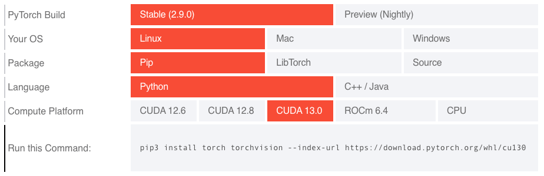
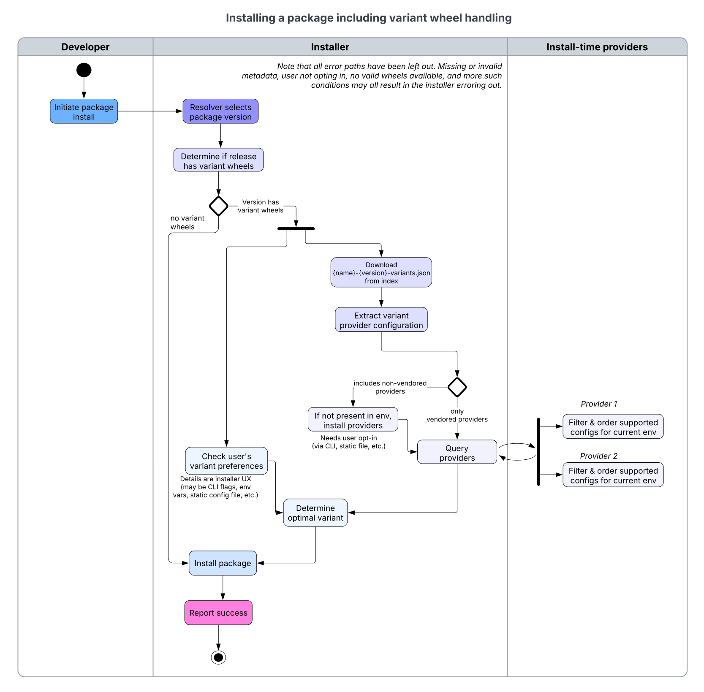

PEP: 817
Title: Wheel Variants: Beyond Platform Tags
Author: Jonathan Dekhtiar <jonathan@dekhtiar.com>,
        Michał Górny <mgorny@quansight.com>,
        Konstantin Schütze <konstin@mailbox.org>,
        Ralf Gommers <ralf.gommers@gmail.com>,
        Andrey Talman <atalman@meta.com>,
        Charlie Marsh <charlie@astral.sh>,
        Michael Sarahan <msarahan@gmail.com>,
        Eli Uriegas <eliuriegas@meta.com>,
        Barry Warsaw <barry@python.org>,
        Donald Stufft <donald@stufft.io>,
        Andy R. Terrel <andy.terrel@gmail.com>
Discussions-To: https://discuss.python.org/t/pep-817-wheel-variants-beyond-platform-tags/105860
Status: Draft
Type: Informational
Topic: Packaging
Created: 10-Dec-2025
Post-History: `24-Jan-2026 <https://discuss.python.org/t/pep-817-wheel-variants-beyond-platform-tags/105860>`__

Abstract
========

Python's existing wheel packaging format uses
:doc:`packaging:specifications/platform-compatibility-tags` to specify a
given wheel's supported environments. These tags cannot express modern
hardware configurations and their features, such as the availability of
GPU acceleration or the instruction sets a CPU supports. Neither can
they express build-time choices that matter at run time, such as which
BLAS implementation a wheel was built against, or which version of a
dependency it matches at the ABI level. These inabilities are
particularly challenging for scientific computing, artificial
intelligence (AI), machine learning (ML), and high-performance computing
(HPC) communities.

"Wheel Variants" is an extension to the
:doc:`packaging:specifications/binary-distribution-format` that lets a
project publish several wheels for the same version, distinguished by
properties the platform compatibility tags cannot carry, and lets
installers choose between them automatically. It comprises:

- **Variant wheels**, which declare the variant properties they were
  built for alongside the existing platform compatibility tags.

- **Variant providers**, which determine the properties a system
  supports. A provider may establish that by inspecting the system at
  install time, or supply it statically where there is nothing to
  detect, as when choosing between BLAS implementations.

- A **static description of an environment**, which a user may supply in
  place of any inspection. Building a container image, a native
  installer, or a wheel that vendors a particular build of a dependency
  calls for a stated target rather than a discovered one.

The goal is for the obvious installation command (``{tool} install
{package}``) to select the most appropriate wheel, whether that choice
is detected or declared, with no index URLs, package-name suffixes or
per-project install instructions.

Scope and Standards Track PEPs
==============================

This PEP is Informational: it specifies nothing normatively. It serves
as the umbrella for a sequence of four Standards Track PEPs, and it
supplies the motivation, the prior art, and the reasoning behind the
design choices those PEPs make, so that each of them can be read
against a shared context rather than restating it. It aims to give a
concise high-level overview of wheel variants; it does not cover the
complete functionality proposed as part of the standard, nor does it
provide normative guidance on implementing it.

The four PEPs are:

- :pep:`PEP 825: Package Format <825>`: changes to the wheel format, the
  initial definition of variant metadata, the index-level metadata file,
  variant wheel ordering rules, environment markers and ``pylock.toml``
  integration.

- Providers: how the variant properties a system supports are
  determined; binding every variant namespace to the one provider that
  governs it (e.g., ``nvidia`` for CUDA capabilities, ``x86_64`` for
  CPU instruction-set levels, ``blas_lapack`` for the choice of BLAS
  implementation); extending variant metadata with provider
  information; introducing providers that supply compatible properties
  statically via variant metadata or dynamically via opt-in Python
  packages, along with the security considerations for their use;
  defining the relevant plugin API; introducing a special provider
  concerned with ABI compatibility.

- Building: integration with build backends and the ``pyproject.toml``
  file; extending variant metadata and the plugin API to support
  verifying the validity of variant properties and embedding static
  properties via plugins at build time.

- UX, maintainability, security and governance: the introduction
  strategy, and a community maintained repository of trusted variant
  providers that can be integrated with installers for opt-out behavior.

Of these, :pep:`825` has been provisionally accepted; the remaining
three are in preparation, and their scope and details may change.

Some aspects are deliberately left outside the sequence, to evolve via
tools or further PEPs. A non-exhaustive list:

- The exact format of a static file describing an environment's variant
  properties,
- The list of variant providers that are vendored or re-implemented by
  installers,
- The specific opt-in mechanisms and UX for allowing an installer to run
  non-vendored variant providers,
- How to instruct build backends to emit variants through the :pep:`517`
  mechanism.

The first of these concerns the encoding only. Installers are expected
to accept a static description of an environment's variant properties;
what is left open is the form that description takes.

Motivation
==========

The `2024 Python Developers Survey`__ shows that a significant
proportion of Python's users have scientific computing use-cases. This
includes data analysis (40% of respondents), machine learning (30%), and
data engineering (30%). Many of the software packages developed for
these areas rely on diverse hardware features that cannot be adequately
expressed in the current wheel format, as highlighted in `the
limitations of platform compatibility tags`_.

__ https://lp.jetbrains.com/python-developers-survey-2024/#purposes-for-using-python

For example, packages such as PyTorch_ need to
be built for specific CUDA or ROCm versions, and that information cannot
currently be included in the wheel tag. Having to build multiple wheels
targeting very different hardware configurations forces maintainers into
various distribution strategies that are suboptimal, and create friction
for users and authors of other software who wish to depend on the
package in question.

A few existing approaches are explored in `Current workarounds and their
drawbacks`_. They include maintaining separate package indexes for
different hardware configurations, bundling all potential variants into
a single wheel of considerable size, or using separate package names
(``mypackage-gpu``, ``mypackage-cpu``, etc.). Each of these approaches
has significant drawbacks and potential security implications.

The limitations of platform compatibility tags
----------------------------------------------

The current wheel format encodes compatibility through three platform
compatibility tags:

1. **Python tag**: encoding the minimum Python version and optionally
   restricting Python distributions (e.g., ``py3`` for any Python 3,
   ``py313`` for Python 3.13 or newer, ``cp313`` for specifically
   CPython, 3.13 or newer).
2. **ABI tag**: encoding the Python ABI required by any extension
   modules (e.g., ``none`` for no requirement, ``abi3`` for the CPython
   stable ABI, ``cp313`` for extensions requiring CPython 3.13 ABI).
3. **Platform tag**: currently encoding the operating system,
   architecture and core system libraries (e.g., ``any`` for any
   platform, ``manylinux_2_34_x86_64`` for x86-64 Linux system with
   glibc 2.34 or newer, ``macosx_14_0_arm64`` for arm64 macOS 14.0
   or newer system).

These tags are limited to expressing the most fundamental properties
of the Python interpreter, operating system and the broad CPU
architectures. They cannot express anything more detailed, including
non-CPU hardware requirements or library ABI constraints.

This lack of flexibility has led many projects to find sub-optimal - yet
necessary - workarounds, such as the manual installation command
selector provided by the PyTorch team. This complexity represents a
fundamental scalability issue with the current tag system that is not
extensible enough to handle the combinatorial complexity of build
options.

Current workarounds and their drawbacks
---------------------------------------

Runtime CPU dispatching
'''''''''''''''''''''''

Projects such as NumPy_ currently resort to building wheels for a
baseline CPU target, and using runtime dispatching for
performance-critical routines. Such a solution requires additional
effort from package maintainers, and usually doesn't let the code
benefit from compiler optimizations outside the few select functions.

For comparison, building GROMACS_ for
higher CPU baselines proved to provide significant speedups:

    .. figure:: pep-0817/avx512_gromacs_benchmark.svg
        :alt: A bar graph comparing GROMACS performance (in ns/day) with
              various targets. The first two bars are labeled "yum
              (2018.8)" and "generic (SSE2)", reach about 1.0 ns/day and
              are both marked as "SSE2". The next bar is labeled
              "ivybridge" ("AVX") and reaches almost 1.5 ns/day. Two
              following bars are labeled "haswell" and "broadwell" (both
              "AVX2") and exceed 1.5 ns/day slightly. The last two bars
              are labeled "skylake_avx512" and "cascadelake" (both
              "AVX512") and reach almost 2.0 ns/day.

        Performance of GROMACS 2020.1 built for different generations of
        CPUs. Vertical axis shows performance expressed in ns/day, a
        GROMACS-specific measure of simulation speed (higher is better).

    Compiling GROMACS_ for architectures that can exploit the AVX-512
    instructions supported by the Intel Cascade Lake microarchitecture
    gives an additional 18% performance improvement relative to using
    AVX2 instructions, with a speedup of about 70% compared to a generic
    GROMACS installation with only SSE2.

    — `archspec: A library for detecting, labeling, and reasoning about
    microarchitectures
    <https://tgamblin.github.io/pubs/archspec-canopie-hpc-2020.pdf>`__

Separate package indexes as variants
''''''''''''''''''''''''''''''''''''

Projects such as `PyTorch <https://pytorch.org/get-started/locally/>`__
and `RAPIDS <https://docs.rapids.ai/install/#selector>`__
currently distribute packages that approximate "variants" through
separate package indexes with custom URLs. We will use the
example of PyTorch, while the problem, the workarounds, and the impact
on users also apply to other packages.

          provide the choice of PyTorch Build (stable or nightly),
          operating system (Linux, Mac, Windows), package (Pip,
          LibTorch, Source), language (Python, C++ / Java), and Compute
          Platform (CUDA 12.6, CUDA 12.8, CUDA 13.0, ROCM 6.4, CPU).
          Below these rows, the pip install command for the selected
          variant is provided, utilizing the --index-url parameter.

    The PyTorch install selector
    (https://pytorch.org/get-started/locally/, captured 22-Aug-2025)

PyTorch uses a combination of index URLs per accelerator type and local
version segments as accelerator tag (such as ``+cu130``, ``+rocm6.4`` or
``+cpu``). Users need to first determine the correct index URL for
their system, and add an index specifically for PyTorch.

.. code:: bash

    pip install torch --index-url https://download.pytorch.org/whl/cu129

Tools need to implement special handling for the way PyTorch uses local
version segments. These requirements break the pattern that packages
are usually installed with. Problems with installing PyTorch
are a very common point of user confusion. To quantify this, on
2025-12-05, 552 out of 8136 (6.8%) of issues on `uv's issue tracker
<https://github.com/astral-sh/uv/issues/>`__ contained the term "torch".

**Security Risk:** This approach has unfortunately led to supply
chain attacks - more details on the `PyTorch Blog
<https://pytorch.org/blog/compromised-nightly-dependency/>`__. It's a
non-trivial problem to address which has forced the PyTorch team to
create a complete mirror of all their dependencies, and is one of the
core motivations behind :pep:`766`.

The complexity of configuration often leads to projects providing ad-hoc
installation instructions that do not provide for seamless package
upgrades.

Package names as variants
'''''''''''''''''''''''''

Packages such as `XGBoost
<https://xgboost.readthedocs.io/en/stable/install.html>`__ use different
package names to approximate variants:

.. code:: bash

    pip install xgboost      # NVIDIA GPU variant
    pip install xgboost-cpu  # CPU-only variant

Maintainers of other software cannot express that they depend on either
of the available variants being selected. They need to
either depend on a specific variant, provide multiple alternative
dependency sets using extras, or even publish their own software using
multiple package names matching upstream variants.

Commonly, these packages install overlapping files. Since Python
packaging does not support expressing that two packages are mutually
exclusive, installers can install both of them to the same environment,
with the package installed second overwriting files from the one
installed first. This leads to runtime errors, and
the possibility of incidentally switching between variants depending on
the way package upgrades are ordered.

An additional limitation of this approach is that publishing a new
release synchronously across multiple package names is not currently
possible. :pep:`694` proposes adding such a mechanism for multiple
wheels within a single package, but extending it to multiple packages is
not a goal.

**Security Risk:** proliferation of suffixed variant packages
leads users to expect these suffixes in other packages, making name
squatting much easier. For example, one could create a malicious
``numpy-cuda`` package that users will be led to believe it's a CUDA
variant of NumPy.

As of the time of writing, CuPy_ has already registered a total of 55
``cupy*`` packages with different names, most of them never actually
used (they are only visible through the use of Simple API), and a large
part of the remaining ones no longer updated. This clearly highlights
the magnitude of the problem, and the effort put into countering the
risk of name squatting.

.. code:: text

    cupy
    cupy-cuda70 cupy-cuda75 cupy-cuda80 cupy-cuda90 cupy-cuda91
    cupy-cuda92 cupy-cuda100 cupy-cuda101 cupy-cuda102
    cupy-cuda110 cupy-cuda111 cupy-cuda112 cupy-cuda113 cupy-cuda114
    cupy-cuda115 cupy-cuda116 cupy-cuda117 cupy-cuda118 cupy-cuda119
    cupy-cuda11x
    cupy-cuda120 cupy-cuda121 cupy-cuda122 cupy-cuda123 cupy-cuda124
    cupy-cuda125 cupy-cuda126 cupy-cuda127 cupy-cuda128 cupy-cuda129
    cupy-cuda12x
    cupy-cuda13x
    cupy-rocm-4-0 cupy-rocm-4-1 cupy-rocm-4-2 cupy-rocm-4-3
    cupy-rocm-4-4 cupy-rocm-4-5 cupy-rocm-5-0 cupy-rocm-5-1
    cupy-rocm-5-2 cupy-rocm-5-3 cupy-rocm-5-4 cupy-rocm-5-5
    cupy-rocm-5-6 cupy-rocm-5-7 cupy-rocm-5-8 cupy-rocm-5-9
    cupy-rocm-6-0 cupy-rocm-6-1 cupy-rocm-6-2 cupy-rocm-6-3
    cupy-rocm-7-0 cupy-rocm-7-1

Package extras as variants
''''''''''''''''''''''''''

`JAX <https://docs.jax.dev/en/latest/installation.html>`__ uses a
plugin-based approach. The central ``jax`` package provides a number of
extras that can be used to install additional plugins,
e.g. ``jax[cuda12]`` or ``jax[tpu]``. This is far from ideal as
``pip install jax`` (with no extra) leads to a nonfunctional
installation, and consequently breaks dependency chains, a fundamental
expected behavior in the Python ecosystem.

JAX includes 12 extras to cover all use cases - many of which
overlap and could be misleading to users if they don't read the
documentation in detail. Most of them are technically mutually
exclusive, though it is currently impossible to correctly express this
within the package metadata.

.. code:: email

    Provides-Extra: minimum-jaxlib
    Provides-Extra: cpu
    Provides-Extra: ci
    Provides-Extra: tpu
    Provides-Extra: cuda
    Provides-Extra: cuda12
    Provides-Extra: cuda13
    Provides-Extra: cuda12-local
    Provides-Extra: cuda13-local
    Provides-Extra: rocm
    Provides-Extra: k8s
    Provides-Extra: xprof

Bundled universal packages - monolithic builds
''''''''''''''''''''''''''''''''''''''''''''''

Including all possible variants in a single wheel is another option, but
this leads to excessively large artifacts, wasting bandwidth and leading
to slower installation times for users who only need one specific
variant. In some cases, such artifacts cannot be hosted on PyPI because
they exceed its size limits.

Wheel variant selection via source distribution
'''''''''''''''''''''''''''''''''''''''''''''''

`FlashAttention <https://github.com/Dao-AILab/flash-attention>`__ does
not publish wheels on PyPI at all, but instead publishes a customized
source distribution that performs platform detection, downloads the
appropriate wheel from an upstream server, and then provides it to the
installer. This approach can select the optimal variant automatically,
but it prevents binary-only installs from working, requires a slow and
error-prone build via a source distribution, and breaks common caching
assumptions tied to the wheel filename. It also requires a specially
prepared build environment that contains the ``torch`` package matching
the version that the software will run against, which requires building
without build isolation. On the project side, it requires hosting wheels
separately.

**Security Risk:** Similar to regular source builds, this
model requires running arbitrary code at install time. The wheels
are downloaded entirely outside the package manager's control, extending
the attack surface to two separate wheel download implementations and
preventing proper provenance tracking.

Ecosystem fragmentation
'''''''''''''''''''''''

The lack of standardized support for solving against hardware
and ABI requirements has led to ecosystem fragmentation:

* **Inconsistent User Experience**: Each project uses different
  installation methods, creating confusion and reducing discoverability.

* **Development Tool Complications**: Installers, IDEs, and CI/CD
  systems struggle to handle non-standard installation requirements.

* **Fragility**: The established workarounds are often error-prone,
  and in the past they have led to issues such as downloading incorrect
  artifacts.

Impact on scientific computing and AI/ML workflows
--------------------------------------------------

The packaging limitations particularly affect scientific computing and
AI/ML applications where performance optimization is critical:

    The current wheel format's lack of hardware awareness creates a
    suboptimal experience for hardware-dependent packages. While plugins
    help with smaller and well scoped packages, users must currently
    manually identify the correct variant (e.g., ``jax[cuda13]``) to
    avoid generic defaults or incompatible combinations. We need a
    system where ``pip install jax`` automatically selects packages
    matching the user's hardware, unless explicitly overridden.

    Wheel variants are a clear step in the right direction in this
    regard.

    — Michael Hudgins, JAX_ Developer Infrastructure Lead

They affect everyone from package authors to end users of all skill
levels, including students, scientists and engineers:

    Accessing compute to run models and process large datasets has been
    a pain point in scientific computing for over a decade. Today,
    researchers and data scientists still spend hours to days installing
    core tools like PyTorch before they can begin their work. This
    complexity is a significant barrier to entry for users who want to
    use Python in their daily work. The WheelNext Wheel Variants
    proposal offers a pathway to address persistent installation and
    compute-access problems within the broader packaging ecosystem
    without creating another, new and separate solution. Let's focus on
    the big picture of enhancing user experience - it will make a real
    difference.

    — Leah Wasser, Executive Director and Founder of `pyOpenSci
    <https://www.pyopensci.org/>`__

Heterogeneous computing environments
''''''''''''''''''''''''''''''''''''

Research institutions and cloud providers manage heterogeneous
computing clusters with different architectures (CPU, Hardware
accelerators, ASICS, etc.). The current system requires
environment-specific installation procedures, making reproducible
deployment difficult. This situation also contributes to making
"scientific papers" difficult to reproduce. Application authors focused
on improving that are hindered by the packaging hurdles too:

    We've been developing a package manager for Spyder, a Python IDE for
    scientists, engineers and data analysts, with three main aims.
    First, to make our users' life easier by allowing them to create
    environments and install packages using a GUI instead of introducing
    arcane commands in a terminal. Second, to make their research code
    reproducible, so they can share it and its dependencies with their
    peers. And third, to allow users to transfer their code to machines
    in HPC clusters or the cloud with no hassle, so they can leverage
    the vast compute resources available there. With the improvements
    proposed by this PEP, we'd be able to make that a reality for all
    PyPI users because installing widely used scientific libraries (like
    PyTorch and CuPy) for the right GPU and instruction set and would be
    straightforward and transparent for tools built on top of uv/pip.

    — Carlos Córdoba, lead developer of the `Spyder IDE`_

Artificial intelligence, machine learning, and deep learning
''''''''''''''''''''''''''''''''''''''''''''''''''''''''''''

The recent advances in modern AI workflows increasingly rely on GPU
acceleration, but the current packaging system makes deployment complex
and adds a significant burden on open source developers of the entire
tool stack (from build backends to installers, not forgetting the
package maintainers).

    PyTorch's extensive wheel support was always state of the art and
    provided hardware accelerator support from day zero via our `package
    selector <https://pytorch.org/get-started/locally/>`__. We believe
    this was always a superpower of PyTorch to get things working out of
    the box for our users. Unfortunately, the infrastructure supporting
    these is very complex, hard to maintain and inefficient (for us, our
    users and package repositories).

    With the number of hardware we support growing rapidly again, we are
    very supportive of the wheel variants efforts that will allow us to
    get PyTorch install instructions to be what our users have been
    expecting since PyTorch was first released: ``pip install torch``

    — The PyTorch_ Core Maintainers

The lead maintainer of XGBoost_ enumerates a
number of problems XGBoost has that he expects will be addressed by
wheel variants:

    * Large download size, due to the use of "fat binaries" for multiple
      SMs [GPU targets]. Currently, XGBoost builds for 11 different SMs.

    * The need for a separate packaging name for CPU-only package.
      Currently we ship a separate package named ``xgboost-cpu``,
      requiring users to maintain separate ``requirements.txt`` files.
      See `xgboost#11632
      <https://github.com/dmlc/xgboost/issues/11632>`__ for an example.

    * Complex dispatching logic for multiple CUDA versions. Some
      features of XGBoost require new CUDA versions (12.5 or 12.8),
      while the XGBoost wheel targets 12.0. As a result, we maintain a
      fairly complex dispatching logic to detect CUDA and driver
      versions at runtime. Such dispatching logic should be best
      implemented in a dedicated piece of software like the NVIDIA
      provider plugin, so that the XGBoost project can focus on its core
      mission.

    * Undefined behavior due to presence of multiple OpenMP runtimes.
      XGBoost is installed in a variety of systems with different OpenMP
      runtimes (or none at all). So far, XGBoost has been vendoring a
      copy of OpenMP runtime, but this is increasingly untenable. Users
      get undefined behavior such as crashes or hangs when multiple
      incompatible versions of OpenMP runtimes are present in the
      system. (This problem was particularly bad on MacOS, so much so
      that the MacOS wheel for XGBoost no longer bundles OpenMP.)

    — Philip Hyunsu Cho, a lead maintainer of XGBoost_

The complexity of packaging is distracting developers from focusing on
the actual goals for their software:

    We maintain a scientific software tool that uses deep learning for
    analyzing biological motion in image sequences that has gotten
    traction (>35k users, >80 countries) due to its user friendliness as
    a frontend for training custom models on specialized scientific
    data. Our userbase are scientists who spend all day doing brain
    surgeries and molecular genetics to discover cures to diseases. It
    is entirely unreasonable to expect that they should have to learn
    about hardware accelerator driver compatibility matrices,
    environment managers, and keep up with the ever changing Python
    packaging ecosystem just to be able to analyze their data.

    In recognition of this, my team has spent an inordinate amount of
    time on maintaining dependencies and packaging hacks to ensure that
    our tool, which now undergirds the reproducibility of millions of
    dollars worth of research studies, remains compatible with every
    platform. In the past couple of years, we estimate that we've spent
    hundreds of hours and over $250,000 of taxpayer-supported research
    funding engineering solutions to this problem. WheelNext would have
    solved this entirely, allowing us to focus our efforts on
    understanding and treating neurodegenerative diseases.

    — Talmo Pereira, Ph.D., author of SLEAP_ and Principal Investigator
    at the Salk Institute for Biological Studies

The potential for improvement can be summarized as:

    This PEP is a significant step forward in improving the deployment
    challenges of the Python ecosystem in the face of increasingly
    complex and varied hardware configurations. By enabling multiple
    deployment targets for the same libraries in a standard way, it will
    consolidate and simplify many awkward and time-consuming
    work-arounds developers have been pursuing to support the rapidly
    growing AI/ML and scientific computing worlds.

    — Travis Oliphant, the author of NumPy_ and SciPy_ and Chief AI
    Architect at OpenTeams

Prior Art
=========

This problem is not unique to the Python ecosystem, different groups and
ecosystems have come up with various answers to that very problem. This
section will focus on highlighting the strengths and weaknesses of the
different approaches taken by various communities.

Conda - conda-forge
-------------------

`Conda <https://docs.conda.io>`__ is a binary-only package ecosystem
that uses aggregated metadata indexes for resolution rather than
filename parsing. Unlike the
:doc:`packaging:specifications/simple-repository-api`, conda's
resolution relies on `repodata indexes per platform
<https://docs.conda.io/projects/conda-build/en/stable/concepts/generating-index.html>`__
containing full metadata, making filenames purely identifiers with no
parsing requirements.

**Variant System**: In `2016-2017
<https://www.anaconda.com/blog/package-better-conda-build-3>`__,
conda-build introduced variants to differentiate packages with identical
name/version but different dependencies.

.. code:: bash

    pytorch-2.8.0-cpu_mkl_py313_he1d8d61_100.conda      # CPU + MKL variant
    pytorch-2.8.0-cuda128_mkl_py313_hf206996_300.conda  # CUDA 12.8 + MKL variant
    pytorch-2.8.0-cuda129_mkl_py313_he100a2c_300.conda  # CUDA 12.9 + MKL variant

A hash (computed from variant metadata) prevents filename collisions;
actual variant selection happens via standard dependency constraints in
the solver. No special metadata parsing is needed—installers simply
resolve dependencies like:

.. code:: bash

    conda install pytorch mkl

**Mutex Metapackages**: Python metadata and conda metadata do not have
good ways to express ideas like "this package conflicts with that one."
The main mechanism for enforcement is sharing a common package name -
only one package with a given name can exist at one time. Mutex
metapackages are sets of packages with the same name, but different
build string. Packages depend on specific mutex builds (e.g.,
``blas=*=openblas`` vs ``blas=*=mkl``) to avoid problems with related
packages using different dependency libraries, such as NumPy_ using
`OpenBLAS <https://www.openmathlib.org/OpenBLAS/>`__ and SciPy_ using
`MKL
<https://www.intel.com/content/www/us/en/developer/tools/oneapi/onemkl.html>`__.

**Example software variants**:
`BLAS <https://conda-forge.org/docs/maintainer/knowledge_base/#blas>`__,
`MPI
<https://conda-forge.org/docs/maintainer/knowledge_base/#message-passing-interface-mpi>`__,
`OpenMP
<https://conda-forge.org/docs/maintainer/knowledge_base/#openmp>`__,
`noarch vs native
<https://conda-forge.org/blog/2024/10/15/python-noarch-variants/>`__

**Virtual Packages**: `Introduced in 2019
<https://github.com/conda/conda/pull/8267>`__, virtual packages inject
system detection (CUDA version, glibc, CPU features) as solver
constraints. Built packages express dependencies like ``__cuda >=12.8``,
and the installer verifies compatibility at install time. Current
virtual packages include ``archspec`` (CPU capabilities), OS/system
libraries, and CUDA driver version. Detection logic is tool-specific
(`rattler
<https://github.com/conda/rattler/tree/main/crates/rattler_virtual_packages/src>`__,
`mamba
<https://github.com/mamba-org/mamba/blob/main/libmamba/src/core/virtual_packages.cpp>`__).

Spack / Archspec
----------------

`archspec <https://github.com/archspec/archspec>`__ is a library for
detecting, labeling, and reasoning about CPU microarchitecture variants,
developed for the `Spack <https://spack.io/>`__ package manager.

**Variant Model:** CPU Microarchitectures (e.g., ``haswell``,
``skylake``, ``zen2``, ``armv8.1a``) form a `Directed Acyclic Graph
(DAG) encoding binary compatibility
<https://tgamblin.github.io/pubs/archspec-canopie-hpc-2020.pdf>`__,
which helps the resolver express that ``packageB`` depends on
``packageA``. The ordering is partial because (1) separate ISA families
are incomparable, and (2) contemporary designs may have incompatible
feature sets—cascadelake and cannonlake are incomparable despite both
descending from skylake, as each has unique AVX-512 extensions.

**Implementation:** A language-agnostic JSON database stores
microarchitecture metadata (features, compatibility relationships,
compiler-specific optimization flags). Language bindings provide
detection (queries ``/proc/cpuinfo``, matches to microarchitecture with
largest compatible feature subset) and compatibility comparison
operators.

**Package Manager Integration:** Spack records target microarchitecture
as package provenance (``spack install fftw target=broadwell``),
automatically selects compiler flags, and enables
microarchitecture-aware binary caching. The `European Environment for
Scientific Software Installations (EESSI)
<https://onlinelibrary.wiley.com/doi/full/10.1002/spe.3075>`__
distributes optimized builds in separate subdirectories per
microarchitecture (e.g., ``x86_64``, ``armv8.1a``, ``haswell``);
runtime initialization uses ``archspec`` to select best compatible build
when no exact match exists.

Gentoo Linux
------------

`Gentoo Linux <https://www.gentoo.org>`__ is a source-first distribution
with support for extensive package customization. This is primarily
achieved via `USE flags
<https://devmanual.gentoo.org/general-concepts/use-flags/index.html>`__:
boolean flags exposed by individual packages and permitting fine-tuning
the enabled features, optional dependencies and some build parameters
(e.g. ``jpegxl`` for JPEG XL image format support,
``cpu_flags_x86_avx2`` for AVX2 instruction set use). Flags can be
toggled individually, and separate binary packages can be built for
different sets of flags. The package manager can either pick a binary
package with matching configuration or build from source.

API and ABI matching is primarily done through use of `slotting
<https://devmanual.gentoo.org/general-concepts/slotting/index.html>`__.
Slots are generally used to provide multiple versions or variants of
given package that can be installed alongside (e.g. different major GTK+
or LLVM versions, or GTK+3 and GTK4 builds of WebKitGTK), whereas
subslots are used to group versions within a slot, usually corresponding
to the library ABI version. Packages can then declare dependencies bound
to the slot and subslot used at build time. Again, separate binary
packages can be built against different dependency slots. When
installing a dependency version falling into a different slot or
subslot, the package manager may either replace the package needing that
dependency with a binary packages built against the new slot, or rebuild
it from source.

Normally, the use of slots assumes that upgrading to the newest version
possible is desirable. When more fine-grained control is desired, slots
are used in conjunction with USE flags. For example,
``llvm_slot_{major}`` flags are used to select a LLVM major version to
build against.

The design space
================

Platform compatibility tags cannot express the characteristics described
above, so something must determine whether a given wheel is suitable for
a given system. The question that shapes the design is where that
knowledge lives, and who is able to add to it.

The approaches below differ in how much standardization they require,
and in whether that requirement returns each time a new compatibility
axis appears. For two of them - logic shipped per project, and separate
package names - adding an axis requires no standardization at all, which
is why both already exist as workarounds today; their costs fall
elsewhere.

Where standardization is required, its shape differs sharply.
Standardizing the compatibility axes themselves means a PEP per axis,
and a further one each time hardware or a library introduces an axis not
already covered, followed in every case by an implementation in each
installer. Standardizing an interface means one PEP, once.

.. list-table::
    :header-rows: 1
    :widths: 18 12 26 22 22

    * - Approach
      - Selects without user input
      - Adding a new compatibility axis requires
      - Detection logic maintained by
      - Third-party code runs at install time
    * - Fixed set of axes
      - Yes
      - A PEP for that axis, then an implementation in every installer
      - Installer maintainers
      - No
    * - Logic shipped per project
      - Yes
      - Nothing; each project decides
      - Every variant-shipping project
      - Yes
    * - Separate package names
      - Unresolved
      - Nothing; a new project name
      - Unspecified; something must still choose the right name
      - No
    * - User-declared environments
      - No
      - A PEP for that axis, but no detection to implement
      - Not applicable; values are supplied by the user
      - No
    * - Variant providers
      - Yes
      - A provider package release
      - Provider maintainers
      - No, unless the user opts in

The table states what each approach costs and where the work lands. The
sections below take each in turn; `The approach taken`_ explains the
choice that follows from them.

Approaches considered
---------------------

A fixed set of compatibility axes
'''''''''''''''''''''''''''''''''

The standards process could define compatibility markers for these
characteristics - CUDA runtime version, GPU architecture, CPU
instruction set level, and so on - together with the semantics for
matching them. Wheels would declare their requirements against these
markers, and each installer would implement the detection needed to
evaluate them. The specification would not need to say how a tool
measures any particular marker; that would remain an implementation
matter for each tool.

This approach has real advantages, and it is the alternative most
frequently raised in discussion. It introduces no new kind of artifact
and no new execution model. The specification stays purely declarative,
and the code performing detection is first-party installer code, so no
new trust surface is created.

It would not, however, be a single document. The rules governing NVIDIA
CUDA compatibility - driver and runtime versions, real and virtual GPU
architectures, and the forward-compatibility guarantees between them -
have little in common with those governing AMD ROCm or Intel XPU, and
less still with x86-64 instruction set levels or Arm feature flags. Each
needs different expertise to write and different reviewers to assess it
competently, and a single document covering them all would be difficult
to review as a whole. A realistic first round is therefore several
PEPs: plausibly one per accelerator vendor, and at least one more for
CPU instruction sets, which may not remain single as architectures
diverge.

The recurring cost has the same shape, and makes the specification the
gatekeeper for every compatibility axis. Each new axis requires
agreement across the packaging community followed by an implementation
in each installer, and a newly specified axis is only as useful as its
slowest widely deployed implementation. The axes in demand today already
extend well past GPUs: CPU instruction set levels, BLAS and LAPACK
implementations, OpenMP runtimes, C++ ABIs, and matching against the ABI
of a dependency such as PyTorch_.

The cost also recurs within an axis, not only across axes. An axis that
has been specified still has to be revised as its subject moves: new
CUDA and ROCm releases, new GPU architectures and new instruction set
extensions each change which values exist and how they compare. That is
a far faster tempo than the existing platform compatibility tags deal
with, where operating systems, C libraries and broad CPU architectures
turn over slowly - and even at that pace, writing a PEP per tag did not
hold up: :pep:`600` replaced that practice for ``manylinux`` in order to
let maintainers adopt new tags sooner and to make better use of limited
volunteer time. Hardware vendors would depend on the standards process
in order to ship optimized wheels, on a timescale measured against their
own release cadence.

The vendors are also not bound by the standards process. A
specification that writes down how a platform's versions relate to one
another records rules that the packaging community does not own and
cannot hold still: the vendor can redefine them in any hardware or
software release it makes, leaving the specification wrong until it is
amended. The renumbering of macOS versions is a reminder that this is
not hypothetical.

A narrower form of this proposal is to standardize deliberately few
axes - a small set of community-supported hardware target levels,
refreshed periodically - rather than attempting to cover the space. This
is coherent, and it answers a genuine concern: a design permitting many
axes also permits build matrices that are difficult to test and to
audit. Two considerations weigh against it. The set requiring
maintenance is not limited to hardware, as the list above shows, so the
curation burden is larger than it first appears. And it places the
judgment about which hardware merits support with the packaging
community rather than with the vendors and projects that have the
expertise and the motivation to maintain it. The concern about
unmanageable build matrices is better met by observing that nothing
obliges a project to publish many variants; how many to ship remains
that project's decision.

Compatibility logic shipped by each project
'''''''''''''''''''''''''''''''''''''''''''

Each project shipping variants could provide its own detection code,
which the installer would run to choose among that project's wheels,
with no mechanism shared between projects. This is the current situation
extrapolated rather than a new design: the approach described in `Wheel
variant selection via source distribution`_ already works this way, and
`wheel-stub <https://github.com/wheelnext/wheel-stub>`__ packages it as
a reusable build backend. Both are confined to source distributions, so
they require arbitrary code execution at install time and leave the
wheel that is actually installed outside anything a lock file records.

The same detection would then be written many times over. Every project
would present its own behavior, its own failure modes and its own user
interface for the same underlying questions, and there would be no
shared story for auditing any of it. Coordination across projects -
ensuring that NumPy_ and SciPy_ agree on a BLAS implementation, or that
everything in an environment is built against the same CUDA major
version - would have no mechanism at all.

Separate package names
''''''''''''''''''''''

`Package names as variants`_ describes what projects do today. A more
deliberate version of the same idea is to make the mapping part of
installation: the user requests ``torch``, and the installer resolves
that to a project name such as ``torch_cu128`` appropriate for the
current platform.

This has the attraction of working within the wheel format as it stands.
It requires no filename changes and no metadata changes, and publishers
retain control over what they publish. The drawbacks described in
`Package names as variants`_ still apply: name squatting becomes easier,
packages installing overlapping files cannot be declared mutually
exclusive, and releases cannot be published synchronously across several
project names.

Two further problems are specific to the mapping. The code performing it
has to live in the installer, and it is bound to a naming convention
that does not exist. Projects already spell the same distinction
differently: JAX_ publishes ``jax-cuda12-plugin`` and
``jax-cuda13-plugin``, identifying CUDA by major version alone, while
PyTorch_ labels its builds ``cu129`` and ``cu130`` in index URLs and
local version segments, by major and minor. Something must establish
which form an installer resolves to, and that whatever convention is
chosen holds for every project using the mechanism. How that would be
agreed between projects and kept consistent across installers is
unclear, and the name carries meaning that nothing in the metadata
records. More fundamentally, the mapping needs a source of truth:
something must still determine which name is appropriate for the
current system. That is the question this section is about, so this
approach relocates it rather than answering it.

A user-declared environment
'''''''''''''''''''''''''''

Compatibility could be matched against values the user declares rather
than values a tool detects. This shares its vocabulary with the first
alternative above - markers for CUDA runtime version, GPU architecture,
instruction set level and so on, defined by the standards process - but
takes their values from a description of the environment that the user
supplies, by hand or produced by a separate tool, rather than from
detection. No detection code would run anywhere during installation.

Many installs have nothing to detect. An install that produces an
artifact for use elsewhere - a container image, a native installer, or a
wheel that vendors a particular build of a dependency - is a statement
about the target, not about the machine doing the work, and the machine
doing the work may have no GPU in it at all. The approach also describes
how a substantial group of users already works: HPC sites and
locked-down corporate environments commonly declare the available
toolchain, accelerator and library stack as a matter of policy, using
mechanisms such as those described in `Spack / Archspec`_. And it has
the smallest trust surface of any approach considered, since no code
runs in order to make a compatibility decision.

It is nonetheless unsuitable as the only mechanism, because it requires
every user to know and state their CUDA runtime version, driver version
and instruction set level. The weight of that objection should not be
overstated. Users already need this knowledge today, where it is
translated into a choice of index URL and a bespoke install command, and
declaring it once to the installer would be an improvement on that - not
least because a declared environment composes with dependency
resolution, whereas an index URL is a property of a single command and
does not, so today a project that merely depends on PyTorch_ can undo
the user's choice. The objection is narrower: the burden remains with
the user, whereas ``{tool} install {package}`` selecting a working wheel
without it is the goal stated in the abstract.

Variant providers
'''''''''''''''''

Compatibility could be determined by named, versioned plugins - variant
providers - each owning one or more axes of the variant space. The
standards process would define the interface such a plugin exposes and
how its results are used, rather than defining the axes themselves. A
new compatibility axis would then be introduced by publishing or
updating a provider rather than by amending a specification.

This places the detection logic with those who have both the expertise
and the motivation to maintain it. A hardware vendor can ship support
for a new accelerator, and correct the compatibility rules when they change,
on its own release cadence. Installers remain generic, and do not
acquire a standing obligation to understand every accelerator and ABI on
every platform. Because providers are shared between projects,
coordinating a consistent choice across an environment remains possible.
Where nothing needs to be detected, as with a choice between BLAS
implementations, a provider supplies its properties statically and no
code runs at install time at all; this is described in `Static
properties in wheels`_.

The costs are real and worth stating plainly. The ecosystem acquires a
new kind of artifact, with its own questions of versioning, trust and
governance. The system inspection performed during resolution expands
considerably: installers already probe the platform to evaluate
compatibility tags, but that inspection is bounded and first-party,
whereas a provider's is open-ended and may be third-party. Whether a
user benefits at all depends on the relevant provider being available to
their installer; where it is not vendored, allowlisted or opted into,
its properties are treated as incompatible and the installer falls back
to a generic wheel - a working result, but not the one the hardware
could have had. And because the properties driving selection are held in
metadata rather than in the filename, determining which wheel a given
system will select requires reading that metadata rather than a
directory listing; :pep:`825` discusses the alternatives considered for
this.

The approach taken
------------------

The design set out further down in `The wheel variants design`_ takes
two of the approaches above rather than one. Variant providers are the
default mechanism, and a user-declared description of the environment is
supported alongside them as a first-class path rather than as a
fallback; `Using static compatibility information`_ describes the form
that description takes.

Why providers are the default
'''''''''''''''''''''''''''''

Providers are the default because they are the only approach that
satisfies three requirements at once: the right wheel is selected
without the user having to supply the answer, a new compatibility axis
does not require a new round of standardization, and the detection logic
is written once and shared rather than once per project.

The first of those requirements matters to more people than those who do
not know what hardware they have. The answer is perishable, since a
driver upgrade or a move to another machine can invalidate it;
establishing it is work, and work repeated for every environment; and it
is easy to get wrong in a way that surfaces much later, as a crash or as
an unexplained slowdown.

The other approaches satisfy some of the three but not all. A fixed set
of axes selects automatically and keeps the logic out of individual
projects, but routes every future axis through the standards process.
Per-project logic avoids that, but writes the same detection once per
project and forgoes any coordination between them. A user-declared
environment hands the question back to the user, and separate names do
not answer it at all, since something must still determine which name
applies.

Why a declared environment sits alongside
'''''''''''''''''''''''''''''''''''''''''

The user-declared path is not present to compensate for a weakness in
providers. It answers requirements that detection cannot, whatever one's
view of running code at install time. Installing for a machine other
than the one running the installer - building a container image for
other hardware, populating a wheelhouse, reproducing an environment in
CI - offers nothing to detect, because the target system is absent.
Environments whose policy forbids executing code during installation
need a route that involves none. Deployments that must install
identically across a fleet of machines differing in CPU generation
within one family need the same route for a different reason: detection
would correctly select a different wheel on each, when the point is for
them to match. A user whose hardware is misdetected needs a way to say
so.

The two approaches fit together rather than merely coexisting, because
they supply the same thing. A provider's output is a set of supported
properties in preference order; a static description declares that set
directly. Selection consumes one form or the other without needing to
know which, so the declared path substitutes at a single point instead
of running as a second mechanism in parallel. That is what makes it
reasonable to offer both without doubling what has to be specified,
implemented and reasoned about.

Why variants stay out of the resolver's search
'''''''''''''''''''''''''''''''''''''''''''''''

One boundary of the design is worth stating explicitly. Variant
selection chooses among the wheels of a package version that the
resolver has already selected; with one optional exception noted below,
it does not make variants part of the resolver's search. This keeps a
substantial change out of dependency
resolution, where the algorithms in use - backtracking, SAT, PubGrub -
would all have to accommodate it, and where the nearest precedent,
extras, is a cautionary one. The cost is that a conflict between the
variants of two different packages cannot be resolved by searching: if
one package is installed against one BLAS implementation and another
publishes only wheels built against a different one, an installer can
backtrack to an older version of the first package, but it cannot
revisit the wheel it chose for the version it had already settled on. It
has to report the conflict rather than work around it.

Two things limit how often that arises. Packages sharing a provider
receive the same properties in the same preference order, so independent
per-package choices tend to converge without coordination, and a user
who needs a particular combination can declare it. The one exception is
the ``abi_dependency`` provider described in `Package ABI matching`_,
which does require a resolver to take variants into account, and which
is optional for precisely that reason.

How much code should run, and when
----------------------------------

Choosing providers settles where compatibility logic lives. It does not
settle how much of that logic should run without the user having said
so. Both extremes are ruled out, for the reasons below: a provider is
not run merely because a wheel names it, and the user is not asked about
each one in turn. What remains open is how a provider comes to be
trusted, so that it runs without the user opting in to it. That is the
most contested aspect of the design, and the mechanisms themselves
belong to the PEPs listed in `Scope and Standards Track PEPs`_.

Both extremes fail. An installer automatically running whatever provider
a wheel's metadata names turns that metadata into a means of executing
code on any machine that merely resolves against the package, before the
user has agreed to install anything. An installer prompting for every
provider produces prompts often enough that they stop being read, and
users grant them wholesale, which arrives at the same place with
additional ceremony. The risk of security fatigue is not a rhetorical
objection to opt-in designs; it is the reason a purely opt-in design
does not by itself resolve the problem.

It is worth being precise about what changes. System inspection during
resolution is not new, and is already more involved than reading a
version string. Establishing ``manylinux`` compatibility requires the
glibc version, which ``packaging`` can obtain by using ``ctypes`` to
load the C library of the running process and call the function that
reports its version. Establishing ``musllinux`` compatibility requires
parsing the interpreter's ELF headers to locate the dynamic loader, then
running that loader as a subprocess and reading the version out of its
output. Installers do this today either by vendoring that code or by
reimplementing it - pip takes the first route, uv the second - and those
are exactly the two strategies proposed for providers. A provider that
an installer vendors or reimplements is much the same kind of artifact.
What is new is that a provider may instead come from a third party,
named by the package being installed.

Several mechanisms narrow the gap, each with its own cost. Installers
may vendor or reimplement the most widely used providers, which keeps
the common path free of third-party code but concentrates the work on
installer maintainers. A curated list of vetted providers avoids that
concentration, but constitutes a curation authority that must be
governed. A static description of the environment removes the question
entirely for users who want that, at the cost of requiring them to
produce one.

This PEP does not attempt to settle that trade-off. The fourth PEP in
the sequence, covering UX, maintainability, security and governance,
takes it up: the opt-in mechanisms, a community-maintained repository of
trusted variant providers that installers can treat as opt-out, and the
model that governs what goes into it.

The wheel variants design
=========================

Wheel variant glossary
----------------------

Variant wheels
    Wheels that share the same distribution name, version, build number,
    and platform compatibility tags, but are distinctly identified by an
    arbitrary set of variant properties.

Variant namespace
    An identifier used to group related features provided by a single
    provider (e.g., ``nvidia``, ``x86_64``, ``arm``, etc.).

Variant feature
    A specific characteristic (key) within a namespace (e.g.,
    ``sm_arch``, ``avx512_bf16``, etc.) that can have one or more
    values.

Variant property
    A 3-tuple (``namespace :: feature-name :: feature-value``)
    describing a single specific feature and its value. If a feature has
    multiple values, each is represented by a separate property.

Variant label
    A string added to the wheel filename to uniquely identify variants.

Null variant
    A special variant with zero variant properties and the reserved
    label ``null``. Always considered supported but has the lowest
    priority among wheel variants, while being preferably chosen over
    non-variant wheels.

Variant provider
    A provider of valid variant properties for a specific namespace.
    Can either be a static list of ordered properties, or a Python
    package that dynamically determines the properties that are
    compatible with the system.

High-level overview
-------------------

Wheel variants introduce a more fine-grained specification of built
wheel characteristics beyond what existing wheel tags provide. Every
variant wheel carries zero or more variant properties. Much like
:doc:`packaging:specifications/platform-compatibility-tags`, variant
properties are used both to determine whether the wheel is compatible
with the system in question and to select the most suitable wheel to
install from multiple compatible wheels.

Unlike tags, variant properties are not stored in the wheel filename,
but in a dedicated metadata file inside the wheel. To distinguish
between different wheel variants and provide a human-readable
identification, variant wheels carry an additional variant label
component in the filename. This label is specified along with the rest
of variant metadata in the project's source tree (normally in
``pyproject.toml``), and it is processed by the build backend that
afterwards embeds it into the built wheel. Additionally, this
information is copied into a dedicated
``{name}-{version}-variants.json`` file on the index, so that clients
can obtain it without having to fetch the wheels.

The properties are organized into a hierarchical structure of
namespaces, features and feature values. Every namespace is governed by
a variant provider that is also defined as part of the variant metadata.
The provider serves as the data source used to determine which variant
properties are compatible with the user's system, and to order them from
the most desirable to the least desirable. This information is
afterwards used to filter the available variant wheels into install
candidates, and select the one that is most preferred among them. The
data can either be provided in a static manner, in which case all the
compatible properties are embedded in the metadata, or it can be
dynamically established from a running system.

Providers that need to establish property compatibility are normally
provisioned as installable Python packages implementing a plugin API.
They may also be vendored or reimplemented by installers to improve user
experience.

Variant properties
------------------

Variant properties can be thought of as a correspondence to and an
extension of
:doc:`packaging:specifications/platform-compatibility-tags`. In this
analogy, variant features are the equivalent of tag types, while their
values are the equivalent of the tags themselves. However, variant
features are not fixed and the wheel can have any number of them.
Furthermore, they are organized into namespaces that are governed
independently.

A variant property encodes a single feature value that the wheel is
compatible with. Conversely, if the wheel is compatible with multiple
values of a given feature, they are represented by multiple properties.

For example, let's say that a package defined a ``nvidia`` namespace
that permitted the following three features:

1. ``nvidia :: cuda_version_lower_bound`` specifying the minimum
   supported CUDA runtime version.
2. ``nvidia :: cuda_version_upper_bound`` specifying the maximum
   supported CUDA runtime version.
3. ``nvidia :: sm_arch`` specifying a single supported GPU architecture.

This package produced a wheel with the following variant properties:

.. code:: text

    nvidia :: cuda_version_lower_bound :: 12.8
    nvidia :: sm_arch :: 120_real
    nvidia :: sm_arch :: 110_real

This would imply the following:

- The wheel can only be installed on a system compatible with the
  ``nvidia :: cuda_version_lower_bound :: 12.8`` property, that is
  featuring installed CUDA runtime version 12.8 or newer.
- Since there is no ``nvidia :: cuda_version_upper_bound``, that feature
  is not taken into consideration and there is no upper bound on CUDA
  runtime version.
- The wheel can only be installed on a system compatible with at least
  one of the ``nvidia :: sm_arch`` values listed, that is having a GPU
  with ``120_real`` or ``110_real`` architecture.

An end-to-end example
---------------------

The following subsections present a complete example of building a
variant wheel, publishing it on an index and installing it on a system.
It covers the baseline scenario where wheel compatibility needs to be
determined at install time, by inspecting the target system. Other cases
will be discussed in subsequent sections.

Building variant wheels
'''''''''''''''''''''''

The recommended way of integrating variant wheel support in a build
backend is to store variant metadata in the ``pyproject.toml`` file, and
to select the variant being built via a ``config_settings`` parameter.

Consider the following example:

.. code-block:: toml

    [variant]
    "$schema" = "..."

    [variant.default-priorities]
    # specifies preference ordering: nvidia support is more important
    # than x86_64 optimizations
    namespace = ["nvidia", "x86_64"]

    # == provider definitions ==

    [variant.providers.nvidia]
    requires = ["nvidia-variant-provider"]

    [variant.providers.x86_64]
    requires = ["x86-64-variant-provider"]

    # == buildable variant definitions ==

    [variant.variants.cu130]
    nvidia.cuda_version_lower_bound = ["13.0"]
    nvidia.sm_arch = ["120_virtual", "120_real", "100_real", "90_real"]

    [variant.variants.x86_64_v4]
    x86_64.level = ["v4"]

This example defines two providers: ``nvidia`` responsible for NVIDIA
CUDA support, and ``x86_64`` responsible for x86_64 CPU optimizations.
These two providers are used to specify two buildable variants:

- ``cu130`` that corresponds to a package using CUDA 13.0 support
- ``x86_64_v4`` that corresponds to a package using code optimized for
  x86-64-v4 CPU

Per the precedence rules specified in
``variant.default-priorities.namespace``, the ``cu130`` variant
featuring GPU support will be preferred if CUDA runtime and a compatible
GPU are available. Otherwise, the ``x86_64_v4`` variant will be the next
best choice, provided a compatible CPU is available.

A specific variant would then be built via an invocation such as::

    python -m build -w -Cvariant-label=cu130

A build backend could behave in the following way:

1. Detect ``variant-label`` in ``config_settings``, and enable variant
   wheel builds.
2. Validate the ``variant`` table against the schema.
3. Find the ``cu130`` label in the ``variant.variants`` table, and
   determine the corresponding properties.
4. In ``get_requires_for_build_wheel()`` hook, return the plugin
   packages needed for the namespaces found in the properties. This will
   cause the build frontend to install them in the build environment.
5. Query the installed plugins to verify that the variant properties are
   valid.
6. Construct the ``*.dist-info/variant.json`` file from the ``variant``
   table. The ``variants`` subtable is filtered to the entry for the
   variant being built, the remaining subtables are copied verbatim.
7. Build the wheel. This could involve processing tool-specific
   configuration to apply variant-specific modifications to the build
   process.

The wheel would be named ``*-cu130.whl``. In it, the variant metadata
file ``*.dist-info/variant.json`` would be similar to the following
example:

.. code-block:: json5

    {
      // == copied verbatim from pyproject.toml ==

      "$schema": "...",

      "default-priorities": {
        "namespace": ["nvidia", "x86_64"]
      },

      "providers": {
        "nvidia": {
          "requires": ["nvidia-variant-provider"]
        },
        "x86_64": {
          "requires": ["x86-64-variant-provider"]
        }
      },

      // == actual properties of the built variant wheel ==

      "variants": {
        "cu130": {
          "nvidia": {
            "cuda_version_lower_bound": ["13.0"],
            "sm_arch": ["120_virtual", "120_real", "100_real", "90_real"]
          }
        }
      }
    }

Publishing variant wheels on an index
'''''''''''''''''''''''''''''''''''''

To enable resolvers to select between different variant wheels without
having to fetch the variant metadata straight from wheel files, an
index-level metadata file ``{name}-{version}-variants.json`` needs to
be published alongside these wheels.

Initially this could be done via running a dedicated tool on all built
variant wheels, for example by invoking::

    variantlib generate-index-json -d dist/

The tool collects the variant metadata from all wheels, ensures that it
is consistent and merges it to create the index-level metadata file.
This file can be then uploaded to the index alongside variant wheels.

Eventually, this manual step will no longer be necessary when uploading
variant wheels to PyPI: PyPI will automatically detect that a variant
wheel is uploaded, read its variant metadata and merge it into its
database. The combined metadata from the database will be published at
the URL corresponding to the index-level metadata file.

The index-level metadata file for the two ``*-cu130.whl`` and
``*-x86_64_v4.whl`` files could look like:

.. code-block:: json5

    {
      // == copied verbatim from variant.json ==

      "$schema": "...",

      "default-priorities": {
        "namespace": ["nvidia", "x86_64"]
      },

      "providers": {
        "nvidia": {
          "requires": ["nvidia-variant-provider"]
        },
        "x86_64": {
          "requires": ["x86-64-variant-provider"]
        }
      },

      // == merged from different variant wheels ==

      "variants": {
        "cu130": {
          "nvidia": {
            "cuda_version_lower_bound": ["13.0"],
            "sm_arch": ["120_virtual", "120_real", "100_real", "90_real"]
          }
        },
        "x86_64_v4": {
          "x86_64": {
            "level": ["v4"]
          }
        }
      }
    }

Querying a provider
'''''''''''''''''''

The primary function of a provider is to determine which of the variant
properties are compatible with the user's system, and to order them from
the most preferable to the least preferable. For example, the purpose of
the ``nvidia`` provider used in the example is to determine whether the
user's system features a compatible NVIDIA CUDA runtime and a GPU, while
the purpose of the ``x86_64`` provider is to determine what CPU is used
and whether the instruction sets used in the wheel are supported by it.

Both these providers rely on install-time checks. It is also possible to
define providers that do not require these checks, and these are
explained in `static properties in wheels`_.

The most common providers, such as the ``nvidia`` provider in the
example, will likely be vendored or reimplemented by installers, and
they will work in an opt-out manner.

For providers that are not provided by the installers themselves, the
Python packages listed in the ``requires`` list will be needed to
determine the compatibility and preference order. These packages are
opt-in by default. If the user opts in to using them, they are installed
into an isolated environment and queried via a dedicated API. Otherwise,
they are not used and the properties are assumed to be incompatible.

Furthermore, it is possible to override the provider queries by `using
static compatibility information`_.

Using static compatibility information
''''''''''''''''''''''''''''''''''''''

While installing wheels natively and determining property compatibility
at install time is the primary use case for variant wheels, it is
considered equally important for users to be able to provide
compatibility information in a static format. This serves the twofold
goal of being able to avoid plugin invocations and being able to install
the package for another configuration than reported for the system where
the installer is being run.

While the installers have the final choice of how to implement this, we
are planning to propose a standardized format based on TOML, to make it
suitable both for machine processing and human editing. For example, a
standard tool could query the system using installed variant provider
plugins and output a file resembling the following:

.. code-block:: toml

    [variant]
    "$schema" = "..."

    [[variant.providers]]
    # specifies the exact package version used to generate the data
    requires = ["nvidia-variant-provider==1.0.0"]
    # ordering for the features listed below
    feature-order = [
      "cuda_version_lower_bound",
      "cuda_version_upper_bound",
      "sm_arch",
    ]
    # properties queried from the plugin, in order of preference
    [variant.providers.static-properties]
    # CUDA 13.0 is installed, so all minimum versions lower than that
    # are acceptable; the wheel built for the newest minimum version
    # is preferred
    cuda_version_lower_bound = [
      "13.0", "12.20", "12.19", "12.18", # ...
    ]
    # conversely, maximum versions higher than 13.0 are acceptable
    # (the plugin generates a "safe" range); the wheel built for the
    # highest maximum version is preferred
    cuda_version_upper_bound = [
      "15.20", "15.19", "15.18", # ...
      "13.0"
    ]
    # sm120 compatible GPU is installed; "real" is preferred over
    # "virtual"
    sm_arch = [
      "120_real", "120_virtual"
    ]

    [[variant.providers]]
    requires = ["x86-64-variant-provider==1.0.0"]
    feature-order = [
      "level",
      "avx512vl",
      "avx512dq",
      "avx512cd",
    ]
    [variant.providers.static-properties]
    # x86-64-v4 CPU is compatible with all older versions; higher
    # (more optimized) levels are preferred
    level = ["v4", "v3", "v2", "v1"]
    # explicit instruction sets that are supported by the CPU
    avx512vl = ["on"]
    avx512dq = ["on"]
    avx512cd = ["on"]
    # ...

Such a file could then be passed to an installer to use in place of
properties obtained from plugins. The installer would match the provider
entries based on the ``requires`` key. Depending on the configuration, a
provider not covered by the static file could either result in querying
the plugin, throwing an explicit error or treating the wheel as
incompatible.

Installing a package from an index
''''''''''''''''''''''''''''''''''

          handling. It is split into three columns: Developer, Installer
          and Install-time providers. The diagram starts with Developer
          initiating package install. The subsequent steps involve
          installer, in order: resolver selects package version;
          determine if release has variant wheels. If there are no
          variant wheels, jump to installing package and report success.
          If the version has variant wheels, check user's variant
          preferences. In parallel, download JSON from index, then
          extract variant provider configuration. If it uses AoT
          providers only, converge to determine optimal variant
          immediately. If it requires install-time providers, the
          further path depends on whether non-vendored providers are
          included. If they are not, query install-time providers
          immediately and converge to determine optimal variant. If
          non-vendored providers are included, they are installed if not
          present in env and then queried. Querying providers involves
          an exchange of data with different providers (in the diagram,
          "provider 1" and "provider 2" are given as examples), each
          filtering and ordering supported configurations for the
          current environment. All the variant paths converge on
          determining optimal variant, which is following by installing
          package and reporting success.

    A conceptual diagram of installing a wheel.

When asked to install a package from an index, the installer would:

1. Query the remote index and select a version. Obtain the list of files
   (distributions) for the selected version.
2. Initially filter wheels based on Platform Compatibility Tags.
3. Determine if any of the remaining wheels are variant wheels (have a
   variant label in the filename). Let's say that in this case we found
   ``*-cu130.whl`` and ``*-x86_64_v4.whl`` variants.
4. Find the ``{name}-{version}-variants.json`` file corresponding to
   the selected version. Fetch the file and parse the variant metadata
   in it.
5. Obtain property lists corresponding to the labels in the installable
   variant wheels from the metadata file. Construct a set of all
   namespaces used in them.
6. Obtain the provider information corresponding to these namespaces
   from the metadata file. In this case the set is
   ``{"nvidia", "x86_64"}``.
7. Query the providers to determine whether the properties of the
   variant wheels on the list are compatible. Discard the variant wheels
   that are incompatible. Let's say that both ``*-cu130.whl`` and
   ``*-x86_64_v4.whl`` are compatible.
8. If any variant wheels remained, order them primarily based on
   ``default-priorities.namespace`` and secondarily based on the data
   obtained from the providers, and select the most appropriate variant.
   In this case, the ``*-cu130.whl`` variant is selected.
9. If there are multiple wheels with the selected label but different
   Platform Compatibility Tags, select the most appropriate of them
   based on Platform Compatibility Tags.

Static properties in wheels
---------------------------

A secondary use case for variant wheels is providing an explicit user
choice between multiple variants that are always supported. Examples
include numerical packages built against different BLAS / LAPACK
implementations, OpenMP implementations, etc. The key difference is that
every variant wheel that was built for a given platform is always
compatible with it, therefore there is no need for querying a provider
at install time. The design proposes using providers with static
properties for that purpose.

For example, a package supporting multiple BLAS / LAPACK variants could
declare them in the following way in its ``pyproject.toml``:

.. code-block:: toml

    [variant]
    "$schema" = "..."

    [variant.default-priorities]
    namespace = ["blas_lapack"]

    [variant.providers.blas_lapack.static-properties]
    # in preference order
    library = ["openblas", "mkl", "netlib"]

    [variant.variants.openblas]
    blas_lapack.library = ["openblas"]

    [variant.variants.mkl]
    blas_lapack.library = ["mkl"]

    [variant.variants.netlib]
    blas_lapack.library = ["netlib"]

In this case there is no provider plugin defined, and properties are
declared statically in the file instead. They are copied into the built
wheel. The installer considers all three ``blas_lapack :: library``
values supported, with ``openblas`` being most preferred and ``netlib``
being least preferred.

For example, if wheels for a given platform feature all three variants,
``openblas`` will be selected by default, and the user will be able to
explicitly override the choice to use another variant. If there is no
``openblas`` variant, ``mkl`` will be chosen instead. ``netlib`` will
only be used by default if both other variants are missing.

Alternatively, a plugin can be used to provide a static list of values
that is consistent across different packages:

.. code-block:: toml

    [variant]
    "$schema" = "..."

    [variant.default-priorities]
    namespace = ["blas_lapack"]

    [variant.providers.blas_lapack]
    build-requires = ["blas-lapack-provider-plugin"]

    [variant.variants.openblas]
    blas_lapack.library = ["openblas"]

    [variant.variants.mkl]
    blas_lapack.library = ["mkl"]

    [variant.variants.netlib]
    blas_lapack.library = ["netlib"]

This will cause the build backend to query
``blas-lapack-provider-plugin`` for all valid features and their values.
The obtained list will be embedded as ``static-properties`` in the built
wheel, so the installer does not have to query the plugin anymore.

Depending on a variant-enabled package
--------------------------------------

A project cannot declare a dependency on a particular variant of another
project. There is no way to write ``dependencies = ["torch+cu126"]`` or
anything equivalent; a dependency names a project and a version range,
as it does today. Making ``dependencies = ["torch"]`` reliable is the
goal of this design, rather than allowing build choices to be fixed
across project boundaries.

Three things argue against permitting it. The first is that naming a
variant couples one project's metadata to another project's build
choices, and those shift over time. A project depending on
``torch+cu124`` would not fail once ``torch`` moved on to ``cu126``; it
would quietly hold its users on the last release that still shipped
``cu124``, where a dependency on ``torch`` would have kept selecting the
highest version. The second is that it would draw variants into the
resolver's search, with the consequences described in `Why variants stay
out of the resolver's search`_. The third is that installers assume
every wheel of a given project version declares the same dependency
metadata, with any differences expressed through environment markers
rather than through separate metadata per wheel; variant-specific
dependencies would break that assumption, and locking across platforms
rests on it. Such a specifier would also offer a way to install a
variant wheel on a system whose user has enabled no providers at all.

What holds a set of packages together instead is the providers they
share. Where a project and its dependency offer variants governed by the
same provider, the installer makes each selection independently and
arrives at matching values, because the provider reports the same
ordered properties in both cases.

Not every axis needs to match. A project built without a particular CPU
instruction set runs perfectly well alongside a dependency built with
one; what matters are the axes where combinations are genuinely
incompatible. For those, the recommendation is that a project should not
publish variant builds that fail to work with one of the variants of its
dependency. Exceptions should be rare, and worth stating plainly in the
project's documentation.

Matching the ABI of a dependency is a related but distinct problem, and
one the design does address; see `Package ABI matching`_ below.

Package ABI matching
--------------------

Yet another use case for variant wheels is providing multiple variants
of a package built against different dependency versions, in order to
resolve binary compatibility issues.

For example, vLLM needs to be installed with the same PyTorch version
that it was built against. While this may not be a major issue for
isolated setups, a more complex environment may end up depending on
multiple packages requiring PyTorch, each of them requiring a specific
PyTorch version. This may require navigating through a complex maze of
interdependencies to find package versions that can all be installed
simultaneously.

The design introduces a special ``abi_dependency`` provider that
provides variants per dependency version. For example, vLLM could
publish the following variants:

- ``vllm-0.27.1-...-torch213.whl`` for PyTorch 2.13.x
- ``vllm-0.27.1-...-torch212.whl`` for PyTorch 2.12.x
- ``vllm-0.27.1-...-torch211.whl`` for PyTorch 2.11.x

The installer would then select whichever of these matches the PyTorch
version it resolves to. If only ``vllm`` is requested, that is
``torch213``, since nothing constrains PyTorch and the newest version is
chosen. Where something else in the resolution holds PyTorch at an older
version, ``torch212`` or ``torch211`` is selected instead, rather than
vLLM having to be downgraded to a release built against that version.

``abi_dependency`` is meant to be the only piece of metadata introduced
by the specification that affects dependency resolution rather than only
wheel selection within a version. Choosing among variants in order to
satisfy constraints elsewhere in the dependency graph is ruled out for
variants in general (see `Why variants stay out of the resolver's
search`_), because doing so may be difficult to implement. Support for
``abi_dependency`` is therefore optional for installers: one that does
not implement it treats the variants using it as incompatible, and is
expected to tell the user that those wheels were skipped.

Key points
----------

The key points in the design we arrived at are:

1. Package compatibility characteristics are expressed as variant
   properties and embedded inside the wheel file, rather than in the
   filename. This means that any number of characteristics can be
   expressed without increasing the filename length.
2. Variant properties are namespaced and governed by independent
   providers. New compatibility axes can be created and the existing
   providers can be updated as necessary by the interested parties
   without the necessity of going through a PEP process.
3. Providers are ultimately selected by the packages needing them, and
   so variant-enabled packages have the final say over which variant
   wheels are available and how they are selected.
4. The design provides both for providers that need to determine system
   compatibility at runtime, and providers that embed all the necessary
   information statically in the wheel itself. It also permits defining
   special cases, such as the ``abi_dependency`` provider, that solve
   specific problems without adding significant complexity to the
   specification.
5. The reference method of implementing providers is through installable
   Python packages, which provides the flexibility needed for package
   maintainers to extend variant wheel support as necessary, as well as
   to facilitate convenient testing. However, we do realize that we
   cannot allow arbitrary code execution at install time, so these
   plugins are opt-in.
6. At the same time, we recognize the need for good user experience
   and the risk of security fatigue from an opt-in design. For this
   reason, we propose that commonly used providers are vendored,
   reimplemented or otherwise vetted as opt-in in installers, bridging
   the gap between security and usability.

Security Implications
=====================

The full security considerations will be provided in the individual PEPs
listed in `Scope and Standards Track PEPs`_. The most significant are
summarized here.

The most important concern is that wheel variants introduce a plugin
system for querying the platform capabilities. Tools may install these
packages and execute the code within them during dependency resolution
or wheel processing, risking Remote Code Execution vulnerabilities. In
some cases the affected tools are executed with elevated privileges
(such as when installing packages for multi-user systems).

To prevent this, the specification will make plugin packages opt-in.
However, to improve user experience and avoid the risk of security
fatigue causing users to blanket enable all plugins, tool maintainers
will be allowed to vendor, reimplement or otherwise trust specific
plugins. A governance model to maintain a repository of trustworthy
plugins will be proposed as well.

A provider is expected to run in an environment isolated from the one
being modified, so that it does not gain access to the environment whose
contents it is helping to select, and so that the packages it requires
do not enter that environment. This is expressed as a recommendation
rather than a requirement because the environment that is appropriate
differs between tools: a build frontend, for instance, already has an
isolated environment of its own and may reasonably reuse it.

A second concern is name squatting, which `Package names as variants`_
describes as a hazard of the current workarounds: projects register many
similarly named packages, and users learn to expect suffixes that an
attacker can then supply. Variant wheels reduce that pressure rather
than repeat it, since every variant of a release lives under one project
name. Nor do variant namespaces amount to a new global namespace to be
claimed. A namespace has meaning only within the variant metadata of the
project that uses it, and that project also names the provider package
implementing it, so choosing a provider is an ordinary dependency
decision, open to the same scrutiny as any other. How a namespace is
bound to the provider that governs it is specified by the Providers PEP.

Backwards Compatibility
=======================

Full backwards compatibility considerations are provided in :pep:`825`.
The key point is that variant wheels add an additional variant label
component to the wheel filename, and that tools commonly used to install
wheels at the time of writing reject wheels carrying it.

That rejection is not incidental. A variant wheel has one filename
component more than a non-variant one, so a tool unaware of variants
reads the Python tag in the position where it expects a build number;
build numbers start with a digit and Python tags do not, so the filename
fails verification. To keep that true in future, :pep:`825` requires that
the Python tag component of a wheel filename must not start with a
digit, which no current tag does.

The guarantee reaches only as far as filename verification does. A
script that parses wheel filenames loosely, rather than verifying them
in full, may treat a variant wheel as an ordinary one. Conversely,
tooling that audits wheel filenames will report variant wheels as
invalid until it is updated to recognize them.

What this buys is coexistence. Variant and non-variant wheels are meant
to be published to the same index, under the same project name and for
the same release; neither a separate index nor a separate project name
is needed, and avoiding both is much of the point of this proposal. An
installer that does not understand variants sees the non-variant wheel
and behaves exactly as it does today, while one that does understand
them sees the variant wheels as well and chooses between them.

One thing can undermine that, and it is arguably the more consequential
compatibility question of the two. :pep:`825` introduces environment
markers that describe variant properties. A project does not have to use
them, but they are what allows a project whose variants differ in their
dependencies - a CUDA build and a CPU build, say - to keep one
dependency list across the entire release instead of diverging per
wheel, and projects such as PyTorch_ are expected to use them for that
reason. Those markers then appear in the metadata of every wheel in the
release, the non-variant wheel included.

Unlike an unrecognized filename component, an unrecognized marker is not
uniformly survivable, because it changes the dependency specifier
grammar rather than adding a value to an existing field. What installers
do when they see an unrecognized marker varies. pip from 24.1 onwards,
uv and PDM treat the release as having invalid metadata and resolve to
an earlier one, which is inconvenient but safe; earlier versions of pip
fail outright; Poetry discards markers it cannot parse and proceeds,
which makes the dependencies they guard unconditional, so the
dependencies of every variant are installed together - usually more than
the user needs, and in rare cases things that conflict.

Adoption and rollout
====================

The introduction strategy belongs to the fourth PEP in the series, and
this section sketches only its shape.

A project adopting variants adds to what it publishes on PyPI rather
than replacing it. Variant wheels go into a release that still carries a
non-variant wheel, so that variant-aware installers choose among the
variants while every other consumer continues to receive the wheel it
would have received anyway. Nothing that works today stops working, and
no user has to do anything.

Dropping the non-variant wheel is a later and separate decision, and a
much slower one. It only becomes reasonable once variant-aware
installers have reached essentially all of a project's users, which is a
matter of years rather than releases, given how long older installers
stay in service in pinned CI images and long-term-support
distributions. Until then, a release published without a non-variant
wheel is simply uninstallable for part of its audience, and what an
installer does instead is not necessarily graceful: it may attempt a
build from source, which can fail with a hard to understand error.

The workarounds can go sooner. A project that today distributes
per-accelerator builds through separate index URLs, or under separate
project names, can retire those well before it drops its non-variant
wheel, because reaching the users of a workaround is a much easier
problem: using one is an explicit step taken on the project's own
instructions, and the project can change the instructions. The plain
``{tool} install {package}`` path offers no comparable lever, which is
why the non-variant wheel is the part that has to linger.

The ``null`` variant does not substitute for a non-variant wheel here.
It is a fallback for installers that understand variants but find no
better match; an installer that does not understand variants cannot
select it either, because it carries a variant label like any other
variant wheel.

Reference Implementation
========================

The `variantlib <https://github.com/wheelnext/variantlib>`__ project
contains a reference implementation of the current state of wheel
variants specification, as well as a command-line tool to convert
wheels, generate the ``*-variants.json`` file and query plugins.

A client for installing variant wheels is implemented in a
`uv branch <https://github.com/astral-sh/uv/pull/12203>`__.

The `Wheel Variants monorepo
<https://github.com/wheelnext/pep_xxx_wheel_variants>`__ includes
example implementations of provider plugins, as well as modified
versions of build backends featuring variant wheel building support and
modified versions of some Python packages demonstrating variant wheel
uses.

References
==========

.. _PyTorch: https://pytorch.org/
.. _JAX: https://docs.jax.dev/en/latest/
.. _NumPy: https://numpy.org/
.. _SciPy: https://scipy.org/
.. _GROMACS: https://www.gromacs.org/
.. _CuPy: https://cupy.dev/
.. _Spyder IDE: https://www.spyder-ide.org/
.. _XGBoost: https://xgboost.ai/
.. _vLLM: https://docs.vllm.ai/en/latest/index.html
.. _SLEAP: https://sleap.ai/

Acknowledgements
================

This work would not have been possible without the contributions and
feedback of many people in the Python packaging community. In
particular, we would like to credit the following individuals for their
help in shaping this PEP (in alphabetical order):

Alban Desmaison, Bradley Dice, Chris Gottbrath, Dmitry Rogozhkin,
Emma Smith, Geoffrey Thomas, Henry Schreiner, Jeff Daily, Jeremy Tanner,
Jithun Nair, Keith Kraus, Leo Fang, Mike McCarty, Nikita Shulga,
Paul Ganssle, Philip Hyunsu Cho, Robert Maynard, Vyas Ramasubramani,
and Zanie Blue.

Change History
==============

- 21-Sep-2026

  - Change this PEP to an Informational PEP, as an umbrella for
    the Standards Track PEPs split off from the first version of
    this PEP.
  - Added a "The design space" section between the prior art and the
    design itself, covering the approaches considered for determining
    which variant fits a system, the reasons for choosing variant
    providers together with a user-declared environment, and the open
    question of how much provider code should run without the user
    asking for it.
  - Stated that variant selection chooses among the wheels of an
    already-selected version rather than taking part in the resolver's
    search, and that support for ``abi_dependency``, which is the
    exception to that, is optional for installers.
  - Clarified that the sequence requires installers to accept a static
    description of an environment's variant properties, while leaving
    the format of that description open.

- 18-Mar-2026

  - Added high-level outlines of suggested implementation logic per type
    of packaging tool, and a diagram for installer behavior.
  - Deemphasized vendoring providers in installers. While it is still
    permitted as an implementation choice, it is not presented as the
    recommended solution to improve security anymore.
  - Made a centrally maintained allowlist the primary solution for
    enabling providers by default. Such an allowlist would be maintained
    by a dedicated team, starting with a subset of the PEP authors.
  - Clarified the specification to permit using user-provided
    compatibility information in place of provider queries.
  - Removed unnecessary UX suggestions regarding the opt-in mechanism.
  - Clarified that the index level variant metadata file can be
    generated by the index itself, or uploaded by the package maintainer
    if index does not support that.
  - Added a recommendation that no new variants are introduced once the
    index level variant metadata file is published.
  - Added an explicit recommendation that variant provider packages are
    run in an isolated environment.
  - Clarified that the value returned by ``get_supported_configs()`` may
    be cached.
  - Emphasized the risks of a full scale opt-in approach.
  - Updated the GROMACS plot to respect dark theme.

Copyright
=========

This document is placed in the public domain or under the
CC0-1.0-Universal license, whichever is more permissive.
